# COURSE PROJECT

<p align="center">
    <strong>Universidad Peruana de Ciencias Aplicadas</strong><br>
    </img><br>
    <strong>Ingeniería de Software</strong><br>
    <strong>Diseño de Experimentos de Ingeniería de Software - 4453</strong><br>
    <strong>Profesor: Julio Manuel Noriega Melendez</strong><br>
    <br>INFORME
</p>
<p align="center">
    <strong>Startup:  </strong><br>
    <strong>Producto:  </strong>
</p>

<div>
    <h3 align="center">Team Members:</h3>
    </div>
<div>
     <table align="center">
        <tr>
            <th style="text-align:center;">Member</th>
            <th style="text-align:center;">Code</th>
        </tr>
        <tr>
            <td>Alvarez Araguache, Samira Jetzabel</td>
            <td>U20211A046</td>
        </tr>
        <tr>
            <td> Elias Sanchez, Harold Miguel</td>
            <td> U202212684</td>
        </tr>
        <tr>
            <td>Ramirez Contreras, Zaid Valentino</td>
            <td>U202218472</td>
        </tr>
        <tr>
            <td>Meneses Arevalo, Victor Manuel</td>
            <td>U202212191</td>
        </tr>
         <tr>
            <td>Velasquez Pizarro, Jair</td>
            <td>U202218114</td>
        </tr>
    </table>
</div>

<p align="center">
    <strong>2025</strong>
</p>

<br>

# Registro de Versiones del Informe
<table>
        <tr>
            <th style="text-align:center;">Versión</th>
            <th style="text-align:center;">Fecha</th>
            <th style="text-align:center;">Autor</th>
            <th style="text-align:center;">Descripción de la modificación</th>
        </tr>
        <tr>
            <td align = "center">TB1</td>
            <td>18/04/2025</td>
            <td> Alvarez Araguache, Samira Jetzabel<br><br>Elias Sanchez, Harold Miguel<br><br>Meneses Arevalo, Victor Manuel<br><br>Ramirez Contreras, Zaid Valentino<br><br>Apellidos y nombres<br>
            <td>Se agregó el contenido del capítulo 1, apartados 1.1, 1.2 y 1.3; el contenido del capítulo 2, apartados 2.1, 2.2, 2.3, 2.4; el contenido del capítulo 3, apartados 3.1, 3.2, 3.3 y 3.4; el contenido del capítulo 4, apartados 4.1, 4.2, 4.3, 4.4, 4.5, 4.6, 4.7 y 4.8; y el contenido del capítulo 5, apartados 5.1, 5.2, 5.3 y 5.4</td>
        </tr>
</table>
<br>


# Tabla de Contenidos

- [Student Outcome](#student-outcome)

- [Capítulo I: Introducción](#capítulo-i-introducción)

  - [1.1. Startup Profile](#11-startup-profile)

    - [1.1.1. Descripción de la Startup](#111-descripción-de-la-startup)

    - [1.1.2. Perfiles de integrantes del equipo](#112-perfiles-de-integrantes-del-equipo)

  - [1.2. Solution Profile](#12-solution-profile)

    - [1.2.1. Antecedentes y problemática](#121-antecedentes-y-problemática)

    - [1.2.2. Lean UX Process](#122-lean-ux-process)

      - [1.2.2.1. Lean UX Problem Statements](#1221-lean-ux-problem-statements)

      - [1.2.2.2. Lean UX Assumptions](#1222-lean-ux-assumptions)

      - [1.2.2.3. Lean UX Hypothesis Statements](#1223-lean-ux-hypothesis-statements)

      - [1.2.2.4. Lean UX Canvas](#1224-lean-ux-canvas)

  - [1.3. Segmentos objetivo](#13-segmentos-objetivo)

- [Capítulo II: Requirements Elicitation & Analysis](#capítulo-ii-requirements-elicitation--analysis)

  - [2.1. Competidores](#21-competidores)

    - [2.1.1. Análisis competitivo](#211-análisis-competitivo)

    - [2.1.2. Estrategias y tácticas frente a competidores](#212-estrategias-y-tácticas-frente-a-competidores)

  - [2.2. Entrevistas](#22-entrevistas)

    - [2.2.1. Diseño de entrevistas](#221-diseño-de-entrevistas)

    - [2.2.2. Registro de entrevistas](#222-registro-de-entrevistas)

    - [2.2.3. Análisis de entrevistas](#223-análisis-de-entrevistas)

  - [2.3. Needfinding](#23-needfinding)

    - [2.3.1. User Personas](#231-user-personas)

    - [2.3.2. User Task Matrix](#232-user-task-matrix)

    - [2.3.3. User Journey Mapping](#233-user-journey-mapping)

    - [2.3.4. Empathy Mapping](#234-empathy-mapping)

    - [2.3.5. As-is Scenario Mapping](#235-as-is-scenario-mapping)

  - [2.4. Ubiquitous Language](#24-ubiquitous-language)

- [Capítulo III: Requirements Specification](#capítulo-iii-requirements-specification)

  - [3.1. To-Be Scenario Mapping](#31-to-be-scenario-mapping)

  - [3.2. User Stories](#32-user-stories)

  - [3.3. Impact Mapping](#33-impact-mapping)

  - [3.4. Product Backlog](#34-product-backlog)

- [Capítulo IV: Product Design](#capítulo-iv-product-design)

  - [4.1. Style Guidelines](#41-style-guidelines)

    - [4.1.1. General Style Guidelines.](#411-general-style-guidelines)

    - [4.1.2. Web Style Guidelines.](#412-web-style-guidelines)

    - [4.1.3. Mobile Style Guidelines.](#413-mobile-style-guidelines)

      - [4.1.3.1. iOS Mobile Style Guidelines.](#4131-ios-mobile-style-guidelines)

      - [4.1.3.2. Android Mobile Style Guidelines.](#4132-android-mobile-style-guidelines)

  - [4.2. Information Architecture.](#42-information-architecture)

    - [4.2.1. Organization Systems.](#421-organization-systems)

    - [4.2.2. Labeling Systems.](#422-labeling-systems)

    - [4.2.3. SEO Tags and Meta Tags](#423-seo-tags-and-meta-tags)

    - [4.2.4. Searching Systems.](#424-searching-systems)

    - [4.2.5. Navigation Systems.](#425-navigation-systems)

  - [4.3. Landing Page UI Design.](#43-landing-page-ui-design)

    - [4.3.1. Landing Page Wireframe.](#431-landing-page-wireframe)

    - [4.3.2. Landing Page Mock-up.](#432-landing-page-mock-up)

  - [4.4. Mobile Applications UX/UI Design.](#44-mobile-applications-uxui-design)

    - [4.4.1. Mobile Applications Wireframes.](#441-mobile-applications-wireframes)

    - [4.4.2. Mobile Applications Wireflow Diagrams.](#442-mobile-applications-wireflow-diagrams)

    - [4.4.3. Mobile Applications Mock-ups.](#443-mobile-applications-mock-ups)

    - [4.4.4. Mobile Applications User Flow Diagrams.](#444-mobile-applications-user-flow-diagrams)

  - [4.5. Mobile Applications Prototyping.](#45-mobile-applications-prototyping)

    - [4.5.1. Android Mobile Applications Prototyping.](#451-android-mobile-applications-prototyping)

    - [4.5.2. iOS Mobile Applications Prototyping.](#452-ios-mobile-applications-prototyping)

  - [4.6. Web Applications UX/UI Design.](#46-web-applications-uxui-design)

    - [4.6.1. Web Applications Wireframes.](#461-web-applications-wireframes)

    - [4.6.2. Web Applications Wireflow Diagrams.](#462-web-applications-wireflow-diagrams)

    - [4.6.3. Web Applications Mock-ups.](#463-web-applications-mock-ups)

    - [4.6.4. Web Applications User Flow Diagrams.](#464-web-applications-user-flow-diagrams)
    
  - [4.7. Web Applications Prototyping.](#47-web-applications-prototyping)

  - [4.8. Domain-Driven Software Architecture.](#48-domain-driven-software-architecture)

    - [4.8.1. Software Architecture Context Diagram.](#481-software-architecture-context-diagram)

    - [4.8.2. Software Architecture Container Diagrams.](#482-software-architecture-container-diagrams)

    - [4.8.3. Software Architecture Components Diagrams.](#483-software-architecture-components-diagrams)

  - [4.9. Software Object-Oriented Design.](#49-software-object-oriented-design)

    - [4.9.1. Class Diagrams.](#491-class-diagrams)

    - [4.9.2. Class Dictionary.](#492-class-dictionary)

  - [4.10. Database Design.](#410-database-design)

    - [4.10.1. Relational/Non-Relational Database Diagram.](#4101-relationalnon-relational-database-diagram)

- [Capítulo V: Product Implementation](#capítulo-v-product-implementation)

  - [5.1. Software Configuration Management.](#51-software-configuration-management)

    - [5.1.1. Software Development Environment Configuration.](#511-software-development-environment-configuration)

    - [5.1.2. Source Code Management.](#512-source-code-management)

    - [5.1.3. Source Code Style Guide & Conventions.](#513-source-code-style-guide--conventions)

    - [5.1.4. Software Deployment Configuration.](#514-software-deployment-configuration)

  - [5.2. Product Implementation & Deployment.](#52-product-implementation--deployment)

    - [5.2.1. Sprint Backlogs.](#521-sprint-backlogs)

    - [5.2.2. Implemented Landing Page Evidence](#522-implemented-landing-page-evidence)

    - [5.2.3. Implemented Frontend-Web Application Evidence](#523-implemented-frontend-web-application-evidence)

    - [5.2.4. Implemented Native-Mobile Application Evidence](#524-implemented-native-mobile-application-evidence)

    - [5.2.5. Implemented RESTful API and/or Serverless Backend Evidence](#525-implemented-restful-api-andor-serverless-backend-evidence)

    - [5.2.6. RESTful API documentation](#526-restful-api-documentation)

    - [5.2.7. Team Collaboration Insights](#527-team-collaboration-insights)

  - [5.3. Video About-the-Product.](#53-video-about-the-product)

- [Conclusiones y Recomendaciones](#conclusiones-y-recomendaciones)

- [Video About-the-Team](#video-about-the-team)

- [Bibliografía](#bibliografía)

- [Anexos](#anexos)

---

# Student Outcome
<table >
        <tr>
            <th style="text-align:center;">Criterio específico</th>
            <th style="text-align:center;">Acciones realizadas</th>
            <th style="text-align:center;">Conclusiones</th>
        </tr>
        <tr>
            <td align = "center">4.c.2 Emite juicios informados
considerando el impacto de las
soluciones de ingeniería de
software en contextos globales,
económicos, ambientales y
sociales</td>
            <td> 

Alvarez Araguache Samira <br>
TB1 <br>
Para esta entrega, el trabajo se desarrolló de forma cooperativa, involucrando activamente a todos los integrantes del equipo en las tareas del proyecto. La participación de cada miembro en la realización de entrevistas permitió recolectar información clave para definir funcionalidades que respondan a necesidades reales, considerando su impacto en distintos contextos sociales y económicos. El uso de Gitflow facilitó un flujo de trabajo eficiente y colaborativo, promoviendo buenas prácticas de desarrollo que favorecen la sostenibilidad del proyecto a largo plazo. Asimismo, la adopción de metodologías ágiles como Scrum permitió una documentación clara del proceso, fomentando la toma de decisiones informadas y conscientes del entorno global y tecnológico en el que se implementará la solución.

Elias Sanchez, Harold Miguel <br>
TB1 <br>
Durante esta etapa del proyecto, trabajé en la construcción del Startup Profile y el Solution Profile, lo que implicó analizar los antecedentes y problemáticas de nuestro público objetivo, así como perfilar a los miembros del equipo y delimitar el impacto de la solución propuesta. A través de herramientas como el Lean UX Canvas y la formulación de hipótesis, se identificaron factores económicos y sociales clave que influyen en la problemática. Esta aproximación nos permitió comprender cómo una solución tecnológica puede generar valor real en distintos contextos, asegurando que las funcionalidades se alineen con necesidades concretas y con una visión responsable de su aplicación a nivel global. Esta experiencia me permitió emitir juicios informados y tomar decisiones con conciencia del impacto social de nuestro sistema.


Ramirez Contreras, Zaid Valentino <br>
TB1 <br>
Durante esta entrega, reforzamos nuestros conocimientos y conceptos necesarios para analizar la problemática en su contexto, lo que nos permitió identificar de manera crítica los segmentos objetivos y sus necesidades. Este análisis no solo nos permitirá desarrollar un proyecto bien estructurado y completo, sino también proponer soluciones de ingeniería de software que consideren su impacto en los ámbitos global, económico, ambiental y social, asegurando así una propuesta responsable, sostenible y contextualizada.

Meneses Arevalo, Victor Manuel <br>
TB1 <br>
Durante la etapa de diseño del producto, se definieron guías de estilo y estructuras de navegación tanto para plataformas web como móviles, asegurando una experiencia de usuario inclusiva y accesible. Al diseñar interfaces responsivas y funcionales, se consideraron buenas prácticas que permiten a los usuarios interactuar con el sistema sin barreras tecnológicas, promoviendo así la equidad digital. Asimismo, se aplicaron principios de arquitectura de la información para optimizar la estructura del contenido, pensando en contextos globales donde el acceso rápido y ordenado a la información es fundamental. Estas decisiones reflejan un juicio informado sobre el impacto social y económico de un software bien diseñado y adaptable a diversas realidades tecnológicas y culturales.


Velasquez Pizarro Jair <br>
TB1 <br>
El desarrollo del proyecto se llevó a cabo bajo un enfoque colaborativo, donde cada integrante del equipo asumió un rol activo en la construcción de una solución tecnológica con impacto real. A través de entrevistas y análisis contextual, se identificaron necesidades concretas que guiaron la definición de funcionalidades alineadas con problemáticas sociales, económicas y globales. Se priorizó la toma de decisiones fundamentadas, considerando no solo la viabilidad técnica, sino también las consecuencias a largo plazo del sistema en los entornos donde será implementado. El uso de metodologías ágiles como Scrum, junto con un flujo de trabajo estructurado mediante Gitflow, permitió mantener una dinámica de desarrollo eficiente y sostenible, integrando buenas prácticas que refuerzan la calidad del software. Esta experiencia evidenció la importancia de construir soluciones de ingeniería de software responsables, con conciencia de su impacto en la sociedad y en el ecosistema tecnológico global.

</td>
         <td> TB1: Conclusiones <br>
</td>         

  <tr>
            <td align = "center">4.c.1 Reconoce responsabilidad
ética y profesional en
situaciones de ingeniería de
software</td>
            <td>


Alvarez Araguache Samira <br>
TB1 <br>

En este avance del trabajo, se realizó un análisis riguroso del estado actual del mercado de plataformas de contratación freelance, identificando fortalezas, debilidades y estrategias frente a los competidores, siempre desde una perspectiva ética y profesional. Asimismo, el estudio del comportamiento, necesidades y preferencias de los segmentos de desarrolladores freelance y empresarios, a través de entrevistas, permitió obtener información valiosa para comprender a fondo a los usuarios y diseñar soluciones responsables y centradas en sus verdaderas problemáticas. Esta información fue fundamental para el desarrollo del needfinding, apoyado en herramientas de mapeo y la creación de user personas, lo que garantiza que las decisiones de diseño se basen en un compromiso con el bienestar y la equidad para todos los involucrados.

Elias Sanchez, Harold Miguel <br>
TB1 <br>
Mi participación en el diseño y análisis de entrevistas, así como en la elaboración del Needfinding, me permitió asumir una postura ética y profesional al momento de recopilar, interpretar y aplicar información de usuarios reales. A través de herramientas como User Personas, Journey Maps y Empathy Maps, pude profundizar en las necesidades y emociones de los usuarios, respetando su contexto y tomando decisiones de diseño centradas en el bienestar y la equidad. Este enfoque permitió construir una solución con base en principios éticos y en la responsabilidad que conlleva desarrollar software que influya directamente en la vida de las personas. El análisis competitivo también reforzó mi capacidad de evaluar decisiones desde una perspectiva ética, comprendiendo el rol social del ingeniero de software en entornos reales.


Ramirez Contreras, Zaid Valentino <br>
TB1 <br>
En esta primera entrega, mantuve un enfoque en el aprendizaje continuo, tanto en la investigación de la problemática y su entorno como en el análisis de las tecnologías disponibles que serán necesarias para el desarrollo del proyecto. Este proceso implicó asumir una actitud responsable y profesional, reconociendo la importancia de tomar decisiones éticas en cada etapa del proyecto, considerando la calidad, la seguridad y el bienestar de los usuarios que se verán impactados por la solución de software propuesta.

Meneses Arevalo, Victor Manuel <br>
TB1 <br>
En el desarrollo de las interfaces gráficas y la arquitectura de información, se asumió una postura ética y profesional al priorizar la usabilidad, accesibilidad y coherencia visual del producto. Se emplearon lineamientos específicos para Android y iOS, asegurando una experiencia consistente y respetuosa con los estándares de cada plataforma. Además, se consideraron etiquetas SEO y sistemas de búsqueda que facilitan el acceso a la información, garantizando transparencia y respeto hacia los usuarios. La creación de prototipos funcionales y wireflows permitió validar las decisiones con foco en el bienestar del usuario, reconociendo el rol del diseñador como parte fundamental de un desarrollo responsable y centrado en las personas.


Velasquez Pizarro Jair <br>
TB1 <br>
En esta etapa del proyecto, se llevó a cabo un análisis detallado del panorama actual de las plataformas de contratación freelance, evaluando sus fortalezas, debilidades y estrategias competitivas con un enfoque ético y profesional. Se reconoció la responsabilidad que implica diseñar soluciones tecnológicas que impacten directamente en la forma en que las personas acceden a oportunidades laborales. A través de entrevistas dirigidas a desarrolladores freelance y empresarios, se recolectó información clave que permitió comprender sus contextos, necesidades reales y desafíos cotidianos. Este proceso, guiado por principios de respeto, inclusión y transparencia, dio lugar a un needfinding riguroso, sustentado en herramientas de mapeo y la construcción de user personas. Así, se aseguró que cada decisión de diseño se tome con un compromiso consciente hacia el bienestar de los usuarios y la equidad en el acceso a la tecnología, asumiendo plenamente el rol ético y profesional del ingeniero de software.

</td>
            <td>TB1: Conclusiones<br>
            

</td>
       <tr>
</table>

<br>

---

# Capítulo I: Introducción

## 1.1. Startup Profile

### 1.1.1. Descripción de la Startup
WebMasters es una startup fundada en 2024 por un equipo de cinco estudiantes de la Universidad Peruana de Ciencias Aplicadas. Esta iniciativa nace como respuesta a la creciente necesidad de empresas que buscan soluciones digitales eficientes y personalizadas, y al mismo tiempo, a la demanda de desarrolladores freelance que desean aplicar sus conocimientos en proyectos reales y generar ingresos.

Nuestro principal producto, **WebMaster**, es una plataforma web diseñada para conectar de forma ágil a empresas que desean publicar proyectos de software con desarrolladores freelance interesados en colaborar. La plataforma busca optimizar el proceso de reclutamiento y desarrollo, promoviendo una experiencia intuitiva, accesible y eficiente para ambas partes.

Nos enfocamos en brindar una solución práctica que beneficie tanto a empresas en búsqueda de talento especializado como a programadores freelance que buscan crecer profesionalmente a través de proyectos retadores y bien remunerados.
#### Misión

Impulsar la colaboración digital entre empresas y desarrolladores freelance mediante una plataforma transparente, eficiente y centrada en la calidad. En WebMaster, aspiramos a facilitar la creación de proyectos tecnológicos que generen valor real, contribuyendo al desarrollo profesional de los usuarios y al crecimiento de las organizaciones que confían en nuestra solución.

#### Visión

Convertirnos en la plataforma líder en Latinoamérica que conecta empresas con desarrolladores freelance altamente calificados, consolidando una comunidad basada en la confianza, la innovación y la eficiencia. Buscamos ser la opción preferida por aquellos que desean construir soluciones digitales de alto impacto.

### 1.1.2. Perfiles de integrantes del equipo

<table border="1" width="70%" style="text-align:center;">
    <tr align="center">
        <td rowspan="3">
        
        </td>
        <td align="left">
            <b>Nombre y Apellido:</b>
            <br>            
            Samira Jetzabel Alvarez Araguache
        </td>
    </tr>
    <tr>
        <td align="left">
        <b>Carrera:</b>
        <br>
        Ingeniería de Software
        </td>
    </tr>
    <tr>
        <td align="left">
        <b>Acerca de:</b>
        <br>
        Soy una estudiante de ingeniería de software con experiencia en los lenguajes de programación C++, C# y JavaScript. Soy una persona comunicativa, capaz de trabajar eficazmente con mi equipo y con habilidades para liderar y gestionar proyectos.
        </td>
    </tr>
    <tr align="center">
        <td rowspan="3">
            
        </td>
        <td align="left">
            <b>Nombre y Apellido:</b>
            <br>            
            Harold Miguel Elias Sanchez
        </td>
    </tr>
    <tr>
        <td align="left">
        <b>Carrera:</b>
        <br>
        Ingeniería de Software
        </td>
    </tr>
    <tr>
        <td align="left">
        <br>Soy un estudiante que se encuentra en el séptimo ciclo de la carrera de ingeniería de software. Mi conocimiento técnico abarca el lenguaje C++ y Python, que manejo de manera intermedia. Además, poseo habilidades básicas que me permiten contribuir efectivamente en equipos, aportando ideas y trabajando en colaboración para alcanzar nuestras metas conjuntas.</br>
        <br>
        </td>
    </tr>
     <tr align="center">
        <td rowspan="3">
            
        </td>
        <td align="left">
            <b>Nombre y Apellido:</b>
            <br>            
            Victor Manuel Meneses Arevalo
        </td>
    </tr>
    <tr>
        <td align="left">
        <b>Carrera:</b>
        <br>
        Ingeniería de Software
        </td>
    </tr>
    <tr>
        <td align="left">
        <b>Acerca de:</b>
        <br>
	Estoy cursando el séptimo ciclo de la carrera de Ingeniería de Software. Manejo los lenguajes de programación Python, C++, JavaScript y Bash a un nivel intermedio. También cuento con habilidades básicas para el trabajo en equipo, lo que me permite colaborar de manera efectiva, aportar ideas y contribuir al logro de objetivos comunes.
        </td>
    </tr>
    <tr align="center">
        <td rowspan="3">
            
        </td>
        <td align="left">
            <b>Nombre y Apellido:</b>
            <br>
            Zaid Valentino Ramirez Contreras 
        </td>
    </tr>
    <tr>
        <td align="left">
        <b>Carrera:</b>
        <br>
        Ingeniería de Software
        </td>
    </tr>
    <tr>
        <td align="left">
        <b>Acerca de:</b>
        <br>
	Me encuentro cursando el septimo ciclo de la carrera de Ingeniería de Software. Tengo familiaridad con los lenguajes de C#, Java, Kotlin, Flutter, Python entre otros. Me interesa la implementación de los datos en el comportamiento del frontend y el backend. Me considero responsable, comunicativo y dispuesto a aprender
        </td>
    </tr>
     <tr align="center">
        <td rowspan="3">
            
        </td>
        <td align="left">
            <b>Nombre y Apellido:</b>
            <br>
            Jair Velasquez Pizarro
        </td>
    </tr>
    <tr>
        <td align="left">
        <b>Carrera:</b>
        <br>
        Ingeniería de Software
        </td>
    </tr>
    <tr>
        <td align="left">
        <b>Acerca de:</b>
        <br>
        	Estoy cursando el séptimo ciclo de la carrera de Ingeniería de Software. Manejo los lenguajes de TypeScript, Java, JavaScript a nivel intermedio, cuento con experiencia en desarrollo FullStack como tambien habilidades de trabajo en equipo para colaborar de forma efectiva.
        </td>
    </tr>
    
</table>

## 1.2. Solution Profile

### 1.2.1. Antecedentes y problemática
#### What / ¿Qué?

El contexto que enfrentan las microempresas peruanas después del COVID-19 fue determinante, llevando a muchas de ellas a iniciar un proceso de transformación digital. Según una investigación de **Microsoft (2023)**, el 95% de las Pymes peruanas aceleraron este proceso. Sin embargo, según **Movistar Empresas (2023)**, el 73% de las Pymes señala enfrentar dificultades en la digitalización de sus negocios.


#### Why / ¿Por qué?

Existen varios factores que contribuyen a estas dificultades en la digitalización de los negocios, principalmente el desconocimiento de las herramientas digitales necesarias, la falta de personal capacitado y los altos costos de inversión.


#### Who / ¿Quién?

Esta problemática afecta a cualquier microempresario o emprendedor independiente mayor de 18 años, especialmente a aquellos con poco conocimiento de herramientas digitales para tener una página web propia y virtualizar su empresa. Además, también impacta a los desarrolladores freelance que buscan oportunidades de trabajo en proyectos de software.


#### When / ¿Cuándo?

Esta problemática afecta a los microempresarios todos los días, ya que al ser un negocio en funcionamiento, no pueden detener su producción sin riesgos financieros. Además, el 95% de aceleración en la transformación digital de empresas genera presión constante para adaptarse.


#### Where / ¿Dónde?

El problema se encuentra en cualquier entorno donde las empresas operan sin presencia digital sólida. La falta de uso de herramientas tecnológicas puede ser un obstáculo para el crecimiento y competitividad, especialmente para las micro y pequeñas empresas.


#### How / ¿Cómo?

El problema surge cuando los microempresarios buscan mejorar sus ventas mediante herramientas digitales sin contar con conocimientos técnicos. Esto puede llevar a inversiones mal dirigidas, herramientas inadecuadas y falta de resultados. Según **Microsoft (2023)**, el 43% de líderes empresariales reconoce que la tecnología permite abrir nuevos mercados y clientes.


#### How much / ¿Cuánto?

El impacto económico es considerable. Según **EY (2021)**, el 50% de las empresas asigna menos del 5% de su presupuesto a tecnología. Además, el **CIEN (2023)** destaca que el 74.4% del total de empresas en el Perú son microempresas, y más del 90% cree que la transformación digital impacta positivamente en su negocio. Sin embargo, la falta de inversión y apoyo limita este potencial.

### 1.2.2. Lean UX Process

#### 1.2.2.1. Lean UX Problem Statements

### Segmento objetivo: PYMEs y emprendimientos

En Perú, tanto las PYMEs como los emprendimientos en crecimiento enfrentan grandes dificultades para digitalizarse. Muchas de estas empresas luchan por establecer una presencia digital debido a la falta de conocimientos técnicos para desarrollar plataformas o herramientas de software. La educación digital deficiente en el país agrava esta situación, lo que afecta directamente su competitividad en un entorno cada vez más digitalizado.

**Problema:** ¿Cómo podríamos crear una solución accesible y profesional para el desarrollo de plataformas digitales dirigidas a propietarios de PYMEs y emprendimientos que están atravesando un proceso de transformación digital?

### Segmento objetivo: Desarrolladores Freelance

En Perú, existe una comunidad activa de desarrolladores freelance que busca constantemente oportunidades de trabajo en proyectos de software. Sin embargo, estos desarrolladores enfrentan desafíos para encontrar proyectos que se alineen con sus habilidades y preferencias. A menudo, los proyectos disponibles no cubren sus necesidades específicas ni ofrecen la flexibilidad que valoran.

**Problema:** ¿Cómo podríamos crear una plataforma que conecte a los desarrolladores freelance con oportunidades de proyectos de software, garantizando que estos proyectos coincidan con sus habilidades y preferencias, mientras les brindamos una experiencia flexible y profesional?

### 1.2.2.2. Lean UX Assumptions
#### Segmento objetivo: PYMEs y emprendimientos

**Creo que mis clientes necesitan:**  
Soluciones digitales personalizadas que mejoren la eficiencia operativa y la experiencia del cliente.

**Estas necesidades se pueden resolver con:**  
Una plataforma donde los empresarios puedan publicar sus proyectos y contratar desarrolladores para hacerlos realidad.

**Mis clientes iniciales serán:**  
Pequeñas y medianas empresas que buscan expandir su presencia en línea o mejorar sus procesos comerciales.

**El valor #1 que un cliente quiere de nuestro servicio es:**  
Soluciones digitales de alta calidad que les permitan mantenerse competitivos en un mercado en constante crecimiento.

**Obtendremos la mayoría de nuestros clientes a través de:**  
Estrategias de marketing digital dirigidas a empresas emergentes, redes sociales y plataformas en línea.

**Haremos dinero a través de:**  
Tarifas de suscripción para acceder a ventajas exclusivas en nuestra plataforma.

**Mi competencia principal es:**  
Plataformas de freelancers y agencias de empleo que conectan a profesionales independientes con oportunidades de trabajo.

**Los venceremos:**  
Ofreciendo una plataforma intuitiva, transparente y centrada en el cliente que satisfaga las necesidades específicas de las PYMEs, brindando una amplia gama de proyectos atractivos, una experiencia de usuario sólida y un soporte dedicado para los profesionales independientes.

**Mi mayor riesgo es:**  
La falta de adopción por parte de las PYMEs debido a la resistencia al cambio o la percepción de que las soluciones digitales son costosas o difíciles de implementar.

**Resolveremos esto:**  
Destacando los beneficios y la accesibilidad de nuestras soluciones digitales, así como ofreciendo un soporte continuo para facilitar el cambio y la adopción del producto.


#### Segmento objetivo: Desarrolladores Freelance

**Creo que mis clientes necesitan:**  
Oportunidades para aplicar sus habilidades en proyectos que les permitan expandir sus habilidades y generar ingresos.

**Estas necesidades se pueden resolver con:**  
Una plataforma que brinde acceso a una amplia variedad de proyectos interesantes y desafiantes, donde los desarrolladores puedan demostrar su experiencia y generar ingresos.

**Mis clientes iniciales serán:**  
Profesionales independientes con experiencia en desarrollo de software, que desean formar parte de proyectos desafiantes y diversificados.

**El valor #1 que un cliente quiere de nuestro servicio es:**  
Oportunidades para trabajar en proyectos interesantes y desafiantes que les permitan expandir sus habilidades y generar ingresos significativos.

**Obtendremos la mayoría de nuestros clientes a través de:**  
Redes sociales, plataformas en línea y marketing digital dirigido a desarrolladores freelance.

**Haremos dinero a través de:**  
Tarifas de suscripción para acceder a ventajas exclusivas en nuestra plataforma, como mejores oportunidades de proyectos y funcionalidades adicionales.

**Mi competencia principal es:**  
Plataformas de freelancers como Upwork, Freelancer.com y otras agencias de empleo.

**Los venceremos:**  
Brindando una plataforma que se enfoca en la flexibilidad, transparencia y la calidad de los proyectos, asegurando que los desarrolladores puedan encontrar trabajos que coincidan con sus habilidades y preferencias.

**Mi mayor riesgo es:**  
La falta de adopción por parte de los desarrolladores freelance debido a la competencia existente y la necesidad de construir una base sólida de usuarios.

**Resolveremos esto:**  
A través de estrategias de marketing efectivas, soporte dedicado y mejoras constantes en la plataforma basadas en retroalimentación de los usuarios y análisis de datos.

### 1.2.2.3. Lean UX Hypothesis Statements
#### Hipótesis 1: Conexión de desarrolladores y emprendimientos

**Creemos que:**  
Al conectar desarrolladores freelance con microempresas y emprendimientos, facilitaremos la creación o mejora de proyectos digitales, ayudando a satisfacer las necesidades específicas de los clientes.  

**Sabremos que hemos tenido éxito cuando:**  
En los primeros seis meses, más del 80% de los emprendimientos que se pusieron en contacto con un desarrollador hayan completado y lanzado su proyecto digital.


#### Hipótesis 2: Perfiles de desarrolladores y visibilidad de sus trabajos anteriores

**Creemos que:**  
Al permitir que los desarrolladores creen perfiles completos y exhiban sus trabajos previos, los clientes podrán tener una mejor visión de sus capacidades y tomar decisiones informadas sobre la contratación.  

**Sabremos que esto es cierto cuando:**  
Más del 50% de los usuarios que utilicen la aplicación dentro de los primeros tres meses completen proyectos o inicien conversaciones con algún desarrollador.


#### Hipótesis 3: Impacto en las estrategias de marketing digital de los emprendimientos

**Creemos que:**  
Nuestra plataforma fortalecerá las estrategias de marketing digital de diversos emprendimientos, ayudándolos a mejorar su visibilidad en línea.  

**Sabremos que hemos tenido éxito cuando:**  
Más del 20% de los nuevos usuarios lleguen a la plataforma a través de recomendaciones de otros usuarios dentro de los primeros diez meses.


#### Hipótesis 4: Mejora en la creación y mejora de sitios web

**Creemos que:**  
Al conectar desarrolladores con microempresas que buscan crear o mejorar sitios web, ayudaremos a que los emprendimientos puedan llevar a cabo estos proyectos de forma eficiente y con soluciones personalizadas.  

**Sabremos que hemos tenido éxito cuando:**  
Más del 80% de los emprendimientos que se pusieron en contacto con un desarrollador hayan lanzado su nuevo sitio web o mejorado el existente dentro de los primeros seis meses.


#### Hipótesis 5: Participación de desarrolladores en proyectos atractivos

**Creemos que:**  
Al ofrecer una amplia variedad de proyectos interesantes y bien remunerados, aumentaremos la participación activa de los desarrolladores freelance en nuestra plataforma.  

**Sabremos que hemos tenido éxito cuando:**  
Veamos un aumento en el número de desarrolladores activos, con una mayor frecuencia de participación en proyectos, y una disminución en la tasa de abandono de usuarios.


#### Hipótesis 6: Transparencia y eficiencia en el proceso de colaboración

**Creemos que:**  
La transparencia en el proceso de selección y colaboración entre los desarrolladores y las microempresas aumentará la confianza y satisfacción de los usuarios en nuestra plataforma.  

**Sabremos que hemos tenido éxito cuando:**  
Veamos una mejora significativa en la calificación de satisfacción de los usuarios, así como un aumento en las recomendaciones y referencias de nuestra plataforma por parte de los usuarios satisfechos.

### 1.2.2.4. Lean UX Canvas


## 1.3. Segmentos objetivo
Nuestra plataforma se dirige principalmente a dos segmentos clave de usuarios:

### 1. Microempresas, Emprendimientos y PYMEs

Este grupo está conformado por pequeñas y medianas empresas, startups y emprendedores independientes del mercado peruano. Su objetivo principal es mejorar su presencia digital mediante el desarrollo de páginas web o aplicaciones personalizadas. Reconocen la necesidad de adaptarse a la transformación digital para escalar sus negocios, pero generalmente carecen de los conocimientos técnicos o del equipo necesario para implementar estas soluciones por cuenta propia. Nuestra plataforma les ofrece acceso directo a profesionales que pueden materializar sus ideas de forma eficiente y accesible.

### 2. Desarrolladores Freelance

Incluye a profesionales independientes especializados en tecnologías web y desarrollo de software. Estos desarrolladores buscan oportunidades para aplicar sus habilidades en proyectos reales, ganar experiencia y generar ingresos. Valoran especialmente la libertad de elegir proyectos que se alineen con sus intereses, así como la posibilidad de colaborar de manera remota con emprendimientos dinámicos. Nuestra plataforma les proporciona un espacio para conectar con clientes que necesitan sus servicios, ampliar su portafolio y posicionarse en el mercado freelance.

---

# Capítulo II: Requirements Elicitation & Analysis

## 2.1. Competidores

Tras analizar el panorama actual de plataformas que conectan a empresas con desarrolladores freelance para el desarrollo de soluciones digitales, hemos identificado a los principales competidores de nuestra startup en el sector. A continuación, se detallan:

### Freelancer

Es una plataforma global que conecta a freelancers con empresas de distintos tamaños que buscan soluciones en áreas como desarrollo de software, diseño, marketing y más. Los profesionales pueden ofertar por proyectos según sus habilidades, mientras que las empresas tienen acceso a una amplia base de talento para contratar de acuerdo a sus necesidades específicas.

### Codementor

Es una plataforma enfocada en desarrolladores que buscan mentoría y oportunidades freelance. Ofrece la posibilidad de recibir tutorías personalizadas por expertos en programación, además de conectar a desarrolladores con proyectos específicos que requieren habilidades técnicas avanzadas.

### Workana

Plataforma latinoamericana que permite a profesionales ofrecer sus servicios en distintas áreas como desarrollo web, diseño gráfico, redacción y más. Es una opción popular en países hispanohablantes, y se ha posicionado como una alternativa accesible y eficiente para contratar talento freelance en la región.

### 2.1.1. Análisis competitivo

| Competitive Analysis Landscape | |
| - | - |
| ¿Por qué llevar a cabo este análisis? | Para conocer el valor que ofrece cada uno de nuestros competidores en este sector |

| | | Freelancer | Codementor | Workana |
| - | - | - | - | - |
| Perfil | Overview | Plataforma global que conecta freelancers con empleadores en proyectos de corto o largo plazo. | Plataforma enfocada en conectar a desarrolladores con clientes para sesiones de mentoría o trabajo freelance. | Plataforma latinoamericana donde desarrolladores pueden aplicar a proyectos y empresas pueden contratar freelancers. |
| | Ventaja competitiva ¿Qué valor ofrece a los clientes? | Permite contratar freelancers para casi cualquier tipo de proyecto, con variedad de rangos de precios y herramientas de seguimiento del progreso. | Cuenta con expertos validados y disponibles bajo demanda. Las sesiones de mentoría y consultas técnicas son altamente valoradas. | Brinda seguridad y confianza entre las partes, con herramientas de gestión y comunicación claras. Facilita la contratación de freelancers con habilidades específicas. |
| Perfil de marketing | Mercado Objetivo | Empresas, startups y particulares que necesiten completar tareas/proyectos específicos.<br><br>Freelancers que deseen ampliar sus ingresos y trabajar por encargo. | Profesionales, startups o desarrolladores junior que buscan soporte técnico o mentoría especializada.<br><br>Mentores con amplia experiencia que deseen monetizar su conocimiento. | PYMEs que deseen contratar buenos desarrolladores de forma remota en Latinoamérica.<br><br>Desarrolladores en busca de trabajos remotos que impulsen sus carreras. |
| | Estrategia de Marketing | Publicidad online, SEO y colaboraciones con influencers del mundo tech. | Estrategias inbound como contenido técnico, charlas online, y enfoque educativo. | Promoción en redes sociales y contenido educativo. |
| Perfil del producto | Productos y servicios | Plataforma de trabajo freelance con sistema de publicaciones y ofertas. | Plataforma de mentoría técnica con opción de proyectos freelance. | Plataforma de trabajo con enfoque en desarrolladores latinoamericanos. |
| | Precios y costos | Comisión por proyecto completado. Planes premium disponibles para mayor visibilidad. | Cobro por sesión de mentoría o por proyecto.<br>Tarifas dependen del mentor. | Membresías según el nivel del freelancer:<br>- Plus: USD 4.90<br>- Professional: USD 16.90<br>- Premium: USD 24.90 |
| - | Canales de distribución (Web y/o Móvil) | Página web y aplicación móvil | Página web | Página web |
| Análisis SWOT | Fortalezas | Gran volumen de usuarios y proyectos activos.<br> Herramientas integradas para gestión del trabajo. | Acceso a expertos en tiempo real para resolución de problemas técnicos. | Transparencia en perfiles de freelancers y variedad de proyectos en la región. |
| | Debilidades | Alta competencia puede dificultar conseguir proyectos para nuevos usuarios. | No tan conocida como otras plataformas de freelancing general.<br>Enfocada en nicho técnico. | Poca visibilidad global al estar centrada en Latinoamérica. |
| | Oportunidades | Expansión a nuevos mercados y áreas técnicas.<br> Integración de IA para mejorar matching. | Mayor demanda de mentoría técnica por el auge del aprendizaje autodidacta. | Potencial de expansión en nuevos países de LATAM. |
| | Amenazas | Plataformas con menor comisión y mayor visibilidad.<br>Falsos perfiles o proyectos fantasmas. | Competencia con plataformas de cursos online y comunidades gratuitas. | Competencia creciente de plataformas internacionales que también apuntan a LATAM. |

### 2.1.2. Estrategias y tácticas frente a competidores

| Competidores | ¿Qué se puede hacer para ganarle a la competencia? |
|--------------|----------------------------------------------------|
| **Freelancer** | A diferencia de Freelancer, nuestra plataforma se centrará en una comunidad más enfocada en desarrolladores, con planes de suscripción accesibles y comisiones más justas, buscando una experiencia más personalizada tanto para clientes como para freelancers. |
| **Codementor** | En comparación con Codementor, ofreceremos funciones que permitan no solo mentorías o asesorías, sino también la ejecución de proyectos de mayor duración con herramientas de gestión y seguimiento integradas, mejorando la trazabilidad y cumplimiento de objetivos. |
| **Workana** | Frente a Workana, nos posicionaremos como una plataforma especializada exclusivamente en desarrollo de software, lo que nos permitirá dedicar más recursos a mejorar la experiencia de este tipo específico de talento, garantizando mejor soporte, visibilidad y ofertas de valor tanto para empresas como desarrolladores. |

## 2.2. Entrevistas

### 2.2.1. Diseño de entrevistas
### **Público objetivo: Empresarios y emprendedores**

Buen día, mi nombre es [Nombre del entrevistador]. Estoy realizando una entrevista para la startup **webmaster**, con el propósito de recabar información clave que nos permita construir de forma efectiva nuestra plataforma.

**WebMaster** es una solución diseñada para apoyar a empresas y emprendimientos que necesiten desarrollar herramientas digitales. Nuestro objetivo es conectar a estos negocios con desarrolladores freelance que puedan atender sus necesidades de forma profesional y eficiente.

#### **Preguntas generales:**
1. ¿Podrías indicarme tu nombre?
2. ¿Cuál es tu edad?
3. ¿Dónde resides actualmente?
4. ¿Cómo se llama tu empresa o emprendimiento?

#### **Preguntas exploratorias:**
1. ¿Tu negocio cuenta actualmente con presencia digital?
2. ¿Consideras que tener presencia en internet es esencial hoy en día? ¿Por qué?
3. ¿Qué acciones implementarías para mejorar la visibilidad digital de tu empresa?
4. ¿Tu empresa ha requerido alguna vez una solución de software? Si es así, ¿de qué tipo?
5. ¿Has considerado desarrollar un proyecto tecnológico para tu negocio? ¿Cuál sería tu motivación?
6. ¿Qué tanto conoces sobre plataformas que permiten contratar desarrolladores freelance?

#### **Preguntas de validación:**
1. ¿Estarías dispuesto a trabajar con un desarrollador para crear una solución digital para tu empresa?
2. ¿Te resultaría útil una plataforma que conecte tu empresa con desarrolladores freelance especializados? ¿Por qué?
3. ¿Qué características consideras indispensables en una plataforma de este tipo?
4. ¿Qué beneficios esperas obtener al utilizar una plataforma como esta?
5. ¿Qué preocupaciones tendrías al contratar freelancers por medio de una plataforma?
6. ¿Estarías dispuesto a pagar por un servicio que te conecte con el desarrollador ideal para tu proyecto?


### **Público objetivo: Desarrolladores freelance**

Buen día, soy [Nombre del entrevistador]. En esta ocasión llevaré a cabo una entrevista como parte del proceso de investigación de la startup **webmaster**, con el fin de recopilar información esencial para diseñar nuestra plataforma.

**WebMaster** es una herramienta enfocada en conectar a desarrolladores freelance con empresas que requieren soluciones tecnológicas específicas, permitiendo oportunidades laborales claras y proyectos alineados con sus habilidades.

#### **Preguntas generales:**
1. ¿Cuál es tu nombre?
2. ¿Cuántos años tienes?
3. ¿Dónde te encuentras actualmente?
4. ¿Cuál es tu área de especialización dentro del desarrollo de software? (web, móvil, ciberseguridad, etc.)

#### **Preguntas exploratorias:**
1. ¿Qué tecnologías utilizas habitualmente en tus proyectos?
2. ¿Has trabajado previamente en proyectos como freelance?
3. ¿Qué tipos de proyectos has desarrollado?
4. ¿Cuáles han sido los principales retos que enfrentaste como desarrollador independiente?
5. ¿Qué factores consideras antes de aceptar un nuevo proyecto?
6. ¿Cómo sueles manejar la comunicación con tus clientes durante el desarrollo del trabajo?
7. ¿Qué tan familiarizado estás con plataformas que conectan desarrolladores freelance con clientes?

#### **Preguntas de validación:**
1. ¿Qué características crees que son imprescindibles en este tipo de plataformas?
2. ¿Qué funcionalidades adicionales te gustaría que tuvieran estas plataformas?
3. ¿Qué te haría elegir una plataforma frente a otras opciones del mercado?
4. ¿Qué beneficios esperarías al usar una plataforma como WebMaster?
5. ¿Qué aspectos te generan dudas o preocupaciones al usar una plataforma para encontrar proyectos?
6. ¿Estarías dispuesto a usar o pagar por una plataforma que te conecte con empresas interesadas en tus servicios?

### 2.2.2. Registro de entrevistas

**Segmento empresarios o emprendedores**  

**Entrevista 1**

  - Entrevistador: Zaid Valentino Ramirez Contreras
  - Entrevistado: Maverick Mendoza
  - Edad: 20
  - Residencia: Lima - San Miguel
  - Enlace del video: [https://upcedupe-my.sharepoint.com](https://upcedupe-my.sharepoint.com/:v:/g/personal/u202218472_upc_edu_pe/EZ6MFAwyeatGnXEs5o7rN-8BH9oREGQs-aek24_WSUpdxw?e=JDVm7r&nav=eyJyZWZlcnJhbEluZm8iOnsicmVmZXJyYWxBcHAiOiJTdHJlYW1XZWJBcHAiLCJyZWZlcnJhbFZpZXciOiJTaGFyZURpYWxvZy1MaW5rIiwicmVmZXJyYWxBcHBQbGF0Zm9ybSI6IldlYiIsInJlZmVycmFsTW9kZSI6InZpZXcifX0%3D)


	
Resumen: 
El entrevistado, Maverick Mendoza, es un estudiante de Ingenieria en Sistemas y dueño del emprendimiento EnchiTacos. Menciona que actualmente la empresa solo maneja Facebook e Instagram con anuncios, por lo que cree que la adquisición de una página web mejoraría la rentabilidad del negocio. También menciona que la parte más importante al implementar una página web es la parte del diseño y la arquitectura. Menciona que le sería conveniente el tener a disposición una plataforma que le facilite el contacto con desarrolladores freelancer para la creación de su página web. Además dice que estaría dispuesto a pagar por el uso de la plataforma si esto significa que podrá elegir al desarrollador que mejor le convenga. 

**Entrevista 2**

  - Entrevistador: Jair Velasquez Pizarro
  - Entrevistado: Alexandra Ñañez
  - Edad: 21
  - Residencia: Lima - Comas
  - Enlace del video: [https://upcedupe-my.sharepoint.com](https://upcedupe-my.sharepoint.com/:v:/g/personal/u202218114_upc_edu_pe/ERCqSU_2GapEunt22M-Mkd8BcsWU3E48f1Yi64nZnEtWqA?e=KUw5GE&nav=eyJyZWZlcnJhbEluZm8iOnsicmVmZXJyYWxBcHAiOiJTdHJlYW1XZWJBcHAiLCJyZWZlcnJhbFZpZXciOiJTaGFyZURpYWxvZy1MaW5rIiwicmVmZXJyYWxBcHBQbGF0Zm9ybSI6IldlYiIsInJlZmVycmFsTW9kZSI6InZpZXcifX0%3D)


	
Resumen: 
Mi entrevistada, Alexandra Ñañez, es estudiante de la carrera de Administración y Marketing, y es asesora de Marketing en un negocio que brinda el servicio de juegos infantiles, estimulación temprana y alquiler de local para fiestas infantiles. Menciona que actualmente la empresa solo maneja Facebook e Instagram con anuncios, por lo que cree que la adquisición de una página web mejoraría la rentabilidad del negocio. También menciona que la parte más importante al implementar una página web es la parte del diseño y la arquitectura. También recalca que lo principal al momento de contratar un programador para un producto de software es la seguridad, comunicación y pruebas de trabajos anteriores para comprender si su forma de diseño se asemeja a la empresa.

**Segmento desarrolladores freelance**  

**Entrevista 1** 

  - Entrevistador: Samira Jetzabel Alvarez Araguache 
  - Entrevistado: Alessandro Medina Agnini
  - Edad: 20 años
  - Residencia: Lima - San Miguel
  - Enlace del video: [https://upcedupe-my.sharepoint.com](https://upcedupe-my.sharepoint.com/:v:/g/personal/u20211a046_upc_edu_pe/EWWgW2c4bpBAv8OynwXt7U0BkvrPYFU33fi4NdxbqDtjng?e=En0xjC&nav=eyJyZWZlcnJhbEluZm8iOnsicmVmZXJyYWxBcHAiOiJTdHJlYW1XZWJBcHAiLCJyZWZlcnJhbFZpZXciOiJTaGFyZURpYWxvZy1MaW5rIiwicmVmZXJyYWxBcHBQbGF0Zm9ybSI6IldlYiIsInJlZmVycmFsTW9kZSI6InZpZXcifX0%3D)


	
Resumen: 
<br>
Se entrevistó a Alessandro Medina, un joven de 20 años estudiante de Ciencias de la Computación quien se dedica al trabajo freelance. Alessandro se especializa en el desarrollo web como Front-End, con el uso de HTML5, CSS3, JS, React y Angular. utilizando tecnologías como HTML5, CSS3, JS, React y Angular. Él ha participado en diversos proyectos, principalmente en la creación de landing pages para emprendedores y pequeñas empresas.

Inicialmente,enfrentó dificultades para encontrar proyectos debido a la falta de un portafolio que respaldara sus habilidades y profesionalismo. Asímismo, antes de elegir un proyecto investiga al cliente para evaluar su reputación y toma en cuenta plazo de entrega del trabajo. Una vez aceptado un proyecto, Alessandro comenta que suele  mantener una comunicación activa con el empleador a través de reuniones periódicas para recibir retroalimentación. 

Menciona que está familiarizado con las plataformas de contratación de desarrolladores freelance y destaca la importancia de personalizar su perfil para resaltar sus habilidades y tener un portafolio asociado. Además, espera encontrar sistemas de pago seguros en estas plataformas. Alessandro menciona que selecciona las plataformas basándose en su reputación y en la facilidad para encontrar proyectos e los que trabajar. Mientras tanto, espera que una plataforma  le brinde la oportunidad de conectarse con un público más amplio. Por otro lado, sus preocupaciones a esto gira entorno a la competencia con freelancers establecidos.

Finalmente, consideraría usar una plataforma conecte con empresas que buscan desarrolladores freelance según el modelo de cobro, ya sea por suscripción o por comisiones.

### 2.2.3. Análisis de entrevistas

**Segmento empresarios o emprendedores:**<br>
Se destaca una convergencia de ideas y necesidades comunes entre los emprendedores. Todos reconocen la importancia de ampliar la presencia en línea de sus negocios más allá de las redes sociales, considerando la adquisición de una página web como un paso fundamental para mejorar la rentabilidad y llegar a un público más amplio.<br>

Un punto clave resaltado por cada uno de ellos es la importancia del diseño y la arquitectura de la página web. Esto sugiere que no solo valoran la apariencia visual, sino también la funcionalidad y la experiencia del usuario como componentes esenciales para el éxito en línea. Además, todos muestran disposición para trabajar con desarrolladores freelance, indicando una preferencia por la flexibilidad y la especialización que estos profesionales ofrecen.<br>

Otro aspecto compartido entre los entrevistados es su preocupación por la calidad del trabajo y la seguridad de la información al contratar desarrolladores freelance o utilizar plataformas para encontrar talento. Esta cautela refleja una mentalidad empresarial prudente y enfocada en asegurar resultados satisfactorios y proteger la integridad de sus negocios.<br>

Finalmente, es notable que todos están dispuestos a invertir en soluciones que satisfagan sus necesidades específicas, ya sea en el desarrollo de un sitio web de calidad o en la selección de talento especializado a través de plataformas pagas. Esta disposición a pagar por servicios adecuados demuestra un enfoque estratégico y comprometido hacia el crecimiento y la mejora continua de sus emprendimientos en el entorno digital.<br>


**Segmento desarrolladores freelance:**<br>
En las entrevistas con Alessandro Medina y William Ramos Vicente, se destaca la importancia crucial de contar con un sólido portafolio y una buena reputación para atraer proyectos de calidad como desarrolladores freelance. Ambos enfatizan la necesidad de mantener una comunicación activa y recibir retroalimentación constante de los empleadores durante los proyectos.

Además, ambos desarrolladores valoran el uso de plataformas de contratación freelance para acceder a una variedad más amplia de oportunidades laborales. William específicamente busca plataformas eficaces que clasifiquen proyectos según especialidades y niveles de experiencia, mientras que Alessandro prefiere plataformas que le permitan conectarse con un público más amplio y que ofrezcan sistemas de pago seguros.

Sus principales preocupaciones incluyen la eficiencia en la selección de proyectos, la comunicación transparente durante todo el proceso y la retroalimentación sobre el progreso del trabajo. En conjunto, estas entrevistas reflejan la importancia de estrategias efectivas de presentación, comunicación clara y selección inteligente de plataformas para maximizar las oportunidades y la satisfacción como desarrolladores freelance.

## 2.3. Needfinding

### 2.3.1. User Personas

**Segmento empresarios y emprendedores**

<br><br>


**Segmento desarrolladores freelance**


### 2.3.2. User Task Matrix

A continuación se presenta una matriz de tareas diseñada para representar las actividades clave y su relevancia para cada uno de nuestros segmentos de usuarios objetivo.

| **Tarea** | **Frecuencia** <br> Empresario/Emprendedor | **Importancia** <br> Empresario/Emprendedor | **Frecuencia** <br> Desarrollador Freelance | **Importancia** <br> Desarrollador Freelance |
|-----------|---------------------------------------------|----------------------------------------------|-----------------------------------------------|------------------------------------------------|
| Organizar su tiempo de forma eficiente | Alta | Alta | Alta | Alta |
| Estar actualizado con las nuevas tendencias y estilos | Alta | Alta | Media | Alta |
| Gestionar operaciones como pedidos, ventas y envíos | Alta | Alta | Baja | Baja |
| Mejorar la experiencia del usuario en su sitio web | Baja | Media | Alta | Alta |
| Buscar oportunidades o proyectos de desarrollo | Baja | Baja | Alta | Alta |
| Solucionar problemas técnicos y proponer ideas creativas | Media | Alta | Alta | Alta |
| Crear soluciones tecnológicas o software personalizado | Baja | Baja | Alta | Alta |

### 2.3.3. User Journey Mapping

A continuación se pueden observar los User Journey Mapping de los segmentos objetivos.

Segmento Microempresas, Emprendimientos y PYMEs:

<br><br>

Segmento desarrollador freelance:

<br><br>

### 2.3.4. Empathy Mapping

A continuación se muestra los Empathy Mapping de los segmentos objetivos.

Segmento Microempresas, Emprendimientos y PYMEs:

<br><br>

Segmento desarrollador freelance:
<br><br>

### 2.3.5. As-is Scenario Mapping
**Segmento emprendedores y PYMES**
<br/>**Escenario principal:** Adquirir freelancers para el desarrollo de proyecto de software
<br/>**Fases**: Búsqueda y selección de candidatos. Negociación y acuerdo. Colaboración y seguimiento. Evaluación y cierre.


Enlace a Miro: https://miro.com/app/board/uXjVIA0Hwb4=/?moveToWidget=3458764625322270209&cot=14 

**Segmento Desarrolladores Freelance**
<br/>**Escenario Principal:** Adquirir un proyecto cuyo desarrollo sea remunerado
<br/>**Fases:** Búsqueda de proyectos de software. Elección y contacto con el jefe del proyecto. Desarrollo del proyecto. Entrega y pago final.


Enlace a Miro: https://miro.com/app/board/uXjVIA0Hwb4=/?moveToWidget=3458764625320099091&cot=14 


## 2.4. Ubiquitous Language

A continuación, se definen los términos clave que forman parte del lenguaje común utilizado en el desarrollo de la plataforma:

- **Connection Platform (Plataforma de Conexión)**: Entorno digital diseñado para facilitar el vínculo entre empresas/emprendimientos y desarrolladores freelance.

- **User (Usuario)**: Cualquier individuo que haga uso de la plataforma, ya sea como desarrollador independiente o como empresario/emprendedor.

- **User Profile (Perfil de Usuario)**: Sección personalizada del usuario dentro de la plataforma que muestra su trayectoria, habilidades técnicas y proyectos realizados.

- **Project Catalog (Catálogo de Proyectos)**: Colección de propuestas de desarrollo de software publicadas por empresas o emprendedores, disponibles para ser ejecutadas por freelancers.

- **Rating System (Sistema de Valoración)**: Mecanismo que permite a los usuarios calificar aspectos como la calidad, profesionalismo y cumplimiento de los proyectos realizados por los desarrolladores.

- **Work Contract (Contrato de Trabajo)**: Documento formal que establece los términos de colaboración entre un desarrollador freelance y una empresa, incluyendo plazos, pagos y condiciones.

- **Project Management (Gestión de Proyectos)**: Funcionalidad que proporciona herramientas para organizar, monitorear y administrar el desarrollo del proyecto en curso.

- **Subscription Model (Modelo de Suscripción)**: Esquema de pago que ofrece beneficios adicionales a empresas y freelancers a través de una cuota periódica.

- **Commission System (Sistema de Comisión)**: Modelo de cobro en el que se deduce un porcentaje del valor total del proyecto como comisión para el uso de la plataforma.

- **Registration and Verification (Registro y Verificación)**: Procedimiento mediante el cual se valida la identidad de los nuevos usuarios antes de permitirles utilizar plenamente la plataforma.

- **Customer Support (Soporte al Cliente)**: Servicio de atención que ayuda a resolver dudas, brindar soporte técnico y atender inconvenientes que los usuarios puedan tener al interactuar con la plataforma.


# Capítulo III: Requirements Specification

## 3.1. To-Be Scenario Mapping
**Segmento emprendedores y PYMES**
<br/>**Escenario principal:** Adquirir freelancers para el desarrollo de proyecto de software
<br/>**Fases**: Búsqueda y selección de candidatos. Negociación y acuerdo. Colaboración y seguimiento. Evaluación y cierre.


Enlace a Miro: https://miro.com/app/board/uXjVIA0Hwb4=/?moveToWidget=3458764625325230193&cot=14 

**Segmento Desarrolladores Freelance**
<br/>**Escenario Principal:** Adquirir un proyecto cuyo desarrollo sea remunerado
<br/>**Fases:** Búsqueda de proyectos de software. Elección y contacto con el jefe del proyecto. Desarrollo del proyecto. Entrega y pago final.


Enlace a Miro: https://miro.com/app/board/uXjVIA0Hwb4=/?moveToWidget=3458764625325170755&cot=14 

## 3.2. User Stories

<table>
<colgroup>
<col style="width: 11%" />
<col style="width: 15%" />
<col style="width: 21%" />
<col style="width: 39%" />
<col style="width: 11%" />
</colgroup>
<tbody>
<tr class="odd">
<td>Epic / Story ID</td>
<td>Título</td>
<td>Descripción</td>
<td>Criterios de Aceptación</td>
<td>Relación Epic ID</td>
</tr>

<tr class="header">
<td colspan="5" style="text-align: center"><strong>Epic 1: Autenticación de usuario</strong><br>
<strong>Como</strong> empresario o freelancer<br>
<strong>Quiero</strong> autenticarme y configurar mi perfil del usuario<br>
<strong>Para</strong> ingresar a la aplicación de forma segura y personalizar mi experiencia</td>
</tr>

<tr class="even">
<td>E1-US101</td>
<td>Registrar usuario</td>
<td><p><strong>Como</strong> empresario o freelancer</p>
<p><strong>quiero</strong> tener un apartado de registro en la aplicación</p>
<p><strong>para</strong> que mi información se guarde y pueda acceder a mi cuenta</p></td>
<td><p><strong>Escenario 1: Acceder a la pantalla de registro</strong></p>
<p><strong>Dado que</strong> el empresario o freelancer está en la pantalla de inicio de sesión</p>
<p><strong>Cuando</strong> seleccione la opción "Crear Cuenta"</p>
<p><strong>Entonces</strong> se le mostrará un formulario de registro donde podrá ingresar su nombre de usuario, correo electrónico, contraseña y tipo de cuenta.</p>
<p><strong>Escenario 2: Registrarse exitosamente</strong></p>
<p><strong>Dado que</strong> el empresario o desarrollador ha completado todos los campos requeridos en el formulario de registro</p>
<p><strong>Y</strong> se han validado los datos</p>
<p><strong>Cuando</strong> presione la opción "Crear cuenta"</p>
<p><strong>Entonces</strong> el sistema guardará la información del usuario de manera segura, creará una cuenta nueva y redirigirá al usuario a la pantalla de inicio de sesión.</p></td>
<td>1</td>
</tr>

<tr class="odd">
<td>E1-US102</td>
<td>Iniciar sesión</td>
<td><p><strong>Como</strong> empresario o desarrollador usuario de la aplicación</p>
<p><strong>quiero</strong> ingresar con mi cuenta con la cual me registre</p>
<p><strong>para</strong> usar las herramientas a mi disposición.</p></td>
<td><p><strong>Escenario 1: Iniciar sesión exitosamente</strong></p>
<p><strong>Dado que</strong> el empresario o desarrollador se encuentra en la pantalla de "Inicio de sesión"</p>
<p><strong>Cuando</strong> ingrese el correo electrónico y contraseña correctos</p>
<p><strong>Y</strong> presione el botón de "Iniciar sesión"</p>
<p><strong>Y</strong> los datos sean validados correctamente</p>
<p><strong>Entonces</strong> se le redirigirá a la página principal de la aplicación</p>
<p><strong>Escenario 2: Iniciar sesión erróneamente</strong></p>
<p><strong>Dado que</strong> el empresario o desarrollador se encuentra en la pantalla de "Inicio de sesión"</p>
<p><strong>Cuando</strong> ingrese un correo electrónico o una contraseña incorrectos</p>
<p><strong>Y</strong> presione el botón "Iniciar sesión"</p>
<p><strong>Y</strong> los datos no sean validados correctamente</p>
<p><strong>Entonces</strong> el sistema mostrará un mensaje de error en rojo bajo el campo de la contraseña con el texto "Las credenciales son incorrectas"</p></td>
<td>1</td>
</tr>

<tr class="even">
<td>E1-US103</td>
<td>Recuperar contraseña</td>
<td><p><strong>Como</strong> usuario quiero que la aplicación ofrezca una opción para recuperar mi contraseña</p>
<p><strong>para</strong> poder acceder a mi cuenta si olvido la contraseña</p></td>
<td><p><strong>Escenario 1: Solicitar de recuperación de contraseña</strong></p>
<p><strong>Dado que</strong> el empresario o freelancer ha olvidado su contraseña y no puede iniciar sesión</p>
<p><strong>Cuando</strong> seleccione la opción "Olvidé mi contraseña" en la pantalla de inicio de sesión</p>
<p><strong>Y</strong> presione el botón "Enviar enlace de recuperación"</p>
<p><strong>Entonces</strong> la aplicación enviará un correo electrónico con un enlace para restablecer la contraseña al correo registrado</p>
<p><strong>Escenario 2: Recuperar contraseña tras múltiples intentos fallidos</strong></p>
<p><strong>Dado que</strong> el empresario o desarrollador está en la pantalla de inicio de sesión</p>
<p><strong>Cuando</strong> intente iniciar sesión con una contraseña incorrecta más de 4 veces</p>
<p><strong>Entonces</strong> la aplicación mostrará un aviso de recuperación de contraseña</p>
<p><strong>Y</strong> el aviso incluirá un enlace para que el usuario pueda recibir instrucciones para restablecer su contraseña al correo electrónico registrado</p>
<p><strong>Y</strong> el aviso tendrá un botón "Enviar enlace de recuperación" para proceder con la solicitud.</p></td>
<td>1</td>
</tr>

<tr class="header">
<td colspan="5" style="text-align: center"><strong>Epic 2: Funcionalidades como empresario</strong><br>
<strong>Como</strong> empresario<br>
<strong>Quiero</strong> poder gestionar proyectos de desarrollo de software de forma eficiente<br>
<strong>Para</strong> encontrar freelancers adecuados, hacer seguimiento al trabajo realizado y calificar el trabajo</td>
</tr>

<tr class="odd">
<td>E2-US101</td>
<td>Visualizar proyectos en la pantalla de inicio</td>
<td><p><strong>Como</strong> empresario</p>
<p><strong>quiero</strong> visualizar todos los proyectos publicados</p>
<p><strong>para</strong> poder ver fácilmente el progreso de los mismos</p></td>
<td><p><strong>Escenario 1: Visualizar proyectos en la pantalla de inicio</strong></p>
<p><strong>Dado que</strong> el empresario se encuentre en la pantalla principal de la aplicación</p>
<p><strong>Cuando</strong> presione el logo de la aplicación que dice "Inicio"</p>
<p><strong>Entonces</strong> podrá ver todos los proyectos que he publicado</p>
<p><strong>Y</strong> cada proyecto estará representado por una tarjeta con el nombre del proyecto, número de postulantes o el indicador de progreso.</p>
<p><strong>Escenario 2: Visualizar detalles de un proyecto</strong></p>
<p><strong>Dado que</strong> el empresario está en la pantalla de inicio</p>
<p><strong>Cuando</strong> seleccione un proyecto específico de la lista</p>
<p><strong>Entonces</strong> se abrirá una vista detallada del proyecto</p>
<p><strong>Y</strong> el empresario podrá ver información adicional como la descripción, los entregables y las fechas de entrega.</p></td>
<td>2</td>
</tr>

<tr class="even">
<td>E2-US102</td>
<td>Gestionar una propuesta de proyecto de software</td>
<td><p><strong>Como</strong> empresario que necesita una solución de software</p>
<p><strong>quiero</strong> utilizar la aplicación para publicar propuesta de proyecto de desarrollo de software</p>
<p><strong>para</strong> que los freelancers interesados puedan contactarme</p></td>
<td><p><strong>Escenario 1: Publicar solicitud de proyecto de software</strong></p>
<p><strong>Dado que</strong> el empresario se encuentre en cualquier página de la aplicación</p>
<p><strong>Cuando</strong> seleccione la opción "Publicar Proyecto"</p>
<p><strong>Y</strong> complete el formulario con los detalles del proyecto</p>
<p><strong>Y</strong> presione el botón "Publicar proyecto"</p>
<p><strong>Y</strong> luego presione el botón "Aceptar"</p>
<p><strong>Entonces</strong> el proyecto debe aparecer en la lista de proyectos disponibles.</p>
<p><strong>Escenario 2: Cancelar la publicación del proyecto</strong></p>
<p><strong>Dado que</strong> el empresario ha iniciado el proceso de publicación del proyecto</p>
<p><strong>Cuando</strong> decida no continuar con la publicación</p>
<p><strong>Y</strong> seleccione algún botón de la barra de navegación</p>
<p><strong>Entonces</strong> se le redirigirá a la página de la opción seleccionada sin guardar la propuesta</p>
<p><strong>Y</strong> la solicitud de publicación del proyecto no se guardará ni se mostrará en la lista de proyectos.</p></td>
<td>2</td>
</tr>

<tr class="odd">
<td>E2-US103</td>
<td>Gestionar lista de postulantes</td>
<td><p><strong>Como</strong> empresario</p>
<p><strong>quiero</strong> un sistema de gestión de mi lista de postulantes</p>
<p><strong>para</strong> gestionar las postulaciones de los freelancers a mis proyectos activos</p></td>
<td><p><strong>Escenario 1: Aceptar postulación</strong></p>
<p><strong>Dado que</strong> el empresario ha recibido solicitudes de postulación</p>
<p><strong>Cuando</strong> se encuentre en la página de aplicantes de un proyecto</p>
<p><strong>Y</strong> presione el botón con el "tick" verde en la carta de un postulante</p>
<p><strong>Entonces</strong> se asignará ese proyecto al desarrollador aceptado</p>
<p><strong>Y</strong> se le notificará al desarrollador que ha sido aceptado</p>
<p><strong>Escenario 2: Rechazar postulación</strong></p>
<p><strong>Dado que</strong> el empresario ha recibido solicitudes de postulación</p>
<p><strong>Cuando</strong> se encuentre en la página de aplicantes de un proyecto</p>
<p><strong>Y</strong> presione el botón con la "equis" roja en la carta de un postulante</p>
<p><strong>Entonces</strong> se eliminará ese postulante de la lista</p>
<p><strong>Y</strong> se le notificará al desarrollador que ha sido rechazado</p></td>
<td>2</td>
</tr>

<tr class="even">
<td>E2-US104</td>
<td>Visualizar y dar calificación a desarrolladores</td>
<td><p><strong>Como</strong> empresario</p>
<p><strong>quiero</strong> un sistema de calificación</p>
<p><strong>para</strong> conocer la fiabilidad de los desarrolladores web</p></td>
<td><p><strong>Escenario 1: Visualizar calificaciones</strong></p>
<p><strong>Dado que</strong> el empresario se encuentre en la página de aplicantes de un proyecto</p>
<p><strong>Cuando</strong> presione la foto de perfil de un desarrollador</p>
<p><strong>Entonces</strong> entrará al perfil del freelancer y visualizará su calificación representada con estrellas</p>
<p><strong>Escenario 2: Dar una calificación</strong></p>
<p><strong>Dado que</strong> el empresario ha trabajado en un proyecto con un desarrollador</p>
<p><strong>Cuando</strong> el proyecto finalice y acceda a la pantalla de detalles</p>
<p><strong>Entonces</strong> verá una opción para calificar al freelancer con estrellas (1-5) y podrá enviar la evaluación</p></td>
<td>2</td>
</tr>

<tr class="odd">
<td>E2-US105</td>
<td>Visualizar el repositorio de un desarrollador</td>
<td><p><strong>Como</strong> empresario</p>
<p><strong>quiero</strong> visualizar una lista con los trabajos realizados por un desarrollador</p>
<p><strong>para</strong> tener mayor confianza al contactarlo</p></td>
<td><p><strong>Escenario 1: Ver lista de trabajos realizados</strong></p>
<p><strong>Dado que</strong> el empresario está en la pantalla de lista de aplicantes</p>
<p><strong>Cuando</strong> presione la foto de perfil de un freelancer</p>
<p><strong>Entonces</strong> verá en su perfil la sección "Repositorio" con los trabajos previos</p>
<p><strong>Escenario 2: Ver trabajo específico</strong></p>
<p><strong>Dado que</strong> el empresario está en el perfil de un desarrollador</p>
<p><strong>Cuando</strong> seleccione un trabajo del repositorio</p>
<p><strong>Entonces</strong> se abrirá en nueva pestaña el trabajo deployado o su repositorio original</p></td>
<td>2</td>
</tr>

<tr class="even">
<td>E2-US106</td>
<td>Crear y gestionar entregables</td>
<td><p><strong>Como</strong> empresario</p>
<p><strong>quiero</strong> un sistema de entregables</p>
<p><strong>para</strong> establecer los aspectos que debe enviar el desarrollador</p></td>
<td><p><strong>Escenario 1: Crear entregables</strong></p>
<p><strong>Dado que</strong> el empresario está en la pantalla de "Cronograma de entregables"</p>
<p><strong>Cuando</strong> presione el botón "+"</p>
<p><strong>Entonces</strong> podrá crear un nuevo entregable con título, descripción y fecha límite</p>
<p><strong>Escenario 2: Editar entregable</strong></p>
<p><strong>Dado que</strong> el empresario selecciona un entregable existente</p>
<p><strong>Cuando</strong> elija "Editar"</p>
<p><strong>Entonces</strong> podrá modificar sus detalles y guardar cambios</p>
<p><strong>Escenario 3: Eliminar entregable</strong></p>
<p><strong>Dado que</strong> el empresario selecciona "Eliminar" en un entregable</p>
<p><strong>Cuando</strong> confirme la acción</p>
<p><strong>Entonces</strong> el entregable será removido del cronograma</p></td>
<td>2</td>
</tr>

<tr class="odd">
<td>E2-US107</td>
<td>Gestionar fechas de entregables en el calendario</td>
<td><p><strong>Como</strong> empresario</p>
<p><strong>quiero</strong> un sistema de calendario</p>
<p><strong>para</strong> ver, asignar, actualizar y eliminar fechas de entregables</p></td>
<td><p><strong>Escenario 1: Asignar fecha</strong></p>
<p><strong>Dado que</strong> el empresario está creando/editando un entregable</p>
<p><strong>Cuando</strong> seleccione una fecha en el calendario emergente</p>
<p><strong>Entonces</strong> la fecha se asignará al entregable</p>
<p><strong>Escenario 2: Actualizar fecha</strong></p>
<p><strong>Dado que</strong> el empresario edita un entregable existente</p>
<p><strong>Cuando</strong> cambie la fecha y guarde</p>
<p><strong>Entonces</strong> se actualizará en el calendario</p>
<p><strong>Escenario 3: Eliminar fecha</strong></p>
<p><strong>Dado que</strong> el empresario selecciona "Eliminar" en la fecha de un entregable</p>
<p><strong>Cuando</strong> confirme la acción</p>
<p><strong>Entonces</strong> la fecha será removida</p></td>
<td>2</td>
</tr>

<tr class="even">
<td>E2-US108</td>
<td>Obtener status de verificado como empresario</td>
<td><p><strong>Como</strong> empresario premium</p>
<p><strong>quiero</strong> el sistema de verificado</p>
<p><strong>para</strong> dar mayor fiabilidad a los desarrolladores freelancer</p></td>
<td><p><strong>Escenario 1: Obtener el estatus de verificado</strong></p>
<p><strong>Dado que</strong> el empresario ha pagado la suscripción premium</p>
<p><strong>Cuando</strong> acceda a su perfil</p>
<p><strong>Entonces</strong> se mostrará un indicador de verificación</p>
<p><strong>Escenario 2: Mayor visibilidad</strong></p>
<p><strong>Dado que</strong> el empresario es verificado</p>
<p><strong>Cuando</strong> publique un proyecto</p>
<p><strong>Entonces</strong> aparecerá el icono de verificado junto a su nombre</p></td>
<td>2</td>
</tr>

<tr class="odd">
<td>E2-US109</td>
<td>Navegar por la aplicación como empresario</td>
<td><p><strong>Como</strong> empresario</p>
<p><strong>quiero</strong> un sistema de navegación eficiente</p>
<p><strong>para</strong> acceder fácilmente a las secciones</p></td>
<td><p><strong>Escenario 1: Acceder a Buscar Desarrolladores</strong></p>
<p><strong>Dado que</strong> el empresario ha iniciado sesión</p>
<p><strong>Cuando</strong> presione "Explorar Desarrolladores"</p>
<p><strong>Entonces</strong> será dirigido a esa sección</p>
<p><strong>Escenario 2: Acceder a Mensajes</strong></p>
<p><strong>Dado que</strong> el empresario ha iniciado sesión</p>
<p><strong>Cuando</strong> seleccione "Mensajes"</p>
<p><strong>Entonces</strong> verá el formulario de mensajería</p>
<p><strong>Escenario 3: Cerrar sesión</strong></p>
<p><strong>Dado que</strong> el empresario ha iniciado sesión</p>
<p><strong>Cuando</strong> presione "Salir"</p>
<p><strong>Entonces</strong> regresará a la pantalla de inicio de sesión</p></td>
<td>2</td>
</tr>

<tr class="even">
<td>E2-US110</td>
<td>Estadísticas del proyecto</td>
<td><p><strong>Como</strong> empresa</p>
<p><strong>quiero</strong> acceder a un panel de estadísticas</p>
<p><strong>para</strong> visualizar el estado, rendimiento y puntualidad del freelancer</p></td>
<td><p><strong>Escenario 1: Visualizar progreso</strong></p>
<p><strong>Dado que</strong> hay un proyecto en curso</p>
<p><strong>Cuando</strong> acceda a estadísticas</p>
<p><strong>Entonces</strong> verá un gráfico de progreso por entregables</p>
<p><strong>Escenario 2: Entregables a tiempo vs retrasados</strong></p>
<p><strong>Dado que</strong> hay entregables completados</p>
<p><strong>Cuando</strong> revise estadísticas</p>
<p><strong>Entonces</strong> verá un gráfico comparando entregas puntuales y retrasadas</p>
<p><strong>Escenario 3: Evaluar riesgo de retraso</strong></p>
<p><strong>Dado que</strong> el proyecto está en progreso</p>
<p><strong>Cuando</strong> analice fechas límite vs avance</p>
<p><strong>Entonces</strong> verá indicadores de riesgo</p></td>
<td>2</td>
</tr>

<tr class="header">
<td colspan="5" style="text-align: center"><strong>Epic 3: Funcionalidades como desarrollador freelancer</strong><br>
<strong>Como</strong> desarrollador freelancer<br>
<strong>Quiero</strong> encontrar proyectos adecuados, postularme fácilmente y gestionar mis entregas<br>
<strong>Para</strong> trabajar de forma organizada y recibir una remuneración por mi trabajo</td>
</tr>

<tr class="even">
<td>E3-US101</td>
<td>Visualizar y gestionar proyectos asignados</td>
<td><p><strong>Como</strong> freelancer</p>
<p><strong>quiero</strong> visualizar todos los proyectos en los que soy desarrollador en la pantalla de inicio</p>
<p><strong>para</strong> facilitar el seguimiento y el envío de los avances</p></td>
<td><p><strong>Escenario 1: Visualizar proyectos en la pantalla de inicio</strong></p>
<p><strong>Dado que</strong> el desarrollador freelancer ha iniciado sesión en la aplicación</p>
<p><strong>Cuando</strong> presione el logo de la aplicación en la barra de navegación superior</p>
<p><strong>Entonces</strong> deberá ver su perfil, así como una lista de todos los proyectos en los que está asignado como desarrollador</p>
<p><strong>Escenario 2: Acceder a detalles de un proyecto</strong></p>
<p><strong>Dado que</strong> el desarrollador freelancer esté en la pantalla de inicio</p>
<p><strong>Cuando</strong> toque el nombre de un proyecto en la lista de proyectos asignados</p>
<p><strong>Entonces</strong> será dirigido a la pantalla de Detalles del Proyecto</p>
<p><strong>Y</strong> podrá ver información detallada del proyecto como su descripción y los entregables</p></td>
<td>3</td>
</tr>

<tr class="odd">
<td>E3-US102</td>
<td>Buscar proyectos</td>
<td><p><strong>Como</strong> freelancer</p>
<p><strong>quiero</strong> buscar proyectos</p>
<p><strong>para</strong> encontrar proyectos que se alineen con mis habilidades e intereses</p></td>
<td><p><strong>Escenario 1: Buscar Proyecto</strong></p>
<p><strong>Dado que</strong> el desarrollador se encuentra en la pantalla principal de la aplicación</p>
<p><strong>Cuando</strong> seleccione la opción de "Explorar Proyectos" la barra de navegación</p>
<p><strong>Entonces</strong> es dirigido a la sección de buscar proyectos</p></td>
<td>3</td>
</tr>

<tr class="odd">
<td>E3-US103</td>
<td>Postular a proyectos de desarrollo de software</td>
<td><p><strong>Como</strong> freelancer</p>
<p><strong>quiero</strong> postularme a desarrollar un proyecto</p>
<p><strong>para</strong> ser aceptado como desarrollador</p></td>
<td><p><strong>Escenario 1: Postular a un proyecto</strong></p>
<p><strong>Dado que</strong> el freelancer encuentra un proyecto de interés</p>
<p><strong>Cuando</strong> toque "Postular a Proyecto"</p>
<p><strong>Entonces</strong> aparecerá una ventana de confirmación</p>
<p><strong>Y</strong> al aceptar, se enviará la postulación</p>
<p><strong>Escenario 2: Postulaciones ilimitadas (premium)</strong></p>
<p><strong>Dado que</strong> el freelancer tiene suscripción premium</p>
<p><strong>Cuando</strong> postule a proyectos</p>
<p><strong>Entonces</strong> no tendrá límites en postulaciones</p>
<p><strong>Escenario 3: Prioridad en listas (premium)</strong></p>
<p><strong>Dado que</strong> el freelancer es premium</p>
<p><strong>Cuando</strong> postule</p>
<p><strong>Entonces</strong> su postulación aparecerá en posición más alta</p></td>
<td>3</td>
</tr>

<tr class="even">
<td>E3-US104</td>
<td>Obtener status de verificado como freelancer</td>
<td><p><strong>Como</strong> freelancer premium</p>
<p><strong>quiero</strong> obtener una verificación en mi cuenta</p>
<p><strong>para</strong> generar mayor confianza</p></td>
<td><p><strong>Escenario 1: Obtener verificado</strong></p>
<p><strong>Dado que</strong> el freelancer paga suscripción premium</p>
<p><strong>Cuando</strong> complete el proceso</p>
<p><strong>Entonces</strong> aparecerá icono de verificado en su perfil</p>
<p><strong>Escenario 2: Confirmación de verificación</strong></p>
<p><strong>Dado que</strong> el freelancer es premium</p>
<p><strong>Cuando</strong> acceda a su perfil</p>
<p><strong>Entonces</strong> recibirá notificación de verificación</p></td>
<td>3</td>
</tr>

<tr class="odd">
<td>E3-US105</td>
<td>Navegar por la aplicación como freelancer</td>
<td><p><strong>Como</strong> freelancer</p>
<p><strong>quiero</strong> un menú con accesos directos</p>
<p><strong>para</strong> navegar fluidamente</p></td>
<td><p><strong>Escenario 1: Acceder a Inicio</strong></p>
<p><strong>Dado que</strong> el freelancer ha iniciado sesión</p>
<p><strong>Cuando</strong> presione el logo de la app</p>
<p><strong>Entonces</strong> verá su perfil y proyectos asignados</p>
<p><strong>Escenario 2: Acceder a Mensajes</strong></p>
<p><strong>Dado que</strong> el freelancer ha iniciado sesión</p>
<p><strong>Cuando</strong> seleccione "Mensajes"</p>
<p><strong>Entonces</strong> podrá enviar/recepcionar mensajes</p>
<p><strong>Escenario 3: Cerrar sesión</strong></p>
<p><strong>Dado que</strong> el freelancer ha iniciado sesión</p>
<p><strong>Cuando</strong> presione "Salir"</p>
<p><strong>Entonces</strong> regresará al inicio de sesión</p></td>
<td>3</td>
</tr>

<tr class="even">
<td>E3-US106</td>
<td>Gestionar entregables de un proyecto</td>
<td><p><strong>Como</strong> freelancer</p>
<p><strong>quiero</strong> explorar y revisar los entregables</p>
<p><strong>para</strong> verificar los tiempos de entrega</p></td>
<td><p><strong>Escenario 1: Revisar entregables</strong></p>
<p><strong>Dado que</strong> el freelancer está asignado a un proyecto</p>
<p><strong>Cuando</strong> acceda a "Entregables"</p>
<p><strong>Entonces</strong> verá la lista con descripciones y fechas</p>
<p><strong>Escenario 2: Notificaciones anticipadas</strong></p>
<p><strong>Dado que</strong> un entregable tiene fecha próxima</p>
<p><strong>Cuando</strong> falten 3 días</p>
<p><strong>Entonces</strong> recibirá una notificación recordatoria</p></td>
<td>3</td>
</tr>

<tr class="header">
<td colspan="5" style="text-align: center"3.2><strong>Epic 4: Preferencias en la aplicación</strong><br>
<strong>Como</strong> empresa o desarrollador freelancer<br>
<strong>Quiero</strong> configurar preferencias en la aplicación<br>
<strong>Para</strong> tener una mejor experiencia en la aplicación según mis preferencias</td>
</tr>

<tr class="even">
<td>E4-US101</td>
<td>Seleccionar idioma</td>
<td><p><strong>Como</strong> empresario o freelance</p>
<p><strong>quiero</strong> configurar preferencias de idioma</p>
<p><strong>para</strong> utilizar la aplicación según mi preferencia de idioma.</p></td>
<td><p><strong>Escenario 1: Modo predeterminado de preferencia de idioma</strong></p>
<p><strong>Dado que</strong> el empresario o desarrollador freelancer no haya realizado cambios de preferencias de idioma a la aplicación</p>
<p><strong>Cuando</strong> ingrese a la aplicación</p>
<p><strong>Entonces</strong> el idioma predeterminado es inglés</p>
<p><strong>Escenario 2: Cambio de preferencias de idioma en la aplicación</strong></p>
<p><strong>Dado que</strong> el empresario o postulante se encuentra en la sección de configuraciones de idioma</p>
<p><strong>Cuando</strong> selecciona un idioma</p>
<p><strong>Entonces</strong> el idioma de la aplicación se cambia al idioma seleccionado.</p></td>
<td>4</td>
</tr>

<tr class="even">
<td>E4-US102</td>
<td>Manejar y reportar errores</td>
<td><p><strong>Como</strong> empresario o freelancer</p>
<p><strong>quiero</strong> ser informado de errores</p>
<p><strong>para</strong> que se puedan resolver y mejorar la experiencia</p></td>
<td><p><strong>Escenario 1: Error 404</strong></p>
<p><strong>Dado que</strong> el usuario accede a una ruta inexistente</p>
<p><strong>Cuando</strong> la aplicación detecte el error</p>
<p><strong>Entonces</strong> mostrará pantalla de error con opción a redirigir</p>
<p><strong>Escenario 2: Reportar bug</strong></p>
<p><strong>Dado que</strong> el usuario encuentra un problema</p>
<p><strong>Cuando</strong> acceda a "Soporte" en el menú</p>
<p><strong>Entonces</strong> podrá enviar un reporte detallado</p></td>
<td>4</td>
</tr>

<tr class="odd">
<td>E4-US103</td>
<td>Gestionar perfil de usuario</td>
<td><p><strong>Como</strong> usuario</p>
<p><strong>quiero</strong> gestionar mi información de perfil</p>
<p><strong>para</strong> configurarlo a mi gusto</p></td>
<td><p><strong>Escenario 1: Visualizar perfil</strong></p>
<p><strong>Dado que</strong> el usuario inicia sesión</p>
<p><strong>Cuando</strong> acceda a su perfil</p>
<p><strong>Entonces</strong> verá su información actual</p>
<p><strong>Escenario 2: Editar perfil</strong></p>
<p><strong>Dado que</strong> el usuario selecciona "Editar perfil"</p>
<p><strong>Cuando</strong> modifique datos y guarde</p>
<p><strong>Entonces</strong> los cambios se reflejarán inmediatamente</p></td>
<td>4</td>
</tr>

<tr class="header">
<td colspan="5"  style="text-align: center"> <strong>Epic 5: Backend API</strong><br>
<strong>Como</strong> desarrollador<br>
<strong>Quiero</strong> utilizar un backend API<br>
<strong>Para</strong> que los usuarios puedan interactuar con la aplicación</td>
</tr>

<tr class="odd">
<td>E5-US101</td>
<td>Seleccionar fechas de entregables en el calendario</td>
<td><p><strong>Como</strong> desarrollador</p>
<p><strong>quiero</strong> funciones de información</p>
<p><strong>para</strong> que los usuarios puedan manipular y observar la fecha de los entregables de los proyectos</p></td>
<td><p><strong>Escenario 1: Solicitud GET</strong></p>
<p><strong>Dado que</strong> desarrollador utilice el endpoint</p>
<p><strong>Cuando</strong> utilice el método GET a los usuarios</p>
<p><strong>Entonces</strong> consigue las fechas de los entregables</p>
<p><strong>Escenario 2: Solicitud POST</strong></p>
<p><strong>Dado que</strong> desarrollador utilice el endpoint</p>
<p><strong>Cuando</strong> utilice el método POST a los entregables</p>
<p><strong>Y</strong> los datos son validados</p>
<p><strong>Entonces</strong> se crea una nueva fecha en el calendario</p>
<p><strong>Escenario 3: Solicitud PUT</strong></p>
<p><strong>Dado que</strong> desarrollador utilice el endpoint</p>
<p><strong>Cuando</strong> utilice el método PUT con el ID del entregable con la fecha a editar</p>
<p><strong>Y</strong> los datos son validados</p>
<p><strong>Entonces</strong> se cambia la fecha seleccionada en el calendario</p>
<p><strong>Escenario 4: Solicitud DELETE</strong></p>
<p><strong>Dado que</strong> desarrollador utilice el endpoint</p>
<p><strong>Cuando</strong> utilice el método DELETE con el ID del entregable con la fecha a eliminar</p>
<p><strong>Y</strong> los datos son validados</p>
<p><strong>Entonces</strong> se eliminará la fecha del entregable seleccionado del calendario</p></td>
<td>5</td>
</tr>

</tbody>
</table>

## 3.3. Impact Mapping
**Segmento emprendedores y PYMES**


**Segmento desarrolladores freelance**


## 3.4. Product Backlog

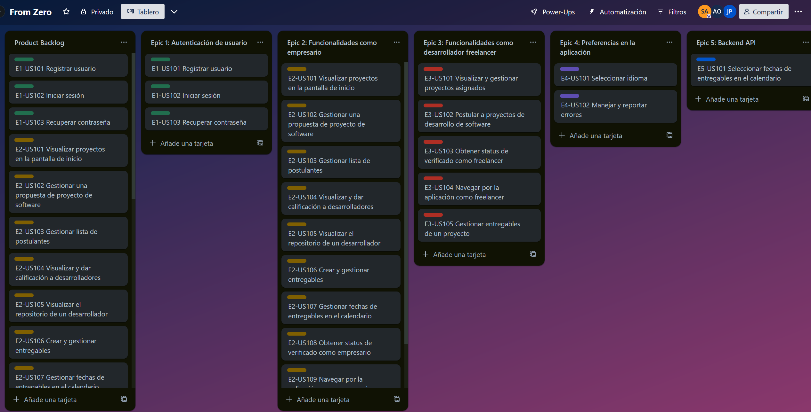

Enlace al tablero de Trello: https://trello.com/b/gNzXJS37/from-zero 

<table border="1">
  <thead>
    <tr>
      <th>User story ID</th>
      <th>Título</th>
      <th>Story Points (1 / 2 / 3 / 5 / 8)</th>
      <th>Sprint</th>
    </tr>
  </thead>
  <tbody>
    <tr>
      <td>E2-US109</td>
      <td>Navegar por la aplicación como empresario</td>
      <td>3</td>
      <td>1</td>
    </tr>
    <tr>
      <td>E2-US102</td>
      <td>Gestionar una propuesta de proyecto de software</td>
      <td>3</td>
      <td>1</td>
    </tr>
    <tr>
      <td>E2-US106</td>
      <td>Crear y gestionar entregables</td>
      <td>5</td>
      <td>1</td>
    </tr>
    <tr>
      <td>E2-US107</td>
      <td>Gestionar fechas de entregables en el calendario</td>
      <td>5</td>
      <td>1</td>
    </tr>
    <tr>
      <td>E2-US110</td>
      <td>Estadísticas del proyecto</td>
      <td>2</td>
      <td>1</td>
    </tr>
    <tr>
      <td>E2-US101</td>
      <td>Visualizar proyectos en la pantalla de inicio</td>
      <td>3</td>
      <td>1</td>
    </tr>
    <tr>
      <td>E2-US104</td>
      <td>Visualizar y dar calificación a desarrolladores</td>
      <td>3</td>
      <td>1</td>
    </tr>
    <tr>
      <td>E1-US101</td>
      <td>Registrar usuario</td>
      <td>3</td>
      <td>1</td>
    </tr>
    <tr>
      <td>E1-US102</td>
      <td>Iniciar sesión</td>
      <td>3</td>
      <td>1</td>
    </tr>
    <tr>
      <td>E2-US103</td>
      <td>Gestionar lista de postulantes</td>
      <td>5</td>
      <td>2</td>
    </tr>
    <tr>
      <td>E5-US101</td>
      <td>Seleccionar fechas de entregables en el calendario</td>
      <td>5</td>
      <td>2</td>
    </tr>
    <tr>
      <td>E2-US105</td>
      <td>Visualizar el repositorio de un desarrollador</td>
      <td>3</td>
      <td>2</td>
    </tr>
    <tr>
      <td>E2-US108</td>
      <td>Obtener status de verificado como empresario</td>
      <td>3</td>
      <td>2</td>
    </tr>
    <tr>
      <td>E3-US104</td>
      <td>Navegar por la aplicación como freelancer</td>
      <td>3</td>
      <td>3</td>
    </tr>
    <tr>
      <td>E3-US102</td>
      <td>Postular a proyectos de desarrollo de software</td>
      <td>3</td>
      <td>3</td>
    </tr>
    <tr>
      <td>E3-US101</td>
      <td>Visualizar y gestionar proyectos asignados</td>
      <td>3</td>
      <td>3</td>
    </tr>
    <tr>
      <td>E3-US103</td>
      <td>Obtener status de verificado como freelancer</td>
      <td>3</td>
      <td>3</td>
    </tr>
    <tr>
      <td>E4-US101</td>
      <td>Seleccionar idioma</td>
      <td>2</td>
      <td>4</td>
    </tr>
    <tr>
      <td>E4-US102</td>
      <td>Manejar y reportar errores</td>
      <td>1</td>
      <td>4</td>
    </tr>
    <tr>
      <td>E1-US103</td>
      <td>Recuperar contraseña</td>
      <td>3</td>
      <td>4</td>
    </tr>
  </tbody>
</table>

---

# Capítulo IV: Product Design

## 4.1. Style Guidelines

### 4.1.1. General Style Guidelines.
**Branding**<br>
Nuestra marca debe reflejar la esencia de la plataforma: facilitar la coordinación de proyectos de software entre empresas y desarrolladores freelance. Debe transmitir eficiencia, orden y colaboración.  
El diseño debe ser moderno y profesional, destacando elementos visuales que representen flujo de trabajo, seguimiento y avance. Además debe evocar un entorno donde el desarrollo fluye de forma clara y estructurada, reforzando la idea de conexión y progreso continuo.


**Typography**<br>
La fuente principal de nuestra marca será Lato, seleccionada por su claridad y elegancia. Esta tipografía equilibra un estilo profesional con un toque accesible y acogedor, lo que la hace ideal para diversas aplicaciones y refuerza la sensación de confiabilidad en la marca.
      

    
También emplearemos Open Sans como tipografía secundaria para destacar detalles y elementos complementarios. Esta elección añade diversidad visual mientras mantiene la armonía y consistencia en el diseño.


Por último, se elegirán los tamaños de fuente con especial atención para asegurar tanto una lectura clara como una estructura jerárquica adecuada dentro de la interfaz de usuario.

**Spacing**  
El uso del espacio en nuestra interfaz de usuario es clave para brindar una experiencia organizada y efectiva.  
Implementaremos márgenes y rellenos consistentes para asegurar una estructura visual ordenada.  
Los elementos interactivos, como botones y enlaces, contarán con un espacio adecuado para prevenir toques accidentales, especialmente en dispositivos móviles.

### 4.1.2. Web Style Guidelines.

Identificación de los componentes que formarán parte de la aplicación web.

En la esquina superior izquierda de la portada de WebMaster, se presenta un encabezado sencillo y sofisticado que incluye nuestro logotipo, simbolizando el vínculo entre empresarios y desarrolladores web. Justo a la derecha, se ubica un menú desplegable que organiza las distintas secciones de la aplicación, facilitando la navegación fluida para los usuarios.

**Colors**<br>
La paleta de colores principales incluye Azul (#0072FF), Gris Claro (#F5F7FA) y Verde Acento (#28A745). Estos colores se combinan para ofrecer un equilibrio entre profesionalismo, claridad y dinamismo. El azul, como color predominante, inspira confianza, mientras que el gris claro asegura una lectura cómoda, y el verde resalta los elementos clave de la interfaz.


Además, se incorporarán colores secundarios como Naranja Suave (#FFA500), Gris Oscuro (#333333) y Fucsia (#FF00FF), que serán aplicados de forma limitada para destacar componentes clave dentro del aplicativo.


### 4.1.3. Mobile Style Guidelines.

**Colors**<br>
Nuestra paleta de colores principales, compuesta por Azul violáceo (#6B74B4), Turquesa (#45B7A8) y Blanco (#FFFFFF). La combinación de estos tres colores en la paleta logra un equilibrio entre un aspecto profesional, la claridad necesaria y un toque de dinamismo. 
 
 

#### 4.1.3.1. iOS Mobile Style Guidelines.

En esta subsección se especificarán las pautas de diseño que se adherirán a las directrices de la interfaz humana de Apple (Human Interface Guidelines). Se definirán los patrones de navegación (como el uso de `UINavigationController` y `UITabBarController`), el estilo de los controles (como `UIButton`, `UITableView`, `UICollectionView`), el uso de tipografía y colores adaptados a iOS, las animaciones y transiciones, y las consideraciones de accesibilidad específicas para dispositivos Apple. Se proporcionarán ejemplos visuales y especificaciones técnicas para asegurar la coherencia con el ecosistema iOS.

#### 4.1.3.2. Android Mobile Style Guidelines.

En esta subsección se detallarán las directrices de diseño que seguirán los principios de Material Design de Google. Se definirán los patrones de navegación (como el uso de la `BottomNavigationView` y el `NavigationView`), el estilo de los componentes de la interfaz de usuario (como `Button`, `RecyclerView`, `CardView`), el uso de la paleta de colores de Material Design, las animaciones y transiciones basadas en las especificaciones de Material, y las consideraciones de accesibilidad específicas para dispositivos Android. Se incluirán ejemplos visuales y especificaciones técnicas para garantizar la consistencia con el lenguaje de diseño de Android.

## 4.2. Information Architecture.

### 4.2.1. Organization Systems.

**Web Applications**

Breve descripción sobre los sistemas de organización que utilizaremos (seleccionar):

- **Hierarchical:** This approach structures content by emphasizing varying levels of importance through visual differences such as size, colour, contrast, and alignment.
- **Sequential:** This method guides users along a specific path toward their goals, presenting content step-by-step according to the current stage.
- **Matrix:** You can always provide users with the option to choose their preferred navigation style, for example, alphabetical, chronological, or by topic.

**Mobile Applications**

Los sistemas de organización para aplicaciones móviles están diseñados para ofrecer una experiencia completa e intuitiva. Entre las funcionalidades principales se destacan:

- **Autenticación y Gestión de Cuentas:** Incluye una pantalla de inicio de sesión, la opción de seleccionar el tipo de usuario (Empresa o Desarrollador), registro de cuenta y recuperación de contraseña.
- **Interfaz para Empresas:** Permite acceder al panel principal donde se pueden crear y consultar proyectos, ver y editar el perfil empresarial, buscar desarrolladores y revisar sus perfiles, gestionar postulantes y utilizar un sistema de mensajería integrado.
- **Interfaz para Desarrolladores:** Ofrece un dashboard que posibilita la edición del perfil, la búsqueda y visualización de proyectos (incluyendo detalles y la opción de postularse), consultar perfiles de empresas, gestionar entregables y comunicarse mediante un sistema de mensajería.
- **Características Compartidas:** Ambas interfaces incluyen elementos comunes como un menú de navegación, notificaciones, sección de soporte/ayuda y opciones de configuración.
- **Gestión de Proyectos:** Se contemplan formularios para la creación de nuevos proyectos, listados y detalles, procesos de aplicación, seguimiento de entregables y un sistema de calificación.
- **Comunicación:** La aplicación incorpora mensajería por correo interno, notificaciones y la integración de email para la recuperación de contraseña.
- **Búsqueda y Descubrimiento:** Incluye funciones para la búsqueda de proyectos destinadas a desarrolladores y la búsqueda de desarrolladores para empresas, con opciones avanzadas de filtrado y ordenamiento.
- **Gestión de Perfiles:** Se administran los perfiles de usuario para empresas y desarrolladores, permitiendo la exhibición de portafolios en el caso de los desarrolladores, la presentación de información corporativa en los perfiles empresariales y la recopilación de calificaciones y reseñas.

### 4.2.2. Labeling Systems.

**Web Applications**

El sistema de etiquetado se ha diseñado para consolidar la información de manera eficaz y presentarla de forma clara y sencilla, evitando así la saturación de datos. Una estrategia común consiste en crear etiquetas breves que resuman grandes volúmenes de información en pocas palabras. Esto se traduce, por ejemplo, en emplear títulos cortos—como "home", "about us", etc.—para los elementos de la barra de navegación.

**Mobile Applications**

El sistema de etiquetado se fundamentará en imágenes sencillas y fácilmente comprensibles que representen el apartado o acción correspondiente. Se aplicarán prácticas habituales para desarrollar un sistema intuitivo que facilite la identificación visual y la navegación del usuario.

### 4.2.3. SEO Tags and Meta Tags

### Web Applications

**Meta & SEO (Search Engine Optimization) Tags**  
These tags are essential for making the website easily discoverable through search engines. They appear in search results and are included within the `<head>` section of the HTML.

- **Title**: WebMaster - Connecting Businesses and Freelance Developers  
- **Description**: `<meta name="description" content="WebMaster is the platform that links companies seeking software solutions with freelance developers eager to work on projects.">`  
- **Keywords**: `<meta name="keywords" content="hiring platform, freelance developers, custom software, development projects, connect companies with developers">`  
- **Author**: `<meta name="author" content="WebMaster Development Team">`

---

#### Mobile Applications

**Meta & SEO (Search Engine Optimization) Tags**  
Estas etiquetas permiten que la aplicación sea fácilmente encontrada en buscadores y tiendas. En Android, esta información se define en el archivo `AndroidManifest.xml`.

```xml
<manifest ... >
    <application 
        android:label="Web Master - Plataforma de Proyectos Digitales" 
        android:description="Conecta empresas y desarrolladores para realizar sueños digitales" 
        ... >
        
        <activity
            android:name=".MainActivity"
            android:label="Web Master - Inicio"
            ... >
        </activity>
    </application>
</manifest>
```
**Para Google Play Store**  

- **Título de la aplicación**: Web Master - Plataforma de Proyectos Digitales  
- **Descripción corta**: Conecta empresas y desarrolladores para tus sueños digitales  
- **Descripción completa**:  
  Web Master es la plataforma perfecta para hacer realidad tus proyectos digitales. Reunimos empresas visionarias con desarrolladores talentosos para llevar a cabo iniciativas excepcionales.

  **Características principales**:  
  - Crea y administra proyectos digitales  
  - Encuentra desarrolladores con experiencia  
  - Desarrolladores: accede a oportunidades interesantes  
  - Sistema de mensajería incluido  
  - Perfiles completos y portafolios  
  - Control de entregas y pagos seguros  

  Tanto si eres una empresa en busca de profesionales como un desarrollador en busca de retos, Web Master es tu lugar para lograr el éxito digital.

- **Palabras clave**: proyectos digitales, desarrollo web, aplicaciones móviles, freelance, empresas, desarrolladores, tecnología, innovación, plataforma, conectar, trabajo remoto

### 4.2.4. Searching Systems
Los sistemas de búsqueda son herramientas digitales diseñadas para ayudar a los usuarios a localizar información específica dentro de un conjunto de datos, desempeñando un papel clave en la mejora de la experiencia de usuario. Para ello, se implementarán dos tipos de sistemas de búsqueda:
- Búsqueda Inicial: Disponible para todos los usuarios, este sistema ofrecerá una experiencia sencilla e intuitiva mediante menús desplegables y una barra de navegación accesible, facilitando la localización de información sin complicaciones.
- Búsqueda de empresas o desarrolladores: En función del segmento correspondiente, este sistema permitirá aplicar filtros de búsqueda para identificar empresas con proyectos disponibles o explorar perfiles de desarrolladores.
Espero que esta versión sea adecuada.

### 4.2.5. Navigation Systems.

#### Web Applications

En la página de inicio se mostrará una barra de navegación en la parte superior junto con un botón para iniciar sesión. Al acceder a la aplicación, el usuario contará con accesos directos ubicados en la parte superior de la pantalla para facilitar la navegación dentro del sistema.

#### Mobile Applications

En la versión móvil, la aplicación presentará un botón para iniciar sesión. Una vez dentro, el usuario podrá moverse por las diferentes secciones mediante una barra de navegación situada en la parte inferior de la interfaz.

## 4.3. Landing Page UI Design.

### 4.3.1. Landing Page Wireframe.


### 4.3.2. Landing Page Mock-up.


## 4.4. Mobile Applications UX/UI Design.

### 4.4.1. Mobile Applications Wireframes.


**Usuario desarrollador**


**Usuario empresas**


### 4.4.2. Mobile Applications Wireflow Diagrams.

**Inicio de aplicación**  


**Registrar usuario / Reestablecer contraseña**  


**Ver información de los desarrolladores**  


**Explorar y Postular Proyecto**  


**Empresas Crear proyecto**  


**Empresas Explorar, ver perfil y contactar con desarrollador**  


**Empresas Ver y crear entregables**  


**Atención al Cliente**  


### 4.4.3. Mobile Applications Mock-ups.

**Prototype:**<br>
https://www.figma.com/proto/F9uDpQtivg5tkJt5aA81VP/Mockup-Webmaster-Mobile?node-id=2-325&t=3sAIe7acXLbBfGd5-1

**Inicio de sesión y creación de usuario:**<br>
|  |  |
|---------------------------------------------|---------------------------------------------|
|  |  |

|  |  |
|---------------------------------------------|---------------------------------------------|
#### Usuario Desarrollador<br>
**Página principal:**<br>
 

**Buscar/postular proyectos:**<br>
|  |  |  |
|---------------------------------------------|---------------------------------------------|---------------------------------------------|

**Ver Proyecto/Entregables:**<br>
 

**Mensaje:**<br>


**Misceláneos:**<br>
 

#### Usuario Empresa<br>
**Página principal:**<br>


**Buscar desarrolladores:**<br>


**Ver entregables:**<br>


**Crear entregables:**<br>


**Mensaje:**<br>


**Misceláneos:**<br>
 

**Crear proyecto:**<br>


### 4.4.4. Mobile Applications User Flow Diagrams.


**Link:**<br>
https://www.figma.com/board/IE1u1Ga2nGV2Z2uGkbeTXG/User-Flow---Fromzero-Mobile?node-id=0-1&t=uwWbBD9adPi6GK0e-1

## 4.5. Mobile Applications Prototyping.

### 4.5.1. Android Mobile Applications Prototyping.


[URL del Prototipo Android (Hecho en figma)](https://www.figma.com/proto/F9uDpQtivg5tkJt5aA81VP/Mockup-FromZero-Mobile?node-id=4228-204&t=3sAIe7acXLbBfGd5-1&starting-point-node-id=4228%3A204)

[URL de video de flujos de interaccion]()

### 4.5.2. iOS Mobile Applications Prototyping.


[URL del Prototipo iOS (Hecho en figma)](https://www.figma.com/proto/F9uDpQtivg5tkJt5aA81VP/Mockup-FromZero-Mobile?node-id=4228-204&t=3sAIe7acXLbBfGd5-1&starting-point-node-id=4228%3A204)

[URL de video de flujos de interaccion]()

## 4.6. Web Applications UX/UI Design.

### 4.6.1. Web Applications Wireframes.

**Inicio de Sesión**<br>


**Registro**<br>


**Cambiar contraseña**


##### Empresas
**HomePage**<br>


**ProjectsPage**<br>


**Deliverables Timeline**<br>


**Explore Devs**


**Messages**<br>


**Explorar Proyectos Destacados**


**Support**<br>


##### Desarrolladores
**HomePage**<br>


**Browse Projects**<br>


**Apply for Job**<br>


**Deliverables Timeline**<br>


**Messages**<br>


**Support**<br>


**Explorar Proyectos Destacados**


### 4.6.2. Web Applications Wireflow Diagrams.

**Registrar Usuario_Reestablecer contraseña**


**Inicio de la aplicación**


**Proyectos Destacados**


**Atencion al cliente**


**Segmento Empresa**

**Ver entregables de proyecto**


**Explorar, ver perfil y contactar con desarrollador**


**Crear proyecto**


**Segmento Desarrollador**

**Trabajar en proyecto, ver entregables y comunicar con empresa**


**Explorar y postular a proyecto**


### 4.6.3. Web Applications Mock-ups.

**Inicio de Sesión**<br>


**Registro**<br>


**Cambiar contraseña**


##### Empresas
**HomePage**<br>


**ProjectsPage**<br>


**Deliverables Timeline**<br>


**Explore Devs**


**Messages**<br>


**Explorar Proyectos Destacados**


**Support**<br>


##### Desarrolladores
**HomePage**<br>


**Browse Projects**<br>


**Apply for Job**<br>


**Deliverables Timeline**<br>


**Messages**<br>


**Support**<br>


**Explorar Proyectos Destacados**


### 4.6.4. Web Applications User Flow Diagrams.

**Registrar Usuario_Reestablecer contraseña**


**Inicio de la aplicación**


**Proyectos Destacados**


**Atencion al cliente**


**Segmento Empresa**

**Ver entregables de proyecto**


**Explorar, ver perfil y contactar con desarrollador**


**Crear proyecto**


**Segmento Desarrollador**

**Trabajar en proyecto, ver entregables y comunicar con empresa**


**Explorar y postular a proyecto**


## 4.7. Web Applications Prototyping.


[URL del Prototipo en vista de empresa(Hecho en figma)](https://www.figma.com/proto/59rup67dfioDXBRKEmpxAD/Mockup-From-Zero-Open-Source?type=design&node-id=2-325&t=YuGoXqkU7ZGQ3s2N-0&scaling=scale-down&starting-point-node-id=3254%3A359&show-proto-sidebar=1)

[URL del Prototipo en vista de desarrollador(Hecho en figma)](https://www.figma.com/proto/59rup67dfioDXBRKEmpxAD/Mockup-From-Zero-Open-Source?type=design&node-id=2-325&t=YuGoXqkU7ZGQ3s2N-0&scaling=scale-down&starting-point-node-id=3254%3A319&show-proto-sidebar=1)

### 4.8. Domain-Driven Software Architecture.

### 4.8.1. Software Architecture Context Diagram.


### 4.8.2. Software Architecture Container Diagrams.


### 4.8.3. Software Architecture Components Diagrams.


## 4.9. Software Object-Oriented Design.

### 4.9.1. Class Diagrams.


### 4.9.2. Class Dictionary.

|**User**||
| - | :- |
|Clase usuario definida como la cuenta principal con la nuestro segmentos pueden ingresar a nuestra aplicación.||
|**Atributo**|**Tipo de Variables**|
|\_id|Long|
|\_email|String|
|\_password|String|
|\_Set<Rol>|Enterprise|

|**Enterprise**||
| - | :- |
|Perfil de empresa dentro de la aplicacion, donde se podra gestionar la informacion personal.||
|**Atributo**|**Tipo de Variables**|
|\_id|Long|
|\_enterpriseName|String|
|\_description|String|
|\_ruc|String|
|\_profileImgUrl|String|
|\_projectsCompleted|Number|

|**Developer**||
| - | :- |
|Perfil de desarrollador dentro de la aplicacion, donde se podra gestionar la informacion personal.||
|**Atributo**|**Tipo de Variables**|
|\_id|Long|
|\_firstName|String|
|\_lastName|String|
|\_description|String|
|\_profileImgUrl|String|
|\knowledges|Array[String]|

|**Project**||
| - | :- |
|Entidad que contendra la informacion de un proyecto create mediante un usuario Enterprise, contiene la relacion con entregables que seran definidos de forma automatica como tambien gestionada por la misma Enteprise.||
|**Atributo**|**Tipo de Variables**|
|\_id|Long|
|\_projectName|String|
|\_description|String|
|\_projectProgress|Double|
|\_budget|Double|
|\_projectType|LANDING_PAGE|
||WEB_APPLICATION|
||MOBILE_APPLICATION|
||DESKTOP_APPLICATION|
||IOT_PROJECT|
|\_projectState|IN_SEARCH|
|             |IN_PROGRESS|
|             |COMPLETED|

|**Deliverables**||
| - | :- |
|Entidad que contendra la informacion de un entregable. Estan ligados a un Proyecto, contienen una fecha de fin y un estado, el cualquier evolucionada de acuerdo a las acciones del usuarios Developer como del usuario Enterprise||
|**Atributo**|**Tipo de Variables**|
|\_id|Long|
|\_name|String|
|\_description|String|
|\_endDate|LocalDate|
|\_files|String|
|\_tate       |PENDING|
|             |AWAITING_REVIEW|
|             |DECLINED|
|             |COMPLETED|

|**Notifications**||
| - | :- |
|Entidad encargada a las notificaciones a los distintos usuarios. Se enfocara en notificaciones de avance del proyecto y entregables. Cada proyecto tendria sus propias notificaciones relacionadas.||
|**Atributo**|**Tipo de Variables**|
|\_id|Long|
|\_message|String|
|\_tmestamp|LocalDateTime|
|\_read|Boolean|

|**Membership**||
| - | :- |
|Entidad encargada de manejar la membresia de un usuarios, esta se encarga de la gestion del plan del usuario y revision de tiempo de fin.||
|**Atributo**|**Tipo de Variables**|
|\_id|Long|
|\_startDate|LocalDate|
|\_endDate|LocalDate|
|\_isActive|Boolean|

|**Plan**||
| - | :- |
|Entidad encargada de manejar las mejoras que tendra por la membresia, como tambien manejar el precio de cada plan relacionado a la membresia dentro de la aplicacion.||
|**Atributo**|**Tipo de Variables**|
|\_id|Long|
|\_name|String|
|\_price|Double|
|\_durationInDays|Int|

## 4.10. Database Design.

### 4.10.1. Relational/Non-Relational Database Diagram.

Se utilizara como base de datos relacional el gestor de base de datos MySQL. A continuacion se mostrara el diagrama de base de datos:


---

# Capítulo V: Product Implementation

## 5.1. Software Configuration Management.
### 5.1.1. Software Development Environment Configuration.
#### Project Management
- Trello [https://trello.com](https://trello.com):
 Trello es una aplicación web de gestión de proyectos compatible con la mayoria de navegadores. Se utilizó Trello para la organización y registro de las tareas por hacer, las que están en proceso y las realizadas. De esta forma podemos tener control acerca del avance del proyecto y las actividades de cada uno de los miembros del equipo.

#### Product UX/UI Design
- Miro [https://miro.com](https://miro.com):
 Miro ha sido empleado en el desarrollo de los escenarios mapping y escenario mapping para ambos segmentos objetivos.

- Figma [https://figma.com](https://figma.com):
 Esta herramienta fue de vital importancia para la creación de los wireframes, mockups y mobile applications prototyping de manera colaborativa. Asimismo, su acceso es gratuito al contar con una cuenta registrada.

#### Software Developement
- Landing Page:
El desarrollo del landing page se llevó a cabo con las tecnologías básicas para esta misma: HTML5, CSS3 y JavaScript.
- Frontend Web Application:
Se ha utilizado a Vue como framework de Javascript. En adición, para la implementación de componentes reutilizables y accesibles se usó PrimeVue como biblioteca de componentes UI.


#### IDE's de desarrollo
- IntelliJ IDEA [https://www.jetbrains.com/idea/](https://www.jetbrains.com/idea/):
IntelliJ IDEA es un entorno de desarrollo integrado (IDE) creado por JetBrains. Este entorno de desarrollo nos proporcionará distintas herramientas para agilizar el proceso de desarrollo

- WebStorm [https://www.jetbrains.com/webstorm/](https://www.jetbrains.com/webstorm/): Para el front se utilizó WebStorm, un IDE de JavaScript y TypeScript. Este IDE es muy útil para el desarrollo de aplicaciones web, ya que cuenta con herramientas para la depuración, pruebas y análisis de código.

#### Software Testing
- Para las pruebas de testeo software, tanto de la landing page como de la aplicación web, se emplearon las herramientas de desarrollador de los principales navegadores web como Google Chrome [https://www.google.com/chrome/](https://www.google.com/chrome/), Microsoft Edge [https://www.microsoft.com/en-us/edge](https://www.microsoft.com/en-us/edge) y Mozilla Firefox [https://www.mozilla.org/en-US/firefox/browsers/](https://www.mozilla.org/en-US/firefox/browsers/). Estos navegadores cuentan con aplicaciones desktop y móviles las cuáles son totalmente gratuitas. En el caso de desktop podemos instalarlos desde sus sitios oficiales, en el caso de móvil, desde la tienda de aplicaciones del sistema operativo en cuestión.

#### Software Deployment
- **Vercel** [https://vercel.com](https://vercel.com):
es una plataforma en la nube que ofrece herramientas integrales para el desarrollo, implementación y alojamiento de aplicaciones web, permitiendo a los desarrolladores crear y lanzar sitios estáticos o dinámicos de manera eficiente y escalable.

#### Software Documentation
- Markdown [https://docs.github.com/es/get-started/writing-on-github/getting-started-with-writing-and-formatting-on-github/basic-writing-and-formatting-syntax](https://docs.github.com/es/get-started/writing-on-github/getting-started-with-writing-and-formatting-on-github/basic-writing-and-formatting-syntax):
Markdown es un lenguaje de marcado ligero que nos permite formatear texto de manera sencilla utilizando un formato de texto plano. De esta forma documentamos la información importante acerca del contexto, organización, producción y creacíon del proyecto.
- Structurizr [https://structurizr.com/](https://structurizr.com/):
Esta herramienta permite crear los diagramas C4 de manera rápida con una sintaxis similar a un lenguaje de programación. Para utilizar esta aplicación web hace falta tener una cuenta registrada.

- Vertabelo: [https://www.vertabelo.com/](https://www.vertabelo.com/)
Es una aplicación web colaborativa que facilita el diseño e implementación de bases de datos en una amplia variedad de motores.

### 5.1.2. Source Code Management.
Repositorios:<br>
- Url del repositorio del La web app: [Url del repositorio](https://github.com/upc-pre-20251-1asi0732-4453-webmaster/webmaster-app)
- Url del repositorio de la Api RESTful: [Url del repositorio](https://github.com/upc-pre-20251-1asi0732-4453-webmaster/FromZeroAPI)
- Url del repositorio de la Landing Page: [Url del repositorio](https://github.com/upc-pre-20251-1asi0732-4453-webmaster/WebMaster-LandingPage)

Git Flow:<br>


Se aplicará GitFlow utilizando el artículo de Vincent Driessen, “A successful Git branching model”. A continuación se dará una explicación de cada Branch que se utiliza en el modelo GitFlow.

- MASTER: Se utilizara esta rama como la versión estable y lista para producción. Todos los cambios que se fusionan aquí ya se consideran seguros y listos para implementar.

- DEVELOP: Esta rama es donde se trabajarán nuevas características y correcciones de errores. Es la rama principal de desarrollo.

- FEATURE BRANCHES: Son ramas de características para trabajar en nuevas funciones. Cada característica tendrá su propia rama, para que se trabaje de manera aislada, luego se fusiona con la rama DEVELOP.

- RELEASE BRANCHES: Son las ramas de lanzamiento que sirven para preparar una nueva versión del software. Se corrigen errores, pruebas finales y se prepara para fusionarse con MASTER y DEVELOP.

- HOTFIX BRANCHES: Son esenciales cuando ocurren errores en la producción. Se crean directamente desde MASTER, se solucionan los problemas y se fusionan los cambios en las ramas de MASTER y DEVELOP.
<br>

Commit Conventions
Para el formato de los COMMITS se aplicará lo siguiente: \<type>:\<description> Donde:

TYPE: Solo pueden ser 3 tipos, sea BREAKING que se relaciona con X, luego FEAT que se relaciona con Y y por último FIX que se relaciona con Z.

### 5.1.3. Source Code Style Guide & Conventions.

**HTML**: https://www.w3schools.com/html/html5_syntax.asp
           
**Index.html**

Es la página por defecto dentro de los directorios de los servidores de cualquier sitio web que se carga siempre que se solicita un dominio y no se especifica el nombre de un archivo en específico. Y en la mayoría de los casos el propio servidor web es el que se encarga de buscar el archivo index.

**Convenciones de HTML**:

- Se debe declarar el tipo de documento en la primera línea: `<!DOCTYPE html>`
- Se recomienda usar minúsculas en las etiquetas y estructuras: `<body>` `<p>`
- Se recomienda cerrar todas las etiquetas y estructuras: `<p>This is a paragraph.</p>`
- Se recomienda usar minúsculas en los atributos: `<a href="https://www.google.com/html/">`
- Se recomienda usar comillas en los valores de atributo: `<table class="striped">`
- Se debe especificar el alt, ancho y alto de las imágenes: ``
- Se recomienda no usar espacios a la hora de usar el signo “=”: `<link rel="stylesheet" href="styles.css">`
- Solo se debe usar líneas en blaco para facilitar la lectura de bloques de códigos grandes o lógicos.
- No se debe omitir el elemento `<title>` ya que es vital para el motor de búsqueda, así como también se recomienda que el contenido de los `<title>` sea preciso y significativo: `<title>HTML Style Guide and Coding Conventions</title>`
- No se recomienda omitir las etiquetas `<html>` y `<body>` ya que puede producir errores en navegadores antiguos y puede bloquear el software DOM y XML.
- Se debe usar el atributo lang para declarar el idioma de la página web: `<html lang="en-us">`
- Se debe utilizar el atributo meta para una interpretación adecuada e indexación correcta en los motores de búsqueda: `<meta charset="UTF-8">`

**CSS**: https://google.github.io/styleguide/htmlcssguide.html
           
**Style.css**

El estilo de cascada (CSS) se puede usar para estilos de texto, por ejemplo, cambiar de color y el tamaño de los encabezados, enlaces, entre otras cosas.

**Convenciones de CSS**:

- Utilizar el protocolo HTTPS para imágenes y otros archivos multimedia: `@import 'https://fonts.googleapis.com/css?family=Open+Sans'` ; Todo el código debe estar en minúsculas como nombres de elementos HTML, atributos, valores de atributo, entre otros: `color : #e5e5e5;`
- El nombre de una clase debe transmitir lo que hace de la forma más breve posible ya que de esta manera se apoya la comprensibilidad y eficiencia del código: navegación {} . autor {} Se debe separar los nombres de las clases con un guión (“-”): navegación {} . autor {}
- Se recomienda usar propiedades abreviadas cuando sea posible: `border - top : 0 ;`
- Se recomienda usar la notación hexadecimal de 3 caracteres en colores que lo permitan: `color : #ebc;`
- Se recomienda ordenar las declaraciones de propiedades y características en orden alfabético
- Se debe usar un “;” después de cada declaración: `pantalla : bloque ;`
- Se debe usar un espacio después de los “:” de cada nombre de la propiedad: `font - weight : bold ;`
- Se debe usar un espacio entre el último sector y la llave “{ “ que comienza el bloque de declaración:. vídeo {.....}
- Se debe usar las comillas simples (‘ ‘) para los atributos y valores de propiedad: `familia de fuentes : ' open sans' , arial , sans - serif ;`

**Gherkin**: https://cucumber.io/docs/gherkin/reference/

**`<usertStoryID>`.featrue** :

En este archivo de formato feature estarán las historias de usuario como características de la aplicación. Asimismo se pueden encontrar los criterios de aceptación para las diversas situaciones.

**Convenciones de Gherkin**:

- Se utiliza la palabra Feature para introducir una descripción de alto nivel de una función de software y agruparlos en escenarios relacionados
- Example o Scenario sirven para plantear una situación
- Se utiliza Given para describir el contexto inicial, When para describir un evento y Then para describir un resultado esperado y And para adicionar información. Given,When,Then y And se usan para describir un escenario
- El carácter “|” sirve para formar una tabla datos, las cuales son útiles para pasar una lista de valores a una definición de paso.

**Java**: https://google.github.io/styleguide/javaguide.html 

**Convenciones de Java**:

- Los nombres de clases y tipos deben ser sustantivos en mayúscula inicial.
- Los nombres de los métodos deben ser minúsculas.
- El nombre de las variables debe ser en minúsculas y usar camel case.
- Para las sentencias if,else,for,do y while se deben usar “ { } “.
- Los nombres de variables que son Constantes deben ir en mayúsculas.

**JavaScript**: https://google.github.io/styleguide/jsguide.html. 

**Convenciones de JavaScript**:

- Se debe usar Camelcase para los nombres de variables y funciones.
- Se debe usar Pascalcase para los nombres de constructores o clases.
- Se debe usar mayúsculas y guiones bajos para los nombres de la constantes, por ejemplo UPPER_CASE_WITH_UNDERSCORES..
- Se debe usar let y const para definir las variables, var debe evitarse.
- Para los comentarios de una sola línea debe usar “ // ” y para bloques de comentario se debe usar  “ /* */ ”.
Se debe incluir un punto y coma al final de cada instrucción.

**TypeScript**: https://google.github.io/styleguide/tsguide.html

**Convenciones de TypeScript**:

- Se debe usar Camelcase para los nombres de variables y funciones.
- Se debe usar Pascalcase para los nombres de interfaces o clases.
- Se debe usar number para valores numéricos, string para cadenas de texto y boolean para los valores booleanos.
- Se debe usar const para las constantes.
- Se debe usar extends para la herencia 
- Se debe usar implements para la implementación de interfaces
- Se debe usar por imports y exports para modularizar el código
- Se debe usar “ | ” para la unión y “ & ” para las intersecciones

**Spring Boot** : https://docs.spring.io/spring-boot/docs/current/reference/html/features.html

**Convenciones de Spring Boot**:

- Se debe emplear `@Controller`, `@Service`, `@Repository`, `@Component`, `@Autowired`, entre otros más, para poder definir y gestionar los componentes de Spring.
- Para el manejo de excepciones se debe hacer uso de `@ControllerAdvice` y `@ExceptionHandler` para poder gestionar los errores de manera consistente.
- Se debe usar `@Transactional` para gestionar las transacciones.
- En el caso que se quiera gestionar la autenticación y autorización de una aplicación, se debe usar Spring Security.
- Se debe usar nombre de paquetes y clases descriptivas que reflejan la funcionalidad de los componentes.

**Vue.js**: https://vuejs.org/v2/style-guide/

**Convenciones de Vue.js**:
- Usar PascalCase para nombrar componentes (`UserCard.vue`).
- Usar kebab-case para usar componentes en plantillas (`<user-card />`).
- Un componente por archivo `.vue`.
- Estructurar los archivos `.vue` con `<template>`, `<script>`, y `<style>` en ese orden.
- Usar `scoped` en estilos si solo deben afectar al componente.
- Usar camelCase para las props en JS (`userName`).
- Usar kebab-case para las props en HTML (`:user-name="..."`).
- Usar kebab-case para nombres de eventos personalizados (`@user-clicked="..."`).
- Ordenar las opciones del componente de forma consistente (`name`, `props`, `data`, `computed`, `methods`, etc.).
- Definir vistas en PascalCase (`HomeView.vue`, `AboutView.vue`).
- Importar vistas en rutas usando `() => import(...)` para lazy loading.
- Agrupar componentes por funcionalidad en carpetas (`components/`, `views/`, etc.).

### 5.1.4. Software Deployment Configuration.
En esta sección abordaremos el despliegue de nuestro Landing Page mediante el servicio de Netlify, a continuación se describirán los pasos a seguir

- Nos situamos en el apartado principal como organización
Como organización contamos con un repositorio del landing page, es la cual se estuvo desarrollando la implementación del código. Y este repositorio será el que se vincula a Netlify.
    
- Luego procedemos a iniciar sesión (o crear una cuenta) en https://www.netlify.com. Una vez ingresemos, buscaremos la sección de sitios y le daremos a la opcion de: “Add new site” y luego a “Import from Git”
    
- Una vez estemos seleccionando el proveedor de Git, escogeremos Github
    
- Por último, seleccionaremos el repositorio e indicaremos cual es la branch donde se realizará el deploy y le damos al botón de Deploy.
    
    

## 5.2. Product Implementation & Deployment.
### 5.2.1. Sprint Backlogs.

**Web Application Sprint Backlog**
---
|Sprint # | Sprint 1|
|---------|---------|
**SprintPlanningBackground** | Implementación de la interfaz base: landing, navegación, login, registro, perfil, listado de proyectos.
**Date** | 2025-04-07
**Time** | 10:00AM–12:00PM
**Location** | Virtual (Google Meet)
**PreparedBy** | Equipo WebMaster
**Attendees(to planning meeting)** | Equipo WebMaster
**Sprintn–0ReviewSummary** | Se completaron bocetos exploratorios para la interfaz web, sin planificación formal previa.
**Sprintn–1RetrospectiveSummary** | Se acordó crear endpoints mockeados para agilizar desarrollo frontend.
**SprintGoalandUserStories** | Objetivo: Interfaz base web. Usuarios: landing, login/registro, perfil, vista de proyectos.
**Sprint1Velocity** | 26 puntos
**SumofStoryPoints** | 26
<br>

**API Sprint Backlog**
---
|Sprint # | Sprint 2|
|---------|---------|
**SprintPlanningBackground** | Desarrollo inicial del API: autenticación, usuarios, proyectos, entregables.
**Date** | 2025-04-07
**Time** | 3:00PM–5:00PM
**Location** | Virtual (Google Meet)
**PreparedBy** | Equipo WebMaster
**Attendees(to planning meeting)** | Equipo WebMaster
**Sprintn–0ReviewSummary** | Se exploró el uso de librerías de auth y se configuró la estructura base.
**Sprintn–1RetrospectiveSummary** | Necesidad de estandarizar documentación desde el primer día.
**SprintGoalandUserStories** | Objetivo: Implementar endpoints clave para el core. Usuarios: login, signup, proyectos CRUD.
**Sprint1Velocity** | 26 puntos
**SumofStoryPoints** | 26

**Mobile Application Sprint Backlog**
---
|Sprint # | Sprint 3|
|---------|---------|
**SprintPlanningBackground** | Creación inicial de la app en Kotlin: navegación, login, registro, proyectos.
**Date** | 2025-04-08
**Time** | 9:00AM–11:00AM
**Location** | Virtual (Google Meet)
**PreparedBy** | Equipo WebMaster
**Attendees(to planning meeting)** | Equipo WebMaster
**Sprintn–0ReviewSummary** | Pruebas de conexión API y configuración del entorno Flutter.
**Sprintn–1RetrospectiveSummary** | Recomendación: crear componentes reutilizables desde el inicio.
**SprintGoalandUserStories** | Objetivo: App funcional con pantallas de auth, listado de proyectos y perfil.
**Sprint1Velocity** | 23 puntos
**SumofStoryPoints** | 23
### 5.2.2. Implemented Landing Page Evidence
[Repositorio](https://github.com/upc-pre-20251-1asi0732-4453-fromzero/WebMaster-LandingPage) <br>
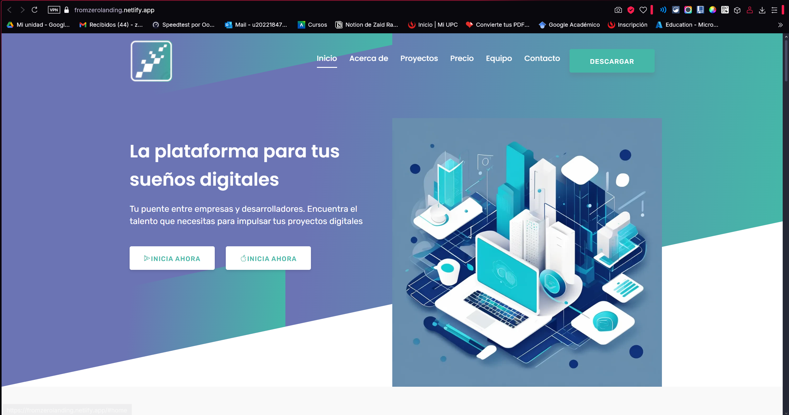

### 5.2.3. Implemented Frontend-Web Application Evidence
[Repositorio](https://github.com/upc-pre-20251-1asi0732-4453-fromzero/webmaster-app) <br>
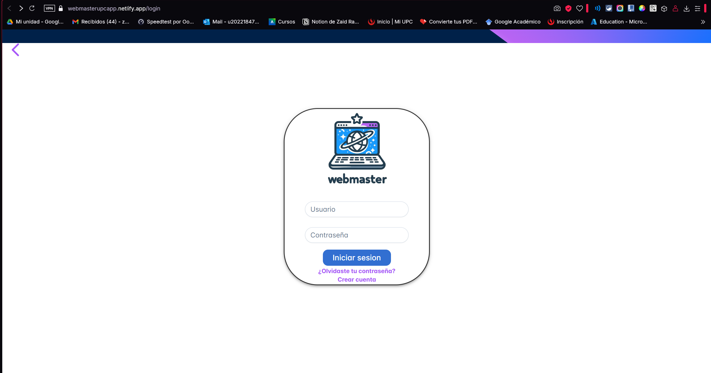

### 5.2.4. Implemented Native-Mobile Application Evidence
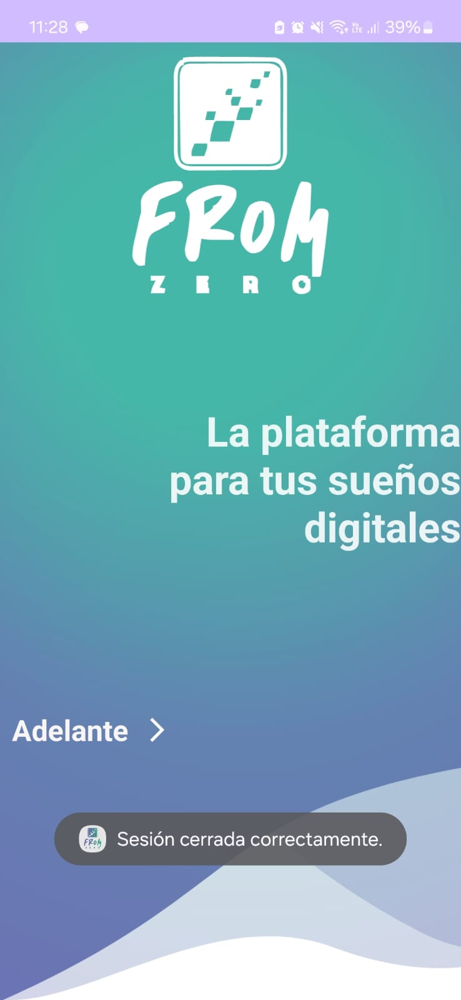

### 5.2.5. Implemented RESTful API and/or Serverless Backend Evidence
[Repositorio](https://github.com/upc-pre-20251-1asi0732-4453-fromzero/FromZeroAPI)<br>
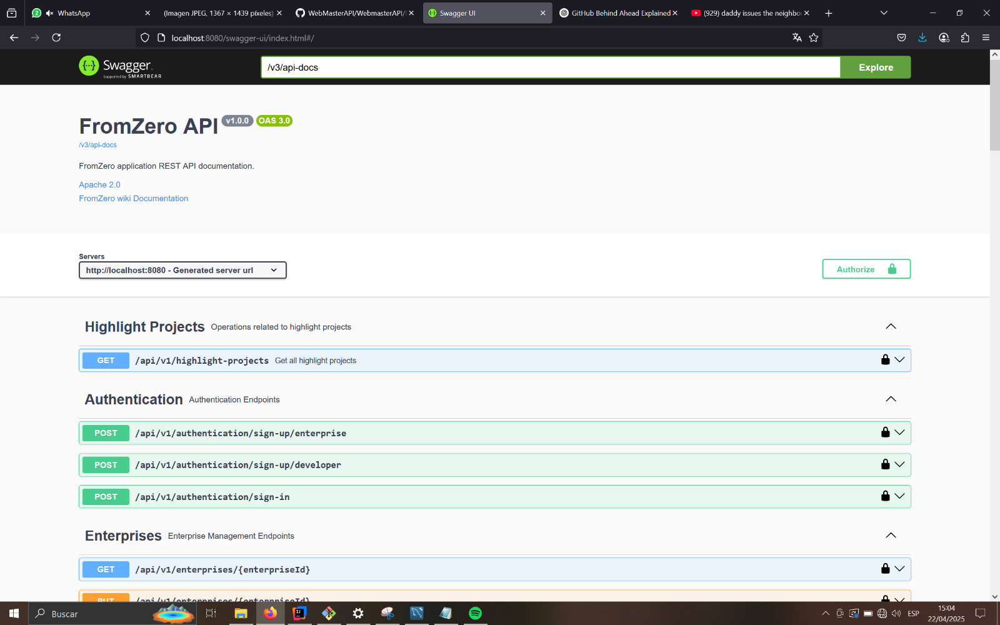

### 5.2.6. RESTful API documentation
En esta sección se presentan los endpoints desarrollados en el
presente sprint y se adjuntan capturas de las acciones CRUD
realizadas con Api. En el alcance del sprint, se han desarrollado los
bounded context de autenticación, perfil, actividades, reclutamiento y
organizaciones. Se adjunta el link del repositorio de la API en Github:
[Api](https://github.com/WebMastersUPC/WebMasterAPI)

| **Bounded Context** | **Endpoint Url**                  |**Swagger**|
|---------------------|-----------------------------------|-----------|
| Authentication      | /api/v1/authentication/           ||
| Enterprises         | /api/v1/enterprises/              |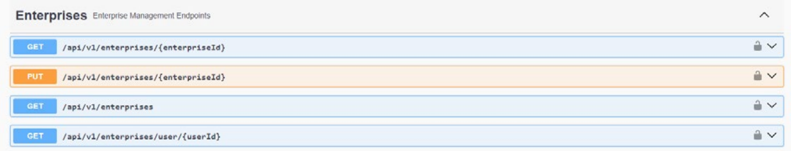|
| Developers          | /api/v1/developers/               |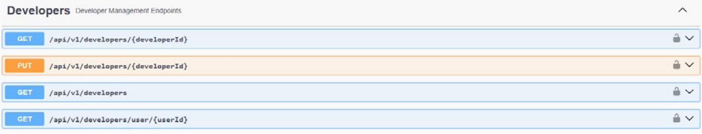|
| Projects            | /api/v1/projects/                 |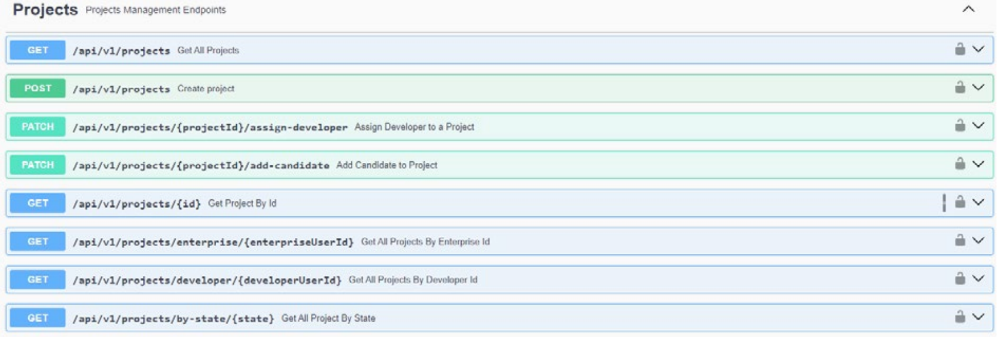|
| Users               | /api/v1/users/                    |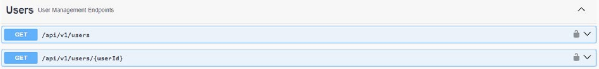|
| Deliverables        | /api/v1/deliverables/             |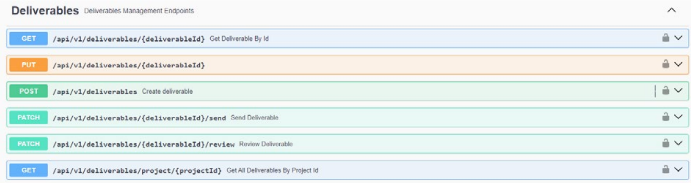|
| Messages            | /api/v1/messages/                 |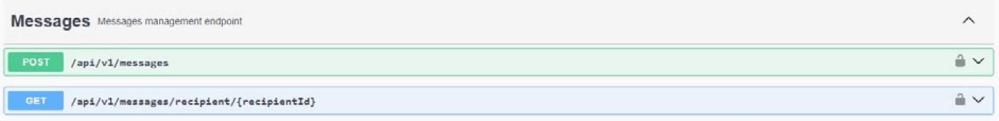|
| Support Tickets     | /api/v1/support-tickets/          |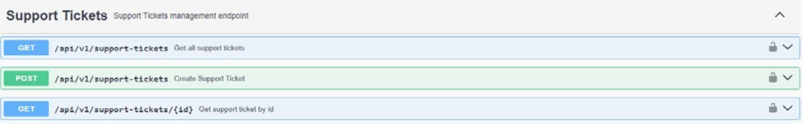|

### 5.2.7. Team Collaboration Insights

Se presentarán los insights del trabajo grupal en Github.

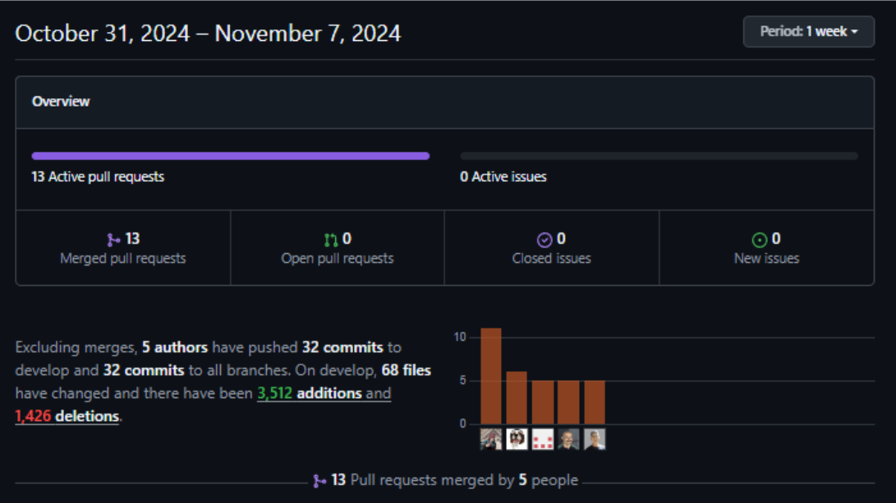
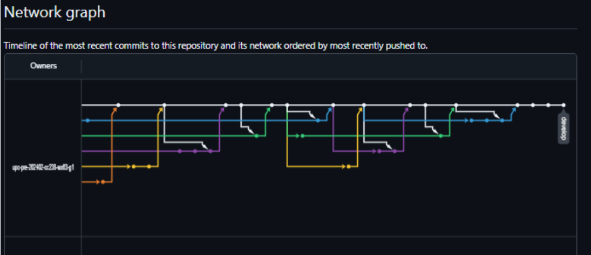

## 5.3. Video About-the-Product.

---

# Conclusiones y Recomendaciones

- **Impacto en el Entorno Digital:** La visión de convertirnos en una plataforma de elección para empresas y emprendimientos que buscan destacar en el entorno digital y el puente para que desarrolladores freelance puedan participar en proyectos que los ayuden tanto en sus conocimientos como financieramente, refleja una ambición significativa. Esta aspiración puede ser un motor motivador para nuestro equipo y un objetivo que guíe
las decisiones estratégicas a medida que crece la startup

- **Equipo Multidisciplinario:** El hecho de que la startup esté compuesta por nosotros 5 esto le da un enfoque multidisciplinario y fresco. Esto puede ser una ventaja ya que cada miembro del equipo puede aportar perspectivas únicas y habilidades complementarias, enriqueciendo así la oferta de servicio, originalidad y eficacia de este proyecto

- **Identificación de una Necesidad Clara:** La startup From Zero ha identificado una necesidad creciente en el mercado, donde las empresas y emprendimientos requieren una presencia en línea sólida para potenciar sus estrategias de marketing digital. Esta identificación precisa de una necesidad puede ser un factor clave para el éxito, ya que abordar una demanda real puede generar un gran interés y participación.


# Video About-the-Team

# Bibliografía
```
qoomon. (2021, 11 enero). Conventional Commit Messages. Gist.
   Recuperado 20 de junio de 2022, de https://gist.github.com/qoomon/5dfcdf8eec66a051ecd85625518cfd13
```

```
LeaseIN. (2018). Importancia de contar con un equipo de soporte
   técnico. [Entrada en blog]. Recuperado de:
   https://leasein.pe/blog/branding-empresarial-importanciasoporte-tecnico/
```

``` 
Gothelf, J., & Seiden, J. (2013). 
  Lean UX: Applying lean principles to improve user experience. O'Reilly Media. 
  https://books.google.es/books?hl=es&lr=&id=wLw6EAAAQBAJ&oi=fnd&pg=PT37&dq=Lean+ux&ots=QuMNDmvouC&sig=36AUu53YuLt_4OXBjwdg9RSLr_4#v=onepage&q=Lean%20ux&f=false
```
```
Cohn, M. (2004). User stories applied: For agile software development. Addison-Wesley. 
  https://books.google.es/books?hl=es&lr=&id=SvIwuX4SVigC&oi=fnd&pg=PR13&dq=Cohn,+M.+(2004).+User+stories+applied:+For+agile+software+development.+Addison-Wesley.&ots=VsSb68rUSO&sig=zVJsoYVopnqITrtBXPAIzePb96w#v=onepage&q=Cohn%2C%20M.%20(2004).%20User%20stories%20applied%3A%20For%20agile%20software%20development.%20Addison-Wesley.&f=false
```

```
Duckett, J. (2014). 
  HTML and CSS: Design and build websites. John Wiley & Sons. https://wtf.tw/ref/duckett.pdf
```

```
Ambler, S. W. (2004). The object primer: Agile model-driven development with UML 2.0. 
  Cambridge University Press. 
  https://www.researchgate.net/publication/235616285_The_object_primer_agile_modeling-driven_development_with_UML_20
```

```
Teorey, T. J., Lightstone, S. S., & Nadeau, T. (2011). 
  Database modeling and design: Logical design (5th ed.). Morgan Kaufmann. 
  https://eketab2.wordpress.com/wp-content/uploads/2007/09/databasemodelinganddesignlogical-design.pdf
```

```
Del Do, A., Villagra, A. y Pandolfi, D. (2023). Una propuesta para la
Transformación Digital en las PYMES. Revista Electrónica del Instituto de
Tecnología Aplicada de la Universidad Nacional de la Patagonia Austral, 1(1), 7-
21. doi: https://doi.org/10.22305/revita-unpa.v1.n1.979
```
```
Breaux, T. y Moritz, J. (2021). The 2021 software developer shortage is coming.
Communications of the ACM, 64(7), 39-41. doi: https://doi.org/10.1145/3440753
```

# Anexos
