# COURSE PROJECT

<p align="center">
    <strong>Universidad Peruana de Ciencias Aplicadas</strong><br>
    </img><br>
    <strong>Ingeniería de Software</strong><br>
    <strong>Diseño de Experimentos de Ingeniería de Software - 4453</strong><br>
    <strong>Profesor: Julio Manuel Noriega Melendez</strong><br>
    <br>INFORME
</p>
<p align="center">
    <strong>Startup:  </strong><br>
    <strong>Producto:  </strong>
</p>

<div>
    <h3 align="center">Team Members:</h3>
    </div>
<div>
     <table align="center">
        <tr>
            <th style="text-align:center;">Member</th>
            <th style="text-align:center;">Code</th>
        </tr>
        <tr>
            <td>Alvarez Araguache, Samira Jetzabel</td>
            <td>U20211A046</td>
        </tr>
        <tr>
            <td> Elias Sanchez, Harold Miguel</td>
            <td> U202212684</td>
        </tr>
        <tr>
            <td>Ramirez Contreras, Zaid Valentino</td>
            <td>U202218472</td>
        </tr>
        <tr>
            <td>Meneses Arevalo, Victor Manuel</td>
            <td>U202212191</td>
        </tr>
         <tr>
            <td>Velasquez Pizarro, Jair</td>
            <td>U202218114</td>
        </tr>
    </table>
</div>

<p align="center">
    <strong>2025</strong>
</p>

<br>

# Registro de Versiones del Informe
<table>
        <tr>
            <th style="text-align:center;">Versión</th>
            <th style="text-align:center;">Fecha</th>
            <th style="text-align:center;">Autor</th>
            <th style="text-align:center;">Descripción de la modificación</th>
        </tr>
        <tr>
            <td align = "center">TB1</td>
            <td>18/04/2025</td>
            <td> Alvarez Araguache, Samira Jetzabel<br><br>Elias Sanchez, Harold Miguel<br><br>Meneses Arevalo, Victor Manuel<br><br>Ramirez Contreras, Zaid Valentino<br><br>Apellidos y nombres<br>
            <td>Se agregó el contenido del capítulo 1, apartados 1.1, 1.2 y 1.3; el contenido del capítulo 2, apartados 2.1, 2.2, 2.3, 2.4; el contenido del capítulo 3, apartados 3.1, 3.2, 3.3 y 3.4; el contenido del capítulo 4, apartados 4.1, 4.2, 4.3, 4.4, 4.5, 4.6, 4.7 y 4.8; y el contenido del capítulo 5, apartados 5.1, 5.2, 5.3 y 5.4</td>
        </tr>
</table>
<br>


# Tabla de Contenidos

- [COURSE PROJECT](#course-project)
- [Registro de Versiones del Informe](#registro-de-versiones-del-informe)
- [Tabla de Contenidos](#tabla-de-contenidos)
- [Student Outcome](#student-outcome)
- [Capítulo I: Introducción](#capítulo-i-introducción)
  - [1.1. Startup Profile](#11-startup-profile)
    - [1.1.1. Descripción de la Startup](#111-descripción-de-la-startup)
    - [1.1.2. Perfiles de integrantes del equipo](#112-perfiles-de-integrantes-del-equipo)
  - [1.2. Solution Profile](#12-solution-profile)
    - [1.2.1. Antecedentes y problemática](#121-antecedentes-y-problemática)
    - [1.2.2. Lean UX Process](#122-lean-ux-process)
      - [1.2.2.1. Lean UX Problem Statements](#1221-lean-ux-problem-statements)
    - [1.2.2.2. Lean UX Assumptions](#1222-lean-ux-assumptions)
    - [1.2.2.3. Lean UX Hypothesis Statements](#1223-lean-ux-hypothesis-statements)
    - [1.2.2.4. Lean UX Canvas](#1224-lean-ux-canvas)
  - [1.3. Segmentos objetivo](#13-segmentos-objetivo)
- [Capítulo II: Requirements Elicitation \& Analysis](#capítulo-ii-requirements-elicitation--analysis)
  - [2.1. Competidores](#21-competidores)
    - [2.1.1. Análisis competitivo](#211-análisis-competitivo)
    - [2.1.2. Estrategias y tácticas frente a competidores](#212-estrategias-y-tácticas-frente-a-competidores)
  - [2.2. Entrevistas](#22-entrevistas)
    - [2.2.1. Diseño de entrevistas](#221-diseño-de-entrevistas)
    - [2.2.2. Registro de entrevistas](#222-registro-de-entrevistas)
    - [2.2.3. Análisis de entrevistas](#223-análisis-de-entrevistas)
  - [2.3. Needfinding](#23-needfinding)
    - [2.3.1. User Personas](#231-user-personas)
    - [2.3.2. User Task Matrix](#232-user-task-matrix)
    - [2.3.3. User Journey Mapping](#233-user-journey-mapping)
    - [2.3.4. Empathy Mapping](#234-empathy-mapping)
    - [2.3.5. As-is Scenario Mapping](#235-as-is-scenario-mapping)
  - [2.4. Ubiquitous Language](#24-ubiquitous-language)
- [Capítulo III: Requirements Specification](#capítulo-iii-requirements-specification)
  - [3.1. To-Be Scenario Mapping](#31-to-be-scenario-mapping)
  - [3.2. User Stories](#32-user-stories)
  - [3.3. Impact Mapping](#33-impact-mapping)
  - [3.4. Product Backlog](#34-product-backlog)
- [Capítulo IV: Product Design](#capítulo-iv-product-design)
  - [4.1. Style Guidelines](#41-style-guidelines)
    - [4.1.1. General Style Guidelines.](#411-general-style-guidelines)
    - [4.1.2. Web Style Guidelines.](#412-web-style-guidelines)
    - [4.1.3. Mobile Style Guidelines.](#413-mobile-style-guidelines)
      - [4.1.3.1. iOS Mobile Style Guidelines.](#4131-ios-mobile-style-guidelines)
      - [4.1.3.2. Android Mobile Style Guidelines.](#4132-android-mobile-style-guidelines)
  - [4.2. Information Architecture.](#42-information-architecture)
    - [4.2.1. Organization Systems.](#421-organization-systems)
    - [4.2.2. Labeling Systems.](#422-labeling-systems)
    - [4.2.3. SEO Tags and Meta Tags](#423-seo-tags-and-meta-tags)
    - [Web Applications](#web-applications)
    - [Mobile Applications](#mobile-applications)
    - [4.2.4. Searching Systems](#424-searching-systems)
    - [4.2.5. Navigation Systems.](#425-navigation-systems)
      - [Web Applications](#web-applications-1)
      - [Mobile Applications](#mobile-applications-1)
  - [4.3. Landing Page UI Design.](#43-landing-page-ui-design)
    - [4.3.1. Landing Page Wireframe.](#431-landing-page-wireframe)
    - [4.3.2. Landing Page Mock-up.](#432-landing-page-mock-up)
  - [4.4. Mobile Applications UX/UI Design.](#44-mobile-applications-uxui-design)
    - [4.4.1. Mobile Applications Wireframes.](#441-mobile-applications-wireframes)
    - [4.4.2. Mobile Applications Wireflow Diagrams.](#442-mobile-applications-wireflow-diagrams)
    - [4.4.3. Mobile Applications Mock-ups.](#443-mobile-applications-mock-ups)
    - [4.4.4. Mobile Applications User Flow Diagrams.](#444-mobile-applications-user-flow-diagrams)
  - [4.5. Mobile Applications Prototyping.](#45-mobile-applications-prototyping)
    - [4.5.1. Android Mobile Applications Prototyping.](#451-android-mobile-applications-prototyping)
    - [4.5.2. iOS Mobile Applications Prototyping.](#452-ios-mobile-applications-prototyping)
  - [4.6. Web Applications UX/UI Design.](#46-web-applications-uxui-design)
    - [4.6.1. Web Applications Wireframes.](#461-web-applications-wireframes)
        - [Empresas](#empresas)
        - [Desarrolladores](#desarrolladores)
    - [4.6.2. Web Applications Wireflow Diagrams.](#462-web-applications-wireflow-diagrams)
    - [4.6.3. Web Applications Mock-ups.](#463-web-applications-mock-ups)
        - [Empresas](#empresas-1)
        - [Desarrolladores](#desarrolladores-1)
    - [4.6.4. Web Applications User Flow Diagrams.](#464-web-applications-user-flow-diagrams)
  - [4.7. Web Applications Prototyping.](#47-web-applications-prototyping)
    - [4.8. Domain-Driven Software Architecture.](#48-domain-driven-software-architecture)
    - [4.8.1. Software Architecture Context Diagram.](#481-software-architecture-context-diagram)
    - [4.8.2. Software Architecture Container Diagrams.](#482-software-architecture-container-diagrams)
    - [4.8.3. Software Architecture Components Diagrams.](#483-software-architecture-components-diagrams)
  - [4.9. Software Object-Oriented Design.](#49-software-object-oriented-design)
    - [4.9.1. Class Diagrams.](#491-class-diagrams)
    - [4.9.2. Class Dictionary.](#492-class-dictionary)
  - [4.10. Database Design.](#410-database-design)
    - [4.10.1. Relational/Non-Relational Database Diagram.](#4101-relationalnon-relational-database-diagram)
- [Capítulo V: Product Implementation](#capítulo-v-product-implementation)
  - [5.1. Software Configuration Management.](#51-software-configuration-management)
    - [5.1.1. Software Development Environment Configuration.](#511-software-development-environment-configuration)
    - [5.1.2. Source Code Management.](#512-source-code-management)
    - [5.1.3. Source Code Style Guide \& Conventions.](#513-source-code-style-guide--conventions)
    - [5.1.4. Software Deployment Configuration.](#514-software-deployment-configuration)
  - [5.2. Product Implementation \& Deployment.](#52-product-implementation--deployment)
    - [5.2.1. Sprint Backlogs.](#521-sprint-backlogs)
      - [5.2.1.1 Sprint 1](#5211-sprint-1)
      - [Sprint Backlog](#sprint-backlog)
      - [5.2.1.2 Sprint 2](#5212-sprint-2)
      - [Sprint Backlog](#sprint-backlog-1)
    - [5.2.2. Implemented Landing Page Evidence](#522-implemented-landing-page-evidence)
    - [5.2.3. Implemented Frontend-Web Application Evidence](#523-implemented-frontend-web-application-evidence)
    - [5.2.4. Acuerdo de Servicio Saas](#524-acuerdo-de-servicio-saas)
    - [5.2.5. Implemented Native-Mobile Application Evidence](#525-implemented-native-mobile-application-evidence)
    - [5.2.6. Implemented RESTful API and/or Serverless Backend Evidence](#526-implemented-restful-api-andor-serverless-backend-evidence)
    - [5.2.7. RESTful API documentation](#527-restful-api-documentation)
    - [5.2.8. Team Collaboration Insights](#528-team-collaboration-insights)
  - [5.3. Video About-the-Product.](#53-video-about-the-product)
- [Capítulo VI: Product Verfication \& Validation](#capítulo-vi-product-verfication--validation)
  - [6.1. Testing Suites \& Validation](#61-testing-suites--validation)
    - [6.1.1. Core Entities Unit Tests](#611-core-entities-unit-tests)
    - [6.1.2. Core Integration Tests](#612-core-integration-tests)
    - [6.1.3 Core Behavior-Driven Development](#613-core-behavior-driven-development)
    - [6.1.4. Core System Tests](#614-core-system-tests)
  - [6.2 Static tetsing \& Verification](#62-static-tetsing--verification)
    - [6.2.1. Static Code Analysis](#621-static-code-analysis)
      - [6.2.1.1. Coding standard \& Code conventions](#6211-coding-standard--code-conventions)
      - [6.2.1.1. Coding Quality \& Code security](#6211-coding-quality--code-security)
    - [6.2.2. Reviews](#622-reviews)
  - [6.3. Validation Interviews](#63-validation-interviews)
    - [6.3.1. Diseño de Entrevistas](#631-diseño-de-entrevistas)
    - [6.3.2 Registro de Entrevistas](#632-registro-de-entrevistas)
    - [6.3.3. Evaluaciones según heurísticas](#633-evaluaciones-según-heurísticas)
  - [6.4. Auditoría de Experiencias de Usuario](#64-auditoría-de-experiencias-de-usuario)
    - [6.4.1. Auditoría realizada](#641-auditoría-realizada)
      - [6.4.1.1. Información del grupo auditado](#6411-información-del-grupo-auditado)
      - [6.4.1.2. Cronograma de auditoría realizada](#6412-cronograma-de-auditoría-realizada)
      - [6.4.1.3. Contenido de auditoría realizada](#6413-contenido-de-auditoría-realizada)
    - [6.4.2. Auditoría recibida](#642-auditoría-recibida)
      - [6.4.2.1. Información del grupo auditado](#6421-información-del-grupo-auditado)
      - [6.4.2.2. Cronograma de auditoría recibida](#6422-cronograma-de-auditoría-recibida)
      - [6.4.2.3. Contenido de auditoría recibida](#6423-contenido-de-auditoría-recibida)
      - [6.4.2.4.Resumen de modificaciones para subsanar hallazgos](#6424resumen-de-modificaciones-para-subsanar-hallazgos)
- [Capítulo VII: DevOps Practices](#capítulo-vii-devops-practices)
  - [7.1. Continuous Integration](#71-continuous-integration)
    - [7.1.1. Tools and Practices](#711-tools-and-practices)
    - [7.1.2. Build \& Test Suite Pipeline Components](#712-build--test-suite-pipeline-components)
  - [7.2. Continuous Delivery](#72-continuous-delivery)
    - [7.2.1. Tools and Practices](#721-tools-and-practices)
    - [7.2.2. Stages Deployment Pipeline Components](#722-stages-deployment-pipeline-components)
  - [7.3. Continuous Deployment](#73-continuous-deployment)
    - [7.3.1. Tools and Practices](#731-tools-and-practices)
    - [7.3.2. Production Deployment Pipeline Components](#732-production-deployment-pipeline-components)
  - [7.4 Continuous Monitoring](#74-continuous-monitoring)
    - [7.4.1. Tools and Practices](#741-tools-and-practices)
    - [7.4.2. Monitoring Pipeline Components](#742-monitoring-pipeline-components)
    - [7.4.3. Alerting Pipeline Components](#743-alerting-pipeline-components)
    - [7.4.4. Notification Pipeline Components](#744-notification-pipeline-components)
- [Capítulo VIII: Experiment-Driven Development](#capítulo-viii-experiment-driven-development)
  - [8.1. Experiment Planning](#81-experiment-planning)
    - [8.1.1. As-Is Summary](#811-as-is-summary)
    - [8.1.2. Raw Material: Assumptions, Knowledge Gaps, Ideas, Claims](#812-raw-material-assumptions-knowledge-gaps-ideas-claims)
    - [8.1.3. Experiment-Ready Questions](#813-experiment-ready-questions)
    - [8.1.4. Question Backlog](#814-question-backlog)
    - [8.1.5. Experiment Cards](#815-experiment-cards)
  - [8.2. Experiment Design](#82-experiment-design)
    - [8.2.1. Hypotheses](#821-hypotheses)
    - [8.2.2. Measures](#822-measures)
    - [8.2.3. Conditions](#823-conditions)
    - [8.2.4. Scale Calculations and Decisions](#824-scale-calculations-and-decisions)
    - [8.2.5. Method Selection](#825-method-selection)
    - [8.2.6. Data Analytics: Goals, KPIs and Metrics Selection](#826-data-analytics-goals-kpis-and-metrics-selection)
    - [8.2.7. Web and Mobile Tracking Plan](#827-web-and-mobile-tracking-plan)
  - [8.3. Experimentation](#83-experimentation)
    - [8.3.1. To-Be User Stories](#831-to-be-user-stories)
    - [8.3.2. To-Be Product Backlog](#832-to-be-product-backlog)
    - [8.3.3. Pipeline-supported, Experiment-Driven To-Be Software Platform Lifecycle](#833-pipeline-supported-experiment-driven-to-be-software-platform-lifecycle)
      - [8.3.3.1. To-Be Sprint Backlogs](#8331-to-be-sprint-backlogs)
      - [8.3.3.2. Implemented To-Be Landing Page Evidence](#8332-implemented-to-be-landing-page-evidence)
      - [8.3.3.3. Implemented To-Be Frontend-Web Application Evidence](#8333-implemented-to-be-frontend-web-application-evidence)
      - [8.3.3.4. Implemented To-Be Native-Mobile Application Evidence](#8334-implemented-to-be-native-mobile-application-evidence)
      - [8.3.3.5. Implemented To-Be RESTful API and/or Serverless Backend Evidence](#8335-implemented-to-be-restful-api-andor-serverless-backend-evidence)
      - [8.3.3.6. Team Collaboration Insights](#8336-team-collaboration-insights)
    - [8.3.4. To-Be Validation Interviews](#834-to-be-validation-interviews)
      - [8.3.4.1. Diseño de Entrevistas](#8341-diseño-de-entrevistas)
      - [8.3.4.2. Registro de Entrevistas](#8342-registro-de-entrevistas)
  - [8.4. Experiment Aftermath \& Analysis](#84-experiment-aftermath--analysis)
    - [8.4.1. Analysis and Interpretation of Results](#841-analysis-and-interpretation-of-results)
    - [8.4.2. Re-scored and Re-prioritized Question Backlog](#842-re-scored-and-re-prioritized-question-backlog)
  - [8.5. Continuous Learning](#85-continuous-learning)
    - [8.5.1. Shareback Session Artifacts: Learning Workflow](#851-shareback-session-artifacts-learning-workflow)
  - [8.6. To-Be Software Platform Pre-launch](#86-to-be-software-platform-pre-launch)
    - [8.6.1. About-the-Product Intro Video](#861-about-the-product-intro-video)
- [Conclusiones y Recomendaciones](#conclusiones-y-recomendaciones)
- [Video About-the-Team](#video-about-the-team)
- [Bibliografía](#bibliografía)
- [Anexos](#anexos)

---

# Student Outcome
<table >
        <tr>
            <th style="text-align:center;">Criterio específico</th>
            <th style="text-align:center;">Acciones realizadas</th>
            <th style="text-align:center;">Conclusiones</th>
        </tr>
        <tr>
            <td align = "center">4.c.2 Emite juicios informados
considerando el impacto de las
soluciones de ingeniería de
software en contextos globales,
económicos, ambientales y
sociales</td>
            <td> 

Alvarez Araguache Samira <br>
TB1 <br>
Para esta entrega, el trabajo se desarrolló de forma cooperativa, involucrando activamente a todos los integrantes del equipo en las tareas del proyecto. La participación de cada miembro en la realización de entrevistas permitió recolectar información clave para definir funcionalidades que respondan a necesidades reales, considerando su impacto en distintos contextos sociales y económicos. El uso de Gitflow facilitó un flujo de trabajo eficiente y colaborativo, promoviendo buenas prácticas de desarrollo que favorecen la sostenibilidad del proyecto a largo plazo. Asimismo, la adopción de metodologías ágiles como Scrum permitió una documentación clara del proceso, fomentando la toma de decisiones informadas y conscientes del entorno global y tecnológico en el que se implementará la solución.

TP <br>
En esta entrega, se tomaron decisiones fundamentadas sobre la codificación de las características esenciales de la aplicación, considerando su viabilidad técnica y su impacto en la organización del trabajo a través del sprint backlog. Estas decisiones se alinearon con una visión responsable del desarrollo, evaluando cómo las soluciones propuestas podrían influir en contextos globales, económicos y sociales, especialmente en términos de accesibilidad, sostenibilidad y escalabilidad del sistema.

TB2 <br>
En esta entrega, implementé análisis estático y evaluar heurísticas, que asegura nuestro código cumpliera con estándares internacionales de seguridad y calidad. Esto no solo previno vulnerabilidades con potencial impacto global (como brechas de datos), sino que también garantizó que la solución fuera accesible para usuarios en entornos con limitaciones tecnológicas. Al documentar entrevistas de validación, incorporé diversas perspectivas socioeconómicas, demostrando cómo la ingeniería rigurosa puede promover inclusión digital.

TF<br>
En esta entrega, el desarrollo de las To-Be User Stories, Sprint Backlogs y Validation Interviews permitió evaluar el impacto global de nuestras soluciones de software, asegurando no solo su eficiencia técnica, sino también su adaptabilidad en entornos con limitaciones tecnológicas. A través de las Shareback Sessions y el Learning Workflow, optimizamos el uso de recursos para reducir costos y huella ambiental, mientras que el Intro Video evidenció nuestro compromiso con la inclusión digital.

Elias Sanchez, Harold Miguel <br>
TB1 <br>
Durante esta etapa del proyecto, trabajé en la construcción del Startup Profile y el Solution Profile, lo que implicó analizar los antecedentes y problemáticas de nuestro público objetivo, así como perfilar a los miembros del equipo y delimitar el impacto de la solución propuesta. A través de herramientas como el Lean UX Canvas y la formulación de hipótesis, se identificaron factores económicos y sociales clave que influyen en la problemática. Esta aproximación nos permitió comprender cómo una solución tecnológica puede generar valor real en distintos contextos, asegurando que las funcionalidades se alineen con necesidades concretas y con una visión responsable de su aplicación a nivel global. Esta experiencia me permitió emitir juicios informados y tomar decisiones con conciencia del impacto social de nuestro sistema.

TB2 <br>
Para esta entrega, diseñé KPIs para medir no solo rendimiento técnico, sino también adopción cultural en diferentes regiones. Al incluir planes de rastreo adaptables, demostré que el éxito del software depende de su capacidad para resolver problemas reales en contextos específicos, sin imponer modelos tecnoculturales homogenizados.

Ramirez Contreras, Zaid Valentino <br>
TB1 <br>
Durante esta entrega, reforzamos nuestros conocimientos y conceptos necesarios para analizar la problemática en su contexto, lo que nos permitió identificar de manera crítica los segmentos objetivos y sus necesidades. Este análisis no solo nos permitirá desarrollar un proyecto bien estructurado y completo, sino también proponer soluciones de ingeniería de software que consideren su impacto en los ámbitos global, económico, ambiental y social, asegurando así una propuesta responsable, sostenible y contextualizada.

TB2 <br>
Durante esta entrega, integré métricas de costo-efectividad y escalabilidad para mercados emergentes. Esto nos permitió tomar decisiones informadas sobre funcionalidades clave, asegurando que la solución fuera viable tanto económica como técnicamente en diversos contextos globales, desde startups hasta grandes corporaciones.

Meneses Arevalo, Victor Manuel <br>
TB1 <br>
Durante la etapa de diseño del producto, se definieron guías de estilo y estructuras de navegación tanto para plataformas web como móviles, asegurando una experiencia de usuario inclusiva y accesible. Al diseñar interfaces responsivas y funcionales, se consideraron buenas prácticas que permiten a los usuarios interactuar con el sistema sin barreras tecnológicas, promoviendo así la equidad digital. Asimismo, se aplicaron principios de arquitectura de la información para optimizar la estructura del contenido, pensando en contextos globales donde el acceso rápido y ordenado a la información es fundamental. Estas decisiones reflejan un juicio informado sobre el impacto social y económico de un software bien diseñado y adaptable a diversas realidades tecnológicas y culturales.

TP <br>
En esta entrega, se implementó un esquema de validación robusto para la aplicación WebMaster, abarcando desde la verificación individual de sus componentes esenciales hasta la confirmación de la interacción fluida entre la interfaz y el almacenamiento de datos. Se emplearon herramientas especializadas para simular y probar las funcionalidades principales, asegurando que cada parte operara según lo previsto y que la comunicación entre ellas fuera efectiva. Además, para los aspectos cruciales del sistema, se definieron comportamientos esperados que fueron verificados automáticamente en cada etapa de desarrollo.

TB2 <br>
En esta entrega, configuré pipelines de monitoreo para optimizar el uso de recursos en la nube, reduciendo costos operativos y la huella ambiental del proyecto. Al diseñar alertas accesibles, aseguré que el sistema pueda implementarse en zonas con infraestructura limitada, probando que la eficiencia técnica puede impulsar equidad digital sin sacrificar rendimiento.

Velasquez Pizarro Jair <br>
TB1 <br>
El desarrollo del proyecto se llevó a cabo bajo un enfoque colaborativo, donde cada integrante del equipo asumió un rol activo en la construcción de una solución tecnológica con impacto real. A través de entrevistas y análisis contextual, se identificaron necesidades concretas que guiaron la definición de funcionalidades alineadas con problemáticas sociales, económicas y globales. Se priorizó la toma de decisiones fundamentadas, considerando no solo la viabilidad técnica, sino también las consecuencias a largo plazo del sistema en los entornos donde será implementado. El uso de metodologías ágiles como Scrum, junto con un flujo de trabajo estructurado mediante Gitflow, permitió mantener una dinámica de desarrollo eficiente y sostenible, integrando buenas prácticas que refuerzan la calidad del software. Esta experiencia evidenció la importancia de construir soluciones de ingeniería de software responsables, con conciencia de su impacto en la sociedad y en el ecosistema tecnológico global.

TB2 <br>
Durante esta entrega, prioricé mejoras que equilibran rendimiento y cumplimiento normativo (como GDPR). Esto redujo riesgos legales y económicos para futuros usuarios, especialmente en regiones con regulaciones estrictas. Mi trabajo evidenció que las correcciones técnicas deben evaluarse también por su impacto en la confianza del usuario y la sostenibilidad del sistema a largo plazo.
</td>
         <td> TB1:
         El equipo trabajó de manera colaborativa utilizando metodologías ágiles como **Scrum** y **Gitflow** para organizar el desarrollo del proyecto, asegurando eficiencia y sostenibilidad. Mediante entrevistas y herramientas como el **Lean UX Canvas**, analizaron las necesidades del público objetivo y definieron funcionalidades alineadas con problemáticas sociales, económicas y globales. Además, se enfocaron en el **diseño de interfaces accesibles e inclusivas** (web y móvil), priorizando la experiencia de usuario y la adaptabilidad en distintos contextos tecnoculturales. Todos los integrantes coincidieron en la importancia de crear una solución responsable, evaluando su impacto a largo plazo y tomando decisiones informadas para garantizar un software sostenible y con valor social.
          <br>
          TB2:
          A través de esta entrega, el equipo demostró cómo la ingeniería de software responsable integra múltiples dimensiones de impacto. Implementamos análisis estáticos y heurísticas para garantizar seguridad global y accesibilidad en entornos vulnerables, mientras que los KPIs culturalmente adaptables aseguraron que la solución respetara diversidad tecnocultural. La optimización de recursos en la nube redujo tanto costos operativos como huella ambiental, y el estricto cumplimiento de normativas como GDPR protegió a usuarios en contextos regulatorios complejos. Estas acciones colectivas reflejan nuestro compromiso con un desarrollo técnico que no solo resuelve problemas inmediatos, sino que construye bases éticas y sostenibles para el futuro digital, priorizando siempre la equidad y el impacto social positivo.
          <br>
</td>         

  <tr>
            <td align = "center">4.c.1 Reconoce responsabilidad
ética y profesional en
situaciones de ingeniería de
software</td>
            <td>


Alvarez Araguache Samira <br>
TB1 <br>

En este avance del trabajo, se realizó un análisis riguroso del estado actual del mercado de plataformas de contratación freelance, identificando fortalezas, debilidades y estrategias frente a los competidores, siempre desde una perspectiva ética y profesional. Asimismo, el estudio del comportamiento, necesidades y preferencias de los segmentos de desarrolladores freelance y empresarios, a través de entrevistas, permitió obtener información valiosa para comprender a fondo a los usuarios y diseñar soluciones responsables y centradas en sus verdaderas problemáticas. Esta información fue fundamental para el desarrollo del needfinding, apoyado en herramientas de mapeo y la creación de user personas, lo que garantiza que las decisiones de diseño se basen en un compromiso con el bienestar y la equidad para todos los involucrados.

TP <br>
En esta entrega, se asumió con responsabilidad ética y profesional la implementación de las características esenciales de la aplicación, priorizando buenas prácticas de codificación, organización del trabajo mediante el sprint backlog y asegurando la claridad y trazabilidad de las decisiones tomadas. Se consideraron aspectos como la mantenibilidad del código, la transparencia en la colaboración y el respeto por los compromisos asumidos dentro del equipo de desarrollo.

TB2 <br>
Al implementar análisis de código estático y evaluaciones de seguridad, asumí la responsabilidad ética de garantizar que nuestro software no solo fuera funcional, sino también seguro y accesible. Al adherirme a estándares internacionales, me aseguré de que nuestro trabajo no pusiera en riesgo la privacidad de los usuarios ni discriminara a comunidades con menos recursos tecnológicos. 

TF <br>
En esta entrega final, asumí la responsabilidad ética y profesional al priorizar la inclusión digital y la sostenibilidad en cada decisión técnica. Las To-Be Validation Interviews nos permitieron identificar y mitigar posibles sesgos en el diseño, asegurando que la solución fuera accesible para diversos contextos. A través del Learning Workflow, documentamos conscientemente cómo decisiones técnicas (como la optimización de performance para dispositivos limitados) promueven accesibilidad digital en entornos vulnerables. 

Elias Sanchez, Harold Miguel <br>
TB1 <br>
Mi participación en el diseño y análisis de entrevistas, así como en la elaboración del Needfinding, me permitió asumir una postura ética y profesional al momento de recopilar, interpretar y aplicar información de usuarios reales. A través de herramientas como User Personas, Journey Maps y Empathy Maps, pude profundizar en las necesidades y emociones de los usuarios, respetando su contexto y tomando decisiones de diseño centradas en el bienestar y la equidad. Este enfoque permitió construir una solución con base en principios éticos y en la responsabilidad que conlleva desarrollar software que influya directamente en la vida de las personas. El análisis competitivo también reforzó mi capacidad de evaluar decisiones desde una perspectiva ética, comprendiendo el rol social del ingeniero de software en entornos reales.

TB2 <br>
Al diseñar KPIs y planes de rastreo, consideré las implicaciones éticas de recopilar y usar datos de usuarios. Me aseguré de que nuestras métricas no solo midieran el rendimiento, sino que también respetaran normas de privacidad y consentimiento. Este proceso reforzó mi compromiso con una ingeniería de software que priorice a las personas sobre los datos.

Ramirez Contreras, Zaid Valentino <br>
TB1 <br>
En esta primera entrega, mantuve un enfoque en el aprendizaje continuo, tanto en la investigación de la problemática y su entorno como en el análisis de las tecnologías disponibles que serán necesarias para el desarrollo del proyecto. Este proceso implicó asumir una actitud responsable y profesional, reconociendo la importancia de tomar decisiones éticas en cada etapa del proyecto, considerando la calidad, la seguridad y el bienestar de los usuarios que se verán impactados por la solución de software propuesta.

TB2 <br>
Durante la planificación de experimentos, me enfoqué en cuestiones éticas como el sesgo en los datos y la escalabilidad justa. Al definir métricas inclusivas, me aseguré de que nuestras soluciones no perpetuaran desigualdades, especialmente en mercados emergentes. Este enfoque demostró mi responsabilidad profesional de desarrollar tecnología que beneficie a todos, sin importar su contexto económico.

Meneses Arevalo, Victor Manuel <br>
TB1 <br>
En el desarrollo de las interfaces gráficas y la arquitectura de información, se asumió una postura ética y profesional al priorizar la usabilidad, accesibilidad y coherencia visual del producto. Se emplearon lineamientos específicos para Android y iOS, asegurando una experiencia consistente y respetuosa con los estándares de cada plataforma. Además, se consideraron etiquetas SEO y sistemas de búsqueda que facilitan el acceso a la información, garantizando transparencia y respeto hacia los usuarios. La creación de prototipos funcionales y wireflows permitió validar las decisiones con foco en el bienestar del usuario, reconociendo el rol del diseñador como parte fundamental de un desarrollo responsable y centrado en las personas.

TP <br>
En esta entrega, la planificación y ejecución de las actividades de prueba se llevaron a cabo de manera estratégica dentro del ciclo de desarrollo, reconociendo la importancia de la responsabilidad ética y profesional en cada decisión tomada durante la ingeniería de software. Se asignaron responsabilidades claras para la validación de los elementos centrales de la aplicación, y la elección de las pruebas se basó en la información obtenida del proceso de integración continua. Se realizaron ajustes continuos en la creación y aplicación de las pruebas hasta cumplir con los estándares de calidad establecidos, asegurando un enfoque ético en la entrega de un producto confiable y sostenible. Esta metodología garantizó una gestión consciente y progresiva en la entrega del producto, priorizando su estabilidad y capacidad de crecimiento, siempre considerando las implicaciones profesionales de cada acción.

TB2 <br>
Al configurar el monitoreo continuo, asumí la responsabilidad de optimizar recursos para minimizar el impacto ambiental de nuestra solución. Cada alerta que diseñé tuvo en cuenta no solo la eficiencia técnica, sino también el acceso equitativo para usuarios en zonas con conectividad limitada. Mi trabajo reflejó el compromiso ético de crear tecnología que no excluya ni dañe el medio ambiente.

Velasquez Pizarro Jair <br>
TB1 <br>
En esta etapa del proyecto, se llevó a cabo un análisis detallado del panorama actual de las plataformas de contratación freelance, evaluando sus fortalezas, debilidades y estrategias competitivas con un enfoque ético y profesional. Se reconoció la responsabilidad que implica diseñar soluciones tecnológicas que impacten directamente en la forma en que las personas acceden a oportunidades laborales. A través de entrevistas dirigidas a desarrolladores freelance y empresarios, se recolectó información clave que permitió comprender sus contextos, necesidades reales y desafíos cotidianos. Este proceso, guiado por principios de respeto, inclusión y transparencia, dio lugar a un needfinding riguroso, sustentado en herramientas de mapeo y la construcción de user personas. Así, se aseguró que cada decisión de diseño se tome con un compromiso consciente hacia el bienestar de los usuarios y la equidad en el acceso a la tecnología, asumiendo plenamente el rol ético y profesional del ingeniero de software.

TB2 <br>
Al recibir y documentar auditorías externas, reconocí mi responsabilidad ética al priorizar hallazgos que afectaban directamente a los usuarios finales. Me comprometí a implementar mejoras que no solo resolvieran problemas técnicos, sino que también protegieran los datos sensibles de las personas, especialmente en regiones con regulaciones estrictas. 

</td>
            <td>TB1: 
            En esta primera etapa del proyecto, se llevó a cabo un trabajo colaborativo fundamentado en principios éticos y profesionales, que permitió comprender de manera profunda el contexto del mercado de plataformas de contratación freelance. A través del análisis competitivo, entrevistas a usuarios clave y la aplicación de herramientas como User Personas, Journey Maps, Empathy Maps y wireflows, el equipo logró identificar las verdaderas necesidades, emociones y desafíos tanto de desarrolladores freelance como de empresarios. Este proceso riguroso de needfinding, sustentado en el respeto, la inclusión y la responsabilidad, garantizó que cada decisión de diseño y desarrollo estuviera centrada en el bienestar del usuario y la equidad en el acceso a la tecnología. Asimismo, se fortaleció el compromiso individual y colectivo del equipo con el rol social del ingeniero de software, reconociendo el impacto real que las soluciones tecnológicas tienen en la vida de las personas.
            <br>
            TB2:
            Este proyecto consolidó nuestro compromiso con una ingeniería de software responsable, donde cada acción técnica estuvo guiada por principios éticos fundamentales. Desde el análisis de código seguro que protege la privacidad hasta los KPIs con enfoque humano que evitan sesgos, priorizamos el impacto social sobre la mera funcionalidad. Implementamos monitoreo ecoeficiente para reducir la huella ambiental y auditorías rigurosas que garantizan cumplimiento normativo global, demostrando que la excelencia técnica va de la mano con la integridad profesional. 
            <br>
          

</td>
       <tr>
</table>

<br>

---

# Capítulo I: Introducción

## 1.1. Startup Profile

### 1.1.1. Descripción de la Startup
WebMasters es una startup fundada en 2024 por un equipo de cinco estudiantes de la Universidad Peruana de Ciencias Aplicadas. Esta iniciativa nace como respuesta a la creciente necesidad de empresas que buscan soluciones digitales eficientes y personalizadas, y al mismo tiempo, a la demanda de desarrolladores freelance que desean aplicar sus conocimientos en proyectos reales y generar ingresos.

Nuestro principal producto, **WebMaster**, es una plataforma web diseñada para conectar de forma ágil a empresas que desean publicar proyectos de software con desarrolladores freelance interesados en colaborar. La plataforma busca optimizar el proceso de reclutamiento y desarrollo, promoviendo una experiencia intuitiva, accesible y eficiente para ambas partes.

Nos enfocamos en brindar una solución práctica que beneficie tanto a empresas en búsqueda de talento especializado como a programadores freelance que buscan crecer profesionalmente a través de proyectos retadores y bien remunerados.

**Misión**

Impulsar la colaboración digital entre empresas y desarrolladores freelance mediante una plataforma transparente, eficiente y centrada en la calidad. En WebMaster, aspiramos a facilitar la creación de proyectos tecnológicos que generen valor real, contribuyendo al desarrollo profesional de los usuarios y al crecimiento de las organizaciones que confían en nuestra solución.

**Visión**

Convertirnos en la plataforma líder en Latinoamérica que conecta empresas con desarrolladores freelance altamente calificados, consolidando una comunidad basada en la confianza, la innovación y la eficiencia. Buscamos ser la opción preferida por aquellos que desean construir soluciones digitales de alto impacto.

### 1.1.2. Perfiles de integrantes del equipo

<table border="1" width="70%" style="text-align:center;">
    <tr align="center">
        <td rowspan="3">
        
        </td>
        <td align="left">
            <b>Nombre y Apellido:</b>
            <br>            
            Samira Jetzabel Alvarez Araguache
        </td>
    </tr>
    <tr>
        <td align="left">
        <b>Carrera:</b>
        <br>
        Ingeniería de Software
        </td>
    </tr>
    <tr>
        <td align="left">
        <b>Acerca de:</b>
        <br>
        Soy una estudiante de ingeniería de software con experiencia en los lenguajes de programación C++, C# y JavaScript. Soy una persona comunicativa, capaz de trabajar eficazmente con mi equipo y con habilidades para liderar y gestionar proyectos.
        </td>
    </tr>
    <tr align="center">
        <td rowspan="3">
            
        </td>
        <td align="left">
            <b>Nombre y Apellido:</b>
            <br>            
            Harold Miguel Elias Sanchez
        </td>
    </tr>
    <tr>
        <td align="left">
        <b>Carrera:</b>
        <br>
        Ingeniería de Software
        </td>
    </tr>
    <tr>
        <td align="left">
        <br>Soy un estudiante que se encuentra en el séptimo ciclo de la carrera de ingeniería de software. Mi conocimiento técnico abarca el lenguaje C++ y Python, que manejo de manera intermedia. Además, poseo habilidades básicas que me permiten contribuir efectivamente en equipos, aportando ideas y trabajando en colaboración para alcanzar nuestras metas conjuntas.</br>
        <br>
        </td>
    </tr>
     <tr align="center">
        <td rowspan="3">
            
        </td>
        <td align="left">
            <b>Nombre y Apellido:</b>
            <br>            
            Victor Manuel Meneses Arevalo
        </td>
    </tr>
    <tr>
        <td align="left">
        <b>Carrera:</b>
        <br>
        Ingeniería de Software
        </td>
    </tr>
    <tr>
        <td align="left">
        <b>Acerca de:</b>
        <br>
	Estoy cursando el séptimo ciclo de la carrera de Ingeniería de Software. Manejo los lenguajes de programación Python, C++, JavaScript y Bash a un nivel intermedio. También cuento con habilidades básicas para el trabajo en equipo, lo que me permite colaborar de manera efectiva, aportar ideas y contribuir al logro de objetivos comunes.
        </td>
    </tr>
    <tr align="center">
        <td rowspan="3">
            
        </td>
        <td align="left">
            <b>Nombre y Apellido:</b>
            <br>
            Zaid Valentino Ramirez Contreras 
        </td>
    </tr>
    <tr>
        <td align="left">
        <b>Carrera:</b>
        <br>
        Ingeniería de Software
        </td>
    </tr>
    <tr>
        <td align="left">
        <b>Acerca de:</b>
        <br>
	Me encuentro cursando el septimo ciclo de la carrera de Ingeniería de Software. Tengo familiaridad con los lenguajes de C#, Java, Kotlin, Flutter, Python entre otros. Me interesa la implementación de los datos en el comportamiento del frontend y el backend. Me considero responsable, comunicativo y dispuesto a aprender
        </td>
    </tr>
     <tr align="center">
        <td rowspan="3">
            
        </td>
        <td align="left">
            <b>Nombre y Apellido:</b>
            <br>
            Jair Velasquez Pizarro
        </td>
    </tr>
    <tr>
        <td align="left">
        <b>Carrera:</b>
        <br>
        Ingeniería de Software
        </td>
    </tr>
    <tr>
        <td align="left">
        <b>Acerca de:</b>
        <br>
        	Estoy cursando el séptimo ciclo de la carrera de Ingeniería de Software. Manejo los lenguajes de TypeScript, Java, JavaScript a nivel intermedio, cuento con experiencia en desarrollo FullStack como tambien habilidades de trabajo en equipo para colaborar de forma efectiva.
        </td>
    </tr>
    
</table>

## 1.2. Solution Profile

### 1.2.1. Antecedentes y problemática
**What / ¿Qué?**

El contexto que enfrentan las microempresas peruanas después del COVID-19 fue determinante, llevando a muchas de ellas a iniciar un proceso de transformación digital. Según una investigación de **Microsoft (2023)**, el 95% de las Pymes peruanas aceleraron este proceso. Sin embargo, según **Movistar Empresas (2023)**, el 73% de las Pymes señala enfrentar dificultades en la digitalización de sus negocios.


**Why / ¿Por qué?**

Existen varios factores que contribuyen a estas dificultades en la digitalización de los negocios, principalmente el desconocimiento de las herramientas digitales necesarias, la falta de personal capacitado y los altos costos de inversión.


**Who / ¿Quién?**

Esta problemática afecta a cualquier microempresario o emprendedor independiente mayor de 18 años, especialmente a aquellos con poco conocimiento de herramientas digitales para tener una página web propia y virtualizar su empresa. Además, también impacta a los desarrolladores freelance que buscan oportunidades de trabajo en proyectos de software.


**When / ¿Cuándo?**

Esta problemática afecta a los microempresarios todos los días, ya que al ser un negocio en funcionamiento, no pueden detener su producción sin riesgos financieros. Además, el 95% de aceleración en la transformación digital de empresas genera presión constante para adaptarse.


**Where / ¿Dónde?**

El problema se encuentra en cualquier entorno donde las empresas operan sin presencia digital sólida. La falta de uso de herramientas tecnológicas puede ser un obstáculo para el crecimiento y competitividad, especialmente para las micro y pequeñas empresas.


**How / ¿Cómo?**

El problema surge cuando los microempresarios buscan mejorar sus ventas mediante herramientas digitales sin contar con conocimientos técnicos. Esto puede llevar a inversiones mal dirigidas, herramientas inadecuadas y falta de resultados. Según **Microsoft (2023)**, el 43% de líderes empresariales reconoce que la tecnología permite abrir nuevos mercados y clientes.


**How much / ¿Cuánto?**

El impacto económico es considerable. Según **EY (2021)**, el 50% de las empresas asigna menos del 5% de su presupuesto a tecnología. Además, el **CIEN (2023)** destaca que el 74.4% del total de empresas en el Perú son microempresas, y más del 90% cree que la transformación digital impacta positivamente en su negocio. Sin embargo, la falta de inversión y apoyo limita este potencial.

### 1.2.2. Lean UX Process

#### 1.2.2.1. Lean UX Problem Statements

**Segmento objetivo: PYMEs y emprendimientos**

En Perú, tanto las PYMEs como los emprendimientos en crecimiento enfrentan grandes dificultades para digitalizarse. Muchas de estas empresas luchan por establecer una presencia digital debido a la falta de conocimientos técnicos para desarrollar plataformas o herramientas de software. La educación digital deficiente en el país agrava esta situación, lo que afecta directamente su competitividad en un entorno cada vez más digitalizado.

**Problema:** ¿Cómo podríamos crear una solución accesible y profesional para el desarrollo de plataformas digitales dirigidas a propietarios de PYMEs y emprendimientos que están atravesando un proceso de transformación digital?

**Segmento objetivo: Desarrolladores Freelance**

En Perú, existe una comunidad activa de desarrolladores freelance que busca constantemente oportunidades de trabajo en proyectos de software. Sin embargo, estos desarrolladores enfrentan desafíos para encontrar proyectos que se alineen con sus habilidades y preferencias. A menudo, los proyectos disponibles no cubren sus necesidades específicas ni ofrecen la flexibilidad que valoran.

**Problema:** ¿Cómo podríamos crear una plataforma que conecte a los desarrolladores freelance con oportunidades de proyectos de software, garantizando que estos proyectos coincidan con sus habilidades y preferencias, mientras les brindamos una experiencia flexible y profesional?

### 1.2.2.2. Lean UX Assumptions
**Segmento objetivo: PYMEs y emprendimientos**

**Creo que mis clientes necesitan:**  
Soluciones digitales personalizadas que mejoren la eficiencia operativa y la experiencia del cliente.

**Estas necesidades se pueden resolver con:**  
Una plataforma donde los empresarios puedan publicar sus proyectos y contratar desarrolladores para hacerlos realidad.

**Mis clientes iniciales serán:**  
Pequeñas y medianas empresas que buscan expandir su presencia en línea o mejorar sus procesos comerciales.

**El valor #1 que un cliente quiere de nuestro servicio es:**  
Soluciones digitales de alta calidad que les permitan mantenerse competitivos en un mercado en constante crecimiento.

**Obtendremos la mayoría de nuestros clientes a través de:**  
Estrategias de marketing digital dirigidas a empresas emergentes, redes sociales y plataformas en línea.

**Haremos dinero a través de:**  
Tarifas de suscripción para acceder a ventajas exclusivas en nuestra plataforma.

**Mi competencia principal es:**  
Plataformas de freelancers y agencias de empleo que conectan a profesionales independientes con oportunidades de trabajo.

**Los venceremos:**  
Ofreciendo una plataforma intuitiva, transparente y centrada en el cliente que satisfaga las necesidades específicas de las PYMEs, brindando una amplia gama de proyectos atractivos, una experiencia de usuario sólida y un soporte dedicado para los profesionales independientes.

**Mi mayor riesgo es:**  
La falta de adopción por parte de las PYMEs debido a la resistencia al cambio o la percepción de que las soluciones digitales son costosas o difíciles de implementar.

**Resolveremos esto:**  
Destacando los beneficios y la accesibilidad de nuestras soluciones digitales, así como ofreciendo un soporte continuo para facilitar el cambio y la adopción del producto.
<br>

**Segmento objetivo: Desarrolladores Freelance**

**Creo que mis clientes necesitan:**  
Oportunidades para aplicar sus habilidades en proyectos que les permitan expandir sus habilidades y generar ingresos.

**Estas necesidades se pueden resolver con:**  
Una plataforma que brinde acceso a una amplia variedad de proyectos interesantes y desafiantes, donde los desarrolladores puedan demostrar su experiencia y generar ingresos.

**Mis clientes iniciales serán:**  
Profesionales independientes con experiencia en desarrollo de software, que desean formar parte de proyectos desafiantes y diversificados.

**El valor #1 que un cliente quiere de nuestro servicio es:**  
Oportunidades para trabajar en proyectos interesantes y desafiantes que les permitan expandir sus habilidades y generar ingresos significativos.

**Obtendremos la mayoría de nuestros clientes a través de:**  
Redes sociales, plataformas en línea y marketing digital dirigido a desarrolladores freelance.

**Haremos dinero a través de:**  
Tarifas de suscripción para acceder a ventajas exclusivas en nuestra plataforma, como mejores oportunidades de proyectos y funcionalidades adicionales.

**Mi competencia principal es:**  
Plataformas de freelancers como Upwork, Freelancer.com y otras agencias de empleo.

**Los venceremos:**  
Brindando una plataforma que se enfoca en la flexibilidad, transparencia y la calidad de los proyectos, asegurando que los desarrolladores puedan encontrar trabajos que coincidan con sus habilidades y preferencias.

**Mi mayor riesgo es:**  
La falta de adopción por parte de los desarrolladores freelance debido a la competencia existente y la necesidad de construir una base sólida de usuarios.

**Resolveremos esto:**  
A través de estrategias de marketing efectivas, soporte dedicado y mejoras constantes en la plataforma basadas en retroalimentación de los usuarios y análisis de datos.

### 1.2.2.3. Lean UX Hypothesis Statements
**Hipótesis 1: Conexión de desarrolladores y emprendimientos**

**Creemos que:**  
Al conectar desarrolladores freelance con microempresas y emprendimientos, facilitaremos la creación o mejora de proyectos digitales, ayudando a satisfacer las necesidades específicas de los clientes.  

**Sabremos que hemos tenido éxito cuando:**  
En los primeros seis meses, más del 80% de los emprendimientos que se pusieron en contacto con un desarrollador hayan completado y lanzado su proyecto digital.


**Hipótesis 2: Perfiles de desarrolladores y visibilidad de sus trabajos anteriores**

**Creemos que:**  
Al permitir que los desarrolladores creen perfiles completos y exhiban sus trabajos previos, los clientes podrán tener una mejor visión de sus capacidades y tomar decisiones informadas sobre la contratación.  

**Sabremos que esto es cierto cuando:**  
Más del 50% de los usuarios que utilicen la aplicación dentro de los primeros tres meses completen proyectos o inicien conversaciones con algún desarrollador.


**Hipótesis 3: Impacto en las estrategias de marketing digital de los emprendimientos**

**Creemos que:**  
Nuestra plataforma fortalecerá las estrategias de marketing digital de diversos emprendimientos, ayudándolos a mejorar su visibilidad en línea.  

**Sabremos que hemos tenido éxito cuando:**  
Más del 20% de los nuevos usuarios lleguen a la plataforma a través de recomendaciones de otros usuarios dentro de los primeros diez meses.


**Hipótesis 4: Mejora en la creación y mejora de sitios web**

**Creemos que:**  
Al conectar desarrolladores con microempresas que buscan crear o mejorar sitios web, ayudaremos a que los emprendimientos puedan llevar a cabo estos proyectos de forma eficiente y con soluciones personalizadas.  

**Sabremos que hemos tenido éxito cuando:**  
Más del 80% de los emprendimientos que se pusieron en contacto con un desarrollador hayan lanzado su nuevo sitio web o mejorado el existente dentro de los primeros seis meses.


**Hipótesis 5: Participación de desarrolladores en proyectos atractivos**

**Creemos que:**  
Al ofrecer una amplia variedad de proyectos interesantes y bien remunerados, aumentaremos la participación activa de los desarrolladores freelance en nuestra plataforma.  

**Sabremos que hemos tenido éxito cuando:**  
Veamos un aumento en el número de desarrolladores activos, con una mayor frecuencia de participación en proyectos, y una disminución en la tasa de abandono de usuarios.


**Hipótesis 6: Transparencia y eficiencia en el proceso de colaboración**

**Creemos que:**  
La transparencia en el proceso de selección y colaboración entre los desarrolladores y las microempresas aumentará la confianza y satisfacción de los usuarios en nuestra plataforma.  

**Sabremos que hemos tenido éxito cuando:**  
Veamos una mejora significativa en la calificación de satisfacción de los usuarios, así como un aumento en las recomendaciones y referencias de nuestra plataforma por parte de los usuarios satisfechos.

### 1.2.2.4. Lean UX Canvas


## 1.3. Segmentos objetivo
Nuestra plataforma se dirige principalmente a dos segmentos clave de usuarios:

**1. Microempresas, Emprendimientos y PYMEs**

Este grupo está conformado por pequeñas y medianas empresas, startups y emprendedores independientes del mercado peruano. Su objetivo principal es mejorar su presencia digital mediante el desarrollo de páginas web o aplicaciones personalizadas. Reconocen la necesidad de adaptarse a la transformación digital para escalar sus negocios, pero generalmente carecen de los conocimientos técnicos o del equipo necesario para implementar estas soluciones por cuenta propia. Nuestra plataforma les ofrece acceso directo a profesionales que pueden materializar sus ideas de forma eficiente y accesible.

**2. Desarrolladores Freelance**

Incluye a profesionales independientes especializados en tecnologías web y desarrollo de software. Estos desarrolladores buscan oportunidades para aplicar sus habilidades en proyectos reales, ganar experiencia y generar ingresos. Valoran especialmente la libertad de elegir proyectos que se alineen con sus intereses, así como la posibilidad de colaborar de manera remota con emprendimientos dinámicos. Nuestra plataforma les proporciona un espacio para conectar con clientes que necesitan sus servicios, ampliar su portafolio y posicionarse en el mercado freelance.

---

# Capítulo II: Requirements Elicitation & Analysis

## 2.1. Competidores

Tras analizar el panorama actual de plataformas que conectan a empresas con desarrolladores freelance para el desarrollo de soluciones digitales, hemos identificado a los principales competidores de nuestra startup en el sector. A continuación, se detallan:

**Freelancer**

Es una plataforma global que conecta a freelancers con empresas de distintos tamaños que buscan soluciones en áreas como desarrollo de software, diseño, marketing y más. Los profesionales pueden ofertar por proyectos según sus habilidades, mientras que las empresas tienen acceso a una amplia base de talento para contratar de acuerdo a sus necesidades específicas.

**Codementor**

Es una plataforma enfocada en desarrolladores que buscan mentoría y oportunidades freelance. Ofrece la posibilidad de recibir tutorías personalizadas por expertos en programación, además de conectar a desarrolladores con proyectos específicos que requieren habilidades técnicas avanzadas.

**Workana**

Plataforma latinoamericana que permite a profesionales ofrecer sus servicios en distintas áreas como desarrollo web, diseño gráfico, redacción y más. Es una opción popular en países hispanohablantes, y se ha posicionado como una alternativa accesible y eficiente para contratar talento freelance en la región.

### 2.1.1. Análisis competitivo

| Competitive Analysis Landscape | |
| - | - |
| ¿Por qué llevar a cabo este análisis? | Para conocer el valor que ofrece cada uno de nuestros competidores en este sector |

| | | Freelancer | Codementor | Workana |
| - | - | - | - | - |
| Perfil | Overview | Plataforma global que conecta freelancers con empleadores en proyectos de corto o largo plazo. | Plataforma enfocada en conectar a desarrolladores con clientes para sesiones de mentoría o trabajo freelance. | Plataforma latinoamericana donde desarrolladores pueden aplicar a proyectos y empresas pueden contratar freelancers. |
| | Ventaja competitiva ¿Qué valor ofrece a los clientes? | Permite contratar freelancers para casi cualquier tipo de proyecto, con variedad de rangos de precios y herramientas de seguimiento del progreso. | Cuenta con expertos validados y disponibles bajo demanda. Las sesiones de mentoría y consultas técnicas son altamente valoradas. | Brinda seguridad y confianza entre las partes, con herramientas de gestión y comunicación claras. Facilita la contratación de freelancers con habilidades específicas. |
| Perfil de marketing | Mercado Objetivo | Empresas, startups y particulares que necesiten completar tareas/proyectos específicos.<br><br>Freelancers que deseen ampliar sus ingresos y trabajar por encargo. | Profesionales, startups o desarrolladores junior que buscan soporte técnico o mentoría especializada.<br><br>Mentores con amplia experiencia que deseen monetizar su conocimiento. | PYMEs que deseen contratar buenos desarrolladores de forma remota en Latinoamérica.<br><br>Desarrolladores en busca de trabajos remotos que impulsen sus carreras. |
| | Estrategia de Marketing | Publicidad online, SEO y colaboraciones con influencers del mundo tech. | Estrategias inbound como contenido técnico, charlas online, y enfoque educativo. | Promoción en redes sociales y contenido educativo. |
| Perfil del producto | Productos y servicios | Plataforma de trabajo freelance con sistema de publicaciones y ofertas. | Plataforma de mentoría técnica con opción de proyectos freelance. | Plataforma de trabajo con enfoque en desarrolladores latinoamericanos. |
| | Precios y costos | Comisión por proyecto completado. Planes premium disponibles para mayor visibilidad. | Cobro por sesión de mentoría o por proyecto.<br>Tarifas dependen del mentor. | Membresías según el nivel del freelancer:<br>- Plus: USD 4.90<br>- Professional: USD 16.90<br>- Premium: USD 24.90 |
| - | Canales de distribución (Web y/o Móvil) | Página web y aplicación móvil | Página web | Página web |
| Análisis SWOT | Fortalezas | Gran volumen de usuarios y proyectos activos.<br> Herramientas integradas para gestión del trabajo. | Acceso a expertos en tiempo real para resolución de problemas técnicos. | Transparencia en perfiles de freelancers y variedad de proyectos en la región. |
| | Debilidades | Alta competencia puede dificultar conseguir proyectos para nuevos usuarios. | No tan conocida como otras plataformas de freelancing general.<br>Enfocada en nicho técnico. | Poca visibilidad global al estar centrada en Latinoamérica. |
| | Oportunidades | Expansión a nuevos mercados y áreas técnicas.<br> Integración de IA para mejorar matching. | Mayor demanda de mentoría técnica por el auge del aprendizaje autodidacta. | Potencial de expansión en nuevos países de LATAM. |
| | Amenazas | Plataformas con menor comisión y mayor visibilidad.<br>Falsos perfiles o proyectos fantasmas. | Competencia con plataformas de cursos online y comunidades gratuitas. | Competencia creciente de plataformas internacionales que también apuntan a LATAM. |

### 2.1.2. Estrategias y tácticas frente a competidores

| Competidores | ¿Qué se puede hacer para ganarle a la competencia? |
|--------------|----------------------------------------------------|
| **Freelancer** | A diferencia de Freelancer, nuestra plataforma se centrará en una comunidad más enfocada en desarrolladores, con planes de suscripción accesibles y comisiones más justas, buscando una experiencia más personalizada tanto para clientes como para freelancers. |
| **Codementor** | En comparación con Codementor, ofreceremos funciones que permitan no solo mentorías o asesorías, sino también la ejecución de proyectos de mayor duración con herramientas de gestión y seguimiento integradas, mejorando la trazabilidad y cumplimiento de objetivos. |
| **Workana** | Frente a Workana, nos posicionaremos como una plataforma especializada exclusivamente en desarrollo de software, lo que nos permitirá dedicar más recursos a mejorar la experiencia de este tipo específico de talento, garantizando mejor soporte, visibilidad y ofertas de valor tanto para empresas como desarrolladores. |

## 2.2. Entrevistas

### 2.2.1. Diseño de entrevistas
**Público objetivo: Empresarios y emprendedores**

Buen día, mi nombre es [Nombre del entrevistador]. Estoy realizando una entrevista para la startup **webmaster**, con el propósito de recabar información clave que nos permita construir de forma efectiva nuestra plataforma.

**WebMaster** es una solución diseñada para apoyar a empresas y emprendimientos que necesiten desarrollar herramientas digitales. Nuestro objetivo es conectar a estos negocios con desarrolladores freelance que puedan atender sus necesidades de forma profesional y eficiente.

**Preguntas generales:**
1. ¿Podrías indicarme tu nombre?
2. ¿Cuál es tu edad?
3. ¿Dónde resides actualmente?
4. ¿Cómo se llama tu empresa o emprendimiento?

**Preguntas exploratorias:**
1. ¿Tu negocio cuenta actualmente con presencia digital?
2. ¿Consideras que tener presencia en internet es esencial hoy en día? ¿Por qué?
3. ¿Qué acciones implementarías para mejorar la visibilidad digital de tu empresa?
4. ¿Tu empresa ha requerido alguna vez una solución de software? Si es así, ¿de qué tipo?
5. ¿Has considerado desarrollar un proyecto tecnológico para tu negocio? ¿Cuál sería tu motivación?
6. ¿Qué tanto conoces sobre plataformas que permiten contratar desarrolladores freelance?

**Preguntas de validación:**
1. ¿Estarías dispuesto a trabajar con un desarrollador para crear una solución digital para tu empresa?
2. ¿Te resultaría útil una plataforma que conecte tu empresa con desarrolladores freelance especializados? ¿Por qué?
3. ¿Qué características consideras indispensables en una plataforma de este tipo?
4. ¿Qué beneficios esperas obtener al utilizar una plataforma como esta?
5. ¿Qué preocupaciones tendrías al contratar freelancers por medio de una plataforma?
6. ¿Estarías dispuesto a pagar por un servicio que te conecte con el desarrollador ideal para tu proyecto?


**Público objetivo: Desarrolladores freelance**

Buen día, soy [Nombre del entrevistador]. En esta ocasión llevaré a cabo una entrevista como parte del proceso de investigación de la startup **webmaster**, con el fin de recopilar información esencial para diseñar nuestra plataforma.

**WebMaster** es una herramienta enfocada en conectar a desarrolladores freelance con empresas que requieren soluciones tecnológicas específicas, permitiendo oportunidades laborales claras y proyectos alineados con sus habilidades.

**Preguntas generales:**
1. ¿Cuál es tu nombre?
2. ¿Cuántos años tienes?
3. ¿Dónde te encuentras actualmente?
4. ¿Cuál es tu área de especialización dentro del desarrollo de software? (web, móvil, ciberseguridad, etc.)

**Preguntas exploratorias:**
1. ¿Qué tecnologías utilizas habitualmente en tus proyectos?
2. ¿Has trabajado previamente en proyectos como freelance?
3. ¿Qué tipos de proyectos has desarrollado?
4. ¿Cuáles han sido los principales retos que enfrentaste como desarrollador independiente?
5. ¿Qué factores consideras antes de aceptar un nuevo proyecto?
6. ¿Cómo sueles manejar la comunicación con tus clientes durante el desarrollo del trabajo?
7. ¿Qué tan familiarizado estás con plataformas que conectan desarrolladores freelance con clientes?

**Preguntas de validación:**
1. ¿Qué características crees que son imprescindibles en este tipo de plataformas?
2. ¿Qué funcionalidades adicionales te gustaría que tuvieran estas plataformas?
3. ¿Qué te haría elegir una plataforma frente a otras opciones del mercado?
4. ¿Qué beneficios esperarías al usar una plataforma como WebMaster?
5. ¿Qué aspectos te generan dudas o preocupaciones al usar una plataforma para encontrar proyectos?
6. ¿Estarías dispuesto a usar o pagar por una plataforma que te conecte con empresas interesadas en tus servicios?

### 2.2.2. Registro de entrevistas

**Segmento empresarios o emprendedores**  

**Entrevista 1**

  - Entrevistador: Zaid Valentino Ramirez Contreras
  - Entrevistado: Maverick Mendoza
  - Edad: 20
  - Residencia: Lima - San Miguel
  - Enlace del video: [https://upcedupe-my.sharepoint.com](https://upcedupe-my.sharepoint.com/:v:/g/personal/u202218472_upc_edu_pe/EZ6MFAwyeatGnXEs5o7rN-8BH9oREGQs-aek24_WSUpdxw?e=JDVm7r&nav=eyJyZWZlcnJhbEluZm8iOnsicmVmZXJyYWxBcHAiOiJTdHJlYW1XZWJBcHAiLCJyZWZlcnJhbFZpZXciOiJTaGFyZURpYWxvZy1MaW5rIiwicmVmZXJyYWxBcHBQbGF0Zm9ybSI6IldlYiIsInJlZmVycmFsTW9kZSI6InZpZXcifX0%3D)


	
Resumen: 
El entrevistado, Maverick Mendoza, es un estudiante de Ingenieria en Sistemas y dueño del emprendimiento EnchiTacos. Menciona que actualmente la empresa solo maneja Facebook e Instagram con anuncios, por lo que cree que la adquisición de una página web mejoraría la rentabilidad del negocio. También menciona que la parte más importante al implementar una página web es la parte del diseño y la arquitectura. Menciona que le sería conveniente el tener a disposición una plataforma que le facilite el contacto con desarrolladores freelancer para la creación de su página web. Además dice que estaría dispuesto a pagar por el uso de la plataforma si esto significa que podrá elegir al desarrollador que mejor le convenga. 

**Entrevista 2**

  - Entrevistador: Jair Velasquez Pizarro
  - Entrevistado: Alexandra Ñañez
  - Edad: 21
  - Residencia: Lima - Comas
  - Enlace del video: [https://upcedupe-my.sharepoint.com](https://upcedupe-my.sharepoint.com/:v:/g/personal/u202218114_upc_edu_pe/ERCqSU_2GapEunt22M-Mkd8BcsWU3E48f1Yi64nZnEtWqA?e=KUw5GE&nav=eyJyZWZlcnJhbEluZm8iOnsicmVmZXJyYWxBcHAiOiJTdHJlYW1XZWJBcHAiLCJyZWZlcnJhbFZpZXciOiJTaGFyZURpYWxvZy1MaW5rIiwicmVmZXJyYWxBcHBQbGF0Zm9ybSI6IldlYiIsInJlZmVycmFsTW9kZSI6InZpZXcifX0%3D)


	
Resumen: 
Mi entrevistada, Alexandra Ñañez, es estudiante de la carrera de Administración y Marketing, y es asesora de Marketing en un negocio que brinda el servicio de juegos infantiles, estimulación temprana y alquiler de local para fiestas infantiles. Menciona que actualmente la empresa solo maneja Facebook e Instagram con anuncios, por lo que cree que la adquisición de una página web mejoraría la rentabilidad del negocio. También menciona que la parte más importante al implementar una página web es la parte del diseño y la arquitectura. También recalca que lo principal al momento de contratar un programador para un producto de software es la seguridad, comunicación y pruebas de trabajos anteriores para comprender si su forma de diseño se asemeja a la empresa.

**Segmento desarrolladores freelance**  

**Entrevista 1** 

  - Entrevistador: Samira Jetzabel Alvarez Araguache 
  - Entrevistado: Alessandro Medina Agnini
  - Edad: 20 años
  - Residencia: Lima - San Miguel
  - Enlace del video: [https://upcedupe-my.sharepoint.com](https://upcedupe-my.sharepoint.com/:v:/g/personal/u20211a046_upc_edu_pe/EWWgW2c4bpBAv8OynwXt7U0BkvrPYFU33fi4NdxbqDtjng?e=En0xjC&nav=eyJyZWZlcnJhbEluZm8iOnsicmVmZXJyYWxBcHAiOiJTdHJlYW1XZWJBcHAiLCJyZWZlcnJhbFZpZXciOiJTaGFyZURpYWxvZy1MaW5rIiwicmVmZXJyYWxBcHBQbGF0Zm9ybSI6IldlYiIsInJlZmVycmFsTW9kZSI6InZpZXcifX0%3D)


	
Resumen: 
<br>
Se entrevistó a Alessandro Medina, un joven de 20 años estudiante de Ciencias de la Computación quien se dedica al trabajo freelance. Alessandro se especializa en el desarrollo web como Front-End, con el uso de HTML5, CSS3, JS, React y Angular. utilizando tecnologías como HTML5, CSS3, JS, React y Angular. Él ha participado en diversos proyectos, principalmente en la creación de landing pages para emprendedores y pequeñas empresas.

Inicialmente,enfrentó dificultades para encontrar proyectos debido a la falta de un portafolio que respaldara sus habilidades y profesionalismo. Asímismo, antes de elegir un proyecto investiga al cliente para evaluar su reputación y toma en cuenta plazo de entrega del trabajo. Una vez aceptado un proyecto, Alessandro comenta que suele  mantener una comunicación activa con el empleador a través de reuniones periódicas para recibir retroalimentación. 

Menciona que está familiarizado con las plataformas de contratación de desarrolladores freelance y destaca la importancia de personalizar su perfil para resaltar sus habilidades y tener un portafolio asociado. Además, espera encontrar sistemas de pago seguros en estas plataformas. Alessandro menciona que selecciona las plataformas basándose en su reputación y en la facilidad para encontrar proyectos e los que trabajar. Mientras tanto, espera que una plataforma  le brinde la oportunidad de conectarse con un público más amplio. Por otro lado, sus preocupaciones a esto gira entorno a la competencia con freelancers establecidos.

Finalmente, consideraría usar una plataforma conecte con empresas que buscan desarrolladores freelance según el modelo de cobro, ya sea por suscripción o por comisiones.

### 2.2.3. Análisis de entrevistas

**Segmento empresarios o emprendedores:**<br>
Se destaca una convergencia de ideas y necesidades comunes entre los emprendedores. Todos reconocen la importancia de ampliar la presencia en línea de sus negocios más allá de las redes sociales, considerando la adquisición de una página web como un paso fundamental para mejorar la rentabilidad y llegar a un público más amplio.<br>

Un punto clave resaltado por cada uno de ellos es la importancia del diseño y la arquitectura de la página web. Esto sugiere que no solo valoran la apariencia visual, sino también la funcionalidad y la experiencia del usuario como componentes esenciales para el éxito en línea. Además, todos muestran disposición para trabajar con desarrolladores freelance, indicando una preferencia por la flexibilidad y la especialización que estos profesionales ofrecen.<br>

Otro aspecto compartido entre los entrevistados es su preocupación por la calidad del trabajo y la seguridad de la información al contratar desarrolladores freelance o utilizar plataformas para encontrar talento. Esta cautela refleja una mentalidad empresarial prudente y enfocada en asegurar resultados satisfactorios y proteger la integridad de sus negocios.<br>

Finalmente, es notable que todos están dispuestos a invertir en soluciones que satisfagan sus necesidades específicas, ya sea en el desarrollo de un sitio web de calidad o en la selección de talento especializado a través de plataformas pagas. Esta disposición a pagar por servicios adecuados demuestra un enfoque estratégico y comprometido hacia el crecimiento y la mejora continua de sus emprendimientos en el entorno digital.<br>


**Segmento desarrolladores freelance:**<br>
En las entrevistas con Alessandro Medina y William Ramos Vicente, se destaca la importancia crucial de contar con un sólido portafolio y una buena reputación para atraer proyectos de calidad como desarrolladores freelance. Ambos enfatizan la necesidad de mantener una comunicación activa y recibir retroalimentación constante de los empleadores durante los proyectos.

Además, ambos desarrolladores valoran el uso de plataformas de contratación freelance para acceder a una variedad más amplia de oportunidades laborales. William específicamente busca plataformas eficaces que clasifiquen proyectos según especialidades y niveles de experiencia, mientras que Alessandro prefiere plataformas que le permitan conectarse con un público más amplio y que ofrezcan sistemas de pago seguros.

Sus principales preocupaciones incluyen la eficiencia en la selección de proyectos, la comunicación transparente durante todo el proceso y la retroalimentación sobre el progreso del trabajo. En conjunto, estas entrevistas reflejan la importancia de estrategias efectivas de presentación, comunicación clara y selección inteligente de plataformas para maximizar las oportunidades y la satisfacción como desarrolladores freelance.

## 2.3. Needfinding

### 2.3.1. User Personas

**Segmento empresarios y emprendedores**

<br><br>


**Segmento desarrolladores freelance**


### 2.3.2. User Task Matrix

A continuación se presenta una matriz de tareas diseñada para representar las actividades clave y su relevancia para cada uno de nuestros segmentos de usuarios objetivo.

| **Tarea** | **Frecuencia** <br> Empresario/Emprendedor | **Importancia** <br> Empresario/Emprendedor | **Frecuencia** <br> Desarrollador Freelance | **Importancia** <br> Desarrollador Freelance |
|-----------|---------------------------------------------|----------------------------------------------|-----------------------------------------------|------------------------------------------------|
| Organizar su tiempo de forma eficiente | Alta | Alta | Alta | Alta |
| Estar actualizado con las nuevas tendencias y estilos | Alta | Alta | Media | Alta |
| Gestionar operaciones como pedidos, ventas y envíos | Alta | Alta | Baja | Baja |
| Mejorar la experiencia del usuario en su sitio web | Baja | Media | Alta | Alta |
| Buscar oportunidades o proyectos de desarrollo | Baja | Baja | Alta | Alta |
| Solucionar problemas técnicos y proponer ideas creativas | Media | Alta | Alta | Alta |
| Crear soluciones tecnológicas o software personalizado | Baja | Baja | Alta | Alta |

### 2.3.3. User Journey Mapping

A continuación se pueden observar los User Journey Mapping de los segmentos objetivos.

Segmento Microempresas, Emprendimientos y PYMEs:

<br><br>

Segmento desarrollador freelance:

<br><br>

### 2.3.4. Empathy Mapping

A continuación se muestra los Empathy Mapping de los segmentos objetivos.

Segmento Microempresas, Emprendimientos y PYMEs:

<br><br>

Segmento desarrollador freelance:
<br><br>

### 2.3.5. As-is Scenario Mapping
**Segmento emprendedores y PYMES**
<br/>**Escenario principal:** Adquirir freelancers para el desarrollo de proyecto de software
<br/>**Fases**: Búsqueda y selección de candidatos. Negociación y acuerdo. Colaboración y seguimiento. Evaluación y cierre.


Enlace a Miro: https://miro.com/app/board/uXjVIA0Hwb4=/?moveToWidget=3458764625322270209&cot=14 

**Segmento Desarrolladores Freelance**
<br/>**Escenario Principal:** Adquirir un proyecto cuyo desarrollo sea remunerado
<br/>**Fases:** Búsqueda de proyectos de software. Elección y contacto con el jefe del proyecto. Desarrollo del proyecto. Entrega y pago final.


Enlace a Miro: https://miro.com/app/board/uXjVIA0Hwb4=/?moveToWidget=3458764625320099091&cot=14 


## 2.4. Ubiquitous Language

A continuación, se definen los términos clave que forman parte del lenguaje común utilizado en el desarrollo de la plataforma:

- **Connection Platform (Plataforma de Conexión)**: Entorno digital diseñado para facilitar el vínculo entre empresas/emprendimientos y desarrolladores freelance.

- **User (Usuario)**: Cualquier individuo que haga uso de la plataforma, ya sea como desarrollador independiente o como empresario/emprendedor.

- **User Profile (Perfil de Usuario)**: Sección personalizada del usuario dentro de la plataforma que muestra su trayectoria, habilidades técnicas y proyectos realizados.

- **Project Catalog (Catálogo de Proyectos)**: Colección de propuestas de desarrollo de software publicadas por empresas o emprendedores, disponibles para ser ejecutadas por freelancers.

- **Rating System (Sistema de Valoración)**: Mecanismo que permite a los usuarios calificar aspectos como la calidad, profesionalismo y cumplimiento de los proyectos realizados por los desarrolladores.

- **Work Contract (Contrato de Trabajo)**: Documento formal que establece los términos de colaboración entre un desarrollador freelance y una empresa, incluyendo plazos, pagos y condiciones.

- **Project Management (Gestión de Proyectos)**: Funcionalidad que proporciona herramientas para organizar, monitorear y administrar el desarrollo del proyecto en curso.

- **Subscription Model (Modelo de Suscripción)**: Esquema de pago que ofrece beneficios adicionales a empresas y freelancers a través de una cuota periódica.

- **Commission System (Sistema de Comisión)**: Modelo de cobro en el que se deduce un porcentaje del valor total del proyecto como comisión para el uso de la plataforma.

- **Registration and Verification (Registro y Verificación)**: Procedimiento mediante el cual se valida la identidad de los nuevos usuarios antes de permitirles utilizar plenamente la plataforma.

- **Customer Support (Soporte al Cliente)**: Servicio de atención que ayuda a resolver dudas, brindar soporte técnico y atender inconvenientes que los usuarios puedan tener al interactuar con la plataforma.


# Capítulo III: Requirements Specification

## 3.1. To-Be Scenario Mapping
**Segmento emprendedores y PYMES**
<br/>**Escenario principal:** Adquirir freelancers para el desarrollo de proyecto de software
<br/>**Fases**: Búsqueda y selección de candidatos. Negociación y acuerdo. Colaboración y seguimiento. Evaluación y cierre.


Enlace a Miro: https://miro.com/app/board/uXjVIA0Hwb4=/?moveToWidget=3458764625325230193&cot=14 

**Segmento Desarrolladores Freelance**
<br/>**Escenario Principal:** Adquirir un proyecto cuyo desarrollo sea remunerado
<br/>**Fases:** Búsqueda de proyectos de software. Elección y contacto con el jefe del proyecto. Desarrollo del proyecto. Entrega y pago final.


Enlace a Miro: https://miro.com/app/board/uXjVIA0Hwb4=/?moveToWidget=3458764625325170755&cot=14 

## 3.2. User Stories

<table>
<colgroup>
<col style="width: 11%" />
<col style="width: 15%" />
<col style="width: 21%" />
<col style="width: 39%" />
<col style="width: 11%" />
</colgroup>
<tbody>
<tr class="odd">
<td>Epic / Story ID</td>
<td>Título</td>
<td>Descripción</td>
<td>Criterios de Aceptación</td>
<td>Relación Epic ID</td>
</tr>

<tr class="header">
<td colspan="5" style="text-align: center"><strong>Epic 1: Autenticación de usuario</strong><br>
<strong>Como</strong> empresario o freelancer<br>
<strong>Quiero</strong> autenticarme y configurar mi perfil del usuario<br>
<strong>Para</strong> ingresar a la aplicación de forma segura y personalizar mi experiencia</td>
</tr>

<tr class="even">
<td>E1-US101</td>
<td>Registrar usuario</td>
<td><p><strong>Como</strong> empresario o freelancer</p>
<p><strong>quiero</strong> tener un apartado de registro en la aplicación</p>
<p><strong>para</strong> que mi información se guarde y pueda acceder a mi cuenta</p></td>
<td><p><strong>Escenario 1: Acceder a la pantalla de registro</strong></p>
<p><strong>Dado que</strong> el empresario o freelancer está en la pantalla de inicio de sesión</p>
<p><strong>Cuando</strong> seleccione la opción "Crear Cuenta"</p>
<p><strong>Entonces</strong> se le mostrará un formulario de registro donde podrá ingresar su nombre de usuario, correo electrónico, contraseña y tipo de cuenta.</p>
<p><strong>Escenario 2: Registrarse exitosamente</strong></p>
<p><strong>Dado que</strong> el empresario o desarrollador ha completado todos los campos requeridos en el formulario de registro</p>
<p><strong>Y</strong> se han validado los datos</p>
<p><strong>Cuando</strong> presione la opción "Crear cuenta"</p>
<p><strong>Entonces</strong> el sistema guardará la información del usuario de manera segura, creará una cuenta nueva y redirigirá al usuario a la pantalla de inicio de sesión.</p></td>
<td>1</td>
</tr>

<tr class="odd">
<td>E1-US102</td>
<td>Iniciar sesión</td>
<td><p><strong>Como</strong> empresario o desarrollador usuario de la aplicación</p>
<p><strong>quiero</strong> ingresar con mi cuenta con la cual me registre</p>
<p><strong>para</strong> usar las herramientas a mi disposición.</p></td>
<td><p><strong>Escenario 1: Iniciar sesión exitosamente</strong></p>
<p><strong>Dado que</strong> el empresario o desarrollador se encuentra en la pantalla de "Inicio de sesión"</p>
<p><strong>Cuando</strong> ingrese el correo electrónico y contraseña correctos</p>
<p><strong>Y</strong> presione el botón de "Iniciar sesión"</p>
<p><strong>Y</strong> los datos sean validados correctamente</p>
<p><strong>Entonces</strong> se le redirigirá a la página principal de la aplicación</p>
<p><strong>Escenario 2: Iniciar sesión erróneamente</strong></p>
<p><strong>Dado que</strong> el empresario o desarrollador se encuentra en la pantalla de "Inicio de sesión"</p>
<p><strong>Cuando</strong> ingrese un correo electrónico o una contraseña incorrectos</p>
<p><strong>Y</strong> presione el botón "Iniciar sesión"</p>
<p><strong>Y</strong> los datos no sean validados correctamente</p>
<p><strong>Entonces</strong> el sistema mostrará un mensaje de error en rojo bajo el campo de la contraseña con el texto "Las credenciales son incorrectas"</p></td>
<td>1</td>
</tr>

<tr class="even">
<td>E1-US103</td>
<td>Recuperar contraseña</td>
<td><p><strong>Como</strong> usuario quiero que la aplicación ofrezca una opción para recuperar mi contraseña</p>
<p><strong>para</strong> poder acceder a mi cuenta si olvido la contraseña</p></td>
<td><p><strong>Escenario 1: Solicitar de recuperación de contraseña</strong></p>
<p><strong>Dado que</strong> el empresario o freelancer ha olvidado su contraseña y no puede iniciar sesión</p>
<p><strong>Cuando</strong> seleccione la opción "Olvidé mi contraseña" en la pantalla de inicio de sesión</p>
<p><strong>Y</strong> presione el botón "Enviar enlace de recuperación"</p>
<p><strong>Entonces</strong> la aplicación enviará un correo electrónico con un enlace para restablecer la contraseña al correo registrado</p>
<p><strong>Escenario 2: Recuperar contraseña tras múltiples intentos fallidos</strong></p>
<p><strong>Dado que</strong> el empresario o desarrollador está en la pantalla de inicio de sesión</p>
<p><strong>Cuando</strong> intente iniciar sesión con una contraseña incorrecta más de 4 veces</p>
<p><strong>Entonces</strong> la aplicación mostrará un aviso de recuperación de contraseña</p>
<p><strong>Y</strong> el aviso incluirá un enlace para que el usuario pueda recibir instrucciones para restablecer su contraseña al correo electrónico registrado</p>
<p><strong>Y</strong> el aviso tendrá un botón "Enviar enlace de recuperación" para proceder con la solicitud.</p></td>
<td>1</td>
</tr>

<tr class="header">
<td colspan="5" style="text-align: center"><strong>Epic 2: Funcionalidades como empresario</strong><br>
<strong>Como</strong> empresario<br>
<strong>Quiero</strong> poder gestionar proyectos de desarrollo de software de forma eficiente<br>
<strong>Para</strong> encontrar freelancers adecuados, hacer seguimiento al trabajo realizado y calificar el trabajo</td>
</tr>

<tr class="odd">
<td>E2-US101</td>
<td>Visualizar proyectos en la pantalla de inicio</td>
<td><p><strong>Como</strong> empresario</p>
<p><strong>quiero</strong> visualizar todos los proyectos publicados</p>
<p><strong>para</strong> poder ver fácilmente el progreso de los mismos</p></td>
<td><p><strong>Escenario 1: Visualizar proyectos en la pantalla de inicio</strong></p>
<p><strong>Dado que</strong> el empresario se encuentre en la pantalla principal de la aplicación</p>
<p><strong>Cuando</strong> presione el logo de la aplicación que dice "Inicio"</p>
<p><strong>Entonces</strong> podrá ver todos los proyectos que he publicado</p>
<p><strong>Y</strong> cada proyecto estará representado por una tarjeta con el nombre del proyecto, número de postulantes o el indicador de progreso.</p>
<p><strong>Escenario 2: Visualizar detalles de un proyecto</strong></p>
<p><strong>Dado que</strong> el empresario está en la pantalla de inicio</p>
<p><strong>Cuando</strong> seleccione un proyecto específico de la lista</p>
<p><strong>Entonces</strong> se abrirá una vista detallada del proyecto</p>
<p><strong>Y</strong> el empresario podrá ver información adicional como la descripción, los entregables y las fechas de entrega.</p></td>
<td>2</td>
</tr>

<tr class="even">
<td>E2-US102</td>
<td>Gestionar una propuesta de proyecto de software</td>
<td><p><strong>Como</strong> empresario que necesita una solución de software</p>
<p><strong>quiero</strong> utilizar la aplicación para publicar propuesta de proyecto de desarrollo de software</p>
<p><strong>para</strong> que los freelancers interesados puedan contactarme</p></td>
<td><p><strong>Escenario 1: Publicar solicitud de proyecto de software</strong></p>
<p><strong>Dado que</strong> el empresario se encuentre en cualquier página de la aplicación</p>
<p><strong>Cuando</strong> seleccione la opción "Publicar Proyecto"</p>
<p><strong>Y</strong> complete el formulario con los detalles del proyecto</p>
<p><strong>Y</strong> presione el botón "Publicar proyecto"</p>
<p><strong>Y</strong> luego presione el botón "Aceptar"</p>
<p><strong>Entonces</strong> el proyecto debe aparecer en la lista de proyectos disponibles.</p>
<p><strong>Escenario 2: Cancelar la publicación del proyecto</strong></p>
<p><strong>Dado que</strong> el empresario ha iniciado el proceso de publicación del proyecto</p>
<p><strong>Cuando</strong> decida no continuar con la publicación</p>
<p><strong>Y</strong> seleccione algún botón de la barra de navegación</p>
<p><strong>Entonces</strong> se le redirigirá a la página de la opción seleccionada sin guardar la propuesta</p>
<p><strong>Y</strong> la solicitud de publicación del proyecto no se guardará ni se mostrará en la lista de proyectos.</p></td>
<td>2</td>
</tr>

<tr class="odd">
<td>E2-US103</td>
<td>Gestionar lista de postulantes</td>
<td><p><strong>Como</strong> empresario</p>
<p><strong>quiero</strong> un sistema de gestión de mi lista de postulantes</p>
<p><strong>para</strong> gestionar las postulaciones de los freelancers a mis proyectos activos</p></td>
<td><p><strong>Escenario 1: Aceptar postulación</strong></p>
<p><strong>Dado que</strong> el empresario ha recibido solicitudes de postulación</p>
<p><strong>Cuando</strong> se encuentre en la página de aplicantes de un proyecto</p>
<p><strong>Y</strong> presione el botón con el "tick" verde en la carta de un postulante</p>
<p><strong>Entonces</strong> se asignará ese proyecto al desarrollador aceptado</p>
<p><strong>Y</strong> se le notificará al desarrollador que ha sido aceptado</p>
<p><strong>Escenario 2: Rechazar postulación</strong></p>
<p><strong>Dado que</strong> el empresario ha recibido solicitudes de postulación</p>
<p><strong>Cuando</strong> se encuentre en la página de aplicantes de un proyecto</p>
<p><strong>Y</strong> presione el botón con la "equis" roja en la carta de un postulante</p>
<p><strong>Entonces</strong> se eliminará ese postulante de la lista</p>
<p><strong>Y</strong> se le notificará al desarrollador que ha sido rechazado</p></td>
<td>2</td>
</tr>

<tr class="even">
<td>E2-US104</td>
<td>Visualizar y dar calificación a desarrolladores</td>
<td><p><strong>Como</strong> empresario</p>
<p><strong>quiero</strong> un sistema de calificación</p>
<p><strong>para</strong> conocer la fiabilidad de los desarrolladores web</p></td>
<td><p><strong>Escenario 1: Visualizar calificaciones</strong></p>
<p><strong>Dado que</strong> el empresario se encuentre en la página de aplicantes de un proyecto</p>
<p><strong>Cuando</strong> presione la foto de perfil de un desarrollador</p>
<p><strong>Entonces</strong> entrará al perfil del freelancer y visualizará su calificación representada con estrellas</p>
<p><strong>Escenario 2: Dar una calificación</strong></p>
<p><strong>Dado que</strong> el empresario ha trabajado en un proyecto con un desarrollador</p>
<p><strong>Cuando</strong> el proyecto finalice y acceda a la pantalla de detalles</p>
<p><strong>Entonces</strong> verá una opción para calificar al freelancer con estrellas (1-5) y podrá enviar la evaluación</p></td>
<td>2</td>
</tr>

<tr class="odd">
<td>E2-US105</td>
<td>Visualizar el repositorio de un desarrollador</td>
<td><p><strong>Como</strong> empresario</p>
<p><strong>quiero</strong> visualizar una lista con los trabajos realizados por un desarrollador</p>
<p><strong>para</strong> tener mayor confianza al contactarlo</p></td>
<td><p><strong>Escenario 1: Ver lista de trabajos realizados</strong></p>
<p><strong>Dado que</strong> el empresario está en la pantalla de lista de aplicantes</p>
<p><strong>Cuando</strong> presione la foto de perfil de un freelancer</p>
<p><strong>Entonces</strong> verá en su perfil la sección "Repositorio" con los trabajos previos</p>
<p><strong>Escenario 2: Ver trabajo específico</strong></p>
<p><strong>Dado que</strong> el empresario está en el perfil de un desarrollador</p>
<p><strong>Cuando</strong> seleccione un trabajo del repositorio</p>
<p><strong>Entonces</strong> se abrirá en nueva pestaña el trabajo deployado o su repositorio original</p></td>
<td>2</td>
</tr>

<tr class="even">
<td>E2-US106</td>
<td>Crear y gestionar entregables</td>
<td><p><strong>Como</strong> empresario</p>
<p><strong>quiero</strong> un sistema de entregables</p>
<p><strong>para</strong> establecer los aspectos que debe enviar el desarrollador</p></td>
<td><p><strong>Escenario 1: Crear entregables</strong></p>
<p><strong>Dado que</strong> el empresario está en la pantalla de "Cronograma de entregables"</p>
<p><strong>Cuando</strong> presione el botón "+"</p>
<p><strong>Entonces</strong> podrá crear un nuevo entregable con título, descripción y fecha límite</p>
<p><strong>Escenario 2: Editar entregable</strong></p>
<p><strong>Dado que</strong> el empresario selecciona un entregable existente</p>
<p><strong>Cuando</strong> elija "Editar"</p>
<p><strong>Entonces</strong> podrá modificar sus detalles y guardar cambios</p>
<p><strong>Escenario 3: Eliminar entregable</strong></p>
<p><strong>Dado que</strong> el empresario selecciona "Eliminar" en un entregable</p>
<p><strong>Cuando</strong> confirme la acción</p>
<p><strong>Entonces</strong> el entregable será removido del cronograma</p></td>
<td>2</td>
</tr>

<tr class="odd">
<td>E2-US107</td>
<td>Gestionar fechas de entregables en el calendario</td>
<td><p><strong>Como</strong> empresario</p>
<p><strong>quiero</strong> un sistema de calendario</p>
<p><strong>para</strong> ver, asignar, actualizar y eliminar fechas de entregables</p></td>
<td><p><strong>Escenario 1: Asignar fecha</strong></p>
<p><strong>Dado que</strong> el empresario está creando/editando un entregable</p>
<p><strong>Cuando</strong> seleccione una fecha en el calendario emergente</p>
<p><strong>Entonces</strong> la fecha se asignará al entregable</p>
<p><strong>Escenario 2: Actualizar fecha</strong></p>
<p><strong>Dado que</strong> el empresario edita un entregable existente</p>
<p><strong>Cuando</strong> cambie la fecha y guarde</p>
<p><strong>Entonces</strong> se actualizará en el calendario</p>
<p><strong>Escenario 3: Eliminar fecha</strong></p>
<p><strong>Dado que</strong> el empresario selecciona "Eliminar" en la fecha de un entregable</p>
<p><strong>Cuando</strong> confirme la acción</p>
<p><strong>Entonces</strong> la fecha será removida</p></td>
<td>2</td>
</tr>

<tr class="even">
<td>E2-US108</td>
<td>Obtener status de verificado como empresario</td>
<td><p><strong>Como</strong> empresario premium</p>
<p><strong>quiero</strong> el sistema de verificado</p>
<p><strong>para</strong> dar mayor fiabilidad a los desarrolladores freelancer</p></td>
<td><p><strong>Escenario 1: Obtener el estatus de verificado</strong></p>
<p><strong>Dado que</strong> el empresario ha pagado la suscripción premium</p>
<p><strong>Cuando</strong> acceda a su perfil</p>
<p><strong>Entonces</strong> se mostrará un indicador de verificación</p>
<p><strong>Escenario 2: Mayor visibilidad</strong></p>
<p><strong>Dado que</strong> el empresario es verificado</p>
<p><strong>Cuando</strong> publique un proyecto</p>
<p><strong>Entonces</strong> aparecerá el icono de verificado junto a su nombre</p></td>
<td>2</td>
</tr>

<tr class="odd">
<td>E2-US109</td>
<td>Navegar por la aplicación como empresario</td>
<td><p><strong>Como</strong> empresario</p>
<p><strong>quiero</strong> un sistema de navegación eficiente</p>
<p><strong>para</strong> acceder fácilmente a las secciones</p></td>
<td><p><strong>Escenario 1: Acceder a Buscar Desarrolladores</strong></p>
<p><strong>Dado que</strong> el empresario ha iniciado sesión</p>
<p><strong>Cuando</strong> presione "Explorar Desarrolladores"</p>
<p><strong>Entonces</strong> será dirigido a esa sección</p>
<p><strong>Escenario 2: Acceder a Mensajes</strong></p>
<p><strong>Dado que</strong> el empresario ha iniciado sesión</p>
<p><strong>Cuando</strong> seleccione "Mensajes"</p>
<p><strong>Entonces</strong> verá el formulario de mensajería</p>
<p><strong>Escenario 3: Cerrar sesión</strong></p>
<p><strong>Dado que</strong> el empresario ha iniciado sesión</p>
<p><strong>Cuando</strong> presione "Salir"</p>
<p><strong>Entonces</strong> regresará a la pantalla de inicio de sesión</p></td>
<td>2</td>
</tr>
<tr class="header">
<td colspan="5" style="text-align: center"><strong>Epic 3: Funcionalidades como desarrollador freelancer</strong><br>
<strong>Como</strong> desarrollador freelancer<br>
<strong>Quiero</strong> encontrar proyectos adecuados, postularme fácilmente y gestionar mis entregas<br>
<strong>Para</strong> trabajar de forma organizada y recibir una remuneración por mi trabajo</td>
</tr>

<tr class="even">
<td>E3-US101</td>
<td>Visualizar y gestionar proyectos asignados</td>
<td><p><strong>Como</strong> freelancer</p>
<p><strong>quiero</strong> visualizar todos los proyectos en los que soy desarrollador en la pantalla de inicio</p>
<p><strong>para</strong> facilitar el seguimiento y el envío de los avances</p></td>
<td><p><strong>Escenario 1: Visualizar proyectos en la pantalla de inicio</strong></p>
<p><strong>Dado que</strong> el desarrollador freelancer ha iniciado sesión en la aplicación</p>
<p><strong>Cuando</strong> presione el logo de la aplicación en la barra de navegación superior</p>
<p><strong>Entonces</strong> deberá ver su perfil, así como una lista de todos los proyectos en los que está asignado como desarrollador</p>
<p><strong>Escenario 2: Acceder a detalles de un proyecto</strong></p>
<p><strong>Dado que</strong> el desarrollador freelancer esté en la pantalla de inicio</p>
<p><strong>Cuando</strong> toque el nombre de un proyecto en la lista de proyectos asignados</p>
<p><strong>Entonces</strong> será dirigido a la pantalla de Detalles del Proyecto</p>
<p><strong>Y</strong> podrá ver información detallada del proyecto como su descripción y los entregables</p></td>
<td>3</td>
</tr>

<tr class="odd">
<td>E3-US102</td>
<td>Buscar proyectos</td>
<td><p><strong>Como</strong> freelancer</p>
<p><strong>quiero</strong> buscar proyectos</p>
<p><strong>para</strong> encontrar proyectos que se alineen con mis habilidades e intereses</p></td>
<td><p><strong>Escenario 1: Buscar Proyecto</strong></p>
<p><strong>Dado que</strong> el desarrollador se encuentra en la pantalla principal de la aplicación</p>
<p><strong>Cuando</strong> seleccione la opción de "Explorar Proyectos" la barra de navegación</p>
<p><strong>Entonces</strong> es dirigido a la sección de buscar proyectos</p></td>
<td>3</td>
</tr>

<tr class="odd">
<td>E3-US103</td>
<td>Postular a proyectos de desarrollo de software</td>
<td><p><strong>Como</strong> freelancer</p>
<p><strong>quiero</strong> postularme a desarrollar un proyecto</p>
<p><strong>para</strong> ser aceptado como desarrollador</p></td>
<td><p><strong>Escenario 1: Postular a un proyecto</strong></p>
<p><strong>Dado que</strong> el freelancer encuentra un proyecto de interés</p>
<p><strong>Cuando</strong> toque "Postular a Proyecto"</p>
<p><strong>Entonces</strong> aparecerá una ventana de confirmación</p>
<p><strong>Y</strong> al aceptar, se enviará la postulación</p>
<p><strong>Escenario 2: Postulaciones ilimitadas (premium)</strong></p>
<p><strong>Dado que</strong> el freelancer tiene suscripción premium</p>
<p><strong>Cuando</strong> postule a proyectos</p>
<p><strong>Entonces</strong> no tendrá límites en postulaciones</p>
<p><strong>Escenario 3: Prioridad en listas (premium)</strong></p>
<p><strong>Dado que</strong> el freelancer es premium</p>
<p><strong>Cuando</strong> postule</p>
<p><strong>Entonces</strong> su postulación aparecerá en posición más alta</p></td>
<td>3</td>
</tr>

<tr class="even">
<td>E3-US104</td>
<td>Obtener status de verificado como freelancer</td>
<td><p><strong>Como</strong> freelancer premium</p>
<p><strong>quiero</strong> obtener una verificación en mi cuenta</p>
<p><strong>para</strong> generar mayor confianza</p></td>
<td><p><strong>Escenario 1: Obtener verificado</strong></p>
<p><strong>Dado que</strong> el freelancer paga suscripción premium</p>
<p><strong>Cuando</strong> complete el proceso</p>
<p><strong>Entonces</strong> aparecerá icono de verificado en su perfil</p>
<p><strong>Escenario 2: Confirmación de verificación</strong></p>
<p><strong>Dado que</strong> el freelancer es premium</p>
<p><strong>Cuando</strong> acceda a su perfil</p>
<p><strong>Entonces</strong> recibirá notificación de verificación</p></td>
<td>3</td>
</tr>

<tr class="odd">
<td>E3-US105</td>
<td>Navegar por la aplicación como freelancer</td>
<td><p><strong>Como</strong> freelancer</p>
<p><strong>quiero</strong> un menú con accesos directos</p>
<p><strong>para</strong> navegar fluidamente</p></td>
<td><p><strong>Escenario 1: Acceder a Inicio</strong></p>
<p><strong>Dado que</strong> el freelancer ha iniciado sesión</p>
<p><strong>Cuando</strong> presione el logo de la app</p>
<p><strong>Entonces</strong> verá su perfil y proyectos asignados</p>
<p><strong>Escenario 2: Acceder a Mensajes</strong></p>
<p><strong>Dado que</strong> el freelancer ha iniciado sesión</p>
<p><strong>Cuando</strong> seleccione "Mensajes"</p>
<p><strong>Entonces</strong> podrá enviar/recepcionar mensajes</p>
<p><strong>Escenario 3: Cerrar sesión</strong></p>
<p><strong>Dado que</strong> el freelancer ha iniciado sesión</p>
<p><strong>Cuando</strong> presione "Salir"</p>
<p><strong>Entonces</strong> regresará al inicio de sesión</p></td>
<td>3</td>
</tr>

<tr class="even">
<td>E3-US106</td>
<td>Gestionar entregables de un proyecto</td>
<td><p><strong>Como</strong> freelancer</p>
<p><strong>quiero</strong> explorar y revisar los entregables</p>
<p><strong>para</strong> verificar los tiempos de entrega</p></td>
<td><p><strong>Escenario 1: Revisar entregables</strong></p>
<p><strong>Dado que</strong> el freelancer está asignado a un proyecto</p>
<p><strong>Cuando</strong> acceda a "Entregables"</p>
<p><strong>Entonces</strong> verá la lista con descripciones y fechas</p>
<p><strong>Escenario 2: Notificaciones anticipadas</strong></p>
<p><strong>Dado que</strong> un entregable tiene fecha próxima</p>
<p><strong>Cuando</strong> falten 3 días</p>
<p><strong>Entonces</strong> recibirá una notificación recordatoria</p></td>
<td>3</td>
</tr>

<tr class="header">
<td colspan="5" style="text-align: center"3.2><strong>Epic 4: Preferencias en la aplicación</strong><br>
<strong>Como</strong> empresa o desarrollador freelancer<br>
<strong>Quiero</strong> configurar preferencias en la aplicación<br>
<strong>Para</strong> tener una mejor experiencia en la aplicación según mis preferencias</td>
</tr>

<tr class="even">
<td>E4-US101</td>
<td>Seleccionar idioma</td>
<td><p><strong>Como</strong> empresario o freelance</p>
<p><strong>quiero</strong> configurar preferencias de idioma</p>
<p><strong>para</strong> utilizar la aplicación según mi preferencia de idioma.</p></td>
<td><p><strong>Escenario 1: Modo predeterminado de preferencia de idioma</strong></p>
<p><strong>Dado que</strong> el empresario o desarrollador freelancer no haya realizado cambios de preferencias de idioma a la aplicación</p>
<p><strong>Cuando</strong> ingrese a la aplicación</p>
<p><strong>Entonces</strong> el idioma predeterminado es inglés</p>
<p><strong>Escenario 2: Cambio de preferencias de idioma en la aplicación</strong></p>
<p><strong>Dado que</strong> el empresario o postulante se encuentra en la sección de configuraciones de idioma</p>
<p><strong>Cuando</strong> selecciona un idioma</p>
<p><strong>Entonces</strong> el idioma de la aplicación se cambia al idioma seleccionado.</p></td>
<td>4</td>
</tr>

<tr class="even">
<td>E4-US102</td>
<td>Manejar y reportar errores</td>
<td><p><strong>Como</strong> empresario o freelancer</p>
<p><strong>quiero</strong> ser informado de errores</p>
<p><strong>para</strong> que se puedan resolver y mejorar la experiencia</p></td>
<td><p><strong>Escenario 1: Error 404</strong></p>
<p><strong>Dado que</strong> el usuario accede a una ruta inexistente</p>
<p><strong>Cuando</strong> la aplicación detecte el error</p>
<p><strong>Entonces</strong> mostrará pantalla de error con opción a redirigir</p>
<p><strong>Escenario 2: Reportar bug</strong></p>
<p><strong>Dado que</strong> el usuario encuentra un problema</p>
<p><strong>Cuando</strong> acceda a "Soporte" en el menú</p>
<p><strong>Entonces</strong> podrá enviar un reporte detallado</p></td>
<td>4</td>
</tr>

<tr class="odd">
<td>E4-US103</td>
<td>Gestionar perfil de usuario</td>
<td><p><strong>Como</strong> usuario</p>
<p><strong>quiero</strong> gestionar mi información de perfil</p>
<p><strong>para</strong> configurarlo a mi gusto</p></td>
<td><p><strong>Escenario 1: Visualizar perfil</strong></p>
<p><strong>Dado que</strong> el usuario inicia sesión</p>
<p><strong>Cuando</strong> acceda a su perfil</p>
<p><strong>Entonces</strong> verá su información actual</p>
<p><strong>Escenario 2: Editar perfil</strong></p>
<p><strong>Dado que</strong> el usuario selecciona "Editar perfil"</p>
<p><strong>Cuando</strong> modifique datos y guarde</p>
<p><strong>Entonces</strong> los cambios se reflejarán inmediatamente</p></td>
<td>4</td>
</tr>

<tr class="header">
<td colspan="5"  style="text-align: center"> <strong>Epic 5: Backend API</strong><br>
<strong>Como</strong> desarrollador<br>
<strong>Quiero</strong> utilizar un backend API<br>
<strong>Para</strong> que los usuarios puedan interactuar con la aplicación</td>
</tr>

<tr class="odd">
<td>E5-US101</td>
<td>Seleccionar fechas de entregables en el calendario</td>
<td><p><strong>Como</strong> desarrollador</p>
<p><strong>quiero</strong> funciones de información</p>
<p><strong>para</strong> que los usuarios puedan manipular y observar la fecha de los entregables de los proyectos</p></td>
<td><p><strong>Escenario 1: Solicitud GET</strong></p>
<p><strong>Dado que</strong> desarrollador utilice el endpoint</p>
<p><strong>Cuando</strong> utilice el método GET a los usuarios</p>
<p><strong>Entonces</strong> consigue las fechas de los entregables</p>
<p><strong>Escenario 2: Solicitud POST</strong></p>
<p><strong>Dado que</strong> desarrollador utilice el endpoint</p>
<p><strong>Cuando</strong> utilice el método POST a los entregables</p>
<p><strong>Y</strong> los datos son validados</p>
<p><strong>Entonces</strong> se crea una nueva fecha en el calendario</p>
<p><strong>Escenario 3: Solicitud PUT</strong></p>
<p><strong>Dado que</strong> desarrollador utilice el endpoint</p>
<p><strong>Cuando</strong> utilice el método PUT con el ID del entregable con la fecha a editar</p>
<p><strong>Y</strong> los datos son validados</p>
<p><strong>Entonces</strong> se cambia la fecha seleccionada en el calendario</p>
<p><strong>Escenario 4: Solicitud DELETE</strong></p>
<p><strong>Dado que</strong> desarrollador utilice el endpoint</p>
<p><strong>Cuando</strong> utilice el método DELETE con el ID del entregable con la fecha a eliminar</p>
<p><strong>Y</strong> los datos son validados</p>
<p><strong>Entonces</strong> se eliminará la fecha del entregable seleccionado del calendario</p></td>
<td>5</td>
</tr>

</tbody>
</table>

## 3.3. Impact Mapping
**Segmento emprendedores y PYMES**


**Segmento desarrolladores freelance**


## 3.4. Product Backlog

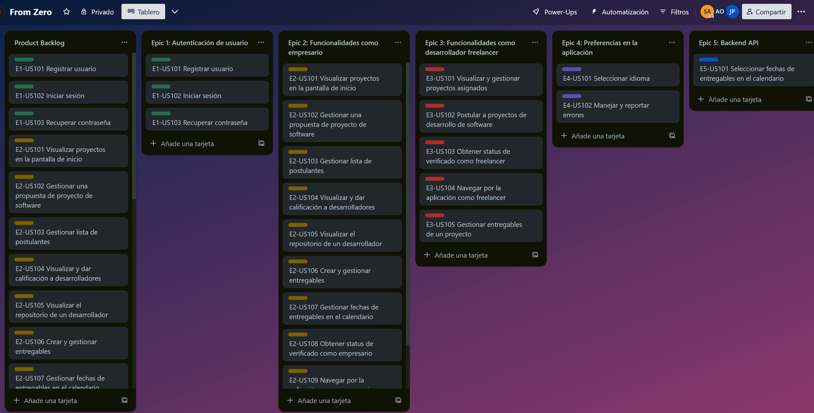

Enlace al tablero de Trello: https://trello.com/b/gNzXJS37/from-zero 

<table border="1">
  <thead>
    <tr>
      <th>User story ID</th>
      <th>Título</th>
      <th>Story Points (1 / 2 / 3 / 5 / 8)</th>
      <th>Sprint</th>
    </tr>
  </thead>
  <tbody>
    <tr>
      <td>E2-US109</td>
      <td>Navegar por la aplicación como empresario</td>
      <td>3</td>
      <td>1</td>
    </tr>
    <tr>
      <td>E2-US102</td>
      <td>Gestionar una propuesta de proyecto de software</td>
      <td>3</td>
      <td>1</td>
    </tr>
    <tr>
      <td>E2-US106</td>
      <td>Crear y gestionar entregables</td>
      <td>5</td>
      <td>1</td>
    </tr>
    <tr>
      <td>E2-US101</td>
      <td>Visualizar proyectos en la pantalla de inicio</td>
      <td>3</td>
      <td>1</td>
    </tr>
    <tr>
      <td>E2-US104</td>
      <td>Visualizar a desarrolladores</td>
      <td>3</td>
      <td>1</td>
    </tr>
    <tr>
      <td>E1-US101</td>
      <td>Registrar usuario</td>
      <td>3</td>
      <td>1</td>
    </tr>
    <tr>
      <td>E1-US102</td>
      <td>Iniciar sesión</td>
      <td>3</td>
      <td>1</td>
    </tr>
    <tr>
      <td>E2-US103</td>
      <td>Gestionar lista de postulantes</td>
      <td>5</td>
      <td>2</td>
    </tr>
    <tr>
      <td>E5-US101</td>
      <td>Seleccionar fechas de entregables en el calendario</td>
      <td>5</td>
      <td>2</td>
    </tr>
    <tr>
      <td>E2-US105</td>
      <td>Visualizar el repositorio de un desarrollador</td>
      <td>3</td>
      <td>2</td>
    </tr>
    <tr>
      <td>E3-US104</td>
      <td>Navegar por la aplicación como freelancer</td>
      <td>3</td>
      <td>2</td>
    </tr>
    <tr>
      <td>E3-US102</td>
      <td>Postular a proyectos de desarrollo de software</td>
      <td>3</td>
      <td>2</td>
    </tr>
    <tr>
      <td>E3-US101</td>
      <td>Visualizar y gestionar proyectos asignados</td>
      <td>3</td>
      <td>2</td>
    </tr>
    <tr>
      <td>E3-US103</td>
      <td>Obtener status de verificado como freelancer</td>
      <td>3</td>
      <td>3</td>
    </tr>
        <tr>
      <td>E2-US108</td>
      <td>Obtener status de verificado como empresario</td>
      <td>3</td>
      <td>3</td>
    </tr>
    <tr>
      <td>E4-US101</td>
      <td>Seleccionar idioma</td>
      <td>2</td>
      <td>4</td>
    </tr>
    <tr>
      <td>E4-US102</td>
      <td>Manejar y reportar errores</td>
      <td>1</td>
      <td>4</td>
    </tr>
    <tr>
      <td>E1-US103</td>
      <td>Recuperar contraseña</td>
      <td>3</td>
      <td>4</td>
    </tr>
        <tr>
      <td>E2-US107</td>
      <td>Gestionar fechas de entregables en el calendario</td>
      <td>5</td>
      <td>4</td>
    </tr>
  </tbody>
</table>

---

# Capítulo IV: Product Design


## 4.1. Style Guidelines

### 4.1.1. General Style Guidelines.
**Branding**<br>
Nuestra marca debe reflejar la esencia de la plataforma: facilitar la coordinación de proyectos de software entre empresas y desarrolladores freelance. Debe transmitir eficiencia, orden y colaboración.  
El diseño debe ser moderno y profesional, destacando elementos visuales que representen flujo de trabajo, seguimiento y avance. Además debe evocar un entorno donde el desarrollo fluye de forma clara y estructurada, reforzando la idea de conexión y progreso continuo.


**Typography**<br>
La fuente principal de nuestra marca será Lato, seleccionada por su claridad y elegancia. Esta tipografía equilibra un estilo profesional con un toque accesible y acogedor, lo que la hace ideal para diversas aplicaciones y refuerza la sensación de confiabilidad en la marca.
      

    
También emplearemos Open Sans como tipografía secundaria para destacar detalles y elementos complementarios. Esta elección añade diversidad visual mientras mantiene la armonía y consistencia en el diseño.


Por último, se elegirán los tamaños de fuente con especial atención para asegurar tanto una lectura clara como una estructura jerárquica adecuada dentro de la interfaz de usuario.

**Spacing**  
El uso del espacio en nuestra interfaz de usuario es clave para brindar una experiencia organizada y efectiva.  
Implementaremos márgenes y rellenos consistentes para asegurar una estructura visual ordenada.  
Los elementos interactivos, como botones y enlaces, contarán con un espacio adecuado para prevenir toques accidentales, especialmente en dispositivos móviles.

### 4.1.2. Web Style Guidelines.

Identificación de los componentes que formarán parte de la aplicación web.

En la esquina superior izquierda de la portada de WebMaster, se presenta un encabezado sencillo y sofisticado que incluye nuestro logotipo, simbolizando el vínculo entre empresarios y desarrolladores web. Justo a la derecha, se ubica un menú desplegable que organiza las distintas secciones de la aplicación, facilitando la navegación fluida para los usuarios.

**Colors**<br>
La paleta de colores principales incluye Azul (#0072FF), Gris Claro (#F5F7FA) y Verde Acento (#28A745). Estos colores se combinan para ofrecer un equilibrio entre profesionalismo, claridad y dinamismo. El azul, como color predominante, inspira confianza, mientras que el gris claro asegura una lectura cómoda, y el verde resalta los elementos clave de la interfaz.


Además, se incorporarán colores secundarios como Naranja Suave (#FFA500), Gris Oscuro (#333333) y Fucsia (#FF00FF), que serán aplicados de forma limitada para destacar componentes clave dentro del aplicativo.


### 4.1.3. Mobile Style Guidelines.

**Colors**<br>
Nuestra paleta de colores principales, compuesta por Azul violáceo (#6B74B4), Turquesa (#45B7A8) y Blanco (#FFFFFF). La combinación de estos tres colores en la paleta logra un equilibrio entre un aspecto profesional, la claridad necesaria y un toque de dinamismo. 
 
 

#### 4.1.3.1. iOS Mobile Style Guidelines.

En esta subsección se especificarán las pautas de diseño que se adherirán a las directrices de la interfaz humana de Apple (Human Interface Guidelines). Se definirán los patrones de navegación (como el uso de `UINavigationController` y `UITabBarController`), el estilo de los controles (como `UIButton`, `UITableView`, `UICollectionView`), el uso de tipografía y colores adaptados a iOS, las animaciones y transiciones, y las consideraciones de accesibilidad específicas para dispositivos Apple. Se proporcionarán ejemplos visuales y especificaciones técnicas para asegurar la coherencia con el ecosistema iOS.

#### 4.1.3.2. Android Mobile Style Guidelines.

En esta subsección se detallarán las directrices de diseño que seguirán los principios de Material Design de Google. Se definirán los patrones de navegación (como el uso de la `BottomNavigationView` y el `NavigationView`), el estilo de los componentes de la interfaz de usuario (como `Button`, `RecyclerView`, `CardView`), el uso de la paleta de colores de Material Design, las animaciones y transiciones basadas en las especificaciones de Material, y las consideraciones de accesibilidad específicas para dispositivos Android. Se incluirán ejemplos visuales y especificaciones técnicas para garantizar la consistencia con el lenguaje de diseño de Android.

## 4.2. Information Architecture.

### 4.2.1. Organization Systems.

**Web Applications**

Breve descripción sobre los sistemas de organización que utilizaremos (seleccionar):

- **Hierarchical:** This approach structures content by emphasizing varying levels of importance through visual differences such as size, colour, contrast, and alignment.
- **Sequential:** This method guides users along a specific path toward their goals, presenting content step-by-step according to the current stage.
- **Matrix:** You can always provide users with the option to choose their preferred navigation style, for example, alphabetical, chronological, or by topic.

**Mobile Applications**

Los sistemas de organización para aplicaciones móviles están diseñados para ofrecer una experiencia completa e intuitiva. Entre las funcionalidades principales se destacan:

- **Autenticación y Gestión de Cuentas:** Incluye una pantalla de inicio de sesión, la opción de seleccionar el tipo de usuario (Empresa o Desarrollador), registro de cuenta y recuperación de contraseña.
- **Interfaz para Empresas:** Permite acceder al panel principal donde se pueden crear y consultar proyectos, ver y editar el perfil empresarial, buscar desarrolladores y revisar sus perfiles, gestionar postulantes y utilizar un sistema de mensajería integrado.
- **Interfaz para Desarrolladores:** Ofrece un dashboard que posibilita la edición del perfil, la búsqueda y visualización de proyectos (incluyendo detalles y la opción de postularse), consultar perfiles de empresas, gestionar entregables y comunicarse mediante un sistema de mensajería.
- **Características Compartidas:** Ambas interfaces incluyen elementos comunes como un menú de navegación, notificaciones, sección de soporte/ayuda y opciones de configuración.
- **Gestión de Proyectos:** Se contemplan formularios para la creación de nuevos proyectos, listados y detalles, procesos de aplicación, seguimiento de entregables y un sistema de calificación.
- **Comunicación:** La aplicación incorpora mensajería por correo interno, notificaciones y la integración de email para la recuperación de contraseña.
- **Búsqueda y Descubrimiento:** Incluye funciones para la búsqueda de proyectos destinadas a desarrolladores y la búsqueda de desarrolladores para empresas, con opciones avanzadas de filtrado y ordenamiento.
- **Gestión de Perfiles:** Se administran los perfiles de usuario para empresas y desarrolladores, permitiendo la exhibición de portafolios en el caso de los desarrolladores, la presentación de información corporativa en los perfiles empresariales y la recopilación de calificaciones y reseñas.

### 4.2.2. Labeling Systems.

**Web Applications**

El sistema de etiquetado se ha diseñado para consolidar la información de manera eficaz y presentarla de forma clara y sencilla, evitando así la saturación de datos. Una estrategia común consiste en crear etiquetas breves que resuman grandes volúmenes de información en pocas palabras. Esto se traduce, por ejemplo, en emplear títulos cortos—como "home", "about us", etc.—para los elementos de la barra de navegación.

**Mobile Applications**

El sistema de etiquetado se fundamentará en imágenes sencillas y fácilmente comprensibles que representen el apartado o acción correspondiente. Se aplicarán prácticas habituales para desarrollar un sistema intuitivo que facilite la identificación visual y la navegación del usuario.

### 4.2.3. SEO Tags and Meta Tags

### Web Applications

**Meta & SEO (Search Engine Optimization) Tags**  
These tags are essential for making the website easily discoverable through search engines. They appear in search results and are included within the `<head>` section of the HTML.

- **Title**: FromZero - Connecting Businesses and Freelance Developers  
- **Description**: `<meta name="description" content="FromZero is the platform that links companies seeking software solutions with freelance developers eager to work on projects.">`  
- **Keywords**: `<meta name="keywords" content="hiring platform, freelance developers, custom software, development projects, connect companies with developers">`  
- **Author**: `<meta name="author" content="SiteForge Development Team">`

---

### Mobile Applications

**Meta & SEO (Search Engine Optimization) Tags**  
Estas etiquetas permiten que la aplicación sea fácilmente encontrada en buscadores y tiendas. En Android, esta información se define en el archivo `AndroidManifest.xml`.

```xml
<manifest ... >
    <application 
        android:label="Web Master - Plataforma de Proyectos Digitales" 
        android:description="Conecta empresas y desarrolladores para realizar sueños digitales" 
        ... >
        
        <activity
            android:name=".MainActivity"
            android:label="Web Master - Inicio"
            ... >
        </activity>
    </application>
</manifest>
```
**Para Google Play Store**  

- **Título de la aplicación**: Web Master - Plataforma de Proyectos Digitales  
- **Descripción corta**: Conecta empresas y desarrolladores para tus sueños digitales  
- **Descripción completa**:  
  Web Master es la plataforma perfecta para hacer realidad tus proyectos digitales. Reunimos empresas visionarias con desarrolladores talentosos para llevar a cabo iniciativas excepcionales.

  **Características principales**:  
  - Crea y administra proyectos digitales  
  - Encuentra desarrolladores con experiencia  
  - Desarrolladores: accede a oportunidades interesantes  
  - Sistema de mensajería incluido  
  - Perfiles completos y portafolios  
  - Control de entregas y pagos seguros  

  Tanto si eres una empresa en busca de profesionales como un desarrollador en busca de retos, Web Master es tu lugar para lograr el éxito digital.

- **Palabras clave**: proyectos digitales, desarrollo web, aplicaciones móviles, freelance, empresas, desarrolladores, tecnología, innovación, plataforma, conectar, trabajo remoto

### 4.2.4. Searching Systems
Los sistemas de búsqueda son herramientas digitales diseñadas para ayudar a los usuarios a localizar información específica dentro de un conjunto de datos, desempeñando un papel clave en la mejora de la experiencia de usuario. Para ello, se implementarán dos tipos de sistemas de búsqueda:
- Búsqueda Inicial: Disponible para todos los usuarios, este sistema ofrecerá una experiencia sencilla e intuitiva mediante menús desplegables y una barra de navegación accesible, facilitando la localización de información sin complicaciones.
- Búsqueda de empresas o desarrolladores: En función del segmento correspondiente, este sistema permitirá aplicar filtros de búsqueda para identificar empresas con proyectos disponibles o explorar perfiles de desarrolladores.
Espero que esta versión sea adecuada.

### 4.2.5. Navigation Systems.

#### Web Applications

En la página de inicio se mostrará una barra de navegación en la parte superior junto con un botón para iniciar sesión. Al acceder a la aplicación, el usuario contará con accesos directos ubicados en la parte superior de la pantalla para facilitar la navegación dentro del sistema.

#### Mobile Applications

En la versión móvil, la aplicación presentará un botón para iniciar sesión. Una vez dentro, el usuario podrá moverse por las diferentes secciones mediante una barra de navegación situada en la parte inferior de la interfaz.

## 4.3. Landing Page UI Design.

### 4.3.1. Landing Page Wireframe.


### 4.3.2. Landing Page Mock-up.


## 4.4. Mobile Applications UX/UI Design.

### 4.4.1. Mobile Applications Wireframes.


**Usuario desarrollador**


**Usuario empresas**


### 4.4.2. Mobile Applications Wireflow Diagrams.

**Inicio de aplicación**  


**Registrar usuario / Reestablecer contraseña**  


**Ver información de los desarrolladores**  


**Explorar y Postular Proyecto**  


**Empresas Crear proyecto**  


**Empresas Explorar, ver perfil y contactar con desarrollador**  


**Empresas Ver y crear entregables**  


**Atención al Cliente**  


### 4.4.3. Mobile Applications Mock-ups.

**Prototype:**<br>
https://www.figma.com/proto/F9uDpQtivg5tkJt5aA81VP/Mockup-Webmaster-Mobile?node-id=2-325&t=3sAIe7acXLbBfGd5-1

**Inicio de sesión y creación de usuario:**<br>
 

 

 

**Usuario Desarrollador**<br>
**Página principal:**<br>
 

**Buscar/postular proyectos:**<br>
|  |  |  |
|---------------------------------------------|---------------------------------------------|---------------------------------------------|

**Ver Proyecto/Entregables:**<br>
 

**Mensaje:**<br>


**Misceláneos:**<br>
 

**Usuario Empresa**<br>
**Página principal:**<br>


**Buscar desarrolladores:**<br>


**Ver entregables:**<br>


**Crear entregables:**<br>


**Mensaje:**<br>


**Crear proyecto:**<br>


### 4.4.4. Mobile Applications User Flow Diagrams.


**Link:**<br>
https://www.figma.com/board/IE1u1Ga2nGV2Z2uGkbeTXG/User-Flow---Fromzero-Mobile?node-id=0-1&t=uwWbBD9adPi6GK0e-1

## 4.5. Mobile Applications Prototyping.

### 4.5.1. Android Mobile Applications Prototyping.


[URL del Prototipo Android (Hecho en figma)](https://www.figma.com/proto/F9uDpQtivg5tkJt5aA81VP/Mockup-FromZero-Mobile?node-id=4228-204&t=3sAIe7acXLbBfGd5-1&starting-point-node-id=4228%3A204)

[URL de video de flujos de interaccion]()

### 4.5.2. iOS Mobile Applications Prototyping.


[URL del Prototipo iOS (Hecho en figma)](https://www.figma.com/proto/F9uDpQtivg5tkJt5aA81VP/Mockup-FromZero-Mobile?node-id=4228-204&t=3sAIe7acXLbBfGd5-1&starting-point-node-id=4228%3A204)

[URL de video de flujos de interaccion]()

## 4.6. Web Applications UX/UI Design.

### 4.6.1. Web Applications Wireframes.

**Inicio de Sesión**<br>


**Registro**<br>


**Cambiar contraseña**<br>


##### Empresas
**HomePage**<br>


**ProjectsPage**<br>


**Deliverables Timeline**<br>


**Explore Devs**<br>


**Messages**<br>


**Explorar Proyectos Destacados**<br>


**Support**<br>


##### Desarrolladores
**HomePage**<br>


**Browse Projects**<br>


**Apply for Job**<br>


**Deliverables Timeline**<br>


**Messages**<br>


**Support**<br>


**Explorar Proyectos Destacados**<br>


### 4.6.2. Web Applications Wireflow Diagrams.

**Registrar Usuario_Reestablecer contraseña**


**Inicio de la aplicación**


**Proyectos Destacados**


**Atencion al cliente**


**Segmento Empresa**

**Ver entregables de proyecto**


**Explorar, ver perfil y contactar con desarrollador**


**Crear proyecto**


**Segmento Desarrollador**

**Trabajar en proyecto, ver entregables y comunicar con empresa**


**Explorar y postular a proyecto**


### 4.6.3. Web Applications Mock-ups.

**Inicio de Sesión**<br>


**Registro**<br>


**Cambiar contraseña**


##### Empresas
**HomePage**<br>


**ProjectsPage**<br>


**Deliverables Timeline**<br>


**Explore Devs**<br>


**Support**<br>


##### Desarrolladores
**HomePage**<br>


**Browse Projects**<br>


**Apply for Job**<br>


**Deliverables Timeline**<br>


**Support**<br>


**Explorar Proyectos Destacados**<br>


### 4.6.4. Web Applications User Flow Diagrams.

**Registrar Usuario/Reestablecer contraseña**<br>


**Inicio de la aplicación**


**Proyectos Destacados**


**Atencion al cliente**


**Segmento Desarrollador**

**Trabajar en proyecto, ver entregables y comunicar con empresa**


**Explorar y postular a proyecto**


## 4.7. Web Applications Prototyping.


[URL del Prototipo en vista de empresa(Hecho en figma)](https://www.figma.com/proto/59rup67dfioDXBRKEmpxAD/Mockup-From-Zero-Open-Source?type=design&node-id=2-325&t=YuGoXqkU7ZGQ3s2N-0&scaling=scale-downstarting-point-node-id=3254%3A359&show-proto-sidebar=1)

[URL del Prototipo en vista de desarrollador(Hecho en figma)](https://www.figma.com/proto/59rup67dfioDXBRKEmpxAD/Mockup-From-Zero-Open-Source?type=design&node-id=2-325&t=YuGoXqkU7ZGQ3s2N-0&scaling=scale-down&starting-point-node-id=3254%3A319&show-proto-sidebar=1)

### 4.8. Domain-Driven Software Architecture.

### 4.8.1. Software Architecture Context Diagram.


### 4.8.2. Software Architecture Container Diagrams.


### 4.8.3. Software Architecture Components Diagrams.


## 4.9. Software Object-Oriented Design.

### 4.9.1. Class Diagrams.


### 4.9.2. Class Dictionary.

|**User**||
| - | :- |
|Clase usuario definida como la cuenta principal con la nuestro segmentos pueden ingresar a nuestra aplicación.||
|**Atributo**|**Tipo de Variables**|
|\_id|Long|
|\_email|String|
|\_password|String|
|\_Set<Rol>|Enterprise|

|**Enterprise**||
| - | :- |
|Perfil de empresa dentro de la aplicacion, donde se podra gestionar la informacion personal.||
|**Atributo**|**Tipo de Variables**|
|\_id|Long|
|\_enterpriseName|String|
|\_description|String|
|\_ruc|String|
|\_profileImgUrl|String|
|\_projectsCompleted|Number|

|**Developer**||
| - | :- |
|Perfil de desarrollador dentro de la aplicacion, donde se podra gestionar la informacion personal.||
|**Atributo**|**Tipo de Variables**|
|\_id|Long|
|\_firstName|String|
|\_lastName|String|
|\_description|String|
|\_profileImgUrl|String|
|\knowledges|Array[String]|

|**Project**||
| - | :- |
|Entidad que contendra la informacion de un proyecto create mediante un usuario Enterprise, contiene la relacion con entregables que seran definidos de forma automatica como tambien gestionada por la misma Enteprise.||
|**Atributo**|**Tipo de Variables**|
|\_id|Long|
|\_projectName|String|
|\_description|String|
|\_projectProgress|Double|
|\_budget|Double|
|\_projectType|LANDING_PAGE|
||WEB_APPLICATION|
||MOBILE_APPLICATION|
||DESKTOP_APPLICATION|
||IOT_PROJECT|
|\_projectState|IN_SEARCH|
|             |IN_PROGRESS|
|             |COMPLETED|

|**Deliverables**||
| - | :- |
|Entidad que contendra la informacion de un entregable. Estan ligados a un Proyecto, contienen una fecha de fin y un estado, el cualquier evolucionada de acuerdo a las acciones del usuarios Developer como del usuario Enterprise||
|**Atributo**|**Tipo de Variables**|
|\_id|Long|
|\_name|String|
|\_description|String|
|\_endDate|LocalDate|
|\_files|String|
|\_tate       |PENDING|
|             |AWAITING_REVIEW|
|             |DECLINED|
|             |COMPLETED|

|**Notifications**||
| - | :- |
|Entidad encargada a las notificaciones a los distintos usuarios. Se enfocara en notificaciones de avance del proyecto y entregables. Cada proyecto tendria sus propias notificaciones relacionadas.||
|**Atributo**|**Tipo de Variables**|
|\_id|Long|
|\_message|String|
|\_tmestamp|LocalDateTime|
|\_read|Boolean|

|**Membership**||
| - | :- |
|Entidad encargada de manejar la membresia de un usuarios, esta se encarga de la gestion del plan del usuario y revision de tiempo de fin.||
|**Atributo**|**Tipo de Variables**|
|\_id|Long|
|\_startDate|LocalDate|
|\_endDate|LocalDate|
|\_isActive|Boolean|

|**Plan**||
| - | :- |
|Entidad encargada de manejar las mejoras que tendra por la membresia, como tambien manejar el precio de cada plan relacionado a la membresia dentro de la aplicacion.||
|**Atributo**|**Tipo de Variables**|
|\_id|Long|
|\_name|String|
|\_price|Double|
|\_durationInDays|Int|

## 4.10. Database Design.

### 4.10.1. Relational/Non-Relational Database Diagram.

Se utilizara como base de datos relacional el gestor de base de datos MySQL. A continuacion se mostrara el diagrama de base de datos:


---

# Capítulo V: Product Implementation

## 5.1. Software Configuration Management.
### 5.1.1. Software Development Environment Configuration.
**Project Management**
- Trello [https://trello.com](https://trello.com):
 Trello es una aplicación web de gestión de proyectos compatible con la mayoria de navegadores. Se utilizó Trello para la organización y registro de las tareas por hacer, las que están en proceso y las realizadas. De esta forma podemos tener control acerca del avance del proyecto y las actividades de cada uno de los miembros del equipo.

**Product UX/UI Design**
- Miro [https://miro.com](https://miro.com):
 Miro ha sido empleado en el desarrollo de los escenarios mapping y escenario mapping para ambos segmentos objetivos.

- Figma [https://figma.com](https://figma.com):
 Esta herramienta fue de vital importancia para la creación de los wireframes, mockups y mobile applications prototyping de manera colaborativa. Asimismo, su acceso es gratuito al contar con una cuenta registrada.

**Software Developement**
- Landing Page:
El desarrollo del landing page se llevó a cabo con las tecnologías básicas para esta misma: HTML5, CSS3 y JavaScript.
- Frontend Web Application:
Se ha utilizado a Vue como framework de Javascript. En adición, para la implementación de componentes reutilizables y accesibles se usó PrimeVue como biblioteca de componentes UI.


**IDE's de desarrollo**
- IntelliJ IDEA [https://www.jetbrains.com/idea/](https://www.jetbrains.com/idea/):
IntelliJ IDEA es un entorno de desarrollo integrado (IDE) creado por JetBrains. Este entorno de desarrollo nos proporcionará distintas herramientas para agilizar el proceso de desarrollo

- WebStorm [https://www.jetbrains.com/webstorm/](https://www.jetbrains.com/webstorm/): Para el front se utilizó WebStorm, un IDE de JavaScript y TypeScript. Este IDE es muy útil para el desarrollo de aplicaciones web, ya que cuenta con herramientas para la depuración, pruebas y análisis de código.

**Software Testing**
- Para las pruebas de testeo software, tanto de la landing page como de la aplicación web, se emplearon las herramientas de desarrollador de los principales navegadores web como Google Chrome [https://www.google.com/chrome/](https://www.google.com/chrome/), Microsoft Edge [https://www.microsoft.com/en-us/edge](https://www.microsoft.com/en-us/edge) y Mozilla Firefox [https://www.mozilla.org/en-US/firefox/browsers/](https://www.mozilla.org/en-US/firefox/browsers/). Estos navegadores cuentan con aplicaciones desktop y móviles las cuáles son totalmente gratuitas. En el caso de desktop podemos instalarlos desde sus sitios oficiales, en el caso de móvil, desde la tienda de aplicaciones del sistema operativo en cuestión.

**Software Deployment**
- **Vercel** [https://vercel.com](https://vercel.com):
es una plataforma en la nube que ofrece herramientas integrales para el desarrollo, implementación y alojamiento de aplicaciones web, permitiendo a los desarrolladores crear y lanzar sitios estáticos o dinámicos de manera eficiente y escalable.

**Software Documentation**
- Markdown [https://docs.github.com/es/get-started/writing-on-github/getting-started-with-writing-and-formatting-on-github/basic-writing-and-formatting-syntax](https://docs.github.com/es/get-started/writing-on-github/getting-started-with-writing-and-formatting-on-github/basic-writing-and-formatting-syntax):
Markdown es un lenguaje de marcado ligero que nos permite formatear texto de manera sencilla utilizando un formato de texto plano. De esta forma documentamos la información importante acerca del contexto, organización, producción y creacíon del proyecto.
- Structurizr [https://structurizr.com/](https://structurizr.com/):
Esta herramienta permite crear los diagramas C4 de manera rápida con una sintaxis similar a un lenguaje de programación. Para utilizar esta aplicación web hace falta tener una cuenta registrada.

- Vertabelo: [https://www.vertabelo.com/](https://www.vertabelo.com/)
Es una aplicación web colaborativa que facilita el diseño e implementación de bases de datos en una amplia variedad de motores.

### 5.1.2. Source Code Management.
Repositorios:<br>
- Url del repositorio del La web app: [Url del repositorio](https://github.com/upc-pre-20251-1asi0732-4453-webmaster/webmaster-app)
- Url del repositorio de la Api RESTful: [Url del repositorio](https://github.com/upc-pre-20251-1asi0732-4453-webmaster/FromZeroAPI)
- Url del repositorio de la Landing Page: [Url del repositorio](https://github.com/upc-pre-20251-1asi0732-4453-webmaster/WebMaster-LandingPage)

Git Flow:<br>
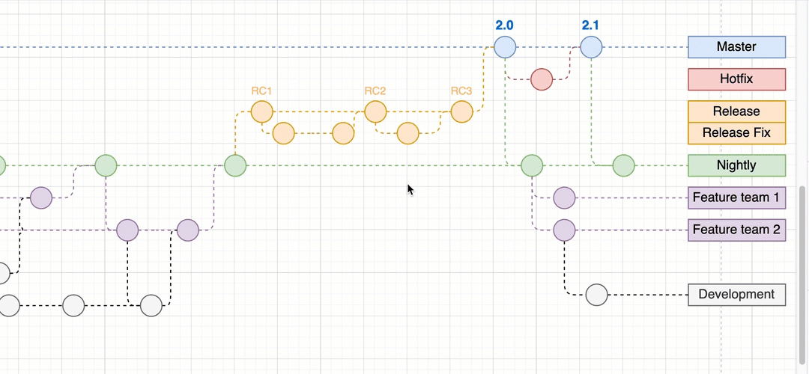

Se aplicará GitFlow utilizando el artículo de Vincent Driessen, “A successful Git branching model”. A continuación se dará una explicación de cada Branch que se utiliza en el modelo GitFlow.

- MASTER: Se utilizara esta rama como la versión estable y lista para producción. Todos los cambios que se fusionan aquí ya se consideran seguros y listos para implementar.

- DEVELOP: Esta rama es donde se trabajarán nuevas características y correcciones de errores. Es la rama principal de desarrollo.

- FEATURE BRANCHES: Son ramas de características para trabajar en nuevas funciones. Cada característica tendrá su propia rama, para que se trabaje de manera aislada, luego se fusiona con la rama DEVELOP.

- RELEASE BRANCHES: Son las ramas de lanzamiento que sirven para preparar una nueva versión del software. Se corrigen errores, pruebas finales y se prepara para fusionarse con MASTER y DEVELOP.

- HOTFIX BRANCHES: Son esenciales cuando ocurren errores en la producción. Se crean directamente desde MASTER, se solucionan los problemas y se fusionan los cambios en las ramas de MASTER y DEVELOP.
<br>

Commit Conventions
Para el formato de los COMMITS se aplicará lo siguiente: \<type>:\<description> Donde:

TYPE: Solo pueden ser 3 tipos, sea BREAKING que se relaciona con X, luego FEAT que se relaciona con Y y por último FIX que se relaciona con Z.

### 5.1.3. Source Code Style Guide & Conventions.

**HTML**: https://www.w3schools.com/html/html5_syntax.asp
           
**Index.html**

Es la página por defecto dentro de los directorios de los servidores de cualquier sitio web que se carga siempre que se solicita un dominio y no se especifica el nombre de un archivo en específico. Y en la mayoría de los casos el propio servidor web es el que se encarga de buscar el archivo index.

**Convenciones de HTML**:

- Se debe declarar el tipo de documento en la primera línea: `<!DOCTYPE html>`
- Se recomienda usar minúsculas en las etiquetas y estructuras: `<body>` `<p>`
- Se recomienda cerrar todas las etiquetas y estructuras: `<p>This is a paragraph.</p>`
- Se recomienda usar minúsculas en los atributos: `<a href="https://www.google.com/html/">`
- Se recomienda usar comillas en los valores de atributo: `<table class="striped">`
- Se debe especificar el alt, ancho y alto de las imágenes: ``
- Se recomienda no usar espacios a la hora de usar el signo “=”: `<link rel="stylesheet" href="styles.css">`
- Solo se debe usar líneas en blaco para facilitar la lectura de bloques de códigos grandes o lógicos.
- No se debe omitir el elemento `<title>` ya que es vital para el motor de búsqueda, así como también se recomienda que el contenido de los `<title>` sea preciso y significativo: `<title>HTML Style Guide and Coding Conventions</title>`
- No se recomienda omitir las etiquetas `<html>` y `<body>` ya que puede producir errores en navegadores antiguos y puede bloquear el software DOM y XML.
- Se debe usar el atributo lang para declarar el idioma de la página web: `<html lang="en-us">`
- Se debe utilizar el atributo meta para una interpretación adecuada e indexación correcta en los motores de búsqueda: `<meta charset="UTF-8">`

**CSS**: https://google.github.io/styleguide/htmlcssguide.html
           
**Style.css**

El estilo de cascada (CSS) se puede usar para estilos de texto, por ejemplo, cambiar de color y el tamaño de los encabezados, enlaces, entre otras cosas.

**Convenciones de CSS**:

- Utilizar el protocolo HTTPS para imágenes y otros archivos multimedia: `@import 'https://fonts.googleapis.com/css?family=Open+Sans'` ; Todo el código debe estar en minúsculas como nombres de elementos HTML, atributos, valores de atributo, entre otros: `color : #e5e5e5;`
- El nombre de una clase debe transmitir lo que hace de la forma más breve posible ya que de esta manera se apoya la comprensibilidad y eficiencia del código: navegación {} . autor {} Se debe separar los nombres de las clases con un guión (“-”): navegación {} . autor {}
- Se recomienda usar propiedades abreviadas cuando sea posible: `border - top : 0 ;`
- Se recomienda usar la notación hexadecimal de 3 caracteres en colores que lo permitan: `color : #ebc;`
- Se recomienda ordenar las declaraciones de propiedades y características en orden alfabético
- Se debe usar un “;” después de cada declaración: `pantalla : bloque ;`
- Se debe usar un espacio después de los “:” de cada nombre de la propiedad: `font - weight : bold ;`
- Se debe usar un espacio entre el último sector y la llave “{ “ que comienza el bloque de declaración:. vídeo {.....}
- Se debe usar las comillas simples (‘ ‘) para los atributos y valores de propiedad: `familia de fuentes : ' open sans' , arial , sans - serif ;`

**Gherkin**: https://cucumber.io/docs/gherkin/reference/

**`<usertStoryID>`.featrue** :

En este archivo de formato feature estarán las historias de usuario como características de la aplicación. Asimismo se pueden encontrar los criterios de aceptación para las diversas situaciones.

**Convenciones de Gherkin**:

- Se utiliza la palabra Feature para introducir una descripción de alto nivel de una función de software y agruparlos en escenarios relacionados
- Example o Scenario sirven para plantear una situación
- Se utiliza Given para describir el contexto inicial, When para describir un evento y Then para describir un resultado esperado y And para adicionar información. Given,When,Then y And se usan para describir un escenario
- El carácter “|” sirve para formar una tabla datos, las cuales son útiles para pasar una lista de valores a una definición de paso.

**Java**: https://google.github.io/styleguide/javaguide.html 

**Convenciones de Java**:

- Los nombres de clases y tipos deben ser sustantivos en mayúscula inicial.
- Los nombres de los métodos deben ser minúsculas.
- El nombre de las variables debe ser en minúsculas y usar camel case.
- Para las sentencias if,else,for,do y while se deben usar “ { } “.
- Los nombres de variables que son Constantes deben ir en mayúsculas.

**JavaScript**: https://google.github.io/styleguide/jsguide.html. 

**Convenciones de JavaScript**:

- Se debe usar Camelcase para los nombres de variables y funciones.
- Se debe usar Pascalcase para los nombres de constructores o clases.
- Se debe usar mayúsculas y guiones bajos para los nombres de la constantes, por ejemplo UPPER_CASE_WITH_UNDERSCORES..
- Se debe usar let y const para definir las variables, var debe evitarse.
- Para los comentarios de una sola línea debe usar “ // ” y para bloques de comentario se debe usar  “ /* */ ”.
Se debe incluir un punto y coma al final de cada instrucción.

**TypeScript**: https://google.github.io/styleguide/tsguide.html

**Convenciones de TypeScript**:

- Se debe usar Camelcase para los nombres de variables y funciones.
- Se debe usar Pascalcase para los nombres de interfaces o clases.
- Se debe usar number para valores numéricos, string para cadenas de texto y boolean para los valores booleanos.
- Se debe usar const para las constantes.
- Se debe usar extends para la herencia 
- Se debe usar implements para la implementación de interfaces
- Se debe usar por imports y exports para modularizar el código
- Se debe usar “ | ” para la unión y “ & ” para las intersecciones

**Spring Boot** : https://docs.spring.io/spring-boot/docs/current/reference/html/features.html

**Convenciones de Spring Boot**:

- Se debe emplear `@Controller`, `@Service`, `@Repository`, `@Component`, `@Autowired`, entre otros más, para poder definir y gestionar los componentes de Spring.
- Para el manejo de excepciones se debe hacer uso de `@ControllerAdvice` y `@ExceptionHandler` para poder gestionar los errores de manera consistente.
- Se debe usar `@Transactional` para gestionar las transacciones.
- En el caso que se quiera gestionar la autenticación y autorización de una aplicación, se debe usar Spring Security.
- Se debe usar nombre de paquetes y clases descriptivas que reflejan la funcionalidad de los componentes.

**Vue.js**: https://vuejs.org/v2/style-guide/

**Convenciones de Vue.js**:
- Usar PascalCase para nombrar componentes (`UserCard.vue`).
- Usar kebab-case para usar componentes en plantillas (`<user-card />`).
- Un componente por archivo `.vue`.
- Estructurar los archivos `.vue` con `<template>`, `<script>`, y `<style>` en ese orden.
- Usar `scoped` en estilos si solo deben afectar al componente.
- Usar camelCase para las props en JS (`userName`).
- Usar kebab-case para las props en HTML (`:user-name="..."`).
- Usar kebab-case para nombres de eventos personalizados (`@user-clicked="..."`).
- Ordenar las opciones del componente de forma consistente (`name`, `props`, `data`, `computed`, `methods`, etc.).
- Definir vistas en PascalCase (`HomeView.vue`, `AboutView.vue`).
- Importar vistas en rutas usando `() => import(...)` para lazy loading.
- Agrupar componentes por funcionalidad en carpetas (`components/`, `views/`, etc.).

### 5.1.4. Software Deployment Configuration.
En esta sección abordaremos el despliegue de nuestro Landing Page mediante el servicio de Netlify, a continuación se describirán los pasos a seguir

- Nos situamos en el apartado principal como organización
Como organización contamos con un repositorio del landing page, es la cual se estuvo desarrollando la implementación del código. Y este repositorio será el que se vincula a Netlify.
    
- Luego procedemos a iniciar sesión (o crear una cuenta) en https://www.netlify.com. Una vez ingresemos, buscaremos la sección de sitios y le daremos a la opcion de: “Add new site” y luego a “Import from Git”
    
- Una vez estemos seleccionando el proveedor de Git, escogeremos Github
    
- Por último, seleccionaremos el repositorio e indicaremos cual es la branch donde se realizará el deploy y le damos al botón de Deploy.
    
    

## 5.2. Product Implementation & Deployment.
### 5.2.1. Sprint Backlogs.

#### 5.2.1.1 Sprint 1

| **Sprint #**               | **Sprint 1**                                                                 |
|-----------------------------|------------------------------------------------------------------------------|
| **SprintPlanningBackground** | Desarrollo de la interfaz base (frontend) y API RESTful (backend) para funcionalidades críticas: landing, autenticación y gestión de proyectos. |
| **Date**                    | 2025-04-07                                                                  |
| **Time**                    | 10:00AM–12:00PM                                                             |
| **Location**                | Virtual (Google Meet)                                                       |
| **PreparedBy**              | Equipo WebMaster                                                            |
| **Attendees**               | Equipo WebMaster|
| **Sprint–0ReviewSummary**   | Bocetos exploratorios de interfaz y diseño de prototipo de alta fidelidad completados. |
| **Sprint–1RetrospectiveSummary** | Prototipo ajustado tras pruebas de usabilidad. API básica implementada para login/registro. |
| **SprintGoal**              | **Frontend**: Interfaz base web (landing, login/registro, perfil). **Backend**: API RESTful para autenticación y gestión de proyectos. |
| **SprintVelocity**          | 26 puntos                |
| **SumofStoryPoints**        | 26                                                                        

<br>

#### Sprint Backlog
| User story | Title                                    | id       | Description                                      | Time (Story Points) | Assigned to | Status |
|------------|------------------------------------------|----------|--------------------------------------------------|---------------------|-------------|--------|
| E2-US109   | Navegar por la aplicación como empresario | E2-US109 | Permitir al empresario navegar por la aplicación | 3                  | Dev Team    | done   |
| E2-US102   | Gestionar una propuesta de proyecto de software | E2-US102 | Crear y administrar propuestas de proyectos      | 3                  | Dev Team    | done   |
| E2-US106   | Crear y gestionar entregables            | E2-US106 | Permitir la creación y gestión de entregables    | 5                  | Dev Team    | done   |
| E2-US101   | Visualizar proyectos en la pantalla de inicio | E2-US101 | Mostrar proyectos en la pantalla principal       | 3                  | Dev Team    | done   |
| E2-US104   | Visualizar a desarrolladores             | E2-US104 | Mostrar información de desarrolladores           | 3                  | Dev Team    | done   |
| E1-US101   | Registrar usuario                        | E1-US101 | Permitir el registro de nuevos usuarios          | 3                  | Dev Team    | done   |
| E1-US102   | Iniciar sesión                           | E1-US102 | Permitir a los usuarios iniciar sesión           | 3                  | Dev Team    | done   |

---

#### 5.2.1.2 Sprint 2

| **Sprint #**               | **Sprint 2**                                                                 |
|-----------------------------|------------------------------------------------------------------------------|
| **SprintPlanningBackground** | Ampliación de funcionalidades: postulaciones y visualización de repositorios. Trabajo en frontend y backend. |
| **Date**|  025-04-21     |
| **Time**                    | 09:00AM–11:00AM              |
| **Location**                | Virtual (Zoom)     |
| **PreparedBy**              | Equipo WebMaster      |
| **Attendees**               | Equipo WebMaster  |
| **Sprint–1ReviewSummary**   | Interfaz base y API de autenticación completadas. Pruebas de integración exitosas. |
| **Sprint–2RetrospectiveSummary** | Mejoras en rendimiento de API y ajustes en UI/UX basados en feedback.       |
| **SprintGoal**              | **Frontend**: Flujo de postulaciones. **Backend**: Endpoints para gestión de postulantes y entregables. |
| **SprintVelocity**          | 22 puntos                       |
| **SumofStoryPoints**        | 22  
<br>

#### Sprint Backlog

| User story | Title                                    | id       | Description                                      | Time (Story Points) | Assigned to | Status |
|------------|------------------------------------------|----------|--------------------------------------------------|---------------------|-------------|--------|
| E2-US103   | Gestionar lista de postulantes          | E2-US103 | Administrar la lista de postulantes a proyectos  | 5                  | Jair    | done   |
| E5-US101   | Seleccionar fechas de entregables en el calendario | E5-US101 | Permitir asignar fechas a entregables en el calendario | 5                  | Zaid    | done   |
| E2-US105   | Visualizar el repositorio de un desarrollador | E2-US105 | Mostrar el repositorio de un desarrollador       | 3                  | Victor   | done   |
| E3-US104   | Navegar por la aplicación como freelancer | E3-US104 | Permitir al freelancer navegar por la aplicación | 3                  | Harold   | done   |
| E3-US102   | Postular a proyectos de desarrollo de software | E3-US102 | Permitir a freelancers postular a proyectos      | 3                  | Samira    | done   |
| E3-US101   | Visualizar y gestionar proyectos asignados | E3-US101 | Mostrar y administrar proyectos asignados        | 3                  | Samira   | done   |

### 5.2.2. Implemented Landing Page Evidence
[Repositorio](https://github.com/upc-pre-20251-1asi0732-4453-fromzero/WebMaster-LandingPage) <br>
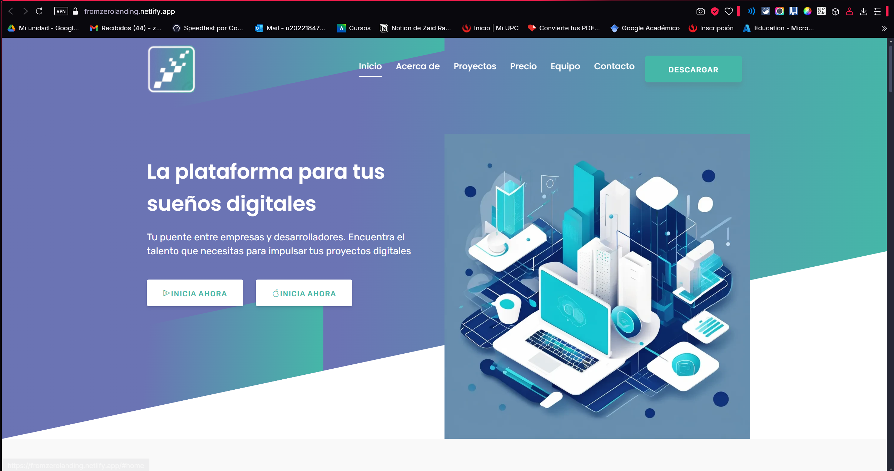

### 5.2.3. Implemented Frontend-Web Application Evidence
[Repositorio](https://github.com/upc-pre-20251-1asi0732-4453-fromzero/webmaster-app) <br>
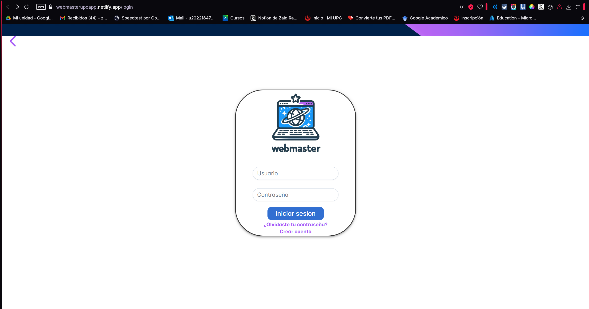

### 5.2.4. Acuerdo de Servicio Saas
En esta sección se definen los derechos, obligaciones y restricciones que se aplican sobre los usuarios de la plataforma de WebMaster. Esto permite transparencia a la hora del uso del sistema. Este acuerdo podrá ser visualizado en el apartado de Términos de servicio para ser accesible durante el flujo del usuario.

**1. Naturaleza del servicio** <br>
WebMaster es una plataforma digital ofrecida bajo el modelo SaaS que permite a empresarios, pymes y desarrolladores freelance interactuar para la creación, gestión y seguimiento de proyectos tecnológicos. Entre sus principales funcionalidades se encuentran:

- Publicación y gestión de proyectos.
- Recepción y evaluación de propuestas por parte de freelancers.
- Gestión de entregables vinculados a proyectos.
- Visualización de postulantes, sus perfiles y calificaciones.
- Coordinación entregables colaborativos.
- Comunicación y seguimiento del estado del proyecto en tiempo real.
- WebMaster actúa como facilitador tecnológico y no participa en la formalización contractual, ejecución técnica ni en la gestión de pagos entre usuarios.

**2. Derechos del usuario** <br>
Todo usuario registrado, ya sea en rol de empresa o freelancer, goza de los siguientes derechos:

- Acceder a las funcionalidades de la plataforma de acuerdo con su perfil.
- Configurar su información personal o profesional, y gestionar su presencia en el sistema.
- Solicitar soporte técnico para el uso adecuado de la plataforma.

**3. Obligaciones del usuario** <br>
Los usuarios de WebMasterse comprometen a:
- Brindar información veraz y actualizada en sus perfiles, proyectos y propuestas.
- Gestionar de manera directa cualquier relación laboral, contractual o financiera derivada del uso de la plataforma.
- Mantener actualizados los datos de contacto, experiencia, habilidades, descripciones de proyectos y cualquier otra información relevante para su correcta participación en la plataforma.
- Asumir responsabilidad total sobre los acuerdos realizados con otros usuarios (tanto proyectos como pagos), comprometiéndose a cumplir con los términos pactados de forma transparente y profesional.

**4. Restricciones del sistema**<br>
WebMaster establece las siguientes restricciones en el uso del servicio:
- La plataforma no gestiona, intermedia ni custodia pagos entre las partes involucradas. Las transacciones se realizan por fuera del sistema y son responsabilidad exclusiva de los usuarios.
- WebMaster se reserva el derecho de suspender o eliminar cuentas que incurran en violaciones de este acuerdo, presenten comportamientos abusivos o comprometan la seguridad del sistema y sus usuarios.
- No se garantiza la ejecución de los acuerdos establecidos entre usuarios ni la calidad de los entregables, siendo estos aspectos ajenos a la operación del sistema.
- WebMaster no actúa como empleador ni representante legal de ninguna de las partes. La relación que se establezca entre usuario empresa y usuario freelance es completamente independiente de la plataforma.

**5. Limitaciones del soporte** <br>
El equipo deWebMaster ofrece soporte limitado a aspectos técnicos de la plataforma, como fallos de acceso, errores funcionales o dudas sobre el uso de las herramientas integradas. No se ofrece intervención en conflictos entre usuarios, ni arbitraje sobre entregas, plazos o pagos.

**6. Privacidad y protección de datos**<br>
La información personal y profesional ingresada en WebMaster será tratada conforme a la Política de Privacidad de la plataforma. No se comparte información sensible con terceros, salvo requerimiento legal o autorización expresa del usuario.
 
### 5.2.5. Implemented Native-Mobile Application Evidence
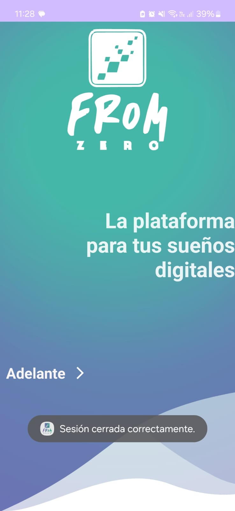

### 5.2.6. Implemented RESTful API and/or Serverless Backend Evidence
[Repositorio](https://github.com/upc-pre-20251-1asi0732-4453-fromzero/FromZeroAPI)<br>
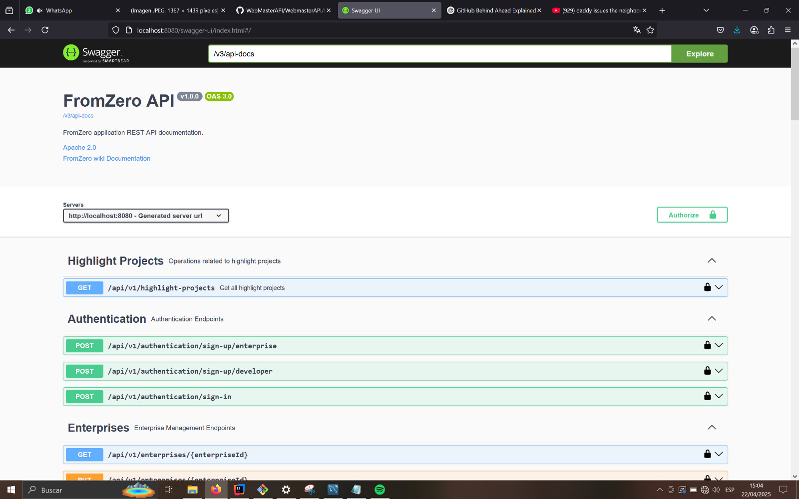

### 5.2.7. RESTful API documentation
En esta sección se presentan los endpoints desarrollados en el
presente sprint y se adjuntan capturas de las acciones CRUD
realizadas con Api. En el alcance del sprint, se han desarrollado los
bounded context de autenticación, perfil, actividades, reclutamiento y
organizaciones. Se adjunta el link del repositorio de la API en Github:
[Api](https://github.com/WebMastersUPC/WebMasterAPI)

| **Bounded Context** | **Endpoint Url**                  |**Swagger**|
|---------------------|-----------------------------------|-----------|
| Authentication      | /api/v1/authentication/           |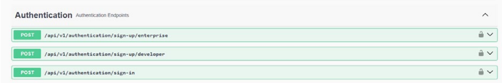|
| Enterprises         | /api/v1/enterprises/              |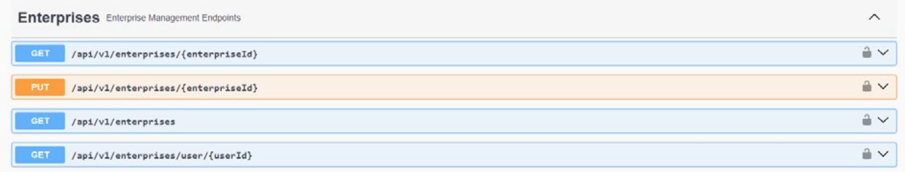|
| Developers          | /api/v1/developers/               |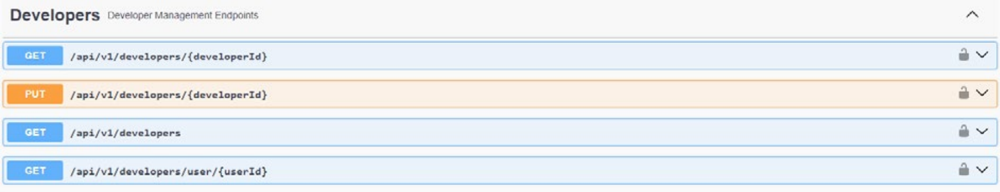|
| Projects            | /api/v1/projects/                 |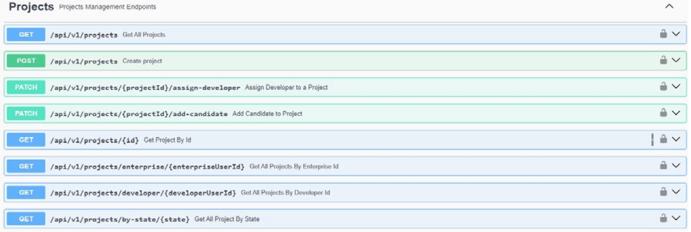|
| Users               | /api/v1/users/                    |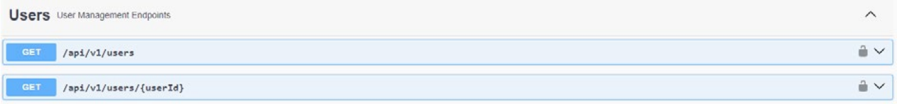|
| Deliverables        | /api/v1/deliverables/             |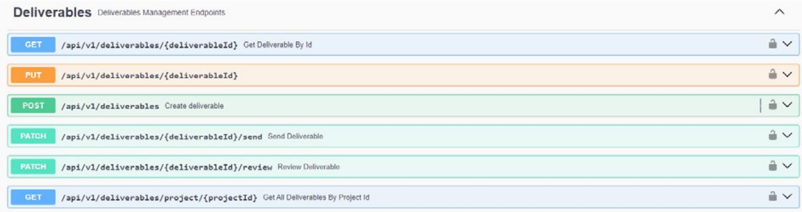|
| Messages            | /api/v1/messages/                 |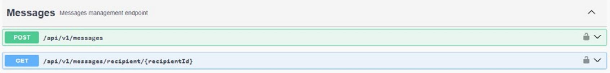|
| Support Tickets     | /api/v1/support-tickets/          |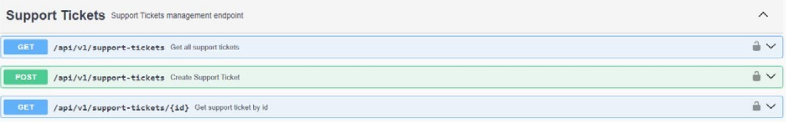|

### 5.2.8. Team Collaboration Insights

Se presentarán los insights del trabajo grupal en Github.

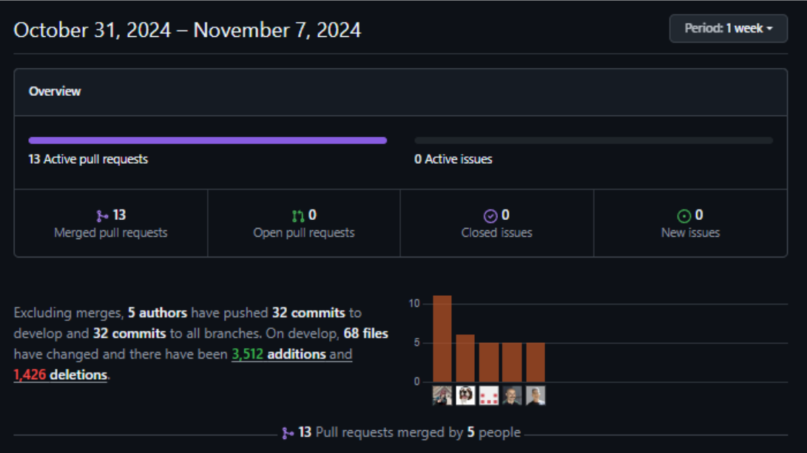
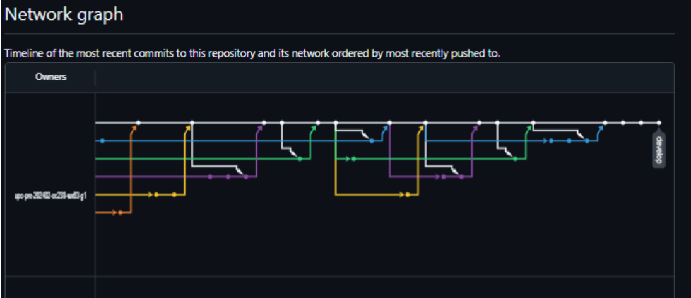

## 5.3. Video About-the-Product.


# Capítulo VI: Product Verfication & Validation
## 6.1. Testing Suites & Validation
### 6.1.1. Core Entities Unit Tests

Pruebas unitarias con con entidades de la aplicación WebMaster utilizando JUnit y Mockito.

**Pruebas Unitarias 1 (Developer Controller) por Zaid Ramirez:**
El controlador de desarrolladores gestiona las operaciones relacionadas con el usuario tipo Desarrollador. Estas funcionalidades están relacionadas con el manejo de datos de desarrolladores, como consultar todos los desarrolladores, consultar un desarrollador por ID, consultar un desarrollador por el ID de su usuarios y actualizar la información del desarrollador. Se realizaron pruebas a las siguientes consultas:

1. GetAllDevelopersAsyncQuery - Consulta para obtener todos los desarrolladores.
2. GetDeveloperByIdQuery - Consulta para obtener un desarrollador mediante su ID.
3. GetDeveloperByUserIdAsyncQuery - Consulta para obtener un desarrollador mediante el ID de su usuario.
4. UpdateDeveloperCommand - Comando para actualizar la informacion de un desarrollador.

Analizaremos mediante Arrange - Act y Assert para el primer servicio.

- Arrange
Se simula la creacion del servicio developerQueryService utilizando Mockito para utilizarlo en la ejecucion. Tambien se creara un Developer y un User para comparar con los datos devueltos por el servicio.


- Act
Mediante la función when de realizara la accion para obtener los developers mediante el servicio.

- Assert
Mediante la funcion assertNotNull se confirmará la existencia de la lista de desarrolladores.


Se confirma el funcionamiento del test en la siguiente imagen:


Se realizar el siguiente analisis mediante Arrange - Act y Asser para el cuarto servicio.

- Arrange
Se simula la creacion del servicio updateDeveloperByUserId utilizando Mockito para utilizarlo en la ejecucion. Tambien se creara un Developer,un User y un UpdateDeveloperResource para comparar y recibir las respuestas.


- Act
Mediante la función when de realizara la accion para obtener los developers mediante el servicio.

- Assert
Mediante la funcion assertNotNull se confirmará la existencia de la lista de desarrolladores.


Se confirma el funcionamiento del test en la siguiente imagen:


En la siguiente imagen se confirman el funcionamiento de todos los tests de los realizados en el servicio de Project.


**Pruebas Unitarias 2 (Project Controller) por Zaid Ramirez:**
El controlador de proyectos gestiona las operaciones relacionadas con el proyecto. Estas funcionalidades están relacionadas con el manejo de datos de proyectos, como consultar todos los proyectos, consultar un proyecto por ID, obtener frameworks r y actualizar la información del proyecto. Se realizaron pruebas a las siguientes consultas:

1. GetProgrammingLanguageByIdQuery para obtener información de lenguajes de programación.
2. GetFrameworkByIdQuery para obtener información de frameworks.
3. CreateProjectCommand para crear un nuevo proyecto.
4. GetAllProjectsQuery para obtener todos los proyectos.
5. GetProjectByIdQuery para obtener un proyecto específico.
6. UpdateProjectCandidatesListCommand para actualizar la lista de candidatos de un proyecto.
7. AssignProjectDeveloperCommand para asignar un desarrollador a un proyecto.
8. GetAllProjectsByDeveloperIdQuery y GetAllProjectsByEnterpriseIdQuery para filtrar proyectos.
9. DeleteProjectCommand para eliminar un proyecto.

Analizaremos mediante Arrange - Act y Assert para el servicio CreateProjectCommand.

- Arrange
Se configura el mock del servicio projectCommandService para que cuando reciba cualquier comando de creación (CreateProjectCommand), retorne un Optional con el objeto project previamente configurado.


- Act
Se invoca el método createProject() del controlador, pasando el recurso con los datos del proyecto a crear.

- Assert
Se verifica que la respuesta no sea nula, lo que indica que el proyecto fue creado correctamente y que el controlador respondió con un resultado esperado.


Se confirma el funcionamiento del test en la siguiente imagen:


En la siguiente imagen se confirman el funcionamiento de todos los tests de los realizados en el servicio de Project.


### 6.1.2. Core Integration Tests

En esta seccion, se realizaron pruebas de integracion para verificar la correcta interaccion entre los componentes principales del sistema, teniendo un enfoque en el DeliverableController y sus dependencias. Se utilizo JUnit 5 junto con Mockito para simular los componentes y estructuras esenciales para el funcionamiento del controller. Se realizaron pruebas en los siguientes asepctos:

1. Creacion de entregables, y obtencion de datos consultados mediante el ID.


Luego de la instancia de los servicios y estructuras utilizadas se procedio a la asignacion de valores de estructuras escenciales para el funcionamiento del controlador, mediante la función "@BeforeEach"


**Prueba Integral 1 por Jair Velasquez**

**Objetivo:** Creacion de entregable y obtencion de ID y demas datos para comprobar una correcta creacion de datos.


A continuacion se visualiza la ejecucion del test:


**Prueba Integral 2 por Jair Velasquez**

**Objetivo:** Revision de un entregable creado, cambiar de estado y realizar validacion de este cambio.


A continuacion se visualiza la ejecucion del test:


### 6.1.3 Core Behavior-Driven Development


### 6.1.4. Core System Tests

| Código  | Título                            | Descripción                                                                                                      |
|---------|----------------------------------|------------------------------------------------------------------------------------------------------------------|
| US101-1 | Acceder a la pantalla de registro | Como empresario o freelancer **quiero** tener un apartado de registro en la aplicación **para** que mi información se guarde y pueda acceder a mi cuenta |


| Código  | Título                            | Descripción                                                                                                      |
|---------|----------------------------------|------------------------------------------------------------------------------------------------------------------|
| US102 | Iniciar sesión exitosamente | Como empresario o desarrollador usuario de la aplicación **quiero** ingresar con mi cuenta con la cual me registré **para** usar las herramientas a mi disposición |


| Código  | Título                            | Descripción                                                                                                      |
|---------|----------------------------------|------------------------------------------------------------------------------------------------------------------|
| US103 | Aceptar postulación | Como empresario **quiero** un sistema de gestión de mi lista de postulantes **para** gestionar las postulaciones de los freelancers a mis proyectos activos |


| Código  | Título                            | Descripción                                                                                                      |
|---------|----------------------------------|------------------------------------------------------------------------------------------------------------------|
| US107-2 | Asignar fecha | Como empresario **quiero** un sistema de calendario **para** ver, asignar, actualizar y eliminar fechas de entregables |


| Código  | Título                            | Descripción                                                                                                      |
|---------|----------------------------------|------------------------------------------------------------------------------------------------------------------|
| US109-2 | Acceder a Buscar Desarrolladores | Como empresario **quiero** un sistema de navegación eficiente **para** acceder fácilmente a las secciones |


| Código  | Título                            | Descripción                                                                                                      |
|---------|----------------------------------|------------------------------------------------------------------------------------------------------------------|
| US101-3 | Visualizar proyectos en la pantalla de inicio | Como empresario **quiero** visualizar todos los proyectos publicados **para** poder ver fácilmente el progreso de los mismos |


| Código  | Título                            | Descripción                                                                                                      |
|---------|----------------------------------|------------------------------------------------------------------------------------------------------------------|
| US102-3 | Buscar Proyecto | Como freelancer **quiero** buscar proyectos **para** encontrar proyectos que se alineen con mis habilidades e intereses |


| Código  | Título                            | Descripción                                                                                                      |
|---------|----------------------------------|------------------------------------------------------------------------------------------------------------------|
| US103-3 | Postular a un proyecto | Como freelancer **quiero** postularme a desarrollar un proyecto **para** ser aceptado como desarrollador |


| Código  | Título                            | Descripción                                                                                                      |
|---------|----------------------------------|------------------------------------------------------------------------------------------------------------------|
| US109-3 | Acceder a Inicio | Como freelancer **quiero** un menú con accesos directos **para** navegar fluidamente |


| Código  | Título                            | Descripción                                                                                                      |
|---------|----------------------------------|------------------------------------------------------------------------------------------------------------------|
| US103-4 | Visualizar perfil | Como usuario **quiero** gestionar mi información de perfil **para** configurarlo a mi gusto |


## 6.2 Static tetsing & Verification
### 6.2.1. Static Code Analysis
Este apartado aborda los métodos y herramientas que se han utilizado en el proyecto para garantizar la calidad del código en etapas tempranas del desarrollo. Mediante el static code analysis, se busca asegurar que el código fuente actual cumpla con los estándares adecuados, disminuir la cantidad de errores y reducir las vulnerabilidades antes de llegar a etapas de producción.

#### 6.2.1.1. Coding standard & Code conventions
Los estándares y convenciones de condificación son una serie de pautas adoptadas por los desarrolladores para garantizar legibilidad, consistencia y mantenibilidad del código. Su aplicación mejora la eficiencia del software y reduce su complejidad, facilitando la colaboración y mantenimiento a largo plazo.

Para el desarrollo de este proyecto, se siguieron los siguientes estilos:
- **Java Code Conventions:** Se tienen convenciones para nombrar clases (PascalCase), métodos y variables (camelCase) y constantes (MAYÚSCULAS_CON_GUIONES_BAJOS). La indentación debe ser 4 espacios y las líneas de código deben evitar ser mayores a 80. Cada clase debe tener un propósito único, evitando lógica redundante, mientras que los métodos deben ser breves y realizar una única tarea. Estas y otras prácticas de esta convención facilitan el mantenimiento futuro.
- **Clean Code:** Se usan nombres descriptivos para las clases, métodos y variables, evitando abreviaturas ambiguas. Se debe seguir el principio DRY (Don't Reap Yourself), eliminando o refactorizan todo el código duplicado. Así mismo, las funciones deben cumplir un unico propósito (Single Responsibility Principle). Estas prácticas buscan crear código mantenible y fácil de entender por otros desarrolladores.

#### 6.2.1.1. Coding Quality & Code security
La calidad del código mide la la fiabilidad, eficiencia y mantebilidad de un software en el tiempo sin caer en deuda técnica. Para ello, el código debe cumplir cuatro aspectos: ser eficiente, ampliable, reusable y testeable. Para garantizar la calidad del código, se usan diferentes herramientas como análisis estático, controles de estilo o pruebas automatizadas.

Por otra parte, la seguridad del código se refiere a las prácticas y métodos implementadas durante el desarrollo de software para mitigar vulnerabilidades y amenazas que puedan poner en riesgo la integridad del sistema. Entre estas prácticas destacan: validación y sanitizacion de entradas (input sanitization), limitación de tasa de requests (rate limiting) y encriptación de datos sensibles, entre otras.
Para garantizar su eficacia, se realizan pruebas de penetración (pentesting), así como escaneo de dependencias y análisis estático para detectar de manera temprana este tipo de vulnerabilidades.

Para cumplir con ambos puntos, se han escogido dos herramientas que ayudan a garantizar la seguridad y calidad del código:

- **Checkstyle** es una herramienta de análisis estático que verifica el cumplimiento de las convenciones de código definidas en el proyecto. Según la configuración, valida aspectos como el formato, nombrado e indentación. De esta manera se garantiza un código consistente y alineado con las buenas prácticas del lenguaje.


- **SonarQube** es una herramienta que evalúa el código de manera estática y dinámica para identificar vulnerabilidades de seguridad, bugs complejos, deuda técnica y otras malas prácticas que comrpometen la calidad del software. Realiza análisis y reportes priorizando los problemas por severidad.

  
### 6.2.2. Reviews
La revisión de código es una práctica esencial para asegurar tanto la calidad del software como el cumplimiento de estándares técnicos. Este procedimiento puede ser manual o automatizado y debe regirse por lineamientos específicos.

**Tipos de Revisión**

- **Revisión por Pares**: Un desarrollador evalúa el código de otro con el fin de verificar que sea legible y cumpla con los estándares establecidos.
- **Revisión Formal**: Se realiza en sesiones estructuradas utilizando listas de verificación (checklists) para identificar problemas de manera colaborativa.
- **Revisión Automatizada**: Se utilizan herramientas como **SonarLint** y **SonarQube** para detectar errores y problemas de calidad en tiempo real.

**Proceso de Revisión**

- **Creación de Pull Requests (PR)**: Todo cambio debe presentarse mediante un PR que describa claramente las modificaciones y pruebas realizadas.
- **Lista de Verificación**: Debe utilizarse un checklist para evaluar aspectos como legibilidad, pruebas automatizadas y manejo de errores.
- **Comentarios y Retroalimentación**: Los revisores deben brindar observaciones claras y constructivas. Los problemas detectados deben corregirse antes de aprobar el PR.
- **Aprobación o Rechazo**: Cada PR debe ser revisado y aprobado por al menos otro desarrollador antes de integrarse a la rama principal.

**Criterios de Aceptación**

- **Calidad y Seguridad**: El código debe adherirse a los estándares de calidad y no introducir nuevas vulnerabilidades.
- **Cobertura de Pruebas**: Se espera un nivel mínimo de cobertura de pruebas (por ejemplo, 80%) para garantizar la confiabilidad del nuevo código.

**Frecuencia de Revisión**

Las revisiones deben realizarse de forma constante, idealmente al final de cada sprint o en períodos predefinidos, para evitar acumulación de cambios y mantener la calidad del proyecto.

## 6.3. Validation Interviews
### 6.3.1. Diseño de Entrevistas
**Segmento objetivo: Empresarios o emprendedores**

  **Preguntas generales:**
  1. ¿Cuál es su nombre? 
  2. ¿Cuántos años tienes? 
  3. ¿Dónde resides actualmente? 
  4. ¿Cuál es el nombre de tu empresa o emprendimiento? 

  **Preguntas de validación:**
  1.	¿Qué opinión tiene con respecto al diseño de la aplicación?
  2.	¿Le parece intuitiva y fácil de manejar?
  3.	¿Cómo se siente en la parte de navegación, le es fácil ir de una pantalla a otra?
  4.	¿Consideras que la aplicación te proporciona las suficientes herramientas para contratar freelancers y gestionar tus proyectos?
  5.	¿Qué característica te llama más la atención de la aplicación? ¿Por qué?
  6.	¿Cuál crees que es el punto fuerte de la aplicación?
  7. ¿Cree que podrá encontrar a un freelancer para un hipotético proyecto utilizando nuestra aplicación?
  8.	¿Estarías dispuesto/a a hacer uso de nuestra aplicación? ¿Por qué?
  9.	¿Estaría dispuesto a suscribirse al plan de WebMaster?


**Segmento objetivo: Desarrolladores freelance**

  **Preguntas generales:**
  1. ¿Cuál es su nombre? 
  2. ¿Cuántos años tienes? 
  3. ¿Dónde resides actualmente? 
  4. ¿Cuál es tu área de especialidad en el desarrollo de software (móvil, escritorio, web, ciberseguridad, etc.)? 

  **Preguntas de validación:**
  1.	¿Qué opinión tiene con respecto al diseño de la aplicación?
  2.	¿Le parece intuitiva y fácil de manejar?
  3.	¿Cómo se siente en la parte de navegación, le es fácil ir de una pantalla a otra?
  4.	¿Las pantallas contienen todas las opciones disponibles para ofrecer tus trabajos freelance?
  5.	¿Qué característica te llama más la atención de la aplicación? ¿Por qué?
  6.	¿Estarías dispuesto/a a hacer uso de nuestra aplicación? ¿Por qué?
  7.	¿Cree que se hará fácil conseguir trabajo gracias a nuestra plataforma?
  8.	¿Qué opinión tiene con respecto a la opción de publicar tu portafolio?
  9.	¿Estaría dispuesto a registrarse a WebMaster?

### 6.3.2 Registro de Entrevistas
**Segmento 1: Segmento empresarios o emprendedores**

**Entrevista 1** 

  - Entrevistador: Zaid Ramirez
  - Entrevistado: Maverick Mendoza
  - Edad: 19 años
  - Residencia: Lima 
  - Enlace del video: [https://upcedupe-my.sharepoint.com](https://youtu.be/rn22s0uMheg)

<div style="display:flex;justify-content:center">
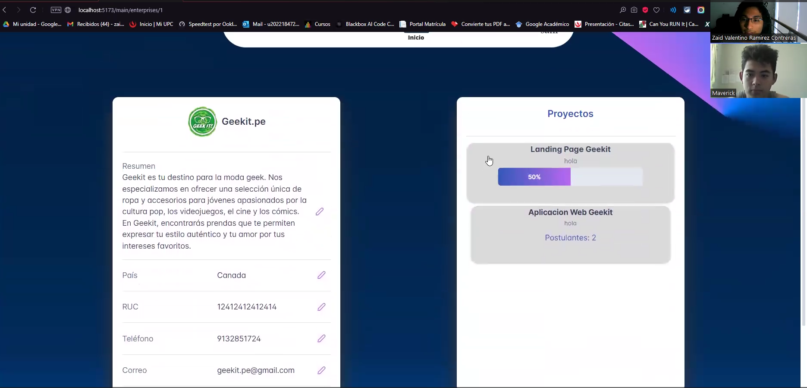
</div>
Maverick nos comenta que considera que la aplicación es intuitiva y facil de usar. Del mismo modo, afirma que las vistas contienen toda la información que considera relevante al momento de definir programadores para su emprendimiento. A su vez comenta que e bajo coste del servicio es el punto fuerte de nuestra plataforma. Con estas observaciones, Maverick declará que estaría dispuesto a obtener una subscripcion a nuestra plataforma
<br><br>

**Entrevista 2** 

  - Entrevistador: Jair Velasquez Pizarro
  - Entrevistado: Alexandra Ñañez
  - Edad: 22 años
  - Residencia: Lima 
  - Enlace del video: [https://upcedupe-my.sharepoint.com](https://upcedupe-my.sharepoint.com/personal/u202218114_upc_edu_pe/_layouts/15/stream.aspx?id=%2Fpersonal%2Fu202218114_upc_edu_pe%2FDocuments%2FEntrevista%20Alexandra%20Webmaster%2Emp4&referrer=StreamWebApp%2EWeb&referrerScenario=AddressBarCopied%2Eview%2Ece709989-e2fd-48b0-8293-20a526c1ec71)

<div style="display:flex;justify-content:center">
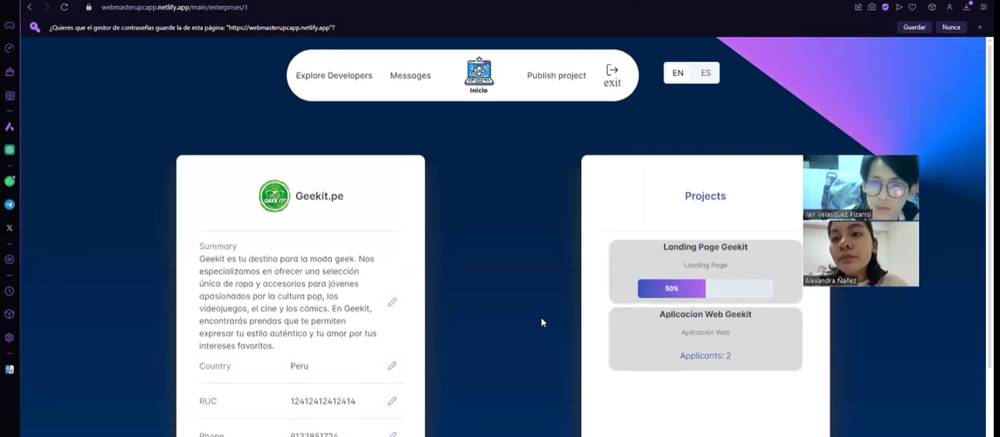
</div>
Alexandra nos comenta que considera que la aplicación web es bastante intuitiva y fácil se usar. De igual forma, afirma que considera acertado la funcionalidad de contacto con los desarrolladores ya que así se podría realizar un proyecto de mejor forma gracias a la comunicación que habría. También resalta de forma positiva el agregado de cambio de idioma ya que esto permite ser más global. Por último nos confirma que si utilizaría la aplicación ya que al no tener muchos conocimientos del desarrollo de aplicaciones de software una página así le vendría bien si ocupa desarrollar una aplicación para su negocio.
<br><br>


**Segmento 2: Desarrolladores Freelancer**

**Entrevista 1** 

  - Entrevistador: Samira Jetzabel Alvarez Araguache 
  - Entrevistado: Alessandro Medina Agnini
  - Edad: 20 años
  - Residencia: Lima - Surco
  - Enlace del video: [https://upcedupe-my.sharepoint.com](https://upcedupe-my.sharepoint.com/:v:/g/personal/u20211a046_upc_edu_pe/EQs0p0bapO1GrR3b5FGP1BIBBGxIgMv7CmrOrKdy2CAoCg?nav=eyJyZWZlcnJhbEluZm8iOnsicmVmZXJyYWxBcHAiOiJPbmVEcml2ZUZvckJ1c2luZXNzIiwicmVmZXJyYWxBcHBQbGF0Zm9ybSI6IldlYiIsInJlZmVycmFsTW9kZSI6InZpZXciLCJyZWZlcnJhbFZpZXciOiJNeUZpbGVzTGlua0NvcHkifX0&e=8OHjW9)


	
Resumen: 
<br>
Se entrevistó a Alessandro Medina, un joven de 20 años estudiante de Ciencias de la Computación quien se dedica al trabajo freelance. Alessandro se especializa en el desarrollo web como Front-End, con el uso de HTML5, CSS3, JS, React y Angular. utilizando tecnologías como HTML5, CSS3, JS, React y Angular. Él ha participado en diversos proyectos, principalmente en la creación de landing pages para emprendedores y pequeñas empresas.

Resalta de manera positiva la parte visual de la aplicación, destacando su diseño intuitivo y su interfaz amigable, donde menciona que es lo suficientemente fácil de usar, incluso para usuarios con poca experiencia interactuando con tecnología. En cuanto a la navegación, considera que la toolbar facilita el flujo a través de la aplicación, permitiendo ir de manera fluida de pantalla en pantalla. También, considera que la app cuenta con todas las herramientas necesarias para trabajar en la plataforma como un desarrollador, como indicar el stack tecnológico y la posibilidad de mostrar tu portafolio. Destaca la personalización que tienen las empresas en cuanto a la descripción del proyecto y los entregables, lo que hace más facil considerar la postulación a este tipo de trabajos. Además, según las funcionalidades que ha podido observar en la aplicación, menciona que la plataforma sí le facilitaría la búsqueda de empleo en un proyecto de desarrollo de software. En conclusión, Alessandro dice estar dispuesto a registrarse a Webmaster. 

**Entrevista 2**

- Entrevistador: Victor Meneses
- Entrevistado: Alejandro Barturen
- Edad: 21 años
- Residencia: Lima - San Miguel
- Enlace del video: [https://upcedupe-my.sharepoint.com](https://upcedupe-my.sharepoint.com/:v:/g/personal/u202212191_upc_edu_pe/ESSBVSmMguBNk8hg4xL1xHkBocNEIKitXl_U07DSStsXBg?e=EtiYBw&nav=eyJyZWZlcnJhbEluZm8iOnsicmVmZXJyYWxBcHAiOiJTdHJlYW1XZWJBcHAiLCJyZWZlcnJhbFZpZXciOiJTaGFyZURpYWxvZy1MaW5rIiwicmVmZXJyYWxBcHBQbGF0Zm9ybSI6IldlYiIsInJlZmVycmFsTW9kZSI6InZpZXcifX0%3D)


Resumen:</br>
Alejandro Barturen, desarrollador web con enfoque en frontend, destacó que la aplicación presenta una combinación de colores adecuada y una interfaz que facilita la identificación de los botones y su función dentro de la navegación. Desde su perspectiva, la plataforma funcionó correctamente, especialmente en las secciones de "Home Developer" y "Explorar Proyectos", donde no encontró errores ni dificultades. Mencionó que la barra de navegación le resultó intuitiva y sencilla de usar, lo cual le permitió moverse por la aplicación sin complicaciones. Considera que la información mostrada en la pantalla principal del desarrollador es clara y relevante. Lo que más le llamó la atención fue la sección de "Explorar Proyectos", ya que le permite visualizar múltiples oportunidades laborales para freelancers. Alejandro comentó que definitivamente usaría esta aplicación, especialmente en momentos en los que buscar empleo puede ser más complicado, ya que le pareció una herramienta práctica y funcional para conectar con proyectos remunerados.

**Entrevista 3**

- Entrevistador: Harold Elias
- Entrevistado: Christofer More
- Edad: 20 años
- Residencia: Lima - San Miguel
- Enlace del video: [https://upcedupe-my.sharepoint.com](https://upcedupe-my.sharepoint.com/:v:/g/personal/u202212684_upc_edu_pe/EUhG463DZARMsHTbpV3BgDgBmQbEBPCj_zDSJjSUkfpVWA?e=TwcyzC)


Resumen:</br>
Se entrevistó a Christofer More, un joven de 20 años que cursa el séptimo ciclo de Ingeniería de Software y trabaja de manera freelance. Christofer es desarrollador fullstack, con mayor experiencia en el backend, y ha participado en diversos proyectos, aportando principalmente en la lógica y arquitectura de servidor.
Destaca especialmente el aspecto visual de la aplicación, señalando su diseño limpio e intuitivo y una interfaz muy amigable, lo cual la hace accesible incluso para quienes tienen poca experiencia tecnológica. En cuanto a la navegación, valora que la barra de herramientas (toolbar) permita un tránsito fluido entre pantallas. También resalta que la plataforma ofrece todas las funcionalidades clave para un desarrollador, como la posibilidad de indicar el stack tecnológico empleado y mostrar el portafolio de proyectos.
Christofer aprecia la personalización que empresas y emprendedores pueden incluir en la descripción de sus proyectos y entregables, lo que facilita la toma de decisión al postularse. Según su experiencia explorando la aplicación, considera que Webmaster simplificaría la búsqueda de empleo en proyectos de software. Además, muestra interés en la opción de pagar por una mayor visibilidad dentro de la plataforma
  
### 6.3.3. Evaluaciones según heurísticas
Con base a las diversas opiniones en las entrevistas realizadas, tanto de empresas como de desarrolladores freelancer se obtiene que:

- La aplicación es intuitiva y fácil de usar.
- La navegación es sencilla y permite ir de una vista a otra sin problemas.
- Las vistas contienen toda la información necesaria para manejar los servicios contratados.
- La aplicación es beneficiosa para las empresas y los desarrolladores, ya que facilita la contratación y prestación de servicios.
- La información contenida en la aplicación es clara y completa.
- La mayoría de los entrevistados estarían dispuestos a suscribirse o registrarse en Webmaster.
## 6.4. Auditoría de Experiencias de Usuario
### 6.4.1. Auditoría realizada
#### 6.4.1.1. Información del grupo auditado

<div>
     <table>
        <tr>
            <th style="text-align:center;">Member</th>
            <th style="text-align:center;">Roles</th>
        </tr>
        <tr>
            <td>Ames Oviedo, Mariano Jose</td>
            <td>Developer</td>
        </tr>
        <tr>
            <td> Criollo de la Cruz, Diego Anderson</td>
            <td> Developer</td>
        </tr>
        <tr>
            <td>Lecca Choccare, Christopher Bryan</td>
            <td>Product Owner</td>
        </tr>
        <tr>
            <td>Valle Zuta, Abel Andrés</td>
            <td>Developer</td>
        </tr>
         <tr>
            <td>Sosa Colca, Angello Rodolfo</td>
            <td>Scrum Master</td>
        </tr>
    </table>
</div>

#### 6.4.1.2. Cronograma de auditoría realizada

<table class="cronograma-auditoria">
  <thead>
    <tr>
      <th>Fase</th>
      <th>Actividades</th>
      <th>Fecha Inicio</th>
      <th>Fecha Fin</th>
      <th>Responsable</th>
    </tr>
  </thead>
  <tbody>
    <tr>
      <td>Recepción</td>
      <td>
        <ul>
          <li>Solicitud formal de auditoría</li>
          <li>Recopilación de documentación</li>
          <li>Acceso a sistemas/producto</li>
        </ul>
      </td>
      <td>12/06/2025</td>
      <td>12/06/2025</td>
      <td> Samira Alvarez </td>
    </tr>
    <tr>
      <td>Planificación</td>
      <td>
        <ul>
          <li>Revisión de requisitos</li>
          <li>Definición de heurísticas</li>
          <li>Elaboración de checklist</li>
        </ul>
      </td>
      <td>12/06/2025</td>
      <td>13/06/2025</td>
      <td> Samira Alvarez </td>
    </tr>
    <tr>
      <td>Ejecución</td>
      <td>
        <ul>
          <li>Evaluación heurística</li>
          <li>Pruebas de usabilidad</li>
          <li>Análisis de accesibilidad</li>
          <li>Registro de hallazgos</li>
        </ul>
      </td>
      <td>14/06/2025</td>
      <td>15/06/2025</td>
      <td> Samira Alvarez </td>
    </tr>
    <tr>
      <td>Reporte</td>
      <td>
        <ul>
          <li>Redacción de informe</li>
          <li>Diseño de recomendaciones</li>
          <li>Revisión final</li>
        </ul>
      </td>
      <td>04/06/2025</td>
      <td>10/06/2025</td>
      <td> Samira Alvarez </td>
    </tr>
  </tbody>
</table>


#### 6.4.1.3. Contenido de auditoría realizada

**TAREAS A EVALUAR**

El alcance de esta evaluación incluye la revisión de la usabilidad de las siguientes tareas:

- Navegación en la interfaz
- Visualización de locales
- Interacción en formularios
- Accesibilidad general
- Manejo de temas de color
- Funcionalidad de contacto
- Experiencia móvil (responsive)

<br>

**ESCALA DE SEVERIDAD**

| Nivel | Descripción |
|-------|-------------|
| 1 | Problema superficial: puede ser fácilmente superado por el usuario o ocurre con muy poca frecuencia. No necesita ser arreglado a no ser que exista disponibilidad de tiempo. |
| 2 | Problema menor: ocurre con mayor frecuencia o es un poco más difícil de superar para el usuario. Prioridad baja para su corrección. |
| 3 | Problema mayor: ocurre frecuentemente o los usuarios no son capaces de resolverlo. Prioridad alta para su corrección. |
| 4 | Problema muy grave: error de gran impacto que impide al usuario continuar. Debe ser corregido antes del lanzamiento. |

<br></br>

**TABLA RESUMEN**

<table>
  <thead>
    <tr>
      <th>#</th>
      <th>Problema</th>
      <th>Escala de severidad</th>
      <th>Heurística/Principio violado</th>
    </tr>
  </thead>
  <tbody>
    <tr>
      <td>1</td>
      <td>No se puede adjuntar más de una imagen por local</td>
      <td>3</td>
      <td>Usability: Flexibilidad y eficiencia de uso</td>
    </tr>
    <tr>
      <td>2</td>
      <td>No hay opción de tema claro/oscuro</td>
      <td>2</td>
      <td>Usability: Preferencias del usuario</td>
    </tr>
    <tr>
      <td>3</td>
      <td>No hay forma de contactar al soporte desde la app</td>
      <td>3</td>
      <td>Usability: Ayuda y documentación</td>
    </tr>
    <tr>
      <td>4</td>
      <td>Textos pequeños en dispositivos móviles</td>
      <td>2</td>
      <td>Inclusive Design: Accesibilidad visual</td>
    </tr>
    <tr>
      <td>5</td>
      <td>Botón "Buscar" se confunde con "Publicar"</td>
      <td>2</td>
      <td>Usability: Consistencia y estándares</td>
    </tr>
    <tr>
      <td>6</td>
      <td>No hay confirmación al eliminar un local</td>
      <td>3</td>
      <td>Usability: Prevención de errores</td>
    </tr>
    <tr>
      <td>7</td>
      <td>Falta de feedback al enviar un formulario</td>
      <td>2</td>
      <td>Usability: Visibilidad del estado del sistema</td>
    </tr>
  </tbody>
</table>

<br>

 **DESCRIPCIÓN DE PROBLEMAS**
 **PROBLEMA #1: No se puede adjuntar más de una imagen por local**
- **Severidad:** 3  
- **Heurística violada:** Usability – Flexibilidad y eficiencia de uso  
- **Problema:**  
  El sistema permite subir únicamente una imagen por local, limitando la información visual que se puede proporcionar al usuario interesado. Esto afecta negativamente la experiencia de exploración de los espacios.  
  

- **Recomendación:**  
  Permitir adjuntar múltiples imágenes por local, con una interfaz que permita visualizarlas en carrusel o miniaturas.

<br>

 **PROBLEMA #2: No hay opción de tema claro/oscuro**
- **Severidad:** 2  
- **Heurística violada:** Usability – Preferencias del usuario  
- **Problema:**  
  La aplicación no cuenta con opción de personalización visual, como el modo claro y oscuro, lo cual limita la comodidad visual según preferencias o condiciones de iluminación.  
  

- **Recomendación:**  
  Implementar un selector de tema para que el usuario elija entre modo claro, oscuro o automático según el sistema operativo.

<br>

**PROBLEMA #3: No hay forma de contactar al soporte desde la app**
- **Severidad:** 3  
- **Heurística violada:** Usability – Ayuda y documentación  
- **Problema:**  
  No existe una sección visible para que los usuarios puedan contactar al equipo de soporte o enviar reportes de errores desde la aplicación.  
  

- **Recomendación:**  
  Añadir una sección de contacto o botón flotante que permita enviar correos o mensajes al equipo de soporte de forma directa.

<br>

 **PROBLEMA #4: Textos pequeños en dispositivos móviles**
- **Severidad:** 2  
- **Heurística violada:** Inclusive Design – Accesibilidad visual  
- **Problema:**  
  En algunos móviles, los textos aparecen demasiado pequeños, dificultando su lectura especialmente para personas con problemas visuales.  
  

- **Recomendación:**  
  Ajustar el tamaño mínimo de fuente en vistas móviles y permitir escalado de texto.
<br>

**PROBLEMA #5: Botón "Buscar" se confunde con "Publicar"**
- **Severidad:** 2  
- **Heurística violada:** Usability – Consistencia y estándares  
- **Problema:**  
  Los botones “Buscar” y “Publicar” están ubicados muy cerca uno del otro y tienen estilos similares, lo que puede causar errores de interacción.  
  

- **Recomendación:**  
  Diferenciar ambos botones por color, ícono o ubicación, y añadir un texto descriptivo más claro si es necesario.

<br>

**PROBLEMA #6: No hay confirmación al eliminar un local**
- **Severidad:** 3  
- **Heurística violada:** Usability – Prevención de errores  
- **Problema:**  
  Al eliminar un local, no se solicita confirmación previa, lo que puede derivar en la pérdida de datos por error involuntario.  
  

- **Recomendación:**  
  Mostrar una alerta de confirmación con opción de cancelar antes de ejecutar la acción de borrado.

<br>

**PROBLEMA #7: Falta de feedback al enviar un formulario**
- **Severidad:** 2  
- **Heurística violada:** Usability – Visibilidad del estado del sistema  
- **Problema:**  
  Cuando un usuario envía un formulario, no se muestra un mensaje de éxito o error, dejando incertidumbre sobre si la acción fue procesada.  
  

- **Recomendación:**  
  Añadir mensajes de retroalimentación visual como alertas, toast o loaders para informar al usuario del resultado.

<br>

### 6.4.2. Auditoría recibida
#### 6.4.2.1. Información del grupo auditado

<div>
     <table>
        <tr>
            <th style="text-align:center;">Member</th>
            <th style="text-align:center;">Roles</th>
        </tr>
        <tr>
            <td>Alvarez Araguache, Samira Jetzabel</td>
            <td>Developer</td>
        </tr>
        <tr>
            <td> Elias Sanchez, Harold Miguel</td>
            <td> Developer</td>
        </tr>
        <tr>
            <td>Ramirez Contreras, Zaid Valentino</td>
            <td>Product Owner</td>
        </tr>
        <tr>
            <td>Meneses Arevalo, Victor Manuel</td>
            <td>Developer</td>
        </tr>
         <tr>
            <td>Velasquez Pizarro, Jair</td>
            <td>Scrum Master</td>
        </tr>
    </table>
</div>


#### 6.4.2.2. Cronograma de auditoría recibida

<table class="cronograma-auditoria">
  <thead>
    <tr>
      <th>Fase</th>
      <th>Actividades</th>
      <th>Fecha Inicio</th>
      <th>Fecha Fin</th>
      <th>Responsable</th>
    </tr>
  </thead>
  <tbody>
    <tr>
      <td>Recepción</td>
      <td>
        <ul>
          <li>Solicitud formal de auditoría</li>
          <li>Recopilación de documentación</li>
          <li>Acceso a sistemas/producto</li>
        </ul>
      </td>
      <td>16/05/2025</td>
      <td>20/05/2025</td>
      <td> Angello Sosa </td>
    </tr>
    <tr>
      <td>Planificación</td>
      <td>
        <ul>
          <li>Revisión de requisitos</li>
          <li>Definición de heurísticas</li>
          <li>Elaboración de checklist</li>
        </ul>
      </td>
      <td>23/05/2025</td>
      <td>27/05/2025</td>
      <td> Angello Sosa </td>
    </tr>
    <tr>
      <td>Ejecución</td>
      <td>
        <ul>
          <li>Evaluación heurística</li>
          <li>Pruebas de usabilidad</li>
          <li>Análisis de accesibilidad</li>
          <li>Registro de hallazgos</li>
        </ul>
      </td>
      <td>01/06/2025</td>
      <td>03/06/2025</td>
      <td> Angello Sosa </td>
    </tr>
    <tr>
      <td>Reporte</td>
      <td>
        <ul>
          <li>Redacción de informe</li>
          <li>Diseño de recomendaciones</li>
          <li>Revisión final</li>
        </ul>
      </td>
      <td>04/06/2025</td>
      <td>10/06/2025</td>
      <td> Angello Sosa </td>
    </tr>
  </tbody>
</table>

#### 6.4.2.3. Contenido de auditoría recibida

**TAREAS A EVALUAR**

El alcance de esta evaluación incluye la revisión de la usabilidad de las siguientes tareas:

- Registro de un usuario nuevo
- Edición de perfil
- Navegación en la interfaz
- Visualización de proyectos
- Creación de proyectos
- Validación de formularios
- Interacción con botones
- Responsive design

<br></br>

**ESCALA DE SEVERIDAD**

| Nivel | Descripción |
|-------|-------------|
| 1 | Problema superficial: puede ser fácilmente superado por el usuario o ocurre con muy poca frecuencia. No necesita ser arreglado a no ser que exista disponibilidad de tiempo. |
| 2 | Problema menor: ocurre con mayor frecuencia o es un poco más difícil de superar para el usuario. Prioridad baja para su corrección. |
| 3 | Problema mayor: ocurre frecuentemente o los usuarios no son capaces de resolverlo. Prioridad alta para su corrección. |
| 4 | Problema muy grave: error de gran impacto que impide al usuario continuar. Debe ser corregido antes del lanzamiento. |

<br></br>

**TABLA RESUMEN**

| # | Problema | Escala de severidad | Heurística/Principio violado |
|---|----------|----------------------|-------------------------------|
| 1 | Elemento visual extraño en área de login | 1 | Usability: Consistencia y estándares |
| 2 | Falta de contraste visual en las letras durante la carga de datos. | 2 | Inclusive Design: Proporcionar experiencias comparables |
| 3 | Falta de indicadores para edición de imágenes | 2 | Usability: Visibilidad del estado del sistema |
| 4 | Botón "Guardar cambios" no funciona correctamente | 3 | Usability: Retroalimentación y control del usuario |
| 5 | Comportamiento inadecuado del footer | 2 | Information Architecture: Is it usable? |
| 6 | Botón "Apply to Project" sin estados hover | 1 | Usability: Consistencia y estándares |
| 7 | 	Fotografías de desarrolladores no visibles en la lista de desarrolladores | 2 | Information Architecture: Is it findable? |
| 8 | Campos de formulario que se deforman | 2 | Usability: Prevención de errores |
| 9 | Problemas de márgenes en navbar móvil | 2 | Usability: Flexibilidad y eficiencia de uso |
| 10 | Logo no funciona como enlace en móvil | 3 | Usability: Libertad y control del usuario |
| 11 | Alineación incorrecta en footer móvil | 1 | Usability: Consistencia y estándares |
| 12 | Falta acceso rápido a creación de proyectos | 2 | Usability: Eficiencia y simplicidad |
| 13 | Inconsistencia en fondos entre versión web y móvil | 2 | Usability - Consistencia y estándares   |
| 14 | Falta de confirmación al crear proyectos | 3  | Usability - Prevención de errores  |
| 15 | Espaciado inadecuado en menús desplegables | 2  | Usability - Flexibilidad y eficiencia de uso |
| 16 | Inputs críticos con tamaño insuficiente | 3  | Usability - Inclusive Design - Tamaño objetivo táctil  |
<br></br>

**DESCRIPCIÓN DE PROBLEMAS**

**PROBLEMA #1: Elemento visual extraño en área de login**

- **Severidad:** 1
- **Heurística violada:** Usability - Consistencia y estándares
- **Problema:**
  Se observa una línea horizontal innecesaria sobre el campo de login que no cumple ninguna función identificable y rompe con la estética del formulario. Este elemento no sigue patrones de diseño convencionales para interfaces de autenticación.
<br></br>
  

- **Recomendación:**
  Eliminar la línea para mantener la interfaz limpia y consistente.
<br></br>

**PROBLEMA #2: Falta de contraste en las letras durante la carga de datos**

- **Severidad:** 2
- **Heurística violada:** Inclusive Design - Proporcionar experiencias comparables
- **Problema:**
  Los mensajes indicadores de carga de datos no tiene suficiente contraste con el fondo, dificultando su lectura especialmente en condiciones de luminosidad ambiental alta o para usuarios con deficiencias visuales.
<br></br>
  

- **Recomendación:**
  Aumentar el contraste del texto o cambiar el color de fondo para mejorar la legibilidad.
<br></br>

**PROBLEMA #3: Falta de indicadores para edición de imágenes**

- **Severidad:** 2
- **Heurística violada:** Usability - Visibilidad del estado del sistema.
- **Problema:**
  Los usuarios no pueden identificar que una imagen es editable debido a la falta de iconos o indicadores visuales.
<br></br>
  
  

- **Recomendación:**
  Añadir un ícono o tooltip que indique la posibilidad de edición.
<br></br>

**PROBLEMA #4:  Botón "Guardar cambios" no funciona correctamente**

- **Severidad:** 3
- **Heurística violada:** Usability - Retroalimentación y control del usuario.
- **Problema:**
  El botón "Guardar cambios" no ejecuta ninguna acción al ser clickeado y no proporciona feedback visual (hover).
  <br></br>
  

- **Recomendación:**
  Implementar la funcionalidad del botón y añadir un efecto hover para mejorar la experiencia del usuario.
<br></br>

**PROBLEMA #5: Comportamiento inadecuado del footer**

- **Severidad:** 2
- **Heurística violada:** Information Architecture - Is it usable?
- **Problema:**
  Cuando no hay contenido en la pantalla, el footer se expande abruptamente, cortando el fondo y creando un espacio vacío antiestético.
<br></br>
  

- **Recomendación:**
  Ajustar el footer para que se adapte dinámicamente al contenido disponible.
<br></br>

**PROBLEMA #6: Botón "Apply to Project" sin estados hover**

- **Severidad:** 1
- **Heurística violada:** Usability - Consistencia y estándares
- **Problema:**
  El botón "Apply to Project" no tiene un efecto hover, lo que rompe con la consistencia de otros botones interactivos en la aplicación.
<br></br>
  

- **Recomendación:**
  Añadir un efecto hover para indicar que el botón es interactivo y mantener la coherencia visual.
<br></br>

**PROBLEMA #7: Fotografías de desarrolladores no visibles en la lista de desarrolladores**

- **Severidad:** 2
- **Heurística violada:** Information Architecture - Is it findable?
- **Problema:**
  Las fotos de perfil de los desarrolladores no aparecen en la lista, lo que dificulta la identificación rápida de los usuarios.
<br></br>
  

- **Recomendación:**
  Asegurar que las imágenes se carguen correctamente y mostrar un placeholder si no están disponibles.
<br></br>

**PROBLEMA #8: Campos de formulario que se deforman**

- **Severidad:** 2
- **Heurística violada:** Usability - Prevención de errores.
- **Problema:**
  Al mostrar mensajes de validación, uno de los inputs reduce su tamaño, lo que afecta la legibilidad y el diseño.
<br></br>
  

- **Recomendación:**
  Ajustar el tamaño del input para que sea consistente con los demás campos sin afectar el layout.
<br></br>

**PROBLEMA #9: Problemas de márgenes en navbar móvil**

- **Severidad:** 2
- **Heurística violada:** Usability - Flexibilidad y eficiencia de uso
- **Problema:**
  En la versión móvil, la navbar no tiene márgenes laterales, lo que hace que los elementos toquen los bordes de la pantalla, dando una apariencia descuidada.
  <br></br>
  

- **Recomendación:**
  Añadir padding/margen en los laterales para mejorar el espaciado.
<br></br>

**PROBLEMA #10: Logo no funciona como enlace en móvil**

- **Severidad:** 3
- **Heurística violada:** Usability - Libertad y control del usuario.
- **Problema:**
  En móviles, hacer clic en el logo de la aplicación no redirige al inicio, lo que contradice el comportamiento esperado por los usuarios.
<br></br>
  

- **Recomendación:**
  Implementar la funcionalidad de redirección al home al hacer clic en el logo.
<br></br>

**PROBLEMA #11: Alineación incorrecta en footer móvil**

- **Severidad:** 1
- **Heurística violada:** Usability - Consistencia y estándares.
- **Problema:**
  En dispositivos móviles, el contenido del footer aparece alineado a la izquierda en lugar de centrado, lo que afecta la estética.
<br></br>
  

- **Recomendación:**
  Centrar el contenido del footer para mejorar la presentación en pantallas pequeñas.
<br></br>

**PROBLEMA #12: Falta acceso rápido a creación de proyectos**

- **Severidad:** 2
- **Heurística violada:** Usability - Eficiencia y simplicidad.
- **Problema:**
  Los usuarios deben navegar a "Publish Project" para crear un proyecto, lo que añade pasos innecesarios.
  <br></br>
  

- **Recomendación:**
  Añadir un botón "Crear proyecto" en la página de inicio de la empresa para acelerar el proceso.

**PROBLEMA #13: Inconsistencia en fondos entre versión web y móvil**

- **Severidad:** 2  
- **Heurística violada:** Usability - Consistencia y estándares  
- **Problema:**  
  El fondo de la aplicación móvil difiere significativamente del diseño web. Esta inconsistencia visual afecta la identidad de marca y la familiaridad de la interfaz.  
<br></br>  


- **Recomendación:**  
  Unificar los diseños de fondo entre ambas plataformas, manteniendo la paleta de colores y elementos gráficos corporativos. 
<br></br>

**PROBLEMA #14: Falta de confirmación al crear proyectos**

- **Severidad:** 3  
- **Heurística violada:** Usability - Prevención de errores  
- **Problema:**  
  No existe un modal de confirmación al crear un proyecto, aumentando el riesgo de acciones accidentales sin posibilidad de cancelación.
<br></br>  


- **Recomendación:**  
  Implementar un modal con un mensaje claro y botones de acción,
<br></br>

**PROBLEMA #15: Espaciado inadecuado en menús desplegables**

- **Severidad:** 2  
- **Heurística violada:** Usability - Flexibilidad y eficiencia de uso  
- **Problema:**  
  Los ítems en menús desplegables tienen un padding que dificulta la interacción con estas opciones, haciendo que se sufra de na superposición visual del contenido.
<br></br>  


- **Recomendación:**  
  Ajustar el espaciado entre los items del menú añadiendo más padding entre ellos. 
<br></br>

**PROBLEMA #16: Inputs críticos con tamaño insuficiente**

- **Severidad:** 3  
- **Heurística violada:** Inclusive Design - Tamaño objetivo táctil  
- **Problema:**  
  Campos como "Destinatario", "Título" y "Mensaje" tienen una altura reducida en relación al contenido, afectando su legibilidad en dispositivos pequeños.
<br></br>  


- **Recomendación:**  
  Aumentar el tamaño de los inputs a una altura adecuada.

#### 6.4.2.4.Resumen de modificaciones para subsanar hallazgos

**PROBLEMA #1: Elemento visual extraño en área de login**

- **Severidad:** 1  
- **Estado:** Resuelto  
- **Heurística violada:** Usability - Consistencia y estándares  

**Problema:**  
Se observaba una línea horizontal innecesaria sobre el campo de login que no cumplía ninguna función identificable y rompía con la estética del formulario.  

**Modificación implementada:**  
- Se eliminó la regla CSS `border-top` del contenedor del formulario.  

**Evidencia de solución:**  
<br>


<br></br> 

**PROBLEMA #2: Falta de contraste en las letras durante la carga de datos**

- **Severidad:** 2  
- **Estado:** Resuelto  
- **Heurística violada:** Inclusive Design - Proporcionar experiencias comparables  

**Problema:**  
Los mensajes indicadores de carga no tenían suficiente contraste con el fondo, dificultando la lectura.  

**Modificación implementada:**  
- Se agregó un card de color `#FFFFFF`, junto con un icono de alerta para indicar el error en la carga de datos.  

**Evidencia de solución:** 
<br> 


<br></br> 

**PROBLEMA #3: Falta de indicadores para edición de imágenes**

- **Severidad:** 2  
- **Estado:**  Resuelto  
- **Heurística violada:** Usability - Visibilidad del estado del sistema  

**Problema:**  
Los usuarios no podían identificar que una imagen era editable por falta de iconos.  

**Modificación implementada:**  
- Se agregó un overlay con `background: rgba(0, 0, 0, 0.6);`  con un mensaje de "editar foto".

**Evidencia de solución:**  
<br>


<br></br> 

**PROBLEMA #4: Botón "Guardar cambios" no funciona correctamente**

- **Severidad:** 3  
- **Estado:** Resuelto  
- **Heurística violada:** Usability - Retroalimentación y control  

**Problema:**  
El botón no ejecutaba acciones ni mostraba feedback visual.  

**Modificación implementada:**  
Se implementó lógica para guardar cambios en BD. Se añadió efecto hover.

**Evidencia de solución:**  
<br>


<br></br> 

**PROBLEMA #5: Comportamiento inadecuado del footer**

- **Severidad:** 2  
- **Estado:** Resuelto  
- **Heurística violada:** Information Architecture  

**Problema:**  
El footer se expandía abruptamente en pantallas vacías.  

**Modificación implementada:**  
Se ajustó `min-height` del contenedor principal.  

**Evidencia de solución:**  
<br>


<br></br> 

**PROBLEMA #6: Botón sin estados hover**

- **Severidad:** 1  
- **Estado:** Resuelto  
- **Heurística violada:** Usability - Consistencia  

**Problema:**  
El botón "Apply to Project" no tenía efecto hover.  

**Modificación implementada:**  
Se añadió `:hover { transform: translateY(-3px); background: #b1b0b0; }` al botón de aplicar al proyecto.  

**Evidencia de solución:**  
<br>


<br></br> 

**PROBLEMA #7: Fotografías no visibles en lista**

- **Severidad:** 2  
- **Estado:**  Resuelto
- **Heurística violada:** Information Architecture  

**Problema:**  
Las fotos de perfil no se cargaban correctamente.  

**Modificación implementada:**  
Corrección de rutas e implementación de placeholder.

**Evidencia de solución:**  
<br>


<br></br>

**PROBLEMA #8: Campos de formulario que se deforman**

- **Severidad:** 2  
- **Estado:** Resuelto
- **Heurística violada:** Usability  

**Problema:**  
Inputs reducían tamaño durante validaciones.  

**Evidencia de solución:**  
<br>

<br></br>


**PROBLEMA #9: Márgenes en navbar móvil**

- **Severidad:** 2  
- **Estado:** Resuelto
- **Heurística violada:** Usability  

**Problema:**  
Elementos tocaban bordes en móvil.  

**Modificación implementada:**  
Se implementó un `padding: 12 24px` 
  
**Evidencia de solución:**  
<br>

<br></br>

**PROBLEMA #10: Logo no funciona como enlace en móvil**

- **Severidad:** 3  
- **Estado:** Resuelto  
- **Heurística violada:** Usability  

**Problema:**  
Logo no redirigía en versión móvil.  

**Modificación implementada:**  
Se agregó evento `onClick` al logo, así como un `pointerClick`.  

**Evidencia de solución:**  
<br>

<br></br>

**PROBLEMA #11: Alineación incorrecta en footer móvil**

- **Severidad:** 1  
- **Estado:** Resuelto  
- **Heurística violada:** Usability  

**Problema:**  
Contenido desalineado a la izquierda.  

**Modificación implementada:**  
Se aplicó `text-align: center` en media queries.  

**Evidencia de solución:**  
<br>

<br></br>

**PROBLEMA #12: Falta acceso rápido a creación de proyectos**

- **Severidad:** 2  
- **Estado:** Resuelto  
- **Heurística violada:** Usability  

**Problema:**  
Flujo requería navegación innecesaria.  

**Modificación implementada:**  
Botón flotante (+) en página principal.  

**Evidencia de solución:**  
<br>

<br></br>

**PROBLEMA #13: Inconsistencia en fondos entre versión web y móvil**

- **Severidad:** 2  
- **Estado:** Resuelto  
- **Heurística violada:** Usability - Consistencia y estándares  

**Problema:**  
El fondo de la aplicación móvil difería significativamente del diseño web, afectando la identidad de marca y la familiaridad de la interfaz.  

**Modificación implementada:**  
Se unificaron los assets gráficos y la paleta de colores para el fondo. 

**Evidencia de solución:**  
<br>
 

<br></br>

**PROBLEMA #14: Falta de confirmación al crear proyectos**

- **Severidad:** 3  
- **Estado:** Resuelto  
- **Heurística violada:** Usability - Prevención de errores  

**Problema:**  
No existía confirmación al crear proyectos, permitiendo acciones accidentales sin retroceso.  

**Modificación implementada:**  
Se implementó un modal con un botón de "Aceptar" e icono de advertencia para acciones críticas.  

**Evidencia de solución:**  
<br>
 

<br></br>

**PROBLEMA #15: Espaciado inadecuado en menús desplegables**

- **Severidad:** 2  
- **Estado:** Resuelto  
- **Heurística violada:** Usability - Flexibilidad y eficiencia  

**Problema:**  
Items con padding insuficiente causaban superposición visual y errores táctiles.  

**Modificación implementada:**  
Se ajustó el espaciado del padding y bottom-margin para cada uno de los items.

**Evidencia de solución:**  
<br>
 

<br></br>

**PROBLEMA #16: Inputs críticos con tamaño insuficiente**

- **Severidad:** 3  
- **Estado:** Resuelto  
- **Heurística violada:** Inclusive Design - Tamaño táctil  

**Problema:**  
Campos clave tenían altura reducida. 

**Modificación implementada:**  
- Se rediseñaron los inputs con mayor altura y tamaño de fuente

**Evidencia de solución:**  
<br>
 

<br></br>

# Capítulo VII: DevOps Practices
## 7.1. Continuous Integration
### 7.1.1. Tools and Practices
**Tools (Herramientas)**

- **JUnit:** Se utilizó JUnit como framework principal para la ejecución de pruebas unitarias. Esta herramienta permite validar de forma automatizada segmentos específicos del código Java, asegurando que cada componente se comporte como se espera.

- **Mockito:** Se empleó Mockito para la creación de objetos simulados (mocks), lo cual facilita probar clases con dependencias sin necesidad de usar sus implementaciones reales, permitiendo aislar el comportamiento de cada componente.

- **Cucumber:** Se utilizó Cucumber como herramienta para pruebas de comportamiento. Este framework permite escribir escenarios de prueba en lenguaje natural mediante la sintaxis Gherkin, facilitando la comprensión de los requisitos por parte de todos los involucrados en el proyecto.


**Practices (Prácticas)**

- **Test-Driven Development (TDD):** Se aplicó la metodología de Desarrollo Guiado por Pruebas, donde las pruebas unitarias se escriben antes del código funcional. Esta práctica mejora la calidad del software y facilita el mantenimiento al detectar errores de forma temprana.

- **Behavior-Driven Development (BDD):** Se implementó el Desarrollo Orientado por Comportamiento para definir las funcionalidades desde la perspectiva del usuario. Esta práctica permite validar que el sistema cumple con las necesidades del negocio mediante escenarios claros y comprensibles.
### 7.1.2. Build & Test Suite Pipeline Components

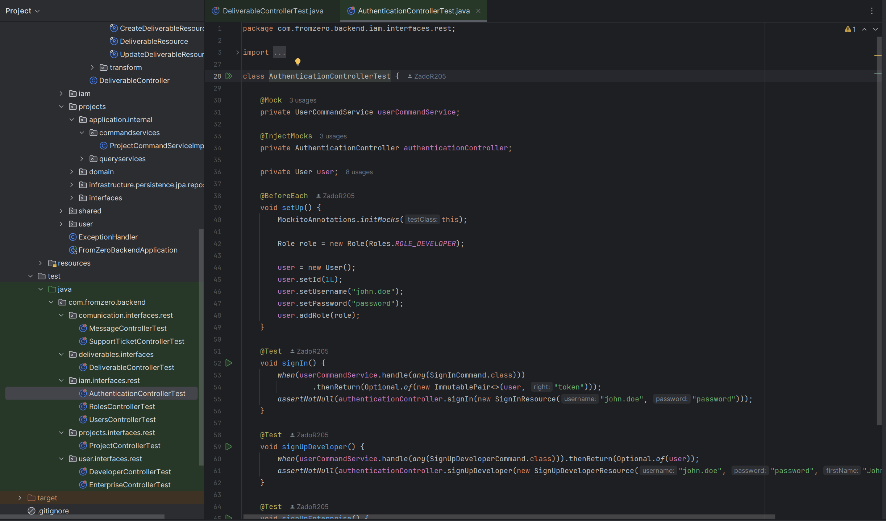
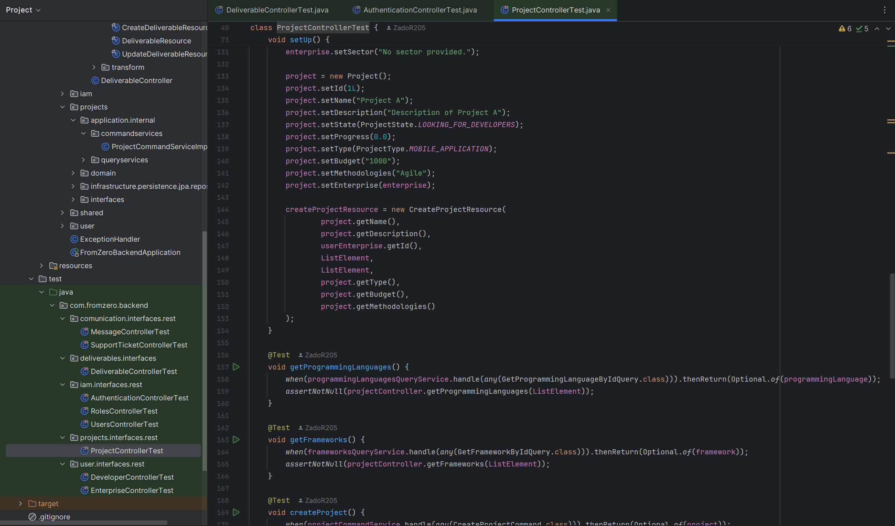

## 7.2. Continuous Delivery
### 7.2.1. Tools and Practices

**Tools (Herramientas)**

- **GitHub + GitFlow:**  
  Cada componente (backend, frontend y landing page) reside en su propio repositorio. Seguimos el modelo GitFlow con ramas `feature/*`, `develop`, `release/*`, `hotfix/*` y `main`. Las ramas `develop` y `main` están protegidas y requieren pull request aprobado antes de merge.

- **Railway:**  
  Plataforma de despliegue del backend (API RESTful). Se conecta al repositorio de GitHub y, tras cada push a `develop` o `main`, realiza build y deploy automáticos. La configuración de variables de entorno (credenciales, URLs de BD) se maneja desde su panel.

- **Netlify:**  
  Hosting y CI/CD del frontend (Vue + PrimeVue). Configuramos Deploy Previews automáticos en `develop` y despliegue de producción en `main`. Las variables de entorno, como el endpoint del backend, se definen en el dashboard de Netlify.

- **GitHub Pages:**  
  Alojamiento continuo del landing page estático (HTML5, CSS3 y JavaScript). Publicamos desde la carpeta `/docs` o mediante la rama `gh‑pages`, según la configuración del repositorio.

**Practices (Prácticas)**

- **Feature Branching y Pull Requests:**  
   
    Cada historia de usuario se desarrolla en una rama `feature/E2‑USXXX`. Al finalizar, se abre un pull request contra `develop`, que debe recibir al menos una aprobación antes de fusionarse.

- **Commits Semánticos:**  
   
    Usamos el formato `<type>:<descripción>` (por ejemplo, `feat:`, `fix:`, `docs:`) para facilitar el seguimiento de cambios y la generación automática de changelogs.

- **Protección de Ramas y Checks Automáticos:**  
   
    Integramos linters (ESLint, Prettier) y pruebas unitarias en pre‑commit o GitHub Actions. Solo se permite merge con todos los checks en verde y al menos un revisor aprobando el PR.

- **Gestión de Variables de Entorno:**  
   
    Mantenemos archivos `.env` locales excluidos de Git y gestionamos las variables de producción/staging en Railway y Netlify, garantizando separación clara de entornos.

### 7.2.2. Stages Deployment Pipeline Components

El pipeline de despliegue comienza con el trabajo en ramas de feature y termina con la publicación y monitoreo de la versión en producción, pasando por entornos de staging para validación.

- **Feature Branching:**  
   
    El desarrollador crea `feature/E2‑USXXX` para implementar una historia de usuario sin afectar otras ramas.

- **Pull Request y Despliegue en Staging:**  
   
    Al abrir el PR contra `develop`, GitHub Actions ejecuta linters, formateadores y pruebas. Cuando el PR se fusiona, Railway y Netlify generan builds preview del backend y frontend, cuyas URLs se comparten con QA.

- **Validación y QA:**  
   
    El equipo de QA prueba la versión de staging y registra incidencias en Trello (“From Zero”). Las correcciones se realizan en ramas `hotfix/*` o en la rama de feature, según corresponda.

- **Merge a `main` y Producción:**  
   
    Una vez aprobado en staging, se fusiona `develop` en `main`. Railway redeploya el backend en producción, Netlify publica el frontend en la CDN del dominio principal, y GitHub Pages actualiza el landing page.

- **Monitoreo y Rollback:**  
   
    Tras el despliegue, se revisan logs y métricas en Railway y Netlify Analytics. Ante fallos críticos, se revierte el merge en `main` para volver a la versión anterior y se documenta la incidencia en Trello.

## 7.3. Continuous Deployment

La implementación continua es una práctica que permite automatizar el proceso de despliegue de una aplicación en un entorno de producción, asegurando que cada cambio realizado en el código fuente se implemente de manera rápida y confiable.

### 7.3.1. Tools and Practices
En esta sección se describirán las herramientas y prácticas utilizadas para la implementación continua de la aplicación. 

**Tools (Herramientas)**

- **GitHub Actions**: Se utilizó GitHub Actions para automatizar el proceso de implementación continua. Esta herramienta permite definir flujos de trabajo que se activan automáticamente al realizar cambios en el repositorio, como la creación de un nuevo commit o la apertura de un pull request.
- **Docker**: Se utilizó Docker para crear contenedores que encapsulan la aplicación y sus dependencias. Esto garantiza que la aplicación se ejecute de manera consistente en diferentes entornos, desde el desarrollo hasta la producción.

- **Railway**: Se utilizó Railway como plataforma de implementación para alojar nuestra base de datos SQL. Railway es una plataforma de implementación en la nube que permite crear y gestionar nuestro despliegue de manera sencilla. 

- **Netflify**: Se utilizó Netlify para alojar la aplicación web. Netlify es una plataforma de implementación continua que permite desplegar aplicaciones web de manera rápida y sencilla.

**Practices (Prácticas)**

- **Feature Branching**: Se utilizó la práctica de ramificación de características para desarrollar nuevas funcionalidades en ramas separadas. Esto permite trabajar en múltiples características al mismo tiempo sin afectar a producción. Una vez que una característica está lista, se crea un pull request para revisarla y fusionarla con la rama principal.

- **Automated Testing**: Se implementaron pruebas automatizadas para garantizar que los cambios realizados en el código no rompan la funcionalidad existente. Estas pruebas se ejecutan automáticamente en cada commit y pull request, lo que permite detectar errores de manera temprana.

- **Continuous Integration**: Se implementó un proceso de integración continua que se activa automáticamente al realizar cambios en el código. Esto incluye la ejecución de pruebas automatizadas y la creación de contenedores Docker para garantizar que la aplicación funcione correctamente en diferentes entornos.

### 7.3.2. Production Deployment Pipeline Components

En esta sección se describirán los componentes del pipeline de implementación en producción.

**Componentes del Pipeline del backend y base de datos (Railway):**
1. **Repositorio de código:** El proyecto se encuentra alojado en un repositorio (como GitHub), el cual contiene el código fuente, configuración y archivos necesarios para la construcción y despliegue del sistema. Railway se conecta a este repositorio para automatizar el proceso de despliegue.

2. **Servicio de Backend:** Railway detecta el tipo de proyecto (por ejemplo, Java con Maven o Gradle) y lo compila automáticamente. El backend se despliega como un servicio, exponiendo una URL pública para consumir la API.

3. **Servicio de Base de Datos:** Se utiliza el plugin de base de datos de Railway (como PostgreSQL), que se crea dentro del mismo proyecto. Este servicio gestiona la persistencia de datos y proporciona las credenciales y conexión necesarias para integrarse con el backend.

4. **Variables de entorno:** Ambos servicios utilizan variables de entorno para configurar parámetros sensibles como la URL de la base de datos, el usuario y la contraseña. Esto permite separar la configuración del código, facilitando el mantenimiento y la seguridad.

5. **Automatización y despliegue (CI/CD):** Cada vez que se realiza un cambio en el repositorio, Railway ejecuta automáticamente el proceso de construcción y despliegue. Esto garantiza que la última versión del sistema esté siempre activa sin necesidad de intervención manual.

**Componentes del Pipeline del frontend (Netlify):**

1. **Repositorio de código:** El frontend está alojado en un repositorio (como GitHub), que contiene todos los archivos fuente, configuraciones y dependencias del proyecto. Netlify se conecta directamente a este repositorio para automatizar el despliegue.

2. **Servicio de construcción y despliegue:** Netlify detecta el framework utilizado (Vue) y ejecuta los comandos de construcción definidos (por ejemplo, npm run build). Luego, genera una versión optimizada del sitio y lo publica automáticamente en una URL pública.

3. **Variables de entorno:** Netlify permite definir variables de entorno necesarias para que el frontend funcione correctamente, como la URL del backend. Estas variables se inyectan durante la fase de construcción.

4. **Automatización y CI/CD:** Cada vez que se realiza un cambio en la rama configurada del repositorio, Netlify reconstruye y despliega automáticamente el sitio. Esto garantiza que siempre se muestre la última versión del frontend sin necesidad de hacerlo manualmente.

5. **Hosting y CDN:** Netlify publica el frontend en su red global de CDN, lo que mejora el rendimiento y la disponibilidad del sitio. Esto permite a los usuarios acceder rápidamente desde cualquier ubicación.

## 7.4 Continuous Monitoring
### 7.4.1. Tools and Practices

Para garantizar una supervisión constante de la calidad y rendimiento de nuestra plataforma WebMaster, se integraron diversas herramientas y buenas prácticas orientadas al monitoreo proactivo. A continuación, se describen las principales:

* Pruebas de Comportamiento y Automatización Visual (Selenium + Cucumber): Se utilizó Selenium para la automatización de pruebas en interfaces gráficas, junto con Cucumber para definir comportamientos esperados mediante especificaciones BDD (Behavior-Driven Development). Esto permite monitorear de forma automatizada que las funcionalidades visibles sigan respondiendo como se espera ante cambios en el código.

* Supervisión de APIs (Postman): Postman fue empleado no solo como herramienta de pruebas manuales e integración, sino también como recurso para validar continuamente la disponibilidad y correcto funcionamiento de nuestros endpoints RESTful. Esta práctica permite identificar problemas de conexión o respuestas inesperadas antes de que impacten a los usuarios.

<div align="center">
  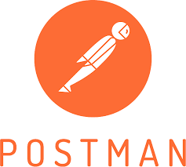
</div>

* Auditorías de Calidad Web (Lighthouse): Google Lighthouse fue incorporado para realizar auditorías periódicas sobre el rendimiento, accesibilidad y buenas prácticas de la plataforma. Gracias a esta herramienta, se logró identificar cuellos de botella y oportunidades de mejora en la experiencia digital.

* Monitoreo de Experiencia del Usuario (Google Analytics): Google Analytics permitió analizar el comportamiento real de los usuarios en la plataforma, facilitando la toma de decisiones para optimizar flujos, identificar caídas en rutas críticas y mejorar la navegación en general.

<div align="center">
  
</div>

### 7.4.2. Monitoring Pipeline Components

Un pipeline de monitoreo continuo fue diseñado para recoger y analizar información clave sobre el comportamiento del sistema en producción, garantizando así una evolución basada en evidencia y una experiencia digital consistente.

* Google Lighthouse: Implementado como parte del pipeline para generar auditorías automatizadas sobre rendimiento, accesibilidad, SEO y otras métricas esenciales. Estos análisis se ejecutan de forma periódica para identificar problemas antes de que impacten negativamente a los usuarios.

<div align="center">
  
</div>


* Google Analytics: Actúa como componente de análisis en tiempo real, recolectando datos sobre el tráfico, flujo de usuarios y puntos de salida críticos. Esta información se integra al pipeline para ayudar a visualizar cómo las decisiones técnicas afectan directamente la experiencia del usuario.

### 7.4.3. Alerting Pipeline Components

Los mecanismos de alerta permiten una respuesta rápida y oportuna ante eventos inesperados o caídas en la calidad del servicio. En nuestro caso, se utilizaron componentes y configuraciones para detectar fallos relevantes tanto a nivel funcional como de rendimiento:

* JUnit5 + Mockito: Aunque tradicionalmente son usados para pruebas, estas herramientas también se incorporaron dentro del pipeline de CI/CD (integrado con GitHub Actions) para verificar continuamente que las funcionalidades básicas del backend operen correctamente. Al fallar alguna prueba crítica, se dispara automáticamente una alerta al equipo.

* GitHub Actions: Configurado para ejecutar pruebas automáticas y mostrar fallos en tiempo real directamente en el repositorio, GitHub se convierte en el centro de control del equipo de desarrollo, quien recibe alertas ante cualquier error en las ejecuciones de los test suites, promoviendo respuestas rápidas ante regresiones.

### 7.4.4. Notification Pipeline Components

La automatización de notificaciones es crucial para mantener al equipo informado sobre el estado del sistema y de las pruebas a lo largo del ciclo de vida del desarrollo.

* GitHub Actions + Railway + Firebase: Gracias a la integración entre GitHub Actions y los entornos de despliegue en Railway y Firebase, se configuraron notificaciones automáticas ante cada despliegue exitoso o fallido. Estas notificaciones incluyen el estado del build, el resultado de las pruebas y el entorno al que se desplegó.

* Mensajería por correo (via GitHub): Se establecieron notificaciones por correo electrónico como mecanismo principal para mantener informados a los miembros del equipo sobre fallos críticos, fallos en builds o actualizaciones importantes, promoviendo una toma de decisiones ágil y colaborativa.

# Capítulo VIII: Experiment-Driven Development
## 8.1. Experiment Planning
### 8.1.1. As-Is Summary
Nuestra aplicación tiene como objetivo principal ofrecer una plataforma para que las pequeñas y medianas empresas puedan conseguir soluciones tecnologicas sencillas basadas en sus necesidades y presupuesto. A su vez, permite a los desarrolladores freelance encontrar proyectos que se alineen con sus habilidades y experiencia. Actualmente, la aplicación cuenta con funcionalidades básicas como el registro de usuarios, la publicación de proyectos y la postulación a estos por parte de los desarrolladores. Sin embargo, aún hay áreas que requieren mejoras y nuevas funcionalidades para optimizar la experiencia del usuario y aumentar la eficiencia del sistema.

**Problemas Identificados:**
- <u>Rendimiento:</u> la aplicación puede ser bastante lenta al momento de cargar los datos en la pantalla inicial, a su vez, la carga de los proyectos puede ser lenta y no se actualiza en tiempo real.

-<u> Usabilidad:</u> la navegación por la aplicación puede ser confusa para los usuarios, especialmente para aquellos que no están familiarizados con el sistema. La interfaz de usuario necesita ser más intuitiva y amigable.

- <u>Funcionalidades:</u> la aplicación carece de ciertas funcionalidades que podrían mejorar la experiencia del usuario, como un sistema de notificaciones, un chat para gestionar las entregas y una sección de perfil más completa.

- <u>Seguridad:</u> la aplicación necesita mejorar sus medidas de seguridad para proteger la información de los usuarios y evitar posibles ataques cibernéticos.

**Objetivos de Mejora:**
- Mejorar el rendimiento de la aplicación para que sea más rápida y eficiente.
- Optimizar la usabilidad de la aplicación para que sea más intuitiva y fácil de navegar.
- Añadir nuevas funcionalidades que mejoren la experiencia del usuario, como un sistema de notificaciones, un chat para gestionar las entregas y una sección de perfil más completa.
- Implementar medidas de seguridad más robustas para proteger la información de los usuarios y evitar posibles ataques cibernéticos.

### 8.1.2. Raw Material: Assumptions, Knowledge Gaps, Ideas, Claims
**Assumptions:**  
  - Los usuarios valoran una interfaz intuitiva y fácil de usar.
  - La velocidad de carga de la aplicación es un factor crítico para la satisfacción del usuario.
  - Los usuarios necesitan funcionalidades adicionales como notificaciones y chat  para mejorar su experiencia.

**Knowledge Gaps:**
  - No se ha realizado un análisis exhaustivo de las necesidades y expectativas de los usuarios.
  - Falta información sobre las mejores prácticas de seguridad para aplicaciones web.
  - Desconocimiento sobre las tecnologías más adecuadas para mejorar el rendimiento de la aplicación.

**Ideas:**
  - Implementar un sistema de notificaciones para mantener a los usuarios informados sobre actualizaciones y cambios en sus proyectos.
  - Añadir un chat para comunnicarse y gestionar las entregas y plazos de los proyectos entre otras cosas.
  - Realizar una auditoría de usabilidad para identificar áreas de mejora en la interfaz de usuario.
  
**Claims:**
  - La implementación de un sistema de notificaciones mejorará la comunicación entre los usuarios y aumentará la retención de usuarios.
  - Un chat integrado facilitará la coordinacion del proyectos y mejorará la planificación de tareas.
  - Mejorar la usabilidad de la aplicación aumentará la satisfacción del usuario y reducirá la tasa de abandono.

### 8.1.3. Experiment-Ready Questions
|Question|Confidence|Risk|Impact|Interest|Total Score|
|--------|----------|----|------|--------|-----------|
| ¿Mejorará la experiencia del usuario si mejoramos la barra de navegacion y ajustamos las tonalidades del fondo? | 3 - Con una configuración mas agradable para la vista podemos asegurarnos que los usuarios permanezcan mas tiempo en ella | 1 - bajo riesgo ya que son configuraciones sencillas que no tomarian mucho en implementar o quitar si no son de agrado al publico| 2 - Podría mejorar la experiencia de usuario por no es critica | 2 - Interes bajo, pero presente en los usuarios | 9 | 
| ¿Aumentará la retención de usuarios si implementamos un sistema de notificaciones? | 4 - Con un sistema de notificaciones, los usuarios estarán más informados y comprometidos con la plataforma | 2 - Riesgo moderado, ya que podría generar spam si no se gestiona adecuadamente | 5 - La retención de usuarios es crucial para el éxito a largo plazo | 6 - Alto interés, ya que los usuarios valoran estar informados sobre sus proyectos | 17 |
| ¿Mejorará la planificación de proyectos si añadimos un chat para que los involucrados puedan comunicarse en tiempo real? | 6 - Un chat facilitará la organización y seguimiento de tareas | 4 - Riesgo moderado, ya que podría complicar la interfaz si no se implementa correctamente | 8 - La planificación es clave para el éxito de los proyectos | 6 - Alto interés, ya que los usuarios necesitan herramientas para gestionar sus proyectos | 24 |
| ¿Aumentará la satisfacción del usuario si optimizamos la velocidad de carga de la aplicación? | 8 - La velocidad de carga es fundamental para una buena experiencia de usuario | 2 - Bajo riesgo, ya que se trata de optimizaciones técnicas | 7 - Una aplicación rápida mejora la percepción general del servicio | 9 - Muy alto interés, ya que los usuarios esperan un rendimiento óptimo | 26 |
| ¿Mejorará el sentimiento de seguridad de los usuarios en la aplicación si implementamos medidas de seguridad más robustas, pero que puedan comprometer el rendimiento?| 6 - Con medidas de seguridad más robustas, los usuarios se sentirán más seguros al usar la aplicación | 6 - Riesgo alto, ya que las medidas de seguridad pueden afectar el rendimiento si no se implementan adecuadamente | 4 - La seguridad es una preocupación crítica para los usuarios | 5 - Muy alto interés, ya que la seguridad es un factor clave en la confianza del usuario | 21 |

### 8.1.4. Question Backlog

|Prioridad (1,2,3,5,8)|Pregunta|
|--------|--------|
| 1 | ¿Mejorará la experiencia del usuario si mejoramos la barra de navegación y ajustamos las tonalidades del fondo? |
| 3 | ¿Aumentará la retención de usuarios si implementamos un sistema de notificaciones? |
| 3 | ¿Mejorará la planificación de proyectos si añadimos un char para gestionar la coordinacion de los proyectos? |
| 5 | ¿Mejorará el sentimiento de seguridad de los usuarios en la aplicación si implementamos medidas de seguridad más robustas, pero que puedan comprometer el rendimiento? |
| 8 | ¿Aumentará la satisfacción del usuario si optimizamos la velocidad de carga de la aplicación? |

### 8.1.5. Experiment Cards

|Quesiton| ¿Mejorará la experiencia del usuario si mejoramos la barra de navegación y ajustamos las tonalidades del fondo?|
|---|---|
|Why?|Para mejorar la experiencia del usuario y hacer la aplicación más atractiva visualmente.|
|What?|Mejorar la barra de navegación y ajustar las tonalidades del fondo.|
|Hypothesis|Si mejoramos la barra de navegación y ajustamos las tonalidades del fondo, entonces los usuarios tendrán una experiencia más agradable y permanecerán más tiempo en la aplicación.|
<br>

|Question| ¿Aumentará la retención de usuarios si implementamos un sistema de notificaciones?|
|---|---|
|Why?|Para mantener a los usuarios informados sobre actualizaciones y cambios en sus proyectos, lo que puede aumentar su compromiso.|
|What?|Implementar un sistema de notificaciones que informe a los usuarios sobre actualizaciones y cambios en sus proyectos.|
|Hypothesis|Si implementamos un sistema de notificaciones, entonces los usuarios estarán más informados y comprometidos con la plataforma, lo que aumentará la retención de usuarios.|
<br>

|Question| ¿Mejorará la planificación de proyectos si añadimos un char para gestionar la coordinacion de los proyectos?|
|---|---|
|Why?|Para facilitar la organización y seguimiento de tareas, lo que puede mejorar la planificación de proyectos.|
|What?|Añadir un chat que permita a los usuarios coordinar fechas de entrega, plazos y alcance de los entregables del proyecto.|
|Hypothesis|Si añadimos un chat para coordinar la gestión el proyecto, entonces los usuarios podrán organizar y seguir sus tareas de manera más efectiva, lo que mejorará la planificación de proyectos.|
<br>

|Question| ¿Aumentará la satisfacción del usuario si optimizamos la velocidad de carga de la aplicación?|
|---|---|
|Why?|Para mejorar la experiencia del usuario, ya que una aplicación rápida es fundamental para una buena percepción del servicio.|
|What?|Optimizar la velocidad de carga de la aplicación para que sea más rápida y eficiente.|
|Hypothesis|Si optimizamos la velocidad de respuesta entre el front y back, entonces los usuarios tendrán una experiencia más fluida y satisfactoria, lo que aumentará su satisfacción.|
<br>

|Question| ¿Mejorará el sentimiento de seguridad de los usuarios en la aplicación si implementamos medidas de seguridad más robustas, pero que puedan comprometer el rendimiento?|
|---|---|
|Why?|Para proteger la información de los usuarios y evitar posibles ataques cibernéticos, lo que puede aumentar la confianza en la plataforma.|
|What?|Implementar medidas de seguridad más robustas, como autenticación de dos factores y cifrado de datos, aunque esto pueda afectar el rendimiento.|
|Hypothesis|Si implementamos medidas de seguridad más robustas, entonces los usuarios se sentirán más seguros al usar la aplicación, lo que aumentará su confianza en la plataforma.|

## 8.2. Experiment Design
### 8.2.1. Hypotheses

| Question | ¿Mejorará la experiencia del usuario si mejoramos la barra de navegacion y ajustamos las tonalidades del fondo? |
| --- | --- |
| Belief | Una barra de navegación más clara y tonos de fondo agradables reducirán la fatiga visual y harán la aplicación más atractiva. |
| Hypothesis | Ajustar la barra de navegación y las tonalidades del fondo incrementará el tiempo promedio de sesión en ≥10% y aumentará la valoración de satisfacción visual en ≥1 punto (escala 1–5). |
| Null Hypothesis | No habrá cambios significativos en tiempo de sesión ni en valoración de satisfacción visual. |


| Question | ¿Aumentará la retención de usuarios si implementamos un sistema de notificaciones? |
| --- | --- |
| Belief | Mantener informados a los usuarios con notificaciones incrementa su compromiso. |
| Hypothesis | Implementar notificaciones push/email elevará la retención mensual de usuarios en ≥15%. |
| Null Hypothesis | La retención mensual no variará de forma significativa. |


| Question | ¿Mejorará la planificación de proyectos si añadimos un char para gestionar la coordinacion de los proyectos? |
| --- | --- |
| Belief | Un chat integrado facilita la organización y seguimiento de entregas. |
| Hypothesis | Añadir un chat entrega incrementará la tasa de tareas completadas a tiempo en ≥20%. |
| Null Hypothesis | La proporción de tareas completadas a tiempo no cambiará significativamente. |


| Question | ¿Aumentará la satisfacción del usuario si optimizamos la velocidad de carga de la aplicación? |
| --- | --- |
| Belief | Una aplicación más rápida mejora la percepción y retención. |
| Hypothesis | Reducir el tiempo de carga a <2s incrementará la satisfacción global en ≥1.5 puntos (escala 1–5). |
| Null Hypothesis | La satisfacción global no mostrará diferencia significativa. |


| Question | ¿Mejorará el sentimiento de seguridad de los usuarios en la aplicación si implementamos medidas de seguridad más robustas, pero que puedan comprometer el rendimiento? |
| --- | --- |
| Belief | Funciones como 2FA y cifrado generan mayor confianza. |
| Hypothesis | Implementar autenticación de dos factores y cifrado avanzado elevará el índice de confianza en ≥20%. |
| Null Hypothesis | La confianza del usuario no variará significativamente. |

### 8.2.2. Measures
| Question | ¿Mejorará la experiencia del usuario si mejoramos la barra de navegación y ajustamos las tonalidades del fondo? |
| --- | --- |
| Measure | Medir la puntuación de satisfacción del usuario (CSAT) a través de una encuesta (escala 1–5) y el tiempo promedio por sesión utilizando Google Analytics antes y después del cambio. |


| Question | ¿Aumentará la retención de usuarios si implementamos un sistema de notificaciones? |
| --- | --- |
| Measure | Medir la tasa de retención de usuarios mensual (porcentaje de usuarios que regresan al mes siguiente) y la tasa de clics en notificaciones (CTR) para evaluar su relevancia. |


| Question | ¿Mejorará la planificación de proyectos si añadimos un char para gestionar la coordinacion de los proyectos?|
| --- | --- |
| Measure | Medir el porcentaje de entregables completados a tiempo y la tasa de finalización de proyectos dentro del plazo estimado. Complementar con encuestas sobre la facilidad de gestión percibida. |


| Question | ¿Mejorará el sentimiento de seguridad de los usuarios si implementamos medidas de seguridad más robustas? |
| --- | --- |
| Measure | Medir la puntuación de confianza en la seguridad mediante una encuesta (escala 1–10) y el tiempo de inicio de sesión promedio para cuantificar el impacto en el rendimiento. |


| Question | ¿Aumentará la satisfacción del usuario si optimizamos la velocidad de carga de la aplicación? |
| --- | --- |
| Measure | Medir el Tiempo de Carga Promedio (Average Page Load Time) y el Time to Interactive (TTI) utilizando herramientas como Google Lighthouse. Medir la Calificación de Satisfacción del Usuario (CSAT) a través de encuestas. |

### 8.2.3. Conditions
| Question | ¿Mejorará la experiencia del usuario si mejoramos la barra de navegación y ajustamos las tonalidades del fondo? |
| --- | --- |
| Condición Experimental | Un grupo de usuarios interactuará con la versión de la aplicación que incluye la nueva barra de navegación y la paleta de colores actualizada. |
| Condición de Control | Un grupo de usuarios utilizará la versión actual de la aplicación sin los cambios visuales. |

| Question | ¿Aumentará la retención de usuarios si implementamos un sistema de notificaciones? |
| --- | --- |
| Condición Experimental | Se habilitará el sistema de notificaciones para un segmento de usuarios, quienes recibirán alertas sobre actividad relevante en sus proyectos. |
| Condición de Control | El grupo de control no recibirá notificaciones, manteniendo la funcionalidad actual. |

| Question | ¿Mejorará la planificación de proyectos si añadimos un char para gestionar la coordinacion de los proyectos? |
| --- | --- |
| Condición Experimental | Un grupo de usuarios tendrá acceso a la nueva funcionalidad de chat para comunicarse con los involucrados del proyecto. |
| Condición de Control | El grupo de control seguirá gestionando sus plazos sin la herramienta de chat. |

| Question | ¿Mejorará el sentimiento de seguridad de los usuarios en la aplicación si implementamos medidas de seguridad más robustas, pero que puedan comprometer el rendimiento? |
| --- | --- |
| Condición Experimental | Se activará la autenticación de dos factores (2FA) de forma opcional para un grupo de usuarios. |
| Condición de Control | El grupo de control mantendrá el sistema de autenticación actual de usuario y contraseña. |

| Question | ¿Aumentará la satisfacción del usuario si optimizamos la velocidad de carga de la aplicación? |
| --- | --- |
| Condición Experimental | Se desplegará la versión optimizada del backend y frontend para un grupo de usuarios. |
| Condición de Control | Un grupo de usuarios seguirá utilizando la versión no optimizada de la aplicación para establecer una línea base. |
### 8.2.4. Scale Calculations and Decisions
Se define un marco de decisión para cada experimento, estableciendo de antemano los umbrales de éxito que determinarán si una funcionalidad se implementa, se revisa o se descarta.

| Scale Calculation                                                                                                                                                         | Decision                                                                                                                    | Desfavorable | Aceptable | Ideal | Excelente |
|---------------------------------------------------------------------------------------------------------------------------------------------------------------------------|-----------------------------------------------------------------------------------------------------------------------------|--------------|-----------|-------|-----------|
| Creemos que mejorando la UI, la satisfacción aumentará un 15%. Sabremos que es cierto si observamos dicho aumento en las encuestas CSAT.                                    | Implementar los cambios de UI si el resultado es aceptable o superior.                                                      |              |           |   X   |           |
| Creemos que las notificaciones aumentarán la retención en un 20%. Sabremos que es cierto si la tasa de retención mensual alcanza ese valor.                               | Lanzar las notificaciones a todos los usuarios si se cumple el objetivo ideal.                                              |              |           |   X   |           |
| Creemos que el chat reducirá entregas tardías en un 25%. Sabremos que es cierto si el porcentaje de entregas funcionales a tiempo mejora en esa magnitud.                        | Integrar el chat como una funcionalidad principal si el resultado es ideal.                                           |              |           |   X   |           |
| Creemos que las medidas de seguridad aumentarán la confianza en un 30% sin impactar el rendimiento en más de un 15%.                                                        | Implementar 2FA si la confianza aumenta de forma aceptable y el impacto en el rendimiento es mínimo.                        |              |     X     |       |           |
| Creemos que la optimización del rendimiento reducirá el tiempo de carga en 50%. Sabremos que es cierto si las métricas de Lighthouse lo confirman.                         | Priorizar la implementación de las optimizaciones de rendimiento.                                                            |              |           |       |     X     |

### 8.2.5. Method Selection
Para recopilar los datos definidos en la sección de Measures, se seleccionarán y utilizarán las siguientes herramientas, evaluadas según su idoneidad para cada tarea.

| Herramienta                 | Google Analytics                                                                                          | Google Lighthouse                                                        | Hotjar                                                                | Google Forms / SurveyMonkey                                                   |
|-----------------------------|-----------------------------------------------------------------------------------------------------------|---------------------------------------------------------------------------|-----------------------------------------------------------------------|--------------------------------------------------------------------------------|
| **Precio**                  | Gratuito (con límites)                                                                                    | Gratuito (integrado en Chrome)                                            | Freemium                                                              | Freemium                                                                       |
| **Capacidad de Análisis**   | Análisis exhaustivo del comportamiento del usuario (sesiones, retención, flujo de usuarios).              | Análisis técnico de rendimiento, SEO, accesibilidad y PWA.                | Análisis cualitativo de usabilidad (mapas de calor, grabaciones).      | Recopilación de datos cualitativos y cuantitativos a través de encuestas.      |
| **Sencillez**               | Curva de aprendizaje media. Requiere configuración.                                                       | Muy sencillo de usar y entender los reportes.                             | Fácil de configurar e interpretar los datos visuales.                 | Muy fácil de crear y distribuir encuestas.                                     |
| **Ventajas**                | Ideal para medir métricas de negocio como retención y tiempo en la página. Se integra con otras herramientas de Google. | Proporciona métricas claras y accionables para desarrolladores sobre rendimiento técnico. | Ofrece insights visuales sobre cómo los usuarios interactúan con la interfaz. | Permite medir directamente la percepción y satisfacción del usuario (CSAT, confianza). |
### 8.2.6. Data Analytics: Goals, KPIs and Metrics Selection
<div align="center">
  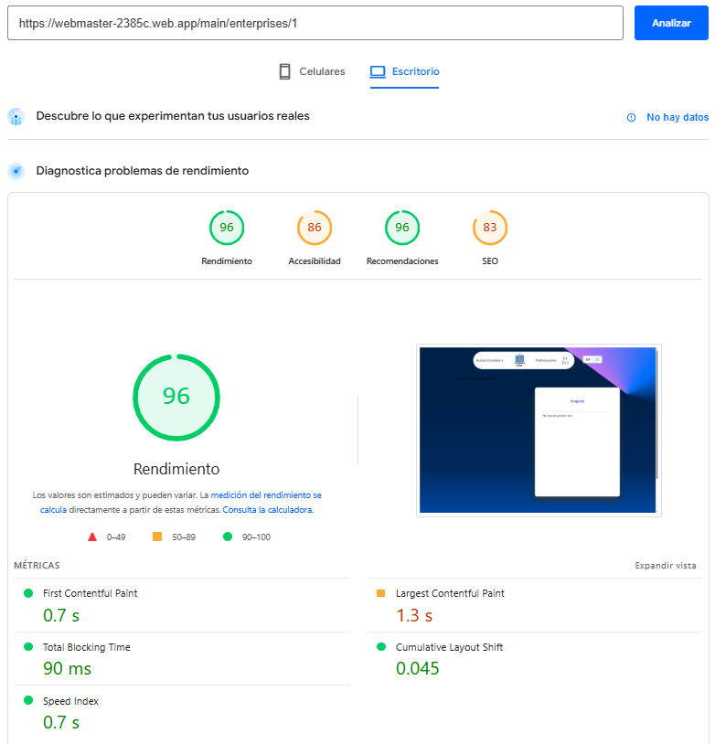
</div>
<div align="center">
  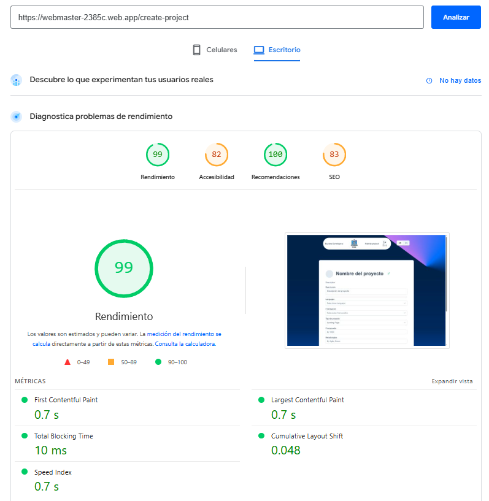
</div>
<div align="center">
  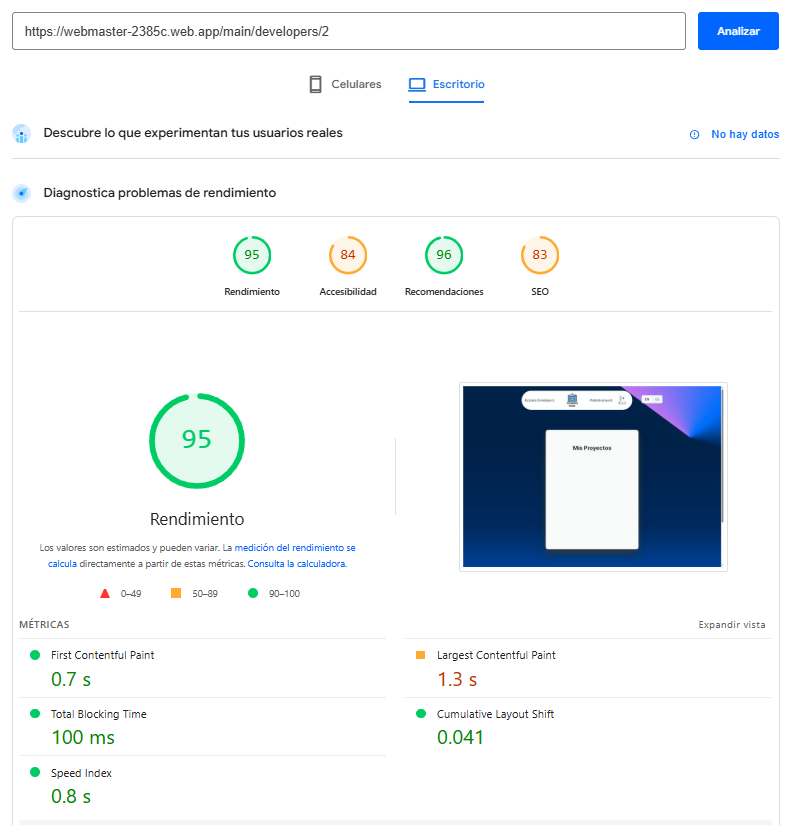
</div>
<div align="center">
  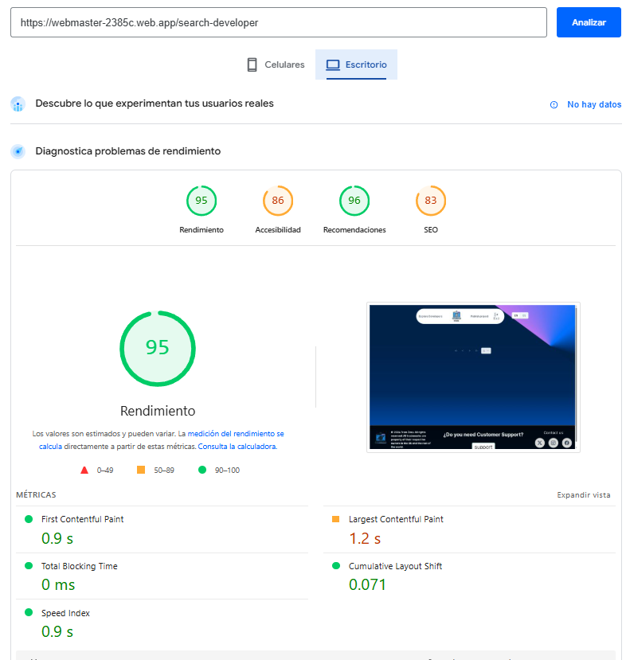
</div>

### 8.2.7. Web and Mobile Tracking Plan
Para asegurar que las mejoras implementadas sean efectivas a largo plazo y para seguir optimizando la plataforma, se establece el siguiente plan de seguimiento.

1. **Implementación Inicial y Establecimiento de Líneas Base:**  
   Durante el primer mes posterior al lanzamiento de cada nueva funcionalidad (chat, notificaciones, etc.), nos enfocaremos en recopilar datos para establecer una nueva línea base de rendimiento y uso.  
   **Recopilación de Datos:**  
   - **Métricas de Rendimiento:** Se registrarán diariamente los scores de Lighthouse para las páginas clave.  
   - **Métricas de Uso (Google Analytics):** Se monitoreará el número de usuarios activos, la duración de las sesiones y las tasas de conversión para acciones clave (ej. proyectos publicados, postulaciones enviadas).  
   - **Métricas de Funcionalidad Específica:** Se registrará la adopción de las nuevas características (ej. mensajes del chat, CTR de notificaciones).  
   - **Análisis Comparativo:** Los datos se compararán con los resultados del experimento inicial para confirmar que el impacto positivo se mantiene en un entorno de producción a mayor escala.  

2. **Seguimiento Continuo y Optimización Iterativa:**  
   Una vez establecida la nueva línea base, se iniciará un proceso de monitoreo continuo para identificar tendencias y oportunidades de mejora.  
   **Recopilación de Datos Continuos:**  
   - **Métricas en Tiempo Real:** Se configurarán dashboards en una herramienta como Google Data Studio o Grafana para visualizar KPIs en tiempo real (usuarios activos, errores de servidor, tiempos de carga).  
   - **Segmentación de Usuarios:** Se analizará el comportamiento por segmento (Empresas vs. Desarrolladores) para entender cómo cada grupo interactúa con las nuevas funcionalidades y personalizar futuras mejoras.  
   - **Feedback Cualitativo (Hotjar y Encuestas):** Se realizarán análisis periódicos con mapas de calor y se enviarán encuestas de satisfacción trimestrales para recopilar feedback directo de los usuarios.  

3. **Evaluación y Ajustes:**  
   - **Informes Mensuales:** El equipo revisará un informe mensual con los hallazgos clave y las tendencias observadas.  
   - **Iteración Basada en Datos:** Las conclusiones de estos informes se utilizarán para generar nuevas ideas y poblar el Question Backlog para el siguiente ciclo de experimentación, asegurando que WebMaster evolucione de manera constante y basada en datos.  

---

## 8.3. Experimentation
### 8.3.1. To-Be User Stories


|User Story ID|Título|Descripción|Criterios de Aceptación|Relación con Epic ID|
| :-: | :-: | :-: | :-: | :-: |
|UA01|Mejora en la barra de navegación|Como usuario de la plataforma, quiero una barra de navegación bien estructurada, para encontrar rápidamente las secciones principales sin confundirme.|<p>**Escenario 1: Acceso rápido con jerarquía clara**</p><p></p><p>**Given** el usuario está en el inicio de la plataforma</p><p></p><p>**When** el usuario navega usando la barra superior</p><p></p><p>**Then** puede llegar a cualquier sección clave en máximo 2 clics, con menús desplegables organizados por categorías.</p><p></p><p>**Escenario 2: Validación de Usabilidad**</p><p>**Given** se realizan pruebas con 20 usuarios nuevos</p><p></p><p>**When** se les pide completar tareas claves (como encontrar la sección de mensajes)</p><p></p><p>**Then** más del 90% de usuarios logran el objetivo en menos de 15 segundos</p>|E02|
|UA02|Notificaciones en tiempo real para desarrolladores|Como desarrollador registrado, quiero notificaciones configurables (email) sobre actualizaciones en mis proyectos, para responder rápidamente sin revisar manualmente.|<p>**Escenario 1: Envío de notificaciones**</p><p></p><p>**Given** que un proyecto al que estoy suscrito tiene una actualización</p><p></p><p>**When** se realiza el cambio</p><p></p><p>**Then** el sistema debe enviar una notificación por email y/o en la plataforma</p><p></p><p>**Escenario 2: Configuración de preferencias**</p><p></p><p>**Given** que el usuario accede a su panel de notificaciones</p><p></p><p>**When** modifica sus preferencias</p><p></p><p>**Then** solo debe recibir notificaciones según lo configurado</p>|E03|
|UA03|Optimización de velocidad de carga|Como usuario, quiero que las páginas carguen rápido, para tener una experiencia fluida sin interrupciones ni demoras|<p>**Escenario 1: Mejora en tiempo de carga**</p><p></p><p>**Given** que un usuario accede a cualquier sección</p><p></p><p>**When** se mide el tiempo de carga</p><p></p><p>**Then** no debe superar los 2 segundos en condiciones normales</p><p></p><p>**Escenario 2: Comparación de rendimiento**</p><p></p><p>**Given** que se implementaron optimizaciones</p><p></p><p>**When** se comparan métricas antes y después</p><p></p><p>**Then** debe evidenciarse al menos un 30% de mejora en el rendimiento</p>|E02|
|UA04|Mejora en la navegación móvil|Como usuario que accede desde la aplicación móvil, quiero que la navegación sea optimizada para usar todas las funciones cómodamente desde el móvil.|<p>**Escenario 1: Accesibilidad total**</p><p></p><p>**Given** que el usuario navega desde el móvil</p><p></p><p>**When** intenta usar funciones clave como postular a un proyecto o enviar mensajes</p><p></p><p>**Then** debe poder realizarlas sin errores ni restricciones</p>|E03|
|UA05|Ajuste de tonalidades para reducir fatiga visual|Como usuario frecuente, quiero que los colores de la interfaz sean suaves y no muy claros, para reducir la fatiga visual durante el uso prolongado.|<p>**Escenario 1: Implementación de tonalidades suaves**</p><p>**Given** que el usuario accede a la plataforma</p><p>**When** navega por las diferentes secciones</p><p>**Then** los colores de fondo y componentes deben evitar blancos intensos y usar tonalidades suaves</p><p></p><p>**Escenario 2: Validación de accesibilidad visual**</p><p>**Given** que se evalúa el diseño con criterios de accesibilidad</p><p>**When** se revisa el contraste y la legibilidad</p><p>**Then** debe cumplirse con el nivel AA de las pautas WCAG en toda la plataforma</p>|E04|
|UA06|Chat integrado para coordinación de proyectos|Como usuario desarrollador, quiero un chat integrado con el cliente del proyecto, para poder coordinar entregas, plazos y entregables sin salir de la plataforma.|<p>**Escenario 1: Envío y recepción de mensajes**</p><p></p><p>**Given** que dos usuarios están en el mismo proyecto</p><p></p><p>**When** uno de ellos envía un mensaje</p><p></p><p>**Then** el otro debe recibirlo en tiempo real y poder responder</p><p></p><p>**Escenario 2: Almacenamiento del historial**</p><p></p><p>**Given** que los usuarios han intercambiado mensajes</p><p></p><p>**When** se consulta en la pestaña de mensajes</p><p></p><p>**Then** deben mostrarse todos los mensajes anteriores de manera cronológica</p>|E04|

### 8.3.2. To-Be Product Backlog

| # Orden | User Story ID | Título | Story Points (1 / 2 / 3 / 5 / 8) |                                                |
|-----------------------------|-----------------------------------------------------------------------------------------------------------|---------------------------------------------------------------------------|-----------------------------------------------------------------------|--------------------------------------------------------------------------------|
| 1 | UA01 | Mejora en la barra de navegación | 2 |
| 2 | UA02 | Notificaciones en tiempo real para usuarios | 5 |
| 3 | UA03 | Optimización de velocidad de carga | 3 |
| 4 | UA04 | Mejora en la navegación móvil | 3 |
| 5 | UA05 | Ajuste de tonalidades para reducir fátiga visual | 2 |
| 6 | UA06 | Chat integrado para coordinación de proyectos | 5 | 

### 8.3.3. Pipeline-supported, Experiment-Driven To-Be Software Platform Lifecycle
#### 8.3.3.1. To-Be Sprint Backlogs

<table border="1" style="width:100%; border-collapse:collapse; text-align:center;">
    <thead>
        <tr>
            <th colspan="9">Sprint Backlog - Mejoras UX/Performance</th>
        </tr>
        <tr>
            <th colspan="2">User Story</th>
            <th colspan="6">Engineering Tasks</th>
        </tr>
        <tr>
            <th>ID</th>
            <th>Title</th>
            <th>ID</th>
            <th>Title</th>
            <th>Description</th>
            <th>Estimation (Hours)</th>
            <th>Assigned to</th>
            <th>Status</th>
        </tr>
    </thead>
    <tbody>
        <tr>
            <td rowspan="2">UA01</td>
            <td rowspan="2">Mejora en la barra de navegación</td>
            <td>ET01-01</td>
            <td>Rediseño Componente NavBar</td>
            <td>Crear nuevo diseño más accesible</td>
            <td>4</td>
            <td>Zaid Ramirez</td>
            <td>Done</td>
        <tr>
            <td>ET01-02</td>
            <td>Implementación Vue.js</td>
            <td>Implementar la nueva barra de navegación en la aplicación Web</td>
            <td>4</td>
            <td>Harold Elías</td>
            <td>Done</td>
        </tr>
        <tr>
            <td rowspan="3">UA02</td>
            <td rowspan="3">Notificaciones en tiempo real</td>
            <td>ET02-01</td>
            <td>Modelado Base de Datos</td>
            <td>Diseñar schema para preferencias de notificación</td>
            <td>5</td>
            <td>Samira Alvarez</td>
            <td>Done</td>
        </tr>
        <tr>
            <td>ET02-02</td>
            <td>Servicio de Notificaciones</td>
            <td>Implementar lógica de envío</td>
            <td>8</td>
            <td>Zaid Ramirez</td>
            <td>Done</td>
        </tr>
        <tr>
            <td>ET02-03</td>
            <td>Integración Email</td>
            <td>Conectar con servicio SendGrid de correo</td>
            <td>6</td>
            <td>Samira Alvarez</td>
            <td>Done</td>
        </tr>
        <tr>
            <td rowspan="3">UA03</td>
            <td rowspan="3">Optimización velocidad de carga</td>
            <td>ET03-01</td>
            <td>Auditoría Performance</td>
            <td>Ejecutar Lighthouse y WebPageTest</td>
            <td>4</td>
            <td>Victor Meneses</td>
            <td>Done</td>
        </tr>
        <tr>
            <td>ET03-02</td>
            <td>Lazy Loading</td>
            <td>Reestructurar carga de componentes en frontend</td>
            <td>8</td>
            <td>Victor Meneses</td>
            <td>Done</td>
        </tr>
        <tr>
            <td>ET03-03</td>
            <td>Migración a Microservicios</td>
            <td>Refactorizar arquitectura monolítica a microservicios para mejorar escalabilidad</td>
            <td>8</td>
            <td>Jair Velasquez</td>
            <td>Done</td>
        </tr>
        <tr>
            <td rowspan="2">UA04</td>
            <td rowspan="2">Mejora en navegación móvil</td>
            <td>ET04-01</td>
            <td>Implementación Responsive</td>
            <td>Adaptar componentes para touch (min 48px)</td>
            <td>4</td>
            <td>Jair Velasquez</td>
            <td>Done</td>
        </tr>
        <tr>
            <td>ET04-02</td>
            <td>Pruebas Cross-Device</td>
            <td>Validar en 5 dispositivos móviles diferentes</td>
            <td>4</td>
            <td>Samira Alvarez</td>
            <td>Done</td>
        </tr>
        <tr>
            <td rowspan="2">UA05</td>
            <td rowspan="2">Ajuste de tonalidades</td>
            <td>ET05-01</td>
            <td>Diseño Sistema de Color</td>
            <td>Crear paleta accesible </td>
            <td>6</td>
            <td>Zaid Ramirez</td>
            <td>Done</td>
        </tr>
        <tr>
            <td>ET05-02</td>
            <td>Implementación CSS Variables</td>
            <td>Actualizar estilos con nueva paleta</td>
            <td>4</td>
            <td>Harold Elias</td>
            <td>Done</td>
        </tr>
        <tr>
            <td rowspan="3">UA06</td>
            <td rowspan="3">Chat integrado en la Web App</td>
            <td>ET06-01</td>
            <td>WebSocket Service</td>
            <td>Implementar websocket para mensajería</td>
            <td>6</td>
            <td>Jair Velasquez</td>
            <td>Done</td>
        </tr>
        <tr>
            <td>ET03-02</td>
            <td>UI Chat</td>
            <td>Crear interfaz de chat</td>
            <td>4</td>
            <td>Harold Elías</td>
            <td>Done</td>
        </tr>
        <tr>
            <td>ET03-03</td>
            <td>Persistencia Mensajes</td>
            <td>Almacenar conversaciones en Postgresql</td>
            <td>8</td>
            <td>Jair Velasquez</td>
            <td>Done</td>
        </tr>
    </tbody>
</table>

#### 8.3.3.2. Implemented To-Be Landing Page Evidence

* UA05 – Ajuste de tonalidades para reducir fatiga visual
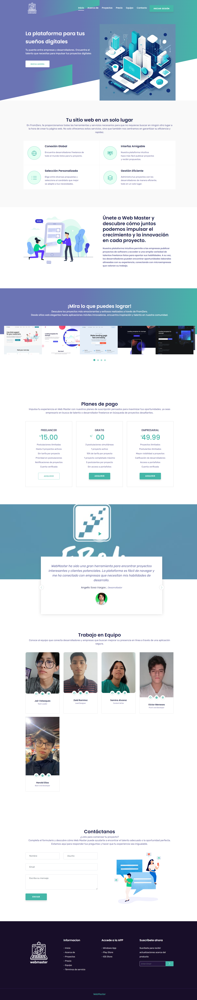

#### 8.3.3.3. Implemented To-Be Frontend-Web Application Evidence

* UA01 – Mejora en la barra de navegación
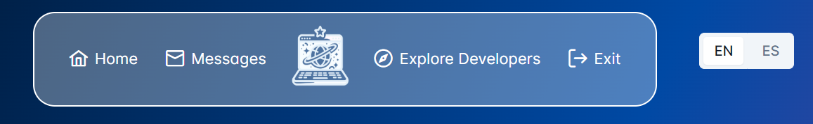

* UA02 – Notificaciones en tiempo real para desarrolladores
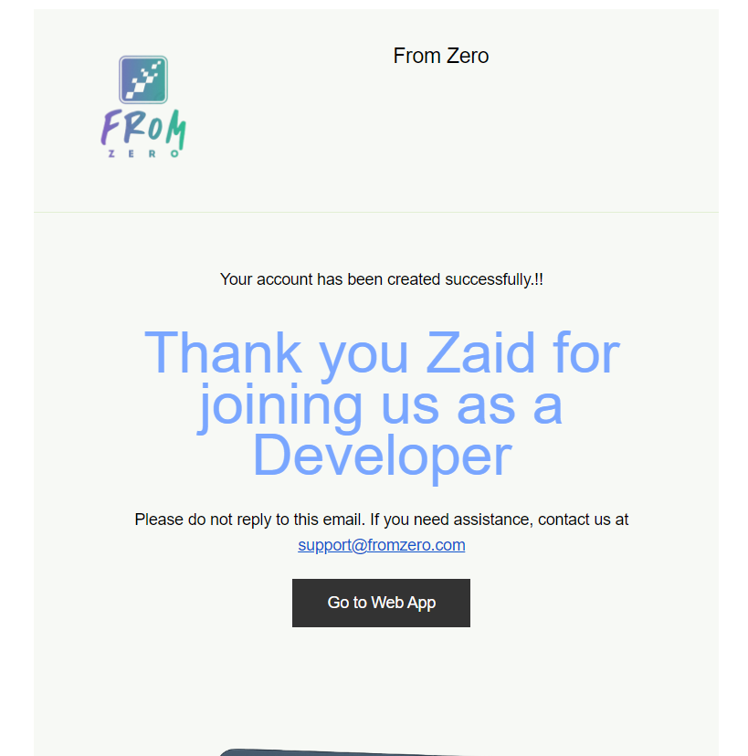

* UA03 – Optimización de velocidad de carga
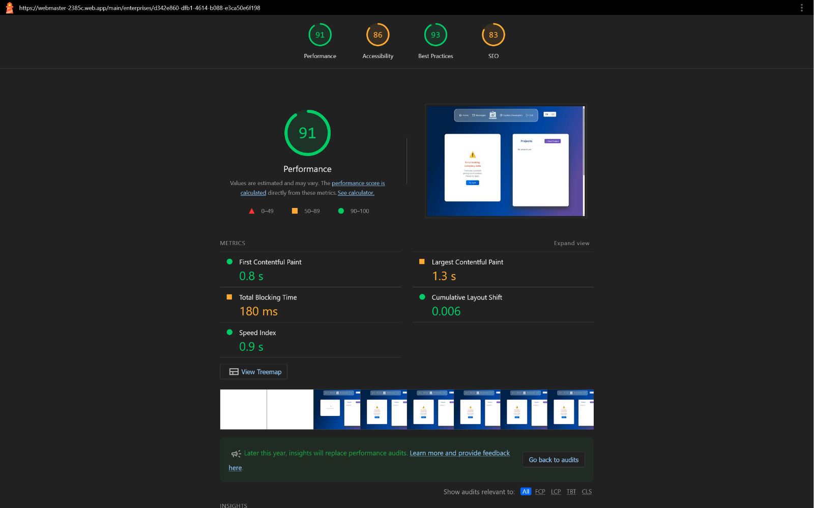


* UA05 – Ajuste de tonalidades para reducir fatiga visual
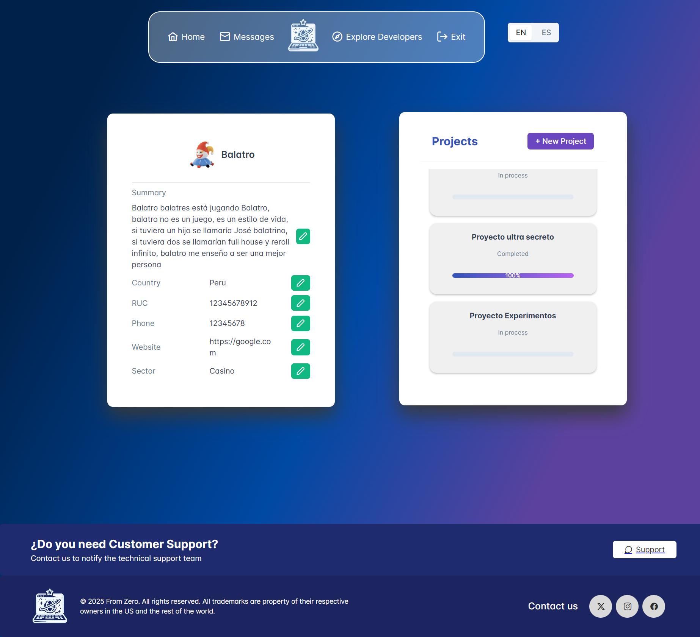

* UA06 – Chat integrado para coordinación de proyectos
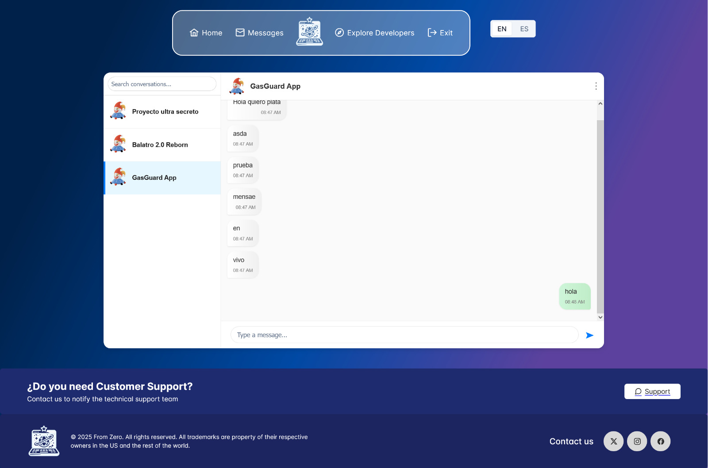


#### 8.3.3.4. Implemented To-Be Native-Mobile Application Evidence

* E2-US109 – Navegar por la aplicación como empresario  
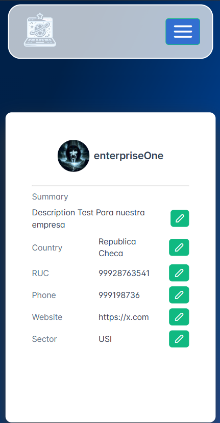

* E2-US102 – Gestionar una propuesta de proyecto de software  
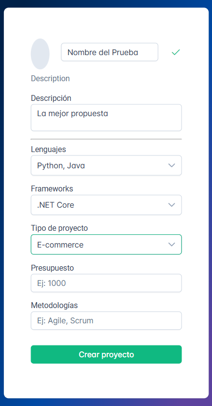  
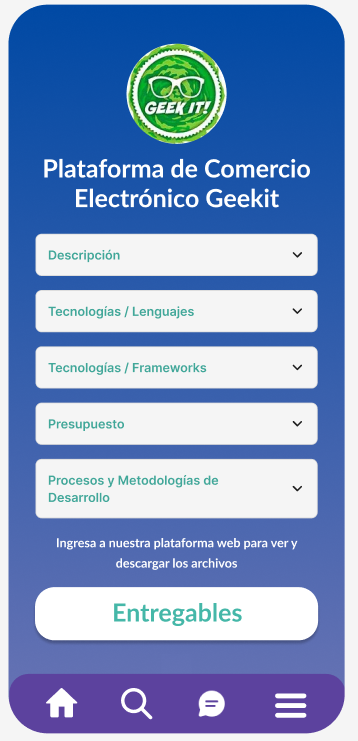

* E2-US106 – Crear y gestionar entregables  
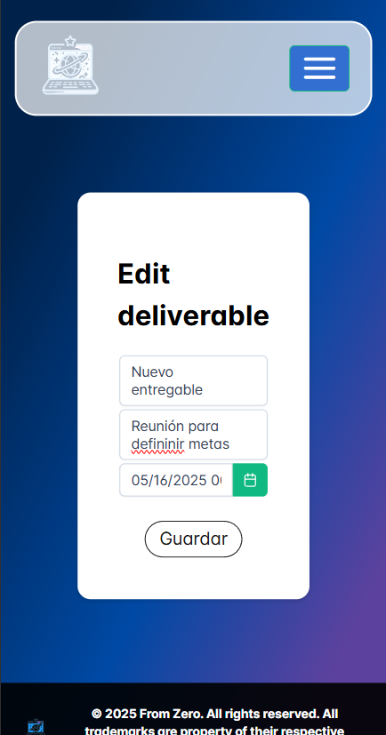  
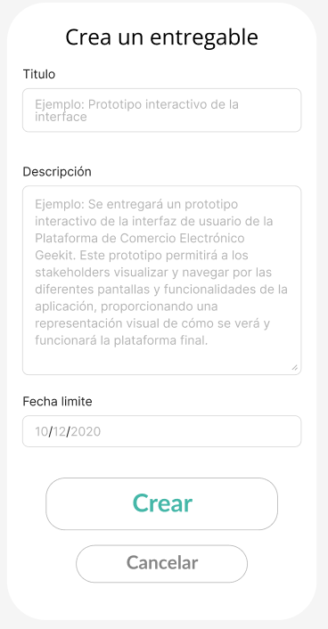

* E2-US101 – Visualizar proyectos en la pantalla de inicio  
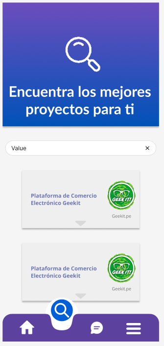

* E2-US104 – Visualizar a desarrolladores  
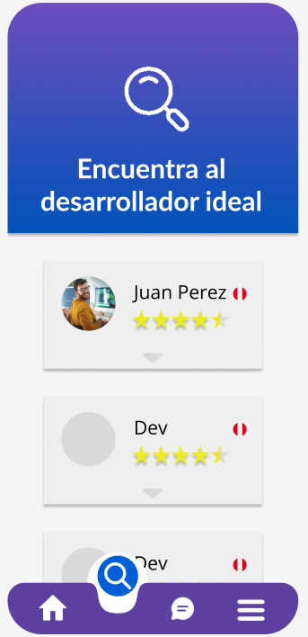

* E1-US101 – Registrar usuario  
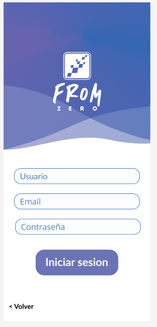

* E1-US102 – Iniciar sesión  


* E2-US103 – Gestionar lista de postulantes  
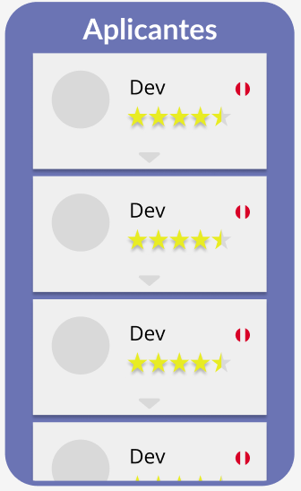  
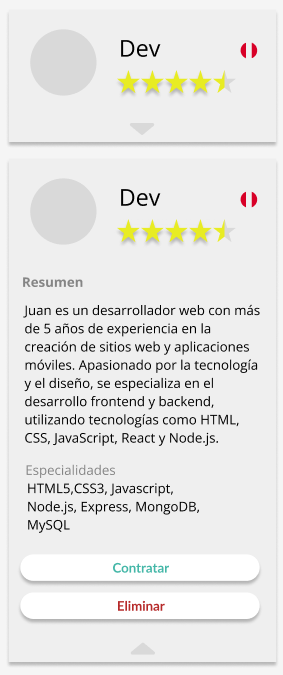

* E3-US104 – Navegar por la aplicación como freelancer  
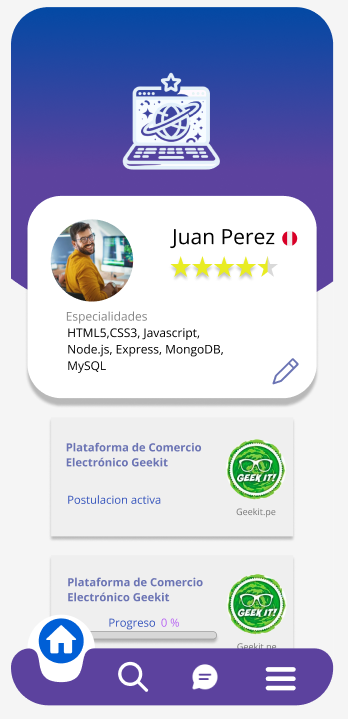

* E3-US102 – Postular a proyectos de desarrollo de software  
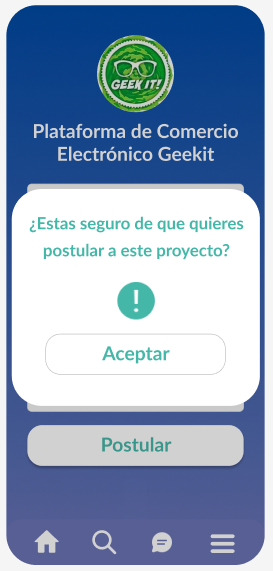

* E3-US101 – Visualizar y gestionar proyectos asignados  
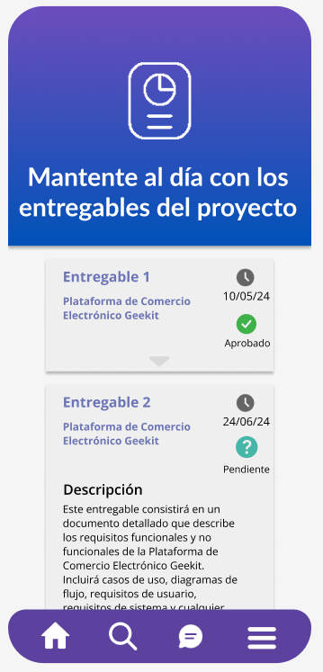

* E4-US102 – Manejar y reportar errores  
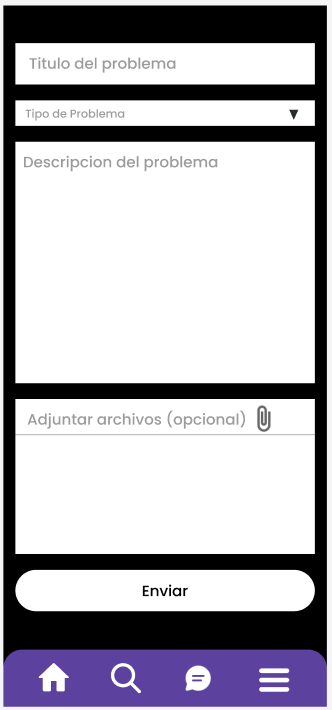


#### 8.3.3.5. Implemented To-Be RESTful API and/or Serverless Backend Evidence

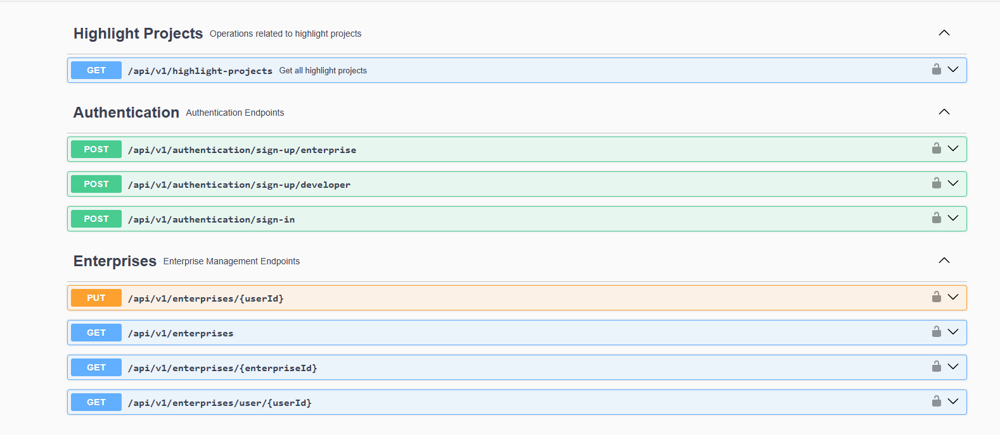

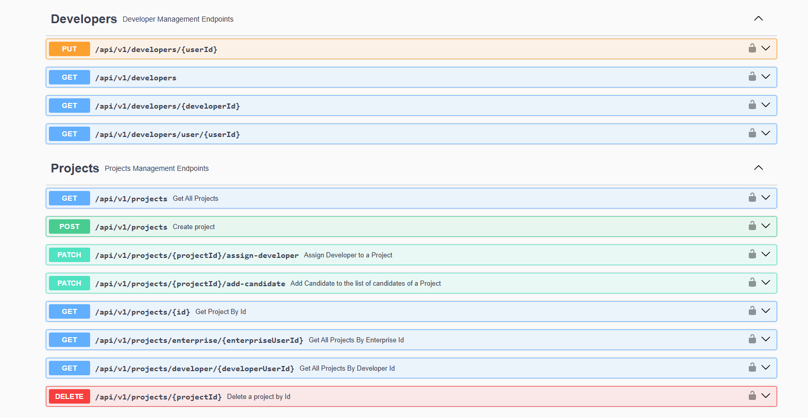

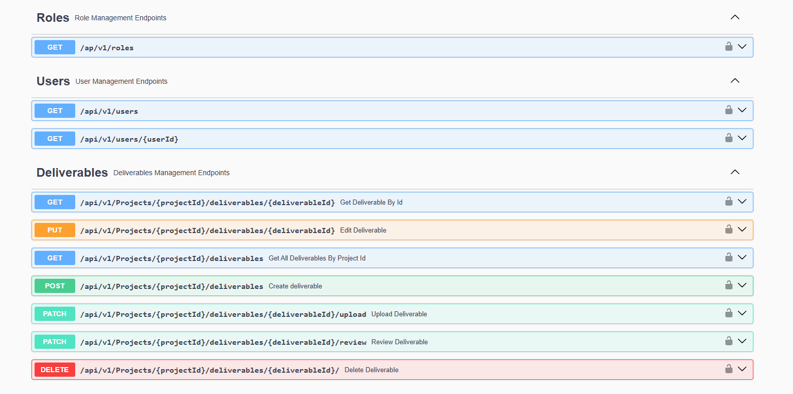

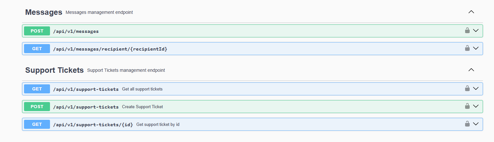


#### 8.3.3.6. Team Collaboration Insights

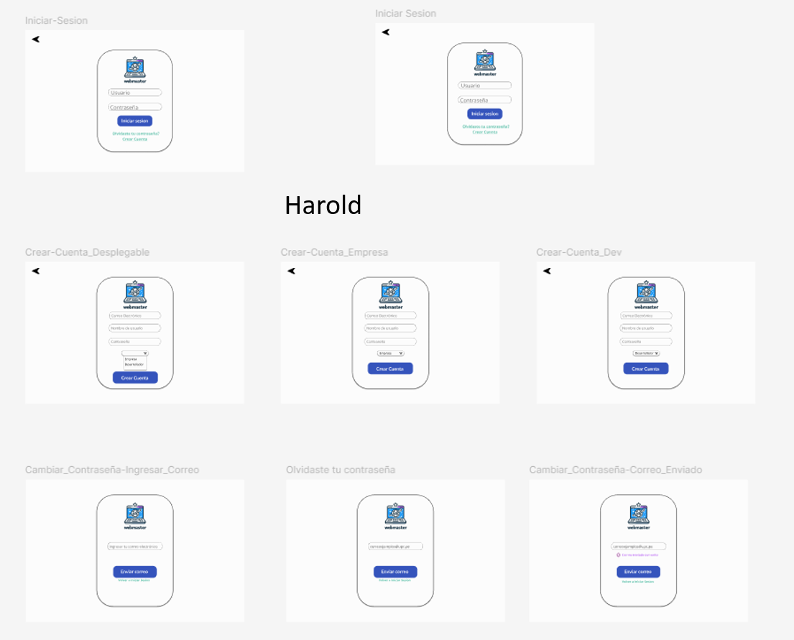


### 8.3.4. To-Be Validation Interviews
#### 8.3.4.1. Diseño de Entrevistas

1. ¿Te resulta más intuitiva la navegación con la nueva barra y los cambios de color de fondo?

2. ¿Los cambios visuales te motivan a permanecer más tiempo dentro de la aplicación?

3. ¿Te gustaría recibir notificaciones sobre actualizaciones o avances en tus proyectos?

4. ¿Qué tipo de notificaciones considerarías útiles y cuáles serían molestas o innecesarias?

5. ¿Consideras útil tener un chat integrado para coordinar tareas y entregas con tu equipo?

6. ¿Has tenido dificultades al coordinar entregables o fechas sin una herramienta de comunicación directa en la app?

7. ¿Has notado mejoras en la velocidad de la aplicación? ¿Cómo afecta esto tu experiencia general?

8. ¿Qué tan importante es para ti la rapidez de carga al usar herramientas como esta?

9. ¿Te sentirías más seguro usando la app si incluye autenticación de dos factores y cifrado de datos?

10. ¿Aceptarías tiempos de carga ligeramente más lentos a cambio de mayor seguridad en tu información?

#### 8.3.4.2. Registro de Entrevistas

**Segmento 1: Empresas**
**Entrevista 1** 

  - Entrevistador: Zaid Ramirez
  - Entrevistado: Maverick Mendoza
  - Edad: 20 años
  - Residencia: Lima 
  - Enlace del video: [https://upcedupe-my.sharepoint.com](https://youtu.be/rn22s0uMheg)

<div style="display:flex;justify-content:center">

</div>
Maverick nos comenta que considera que la aplicación es intuitiva y facil de usar, especialmente gracias a las mejoras visuales implementadas. Tambien piensa que la barra de navegación es clara y le permite acceder a las secciones principales sin complicaciones. Menciona que las notificaciones son útiles para mantenerse al tanto de los avances del proyecto, pero que no le gustaría recibir notificaciones promocionales. Aprecia la incorporación de un chat, ya que le ha dado problemas en proyectos anteriores no contar con un medio de comunicación fijo. En cuanto a la velocidad de carga, considera que es adecuada y está dispuesto a aceptar pequeñas demoras si esto significa mayor seguridad. En general, cree que la plataforma tiene las herramientas necesarias para facilitar la búsqueda de proyectos y mejorar la experiencia del usuario.
<br><br>

**Segmento 2: Desarrolladores Freelancer**

**Entrevista 1**

- Entrevistador: Samira Jetzabel Alvarez Araguache
- Entrevistado: Alessandro Medina Agnini
- Edad: 20 años
- Residencia: Lima - Surco
- Enlace del video: [https://upcedupe-my.sharepoint.com](https://upcedupe-my.sharepoint.com/:v:/g/personal/u20211a046_upc_edu_pe/EQRzZEfOKy5Lk2GClrx_Yx4Bih1kYJl_lsVAT8Ru9I__5A?e=QgPaX2&nav=eyJyZWZlcnJhbEluZm8iOnsicmVmZXJyYWxBcHAiOiJTdHJlYW1XZWJBcHAiLCJyZWZlcnJhbFZpZXciOiJTaGFyZURpYWxvZy1MaW5rIiwicmVmZXJyYWxBcHBQbGF0Zm9ybSI6IldlYiIsInJlZmVycmFsTW9kZSI6InZpZXcifX0%3D)


Resumen:
Alessandro Medina es un estudiante de Ciencias de la Computación y desarrollador front-end freelance. Menciona de manera positiva los ajustes de la interfaz de Webmaster, destacando la nueva barra de navegación. Mencionó que estas mejoras lo motivan a usar por más tiempo la aplicación. Considera últil recibir notificaciones relacionadas con avances, entregas o mensajes del equipo, pero que solo estén relacionadas al proyecto y no sean promocionales. También menciona que la incorporación de un chat es bastante útil, ya que la falta de un medio de comunicación fijo es algo que le ha dado problemas en proyectos anteriores. Aprecia la velocidad de carga actual, y está dispuesto a aceptar pequeñas demoras si es por mayor seguridad. En general, considera que la plataforma cuenta con las herramientas necesarias para desarrolladores como él y que efectivamente le facilitaría encontrar proyectos, así como las mejoras que se han realizado en la aplicación lo hacen estar aún más dispuesto a registrarse.

**Entrevista 2**

- Entrevistador: Victor Manuel Meneses Arevalo
- Entrevistado: Alejandro Barturen
- Edad: 21 años
- Residencia: Lima - San Miguel
- Enlace del video: [Ver video en SharePoint](https://upcedupe-my.sharepoint.com/:v:/g/personal/u202212191_upc_edu_pe/EcQh2GZMvitJo4P6NQyzZQ8BJQ9vjjSLhFBfNGTj5ynb3g?e=WQpu7Q)


Resumen:
Alejandro Bartturen, un estudiante de 21 años de Ingeniería de Software y desarrollador front-end freelance, valoró de forma positiva los recientes cambios en la interfaz de Webmaster, resaltando especialmente la nueva barra de navegación, la cual considera que mejora su experiencia y lo anima a utilizar la plataforma durante más tiempo.
Comentó que sería de gran ayuda recibir notificaciones vinculadas exclusivamente al proyecto, como avances, entregas o mensajes del equipo, evitando que sean de carácter promocional. También destacó la utilidad de contar con un chat integrado, pues en proyectos anteriores le resultó complicado no tener un canal de comunicación fijo.
Por otro lado, mencionó que aprecia la rapidez de carga que tiene actualmente la aplicación y que no tendría inconvenientes en tolerar ligeras demoras si estas se deben a reforzar la seguridad. En términos generales, Alejandro percibe que la plataforma ofrece las funcionalidades necesarias para perfiles como el suyo, facilitando el acceso a proyectos y reforzando su interés en registrarse gracias a las mejoras implementadas.

## 8.4. Experiment Aftermath & Analysis
### 8.4.1. Analysis and Interpretation of Results
En este estudio, las preguntas originales planteadas en las entrevistas iniciales fueron reformuladas y estructuradas con el objetivo de captar respuestas claras y relevantes para el análisis de la experiencia del usuario con el producto. Este enfoque permitió identificar con mayor precisión las percepciones, preferencias y necesidades de los participantes respecto a las funcionalidades clave de la aplicación.

##### **Preguntas Formuladas**

Se realizaron las siguientes preguntas para evaluar la experiencia de los usuarios con el producto:

* 1	¿Qué opinión tiene del diseño visual y la barra de navegación?
* 2	¿La interfaz le parece intuitiva y fácil de usar?
* 3	¿Qué tan clara es la navegación entre secciones/pantallas?
* 4	¿Qué tan útil es la funcionalidad de chat para coordinar proyectos?
* 5	¿Qué tan importante considera recibir notificaciones sobre actividades del proyecto?
* 6	¿Qué tan seguro se siente usando la plataforma (registro, login, 2FA)?
* 7	¿Qué tan útil encuentra el sistema de verificación de perfiles (empresa/freelancer)?
* 8	¿Qué tan clara le resulta la sección de búsqueda y selección de freelancers/proyectos?
* 9	¿Qué tan útil considera la opción de selección de idioma?
* 10 ¿Recomendaría usar WebMaster para contratar o trabajar como freelancer?

La mayoría de las entrevistas se realizó a representantes de empresas (60%) y el 40% a desarrolladores freelance, asegurando retroalimentación equilibrada.

* **Diseño visual y barra de navegación**

    El 80% evaluó positivamente el diseño y la barra de navegación. Esto respalda la hipótesis de que una navegación clara mejora la experiencia.

    

* **Interfaz intuitiva y facilidad de uso**

    El 95% considera la interfaz intuitiva o muy intuitiva, validando la estructura actual del flujo de navegación.

    

* **Claridad de navegación entre secciones**

    Un 70% considera la navegación muy clara. Es un punto fuerte a mantener y optimizar.

    

* **Utilidad de la función de chat**

    El 95% percibe la función de chat como una herramienta clave para coordinar proyectos.

    

* **Importancia de recibir notificaciones**

    El 90% valora recibir alertas para mantenerse actualizado sobre actividades clave.

    

* **Nivel de confianza en seguridad**

    El 95% siente confianza gracias a medidas como autenticación y cifrado. Esto valida la hipótesis de robustecer la seguridad.

    

* **Utilidad del sistema de verificación de perfiles**

    El 95% valora que empresas y freelancers estén verificados, aumentando la confianza en el proceso de contratación.

    

* **Claridad en la búsqueda y selección**

    La mayoría encuentra clara la sección de búsqueda y filtrado, pero hay margen para afinarla.

    

* **Utilidad de la opción de idioma**

    El 90% considera valiosa la opción multilingüe, reforzando la proyección de expansión global.

    

* **Probabilidad de recomendación**

    Un 80% afirma que recomendaría la plataforma, confirmando su potencial de adopción.

    

##### **Recomendaciones de los Usuarios**

Entre las características adicionales que los usuarios creen que mejorarán significativamente la usabilidad, destacan:  

* La optimización de la barra de navegación y la claridad del diseño visual.  
* La implementación de notificaciones push y correos para mantenerse informado de avances y propuestas.  
* La funcionalidad de chat integrado para coordinar proyectos en tiempo real.  
* Los usuarios también resaltaron la importancia de robustecer las medidas de seguridad mediante autenticación de dos factores (2FA) y mejorar la gestión de perfiles verificados.  
* Además, algunos recomendaron ampliar las opciones de idioma para facilitar la adopción internacional de la plataforma.


##### **Conclusión**

Los resultados de la validación evidencian un alto nivel de aceptación general de la plataforma WebMaster, destacando la claridad de la navegación, la interfaz intuitiva y funcionalidades clave como el chat integrado y el sistema de verificación de perfiles. Las recomendaciones y sugerencias obtenidas permiten identificar oportunidades de mejora en aspectos como la optimización de la seguridad, la implementación de notificaciones y la ampliación de opciones de idioma. Todo esto servirá como base para futuras iteraciones que fortalezcan la experiencia del usuario.

### 8.4.2. Re-scored and Re-prioritized Question Backlog

| Prioridad (1,2,3,5,8) | Pregunta                                                                                                                                |
| --------- | --------------------------------------------------------------------------------------------------------------------------------------- |
| 1         | ¿Mejorará la experiencia del usuario implementar un sistema de reputación basado en calificaciones y reseñas entre empresas y desarrolladores?                                                           |
| 5         | ¿Incrementará la retención de usuarios integrar notificaciones personalizadas sobre nuevos proyectos o cambios en postulaciones?                                                    |
| 0      | ¿Aumentará el alcance y la usabilidad agregar soporte multilenguaje, especialmente en portugués?                               |
| 2         | ¿Generará mayor compromiso la inclusión de una sección de comunidad o foro para compartir experiencias y recomendaciones?       |
| 5         | ¿Facilitará la monetización permitir una pasarela de pago integrada para gestionar contratos y pagos entre partes? |

## 8.5. Continuous Learning
### 8.5.1. Shareback Session Artifacts: Learning Workflow
Uno de los artefactos son nuestros prototipos interactivos creados en Figma. En ellos, se visualizan las interfaces propuestas según el análisis de las necesidades y expectativas del usuario, así como la retroalimentación recibida a través de entrevistas de validación. De esta manera, se refleja la evolución de las aplicaciones y los ajustes visuales y funcionales durante el desarrollo del proyecto.

**Aplicación Web**

<br>

**Aplicación Mobile**


Link al Figma: https://www.figma.com/design/RAIUA3kH2FB3hlN6XqgNQu/Figma---Webmaster?node-id=4202-458&t=UgqfWrSclenj0HY1-1


## 8.6. To-Be Software Platform Pre-launch
### 8.6.1. About-the-Product Intro Video
En el video About the product se presentan las funcionalidades de WebMaster, tanto en su versión web como móvil. Se destacan las distintas características de la aplicación, resaltando las ventajas que ofrece la plataforma frente a sus competidores. El propósito principal de este video es captar la atención de desarrolladores freelance y PYMES, invitándolos a para realizar y gestionar sus proyectos de desarrollo a través de WebMaster.


# Conclusiones y Recomendaciones

**Conclusiones:**
- **Impacto en el Entorno Digital:** La visión de convertirnos en una plataforma de elección para empresas y emprendimientos, así como un puente para desarrolladores freelance, refleja una ambición significativa. Esta aspiración actúa como motor motivador y guía estratégica para el crecimiento de la startup.

- **Identificación de una Necesidad Clara:** La startup ha detectado una necesidad creciente en el mercado: la importancia de contar con una presencia en línea sólida. Abordar esta demanda real es un factor clave para atraer el interés de potenciales clientes y posicionarse competitivamente.

- **Cultura DevOps y Experimentación Continua:** La adopción de prácticas DevOps ha permitido una entrega de valor más rápida, validación constante de hipótesis y mejoras continuas. Esto ha favorecido una iteración ágil y adaptativa frente a los cambios del mercado, minimizando errores y optimizando la experiencia del usuario.

**Recomendaciones:**
- Fortalecer la Visión Estratégica: Continuar alimentando la visión planteada, alineando todas las decisiones clave con los objetivos de impacto en el entorno digital y crecimiento sostenible de la comunidad freelance.

- **Aprovechar al Máximo la Multidisciplinariedad:** Fomentar el intercambio de ideas y experiencias dentro del equipo para seguir capitalizando el valor de sus diferentes perspectivas. Espacios regulares de retroalimentación pueden potenciar aún más la colaboración.

- **Expandir el Modelo de Validación Continua:** Seguir utilizando el enfoque de experimentación como base para decisiones estratégicas, no solo en desarrollo, sino también en marketing, diseño y atención al cliente.

- **Escalar las Prácticas DevOps:** Consolidar y escalar los procesos de CI/CD, automatización de pruebas y auditorías de calidad. Evaluar nuevas herramientas y prácticas que puedan integrarse a medida que aumente la complejidad de la plataforma.

- **Medir Impacto y Satisfacción:** Implementar métricas claras de éxito técnico y de experiencia del usuario que permitan medir el impacto real de cada iteración, asegurando que las mejoras estén alineadas con las necesidades reales del público objetivo.

# Video About-the-Team


Link al video About the Team: https://www.youtube.com/watch?v=sLdjEB3_3Kk 


# Bibliografía
```
qoomon. (2021, 11 enero). Conventional Commit Messages. Gist.
   Recuperado 20 de junio de 2022, de https://gist.github.com/qoomon/5dfcdf8eec66a051ecd85625518cfd13
```

```
LeaseIN. (2018). Importancia de contar con un equipo de soporte
   técnico. [Entrada en blog]. Recuperado de:
   https://leasein.pe/blog/branding-empresarial-importanciasoporte-tecnico/
```

``` 
Gothelf, J., & Seiden, J. (2013). 
  Lean UX: Applying lean principles to improve user experience. O'Reilly Media. 
  https://books.google.es/books?hl=es&lr=&id=wLw6EAAAQBAJ&oi=fnd&pg=PT37&dq=Lean+ux&ots=QuMNDmvouC&sig=36AUu53YuLt_4OXBjwdg9RSLr_4#v=onepage&q=Lean%20ux&f=false
```
```
Cohn, M. (2004). User stories applied: For agile software development. Addison-Wesley. 
  https://books.google.es/books?hl=es&lr=&id=SvIwuX4SVigC&oi=fnd&pg=PR13&dq=Cohn,+M.+(2004).+User+stories+applied:+For+agile+software+development.+Addison-Wesley.&ots=VsSb68rUSO&sig=zVJsoYVopnqITrtBXPAIzePb96w#v=onepage&q=Cohn%2C%20M.%20(2004).%20User%20stories%20applied%3A%20For%20agile%20software%20development.%20Addison-Wesley.&f=false
```

```
Duckett, J. (2014). 
  HTML and CSS: Design and build websites. John Wiley & Sons. https://wtf.tw/ref/duckett.pdf
```

```
Ambler, S. W. (2004). The object primer: Agile model-driven development with UML 2.0. 
  Cambridge University Press. 
  https://www.researchgate.net/publication/235616285_The_object_primer_agile_modeling-driven_development_with_UML_20
```

```
Teorey, T. J., Lightstone, S. S., & Nadeau, T. (2011). 
  Database modeling and design: Logical design (5th ed.). Morgan Kaufmann. 
  https://eketab2.wordpress.com/wp-content/uploads/2007/09/databasemodelinganddesignlogical-design.pdf
```

```
Del Do, A., Villagra, A. y Pandolfi, D. (2023). Una propuesta para la
Transformación Digital en las PYMES. Revista Electrónica del Instituto de
Tecnología Aplicada de la Universidad Nacional de la Patagonia Austral, 1(1), 7-
21. doi: https://doi.org/10.22305/revita-unpa.v1.n1.979
```
```
Breaux, T. y Moritz, J. (2021). The 2021 software developer shortage is coming.
Communications of the ACM, 64(7), 39-41. doi: https://doi.org/10.1145/3440753
```

# Anexos
Video exposicion TP [Link del video](youtu.be/pdJZ67g8hd4)
